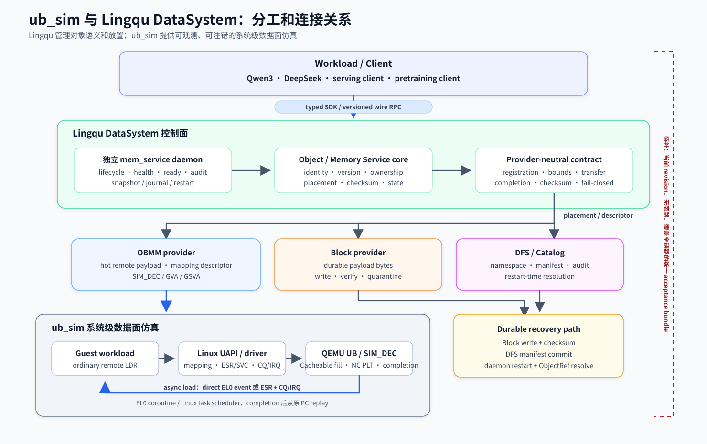

# ub_sim 与 Lingqu DataSystem 当前状态及完整 PoC 差距审计

> 审计日期：2026-08-14；细粒度性能证据复核：2026-08-20
> 审计对象：`ub_sim` 当前工作区、Git 历史、根目录 `mem_service/` 子模块、
> guest/QEMU/kernel 接入代码及现有验证文档
> 结论状态：**底层组件和分段验证已经较完整，但完整 Lingqu DataSystem PoC
> 尚未形成单条、当前 revision、无旁路的端到端证据链。**

## 1. 结论

`ub_sim` 和 Lingqu DataSystem 分工互补：

- **Lingqu DataSystem** 定义并实现对象身份、版本、放置、完整性、生命周期、
  Memory Service 语义以及 Block/DFS 持久化契约。当前产品化权威源码是根目录
  [`mem_service/`](../mem_service/README.md) 子模块。
- **`ub_sim`** 提供系统级仿真和集成环境：Rust 行为模型、Arm64 guest、Linux
  driver/UAPI、QEMU UB/OBMM/GVA/GSVA 模型、多节点拓扑、模型 workload、故障注入、
  验收和性能评估。
- [`crates/sim-services`](../crates/sim-services/src/lib.rs) 与
  [`crates/sim-memory`](../crates/sim-memory/src/lib.rs) 提供确定性参考模型和评估
  工具；独立 daemon 的产品实现集中在根目录 `mem_service/`。
- QEMU、kernel 和 guest 的 async load async-load 路径解决的是“远端普通 `LDR`
  变慢时如何在 guest EL0 切换协程”；`mem_service` 解决的是“这个远端 payload
  是什么对象、哪个版本、放在哪里、谁有权访问、如何校验和恢复”。两者需要
  组合，任何一方单独通过都不等价于完整 DataSystem PoC。

已经具备的代码和历史验证足以说明方向可行，但当前还不能声称：

> 一个真实模型 workload 已在当前锁定 revision 上，通过独立
> `mem_service` daemon 和 typed SDK 解析 ObjectRef，经 OBMM/async load EL0 coroutine
> 执行普通远端 `LDR`，得到正确模型结果，再完成 Block/DFS commit，并在服务重启后
> 恢复同一对象；全程不存在 simulator 私有 store、直接文件交接或 in-process
> helper 旁路。

上面这条是本报告采用的“完整 PoC”门槛，目前没有对应的一体化 acceptance bundle。


### 1.1 2026-08-20 增量结论

OBMM remote-load 的性能证据在本报告初次审计后继续推进。当前已经完成：

- 2-node coarse policy `2,240/2,240` canonical runs；
- fine boundary screening `1,536/1,536`；
- C/W tracing `1,152/1,152`；
- 70 个 winner-flip endpoint 的 7-seed formal boundary `1,960/1,960`，
  `validation.status=pass`。

正式 endpoint 的 transparent policy 分布为 `sync 32 / async load 38`，explicit policy
分布为 `sync 32 / submit/await 7 / async load 31`。这批证据收敛了当前 QEMU PoC 的 L/C/W 边界，
也提供了可审计的离线策略表；它没有闭合本报告定义的 Lingqu DataSystem 纵向 PoC。
当前仍缺独立 `mem_service`、ObjectRef、真实模型消费点、OBMM/async load、Block/DFS commit
与 restart recovery 的统一无旁路 acceptance bundle。

4,942-case full sensitivity campaign 继续保持暂停。fine formal endpoint 聚焦已发现的
winner 翻转，覆盖域没有包含完整 jitter、tail、failure、range 和 scale-out sweep。

## 2. 证据口径

为避免把计划、代码和运行结果混为一谈，本文使用五类证据：

| 级别 | 含义 | 可以证明 | 不能证明 |
| --- | --- | --- | --- |
| A：当前源码 | 当前工作区或锁定子模块中可定位的实现、ABI、CLI、测试 | 能力存在、依赖关系和契约可审计 | 真实多节点运行一定通过 |
| B：当前轻量测试 | 本次审计实际执行的 Rust/Python focused tests | 被覆盖的合同和局部行为当前通过 | QEMU、多节点、模型权重或生产环境通过 |
| C：历史运行证据 | 已提交报告中的 QEMU/模型/容器实跑结果 | 指定 revision、artifact 和场景曾通过 | 当前工作区仍通过；未覆盖场景也通过 |
| D：当前远端状态 | 对暂停 campaign 的只读进程和 evidence 计数 | campaign 此刻的客观状态 | 未完成矩阵的最终性能结论 |
| E：工程判断 | 根据缺口、依赖和验收门槛给出的估算 | 排期和优先级参考 | 已测量完成度或交付承诺 |

本文所有“已完成”均说明属于哪类证据。没有重新执行的历史 QEMU 或模型结果，
一律不表述为当前 revision 重新认证。

## 3. 当前代码基线

2026-08-20 复核后的仓库状态如下：

| 项目 | 当前值 | 审计判断 |
| --- | --- | --- |
| `ub_sim` 已提交实现/数据基线 | `a23b5c2cc4f68ee32cc8c507d94a9979876ebaf7` | 包含 ABI v2 P3、coarse policy、fine formal boundary 与证据 provenance |
| 与 `origin/master` 关系 | ahead 11；`origin/master=67c3ce5` | 远端主分支仍落后于当前完整基线 |
| `mem_service` gitlink/lock/HEAD | `91c20cd34fe6ad68405d0d17b3ad5481f889163c` | 三者一致，锁定关系成立 |
| QEMU 子模块 | `aa9039e50748a150f4c8e5e2ed75e9a59e42f089` | 包含 OBMM split-phase、ABI v2 EL0 upcall 与 replay 模型 |
| guest kernel 子模块 | `d99cdb9706d812bcfa7f30827227a50123637a7c` | 包含 OBMM async、scheduler UAPI 与 replay capability |

`mem_service` 的锁定信息由
[`guest-linux/aarch64/mem_service.lock`](../guest-linux/aarch64/mem_service.lock)
记录，源码消费契约见
[`mem_service/docs/integration-ub-sim.md`](../mem_service/docs/integration-ub-sim.md)。

2026-08-14 初次审计时的 9 个 P3 工作区改动已经沿后续提交进入当前基线。2026-08-20
的 `a23b5c2` 又提交了 formal boundary selector、矩阵、正式结果文档与 SVG。4,942-case
运行没有恢复，因此“完整 P3 sensitivity 已完成”仍不成立。

## 4. 两者的实际分工与连接点



图中实线表示已经存在的接口或数据路径；右侧红色虚线标出当前缺口：仍需一份
绑定当前 revision、禁止旁路并覆盖热数据与持久化路径的统一 acceptance bundle。

关键连接点的当前代码状态：

| 连接点 | 当前实现 | 判断 |
| --- | --- | --- |
| `ub_sim` 消费独立服务源码 | `MEM_SERVICE_ROOT`、gitlink、lock、guest build/package | 已建立 |
| 服务控制面 | Unix-socket daemon、48-byte versioned header、24 个 manifest operations、typed C client | 已实现；24/48 均由当前源码复核 |
| provider 边界 | [`mem_service_provider.h`](../mem_service/components/mem_service/mem_service_provider.h) | 已建立，core 保持 transport-neutral |
| OBMM provider | [`mem_service_provider_obmm.c`](../mem_service/components/mem_service/providers/mem_service_provider_obmm.c) 与 conformance tests | 已实现；当前 revision 仍需随完整 PoC 重验 |
| W5 bootstrap | [`run_w5_memory_service_bootstrap.sh`](../guest-linux/aarch64/scripts/run_w5_memory_service_bootstrap.sh) 调用独立 host binary | 已有独立服务接入面 |
| guest daemon smoke | [`run_app`](../guest-linux/aarch64/initramfs/run_app) 的 `mem-service-serving-publish`/restart/verify | 已有局部 publish/restart 闭环 |
| Rust memory path | `sim-cli lingqu-memory prefix-cache-service` 和 JSON store/decision store 仍存在 | 仍是模拟、分析和兼容路径，不能冒充独立服务产品路径 |
| async load + coroutine scheduler | QEMU async-load assist + kernel UAPI + `obmm_coroutine_scheduler` + `obmm_async_coroutine` | 已形成独立 2-node ABI v2 验证路径 |
| W5 与 async load 合流 | 没有当前 revision 的无旁路模型验收 bundle | **尚未证明** |

代码中仍广泛使用 `linqu_*` 历史拼写；概念和产品名按 `Lingqu` 表述。两种拼写
指向同一系统，产品化权威源码仍是根目录 `mem_service/`。

## 5. Git 历史说明了什么

| 时间/提交 | 演进 | 对当前关系的意义 |
| --- | --- | --- |
| `a25fda1`，2026-05-07 | Object Service 接入 Qwen3 decode | 从模型私有交接转向对象语义 |
| `715601f`，2026-05-17 | Lingqu Memory Service baseline | 建立 semantic/execution memory 模型 |
| `71dee95`、`63acbac`，2026-05-18 | durable simulation store 和 checkpoint persistence | 建立 Block/DFS 风格持久化参考模型 |
| `764e1dd` 起，2026-06-25 | standalone/productization 系列 | daemon、wire、SDK、package、ops/release gates 逐步形成 |
| `60b656b` 起，2026-07-06 | UB SSD GSVA backend | 持久 payload 与 GSVA data plane 开始连接 |
| `4dc9148`，2026-07-19 | DeepSeek V4 两节点 1-step 通过 | 修复 tokenizer bytes；不能外推为连续多步完成 |
| `734e243`，2026-07-29 | TCP payload provider | provider-neutral 架构增加独立 transport |
| `00890f6`、`15574d1` | 抽取并锁定独立 `mem_service` | 产品权威源码从 `ub_sim` 子树迁出 |
| `67c3ce5`，2026-08-11 | OBMM provider conformance | 独立服务与 `ub_sim` OBMM 的合同验证形成 |
| `6ef9c13`，2026-08-13 | submit/await 与 async load remote-load coroutine | 增加 slow remote load 的 EL0 调度机制 |
| `7f05c3d` | Lingqu RPC test transport-neutral | 修复本机 loopback 依赖，测试 RPC framing/handler 本身 |
| `b20af7c` | ABI v2 P3 evidence | 提交 49-case acceptance 和定向 2/4/8-node 数据；full matrix 未完成 |
| `0e98c72`、`300974e` | runtime policy evaluator 与 coarse policy | 完成 2,240-run、7-seed 精确 bucket 策略 |
| `f61764c` | runtime policy 可视化 | 增加 QEMU measured 与 native-calibrated L/C/W 三维图 |
| `a23b5c2` | fine boundary validation | 完成 screening、tracing、70 endpoint formal merge 与 fail-closed 发布策略 |

历史演进支持的判断是：系统已经从“若干 guest 内函数和 simulator model”推进到
“独立服务 + 中立 provider + 系统仿真平台”。历史本身不能证明抽取后的所有接口
已经在一条真实模型链路上重新拼合并通过。

## 6. 已经做到什么

### 6.1 `ub_sim` 系统与数据平面

- 已有 2/4/8-node UB/QEMU full-mesh、OBMM pool、GVA/GSVA、MESI/coherence 和
  lifecycle 的历史运行证据，见
  [8-node final validation](2026-04-15-ubsim-eight-node-final-validation.md) 与
  [GVA/GSVA/OBMM/MESI status summary](sim_gva_gsva_obmm_mesi_stage_status_summary.md)。
- submit/await explicit submit/await 与 async load ordinary-load/direct-EL0-upcall 均已实现；async load 的
  context save/switch/resume 由 guest EL0 scheduler 完成，QEMU 负责建模事件投递、
  pending load 和精确完成。详细设计见
  [async load async-load design](plans/async-load-coroutine-scheduler-detailed-design.md)。
- ABI v2 已有 2-node `49/49` formal acceptance，以及 4/8-node 各 `14/14`
  定向 scale-out 历史证据。该结论绑定已提交报告中的 QEMU/kernel/initramfs hash，
  适用范围限于对应 artifact 和已提交 revision。
- QEMU coarse policy 和 fine formal boundary 已完成。正式 endpoint 显示 L=30 µs 发布
  sync、L=75 µs 发布 async load，L=50 µs 形成依赖 C/W 的混合层；L≥250 µs 的低 C 显式
  接口开始出现 submit/await 与 async load 分化。

### 6.2 Lingqu Object/Memory Service

- 独立 daemon、host daemon、C SDK、versioned wire、object/prefix/KV/runtime
  handoff/execution/training artifact operations 已存在。
- snapshot+journal、idempotency、audit、retention、checksum、quarantine 和 restart
  recovery 的本地合同与 fixture 已存在。
- provider contract 已把 core 与 OBMM、TCP、RoCE 等 transport 分离；OBMM mapping
  使用 SIM_DEC/GVA/GSVA，不由 URMA 实现。
- Qwen3、DeepSeek 和 pretraining 语义位于 adapter/client 层，没有成为 core 的
  transport 依赖。
- package、systemd、metrics、release-readiness 等交付面已经存在；但抽取前 Docker
  test bed 的 certified evidence 没有迁移，当前 `91c20cd` 不能据此宣称生产认证。

### 6.3 模型 workload

- Qwen3-14B 8-node、16-step W5 seed/reuse/Engram 有历史报告，见
  [W5 Qwen3 E2E report](ub_sim-llm-infer_e2e_report.md)。该证据来自抽取前的历史
  revision，覆盖范围没有包含当前独立 `mem_service` + async load 联合验收。
- DeepSeek V4 Flash 已完成官方 checkpoint loader、reference oracle、linear、
  routed expert 和全 43 层 first-token 分段验证；`4dc9148` 后真实 2-node、1-step
  运行通过。
- DeepSeek 2/3/8-node 的 4-step/8-step、MTP 和 1M context 仍未完成；不能把
  “first token”写成“连续推理已完成”。

## 7. 还没有做到什么

### 7.1 完整 PoC 的关键缺口

1. **缺少统一入口。** 当前独立 daemon bootstrap、guest publish/restart smoke、
   Rust `lingqu-memory` service、W5 runner 和 async load evaluator 是多个入口，没有一个
   CLI 负责启动并验收完整 DataSystem 纵向链路。
2. **缺少无旁路证明。** 需要证明模型只通过 typed SDK/ObjectRef 获取对象，payload
   只经选定 provider 访问；不得由 JSON store、直接路径传递、simulator 私有对象、
   in-process helper 或 fallback 偷渡。
3. **async load 尚未与真实模型消费点合流。** 当前 async load test program 能证明普通远端
   `LDR`、upcall、EL0 coroutine 调度和结果正确，但没有证明 W5 的 weight/KV/hidden
   消费点使用同一机制。
4. **热路径与持久路径尚未在同一 run 闭环。** Block bytes 写入、checksum/version
   确认、DFS manifest commit、daemon restart 和 resolve 必须与前面的模型 run
   共享 object identity 和 evidence ID。
5. **当前锁定 revision 未重做完整认证。** 历史 Qwen3、Docker release 和若干
   multi-node 报告仍有价值，但不能替代抽取后 `91c20cd` 的 current-revision bundle。
6. **故障语义未纵向覆盖。** timeout、remote failure、stale version、checksum
   mismatch、daemon restart、provider unavailable 和 coroutine fault 需要在同一
   acceptance CLI 下 fail-closed。

### 7.2 不应成为首个功能 PoC 的阻塞项

- P3 全部 4,942-case sensitivity/break-even 矩阵；当前 coarse/fine boundary 已回答
  无 jitter 的代表性边界，full matrix 继续补充 tail、failure、range 和完整测量域，
  不决定功能链路是否存在。
- DeepSeek 的全部 2/3/8-node 连续推理、MTP 和 1M context。
- 生产级 HA、mTLS、tenant ACL、密钥管理、major-version migration、长时间 soak
  和真实 RoCE 集群认证。

这些能力最终需要做，但如果把它们全部设为首个 PoC gate，会把“证明系统纵向成立”
和“证明系统可生产部署”混为一个不可控项目。

## 8. 完整 PoC 验收定义

建议先以 Qwen3-0.6B 作为 golden workload，原因是它足以覆盖对象、远端 load、
协程调度和持久化语义，同时显著缩短迭代时间。DeepSeek 作为第二阶段兼容性 canary。

### 8.1 必须通过的 2-node golden path

| Gate | 必须观测到的事实 | 当前状态 |
| --- | --- | --- |
| G1 baseline | gitlink/lock/HEAD、QEMU、kernel、initramfs 和 scenario fingerprint 唯一 | 已有机制；需随新 run 固化 |
| G2 object publish | nodeA 通过 typed SDK 向独立 daemon 发布版本化 ObjectRef | 分段能力已有，联合 run 未验 |
| G3 remote map/load | nodeB 由 OBMM provider 获取 mapping descriptor，并以普通 `LDR` 消费 | OBMM/async load test path 已通过 |
| G4 EL0 scheduling | 至少两个 coroutine；日志证明 pending upcall、EL0 save/switch、complete upcall、resume | async load ABI v2 test path 已通过 |
| G5 model correctness | Qwen3 产生固定 token/checksum，且与同步 reference 一致 | 历史模型验证已有，async load 联合 run 未验 |
| G6 durable commit | 结果先写 Block 并校验，再发布 DFS manifest/ObjectRef | 分层实现已有，联合 run 未验 |
| G7 restart recovery | 重启独立 daemon 后用同一 key/version resolve，payload checksum 不变 | 本地 fixture 有，联合 run 未验 |
| G8 fail-closed/evidence | 关闭所有旁路；注入 stale/checksum/timeout 后明确失败；无残留 QEMU | 缺少统一 acceptance bundle |

### 8.2 2-node 通过后再扩到 8-node

8-node gate 不重复完整 P3 sweep，只要求：

- 相同 artifact fingerprint；
- object ownership/placement 和每节点版本一致；
- 至少一次跨节点 async load load 和一次 Block/DFS recovery；
- 输出聚合 token/checksum、per-node counters、provider trace 和残留进程检查；
- 任何节点缺证据则整组 invalid。

### 8.3 应新增的单一入口

按照仓库“功能必须有 CLI 和测试”的规则，PoC 不应依赖人工拼接多条命令。建议新增：

```text
sim-cli lingqu-datasystem-poc \
  --scenario <2-or-8-node-scenario> \
  --workload qwen3-0.6b \
  --remote-load async-load \
  --require-independent-service \
  --require-block-dfs-recovery \
  --forbid-fallback \
  --output-dir <evidence-dir>
```

这个命令属于待实现的验收入口，当前交付状态为 `planned`。它必须生成
machine-readable manifest、raw evidence、aggregate summary 和
`validation.status=pass|invalid`，并配套 Rust unit tests、Python contract tests
和远端 2/8-node acceptance tests。

## 9. 还差多少、困难和预计路径

### 9.1 完成度判断

“约 70%”只能作为工程规划估算，不能作为测试结果。更准确的表述是：

- **组件就绪度约 65%～75%**：服务 core、provider、QEMU/kernel、async load runtime、
  workload 和 durability 的多数构件已经存在。
- **纵向验收就绪度更低**：G1～G8 中，底层 G3/G4 有直接证据，G1/G2/G5/G7
  有分段能力或历史证据，G6/G8 的同-run 联合证据最弱。
- 剩余工作的核心是消除多入口和旁路，把既有部件收敛成一条可复现、可失败、
  可审计的产品链路。集成和证据工作通常比代码行数更难预测。

### 9.2 主要困难

| 困难 | 为什么难 | 处理原则 |
| --- | --- | --- |
| 控制面与数据面身份一致 | daemon ObjectRef、OBMM mapping key、async load pending load 和 durable ref 必须指向同一对象版本 | 统一 `run_id/object_id/version/generation`，跨层日志可 join |
| ordinary load 的精确语义 | load 不能提前退休；complete/fault 必须只提交一次，EL0 context 不能由 QEMU 偷存 | 保持 ABI v2 precise exit/commit 和 generation-safe 状态机 |
| 无旁路验证 | 历史兼容路径多，成功结果可能来自 JSON/file/in-process fallback | `--forbid-fallback`，对每个 payload 输出 provider provenance |
| 多节点证据稳定性 | QEMU 端口、残留进程、外部 workload 和 artifact 变化会污染性能/正确性 | immutable raw、attempt/quarantine、唯一 fingerprint、整组 fail-closed |
| 历史文档与当前 revision 漂移 | “曾经通过”容易被误读成“现在通过” | 报告绑定 commit/hash，并明确 historical/current |
| 大模型迭代成本 | DeepSeek 连续多步耗时高，会拖慢系统语义调试 | 先用 Qwen3-0.6B 固化合同，再用 DeepSeek 做兼容性验证 |

### 9.3 建议实施顺序和估时

以下是单一主线、远端资源可独占、P3 全矩阵和 DeepSeek 全矩阵不作为前置 gate
时的工程估算：

| 阶段 | 交付物 | 估时 |
| --- | --- | ---: |
| M0 基线冻结 | 统一 run/object identity、artifact manifest、旁路清单 | 2～3 天 |
| M1 2-node golden path | 独立 daemon + ObjectRef + OBMM/async load + Qwen3 正确结果 | 5～7 天 |
| M2 durability/failure | Block→DFS commit、restart resolve、负例矩阵 | 4～6 天 |
| M3 8-node acceptance | 同一 CLI 扩到 8-node，聚合证据和 cleanup gate | 4～6 天 |
| M4 运行时接入与 native 复测 | 接入 fine policy、分解真实 coroutine scheduler/MMIO/upcall/resume 成本 | 3～5 天 |

合理总量是 **3～5 个工程周**。这是 E 类规划估算，假设：

- n4 类 Arm64/QEMU 主机可获得不受外部 workload 污染的窗口；
- 不在过程中重写 `mem_service` public ABI；
- Qwen3-0.6B 是首个必过 workload；
- P3 4,942-case 和 DeepSeek 全矩阵并行或后置。

如果把生产 HA/security/RoCE 认证、DeepSeek 2/3/8-node 连续多步、MTP、1M context
和完整 P3 都纳入“完整 PoC”，预计会扩大到 **6～10 周以上**，并且这个范围对远端
资源和故障重跑高度敏感。

## 10. 本次事实审计与修正

| 原表述或风险 | 审计结果 | 处理 |
| --- | --- | --- |
| `lingqu_datasystem_review.md` 锁定 revision 为 `956af0d...` | 不实；gitlink、lock、submodule HEAD 均为 `91c20cd...` | 已修正 |
| DeepSeek 当前阻塞是 token text metadata | 已过时；`4dc9148` 已修复并完成真实 2-node 1-step | 已修正文档；连续矩阵/MTP 仍未完成 |
| P3 full matrix “运行中” | 已过时；用户要求暂停，PID `419618` 为 `Tl`，campaign QEMU 为 0 | 已改为“安全暂停” |
| “生产部署认证已经完成” | 范围过宽；只有抽取前 revision 的 Docker test-bed evidence，且 artifacts 未迁移 | 已收窄为历史 Docker 认证，不代表当前 revision/真实集群 |
| 旧 independent deployment assessment 的“当前”能力 | 文档内部已被后续实现超越 | 已增加历史状态警告和当前报告链接 |
| 旧 target gap report 的 `~98%` | 只表示 2026-06-30 独立化内部清单；完整 PoC 与当前认证完成度不在该指标范围内 | 已增加范围警告 |
| wire header 48 bytes、operation count 24 | 当前源码可直接验证 | 保留，属 A 类事实 |
| async load `49/49`、4/8-node `14/14` | 已提交报告和 artifact hash 支持 | 保留为 C 类历史运行证据，不写成当前工作区重跑 |
| fine boundary “仍在运行/partial” | 已过时；screening、tracing 和 1,960-run formal merge 均已完成 | 更新为正式 7-seed endpoint evidence；不外推到 full matrix |
| Qwen3 W5 8-node/16-step 已通过 | 历史报告支持 | 保留为 C 类证据；不等价于当前独立服务 + async load PoC |
| “完整 PoC 已完成约 70%” | 该数字仅能作为工程规划估算 | 改为 65%～75% 的组件就绪度规划区间，并明确假设 |

### 10.1 本次实际执行的验证

本次审计未启动本地 QEMU、模型权重或多节点 workload。实际执行：

```text
python3 -m unittest \
  guest-linux.aarch64.tests.test_obmm_async_contract \
  guest-linux.aarch64.tests.test_obmm_async_load_coroutine_contract
# 19 tests, OK

cargo test -p sim-cli obmm_eval -- --test-threads=1
# 25 passed, 0 failed
```

另外完成了：

- gitlink/lock/submodule HEAD 一致性复核；
- QEMU/kernel 子模块 revision 复核；
- wire header 长度和 manifest operation count 源码复核；
- P3 远端暂停状态的只读复核：`541/4,942` canonical raw、
  `raw-attempts=3`、campaign QEMU 为 0；
- 后续正式证据复核：fine boundary `1,960/1,960`、0 invalid、单一 artifact
  fingerprint、`validation.status=pass`；
- 关键文件和 Git 提交历史交叉核对。

### 10.2 明确未执行

- 未恢复 P3；
- 未重新运行 QEMU 2/4/8-node acceptance；
- 未重新运行 Qwen3/DeepSeek 模型 workload；
- 未重新生成当前 `mem_service` revision 的 Linux ops、remote transport 或
  release-certification bundle；
- 未证明本报告定义的完整 PoC。

## 11. 最终判断

当前首要任务是建立一个唯一、无旁路的 `lingqu-datasystem-poc` acceptance 入口，
把独立服务、对象语义、OBMM/async load、真实 workload、Block/DFS 恢复和证据聚合串成
一条链；新增并列功能应排在这条纵向链路之后。

一旦 2-node golden path 达成，8-node 是规模化验证；fine P3 已提供当前 QEMU PoC 的
性能边界，full P3 继续承担完整敏感性覆盖；DeepSeek 是更重 workload 的兼容性验证。
这些横向证据不应反过来阻塞最小纵向 PoC。
