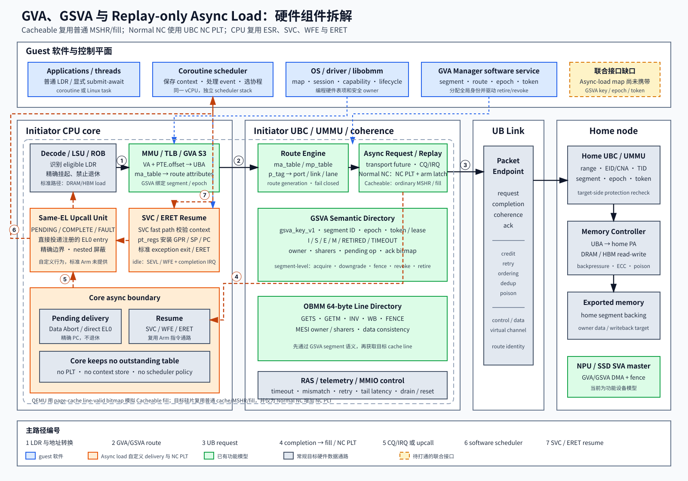

# GVA、GSVA 与 Upcall Coroutine PoC 的硬件机制拆解

日期：2026-08-20

代码基线：ub_sim `4036f7d547c1032759d8d97054105eab6604e75f`

QEMU 基线：`aa9039e50748a150f4c8e5e2ed75e9a59e42f089`

## 1. 结论

当前 PoC 已经把三组机制分别跑通到可验证状态：

1. **GVA** 提供跨节点虚拟地址到远端地址及路由属性的映射。
2. **GSVA** 在 GVA 上增加严格同址语义，以及 segment、epoch、token、生命周期和一致性协议。
3. **Async load** 通过 direct EL0 upcall 和 coroutine scheduler，把一次长延迟
   `LDR` 拆成提交、挂起、完成和恢复，使同一 guest EL0 进程中的其他协程可以继续执行。

这些 PoC 已覆盖映射、路由、远端传输、数据一致性、异步 load、EL0 调度、patch/replay 恢复以及 2/4/8-node 的多项功能验证。它们仍以 QEMU、SIM_DEC、host 共享状态和 guest 软件模拟若干硬件职责，因此尚不能直接等同于芯片实现。

最重要的边界是：**当前 async-load map 只携带远端 EL0 VA range、OBMM map
和 generation，没有携带完整的 `gsva_key_v1`、epoch、token 与 GSVA coherence
状态。** “GSVA 严格一致性路径”和“普通 `LDR` async-load direct-upcall 路径”
均有各自的端到端证据；二者组合后的联合路径还没有形成正式验收闭环。

真实硬件需要新增或扩展的核心能力集中在 CPU/MMU/UBC 三处：

- CPU 需要可中止退休的 split-phase load、同 EL upcall 注入和完整上下文原子恢复能力。
- MMU/TLB 需要 GVA 的第三级地址/路由转换，以及 GSVA epoch、权限和失效联动。
- UBC 需要 async-load assist 的 pending-load table、GSVA 语义目录、OBMM cache-line
  一致性和 UB Link 请求/完成通道。

## 2. 术语与分层

| 术语 | 本文含义 | 解决的问题 |
| --- | --- | --- |
| VA | guest EL0 进程看到的虚拟地址 | 进程地址空间寻址 |
| UBA | UB fabric 使用的全局地址 | 跨节点传输中的地址标识 |
| GVA | Global Virtual Address | 把本地 VA 转换为远端 UBA，并附带目标、路由和访问属性 |
| GSVA | Global Shared Virtual Address | 约束 `user_va == UBA == home_va`，并加入共享段身份、epoch、token 和一致性 |
| OBMM | Open/On-board memory management 数据面 | export/import、远端映射、数据搬运和 cache-line 一致性 |
| SIM_DEC | 当前模拟器中的解码、映射和远端访问实现接缝 | 在 QEMU 中承载尚未落到芯片的功能模型 |
| Coroutine scheduler | guest EL0 中的协程调度器 | 保存 coroutine context、维护 ready/wait 状态并选择下一个 coroutine |
| Async-load assist | CPU/UBC 中的 load 挂起辅助机制 | 维护 pending load、接收远端完成、产生 upcall event 和支持 replay |
| submit/await | 显式 submit/await | 由应用/runtime 明确提交异步读并在 await 点切换协程 |
| Async load | 普通 `LDR` + direct EL0 upcall | 对数据面隐藏单独 API，由 async-load assist 在慢 load 上唤醒 coroutine scheduler |

机制分成四个平面：

- **地址与路由平面**：GVA、MMU S3、`ma_table`、`mp_table`。
- **共享语义平面**：GSVA key、segment、epoch、token、生命周期和 segment-level coherence。
- **数据平面**：OBMM remote read/write、64-byte line directory、一致性消息与 UB Link。
- **延迟隐藏平面**：async-load assist、direct EL0 upcall、coroutine scheduler、
  patch/replay resume。

Coroutine scheduler 位于 guest EL0，拥有 coroutine context、ready queue 和调度
策略。QEMU 中的 PLT、event 和 replay 功能统一称为 **async-load assist**。代码也按
这个边界命名：QEMU/UAPI/driver 使用 `async_load`，EL0 runtime 使用完整的
`coroutine_scheduler`。

## 3. 总体硬件视图

图中的实线表示数据或控制主路径，虚线表示异步事件。蓝色模块属于 guest 软件，
橙色模块代表 async load 所需的自定义 CPU 和 load-assist 能力，绿色模块已有
QEMU/guest 功能模型，灰色模块表示目标硬件中的常规数据通路。图内文字全部使用
深色，便于在浅色背景上阅读。

## 4. PoC 模块到目标硬件的映射

| 当前实现 | 当前承担的职责 | 目标硬件位置 | 实现成熟度 |
| --- | --- | --- | --- |
| `target/arm/tcg/tlb_helper.c` 的 GSVA hook | Arm stage-1 后做 GSVA route、权限、一致性和 local PA window 转换 | CPU MMU/TLB、S3 GVA translator | 功能模型已验证；尚未形成真实 PTE/S3 编码 |
| `hw/ub/gsva_route.c` | GSVA key、route、local PA、lease、map generation | UBC/UMMU GSVA route table | 功能模型已验证 |
| `hw/ub/gsva_coherence.c` | segment-level acquire、invalidate、downgrade、fence、retire | UBC GSVA directory/protocol engine | 功能模型已验证 |
| `hw/ub/obmm_coherence.c` | 64-byte line MESI 与数据一致性 | UBC/cache controller/target memory agent | 功能模型已验证 |
| `hw/ub/ub_ubc.c` | SIM_DEC map、GVA/GSVA route、UB Link remote access | UBC、NoC route、UMMU、link endpoint | 多个目标硬件块暂时集中在一个 QEMU 设备中 |
| `hw/ub/ub_async_load.c` | pending-load table、event FIFO、replay entry、统计 | CPU load suspension queue 或 UBC async-load assist | async-load ABI v2 已端到端验证 |
| `hw/ub/ub_async_load_device.c` | async-load MMIO、session、upcall、异步 OBMM backend | CPU load-assist 控制接口、UBC async request engine | 功能模型已验证 |
| `target/arm/tcg/translate-a64.c`、`helper-a64.c` | 识别 eligible `LDR`、注入 EL0 upcall、安装上下文 | CPU decode/LSU/retirement/control-flow | 自定义架构行为，仅在 QEMU 实现 |
| `libobmm_coroutine_scheduler` 与 AArch64 汇编 | coroutine scheduler：保存 context、EL0 调度、patch/replay resume | EL0 runtime；可选硬件 context assist | guest E2E 已验证 |
| `HLT #0x5343` helper | 原子安装完整目标 coroutine context | 新 EL0 resume 指令或等效硬件 assist | 模拟器私有接口，标准 Arm 无对应指令 |
| host 共享 registry | generic GVA MRSW ownership | 分布式目录、home agent 或控制面服务 | 仅模拟器方案，不应进入芯片数据面 |

## 5. 按硬件组件详细拆解

### 5.1 CPU 前端、译码和 Load/Store Unit

#### 硬件职责

CPU 需要识别哪些 load 可以进入 suspended-load 路径，并在访问普通 DRAM/HBM
时继续保持标准行为。当前 async load 限定为 EL0 下无符号标量 `LDR`：1、2、4、
8 字节，支持目标寄存器为 XZR；尚未覆盖 sign-extend、pair、SIMD、atomic、
writeback 和 store。

对 eligible load，LSU 需要产生完整请求描述符：

- faulting PC 和 effective VA；
- destination register、访问宽度和端序；
- MMU index、进程/地址空间 owner；
- map ID、map generation 和 remote offset；
- coroutine context ID/generation；
- 用于顺序性、异常和取消处理的 load sequence。

#### 当前 PoC

QEMU TCG 在生成普通 `qemu_ld` 前调用 async-load helper。helper 检查 session、
EL0、owner TTBR0、remote range 和访问合法性；命中注册的 async-load range 后向
async-load assist 提交请求，当前 `LDR` 不退休，QEMU 退出当前 translation block。

#### 真实硬件要求

真实 CPU 需要一个可精确恢复的 split-phase load 接口。提交成功后，该 load 必须满足以下条件：

- architectural destination register 未被更新；
- PC 的退休状态仍指向 faulting instruction；
- 不允许 younger instruction 越过该 load 产生不可回滚的架构副作用；
- pending entry 和 coroutine context 建立唯一绑定；
- 普通 cacheable memory 仍走原有同步 LSU 路径。

该机制会触及 ROB/retirement、LSQ、异常精确性和内存顺序模型，是 async load 中
硬件侵入性最高的部分之一。

### 5.2 Arm MMU、GVA S3 Translator 与 TLB

#### GVA 转换

目标 GVA 数据通路分成四步：

| 顺序 | 输入 | 处理 | 输出 |
| --- | --- | --- | --- |
| 1 | EL0 VA | Arm stage-1 translation 与 PTE 权限检查 | 受进程页表保护的 VA 和属性 |
| 2 | VA、PTE offset | 计算 `UBA = VA + PTE.offset` | UBA |
| 3 | VMID、ASID、UBA | 查询 `ma_table` | GVA route entry |
| 4 | GVA route entry | 展开目的和访问属性 | DCNA、TID、UPI、p_tag、cache policy、permission |

`ma_table` 是 GVA 的第三级转换。它输出 fabric route 和保护属性，不只输出本地物理地址。generic GVA 允许 non-identity mapping 和非零 `pte_offset`。

#### GSVA 附加约束

GSVA V1 采用严格同址关系：`user_va == UBA == home_va`，同时要求
`pte_offset == 0`。

TLB 或其扩展项还需要关联 segment ID、epoch、permission/token generation。segment retire、epoch 变化、token revoke 和 unmap 必须触发对应的 TLB/route-cache invalidation。

#### 当前 PoC

QEMU 先完成正常 Arm stage-1 translation，再由 `gsva_arm_mmu_translate_full()` 根据原始 VA 查询 GSVA route，检查 identity/source/coherence/stale epoch，并把最终 TLB PA 替换成导入的 local PA window。QEMU 还用 256-entry side table 记录 VA 对应的 segment/epoch。

这是一套可验证语义的功能模型。真实硬件仍需定义：

- PTE 或独立表项如何标记 GVA/GSVA；
- S3 walk/cache 的格式、时序和异常码；
- VMID/ASID 的完整隔离；
- TLB shootdown 与 GSVA epoch/token 更新的原子性。

当前 GSVA V1 的 VMID/ASID 固定为 0，多 VM、多进程隔离尚无验收证据。

### 5.3 NoC Route Engine 与 `mp_table`

`ma_table` 输出的 p_tag、DCNA 和 UPI 经 `mp_table` 解析为具体的
UBC port、link ID、lane ID 和 target endpoint。

目标硬件需要完成：

- route lookup 和 route version 检查；
- p_tag/DCNA/UPI/TID 的一致性校验；
- 多路径、拥塞和失效时的 fail-closed 行为；
- route 更新与飞行中请求的 generation 隔离；
- 请求与 completion 使用相同安全域和目标身份。

当前 QEMU 把这些职责合并在 UBC/SIM_DEC 后端。PoC 已覆盖多种 route mismatch 和拒绝路径；独立 NoC 路由表的硬件格式、容量和更新协议仍待定义。

### 5.4 UBC 前端与协议封装

UBC 是 CPU/MMU、async-load assist、GSVA coherence、OBMM 数据面和 UB Link 之间的
汇聚点。目标硬件至少需要：

- 接收 GVA/GSVA load/store/DMA 请求；
- 根据 route 和 access attributes 生成 UB transaction；
- 为 split-phase load 分配 transaction ID；
- 对 request/completion 执行长度、边界、权限、epoch 和 token 校验；
- 把 completion 精确返回到 async-load pending entry；
- 为 fence、retire、token revoke 提供有序控制消息。

当前 `hw/ub/ub_ubc.c` 还同时承担 SIM_DEC、route storage、local PA window 和远端读写功能。芯片实现应按 MMU/route、protocol、coherence 和 link endpoint 拆分，避免一个状态机同时掌握所有控制权。

### 5.5 Async-Load Assist 与 Pending-Load Table

Async-load assist 是普通 `LDR` 异步挂起路径的核心硬件状态块。当前 PoC 的表项状态
转换如下：

| 当前状态 | 触发条件 | 下一状态 |
| --- | --- | --- |
| FREE | eligible load 提交成功 | PENDING |
| PENDING | 远端 read 成功完成 | COMPLETE |
| PENDING | 远端错误、超时或取消 | FAULTED |
| COMPLETE | replay 模式等待原 `LDR` 重试 | REPLAY_READY |
| COMPLETE | patch 已交付，或 REPLAY_READY 被精确消费 | FREE |
| FAULTED | fault event 被 guest runtime 回收 | FREE |

patch 模式可以从 COMPLETE 直接释放；replay 模式需要保留到原 `LDR` 成功消费 result。当前功能模型支持 64 个 context、64 个 pending load 和 128 个 event。

每个 pending entry 至少需要保存：

| 字段 | 用途 |
| --- | --- |
| owner/session/home CPU | 防止跨进程、跨 vCPU 接管 |
| context ID/generation | 防止复用后的旧完成写入新 coroutine |
| slot/generation token | 区分 stale、duplicate completion |
| fault PC/effective VA | 恢复和 replay 精确匹配 |
| Rt/size/endian/MMU index | patch 或 replay 的数据语义 |
| map ID/generation/offset | 防止 unmap/remap 后访问错误对象 |
| request sequence | 排序、取消、超时和诊断 |
| result/fault code | 交付完成或精确失败 |

容量耗尽时当前策略退化到同步 stall。真实硬件需要明确 backpressure、overflow、timeout、reset、process exit 和 CPU hot-unplug 行为。

### 5.6 Direct EL0 Upcall Delivery

Async load 需要两类事件：

- **PENDING**：faulting `LDR` 已被 async-load assist 接管，coroutine scheduler
  应立即运行其他 coroutine。
- **COMPLETE/FAULT**：远端结果或错误到达，对应 coroutine 可以进入 READY/FAULTED。

当前 QEMU 的 PENDING 发生在 `LDR` 退休前，直接把 EL0 PC 改到注册的 upcall entry 并退出当前 TB。异步 COMPLETE/FAULT 在 EL0 TB boundary 注入到同一 entry。整个过程没有进入 guest EL1/EL2/EL3。

标准 Arm 没有“把异常直接投递到当前 EL0 handler”的架构机制。真实硬件需要定义新的 same-EL event 机制，至少包含：

- EL0 注册 upcall entry、scheduler stack、event page 和 owner identity；
- 只在精确、可恢复的 instruction boundary 注入；
- 自动屏蔽 nested upcall，避免 scheduler 自身再次被抢占；
- 与 signal、debug exception、interrupt、single-step 和 page fault 的优先级；
- event FIFO overflow、fault storm 和恶意 handler 的隔离；
- pending bit 和 doorbell，保证空闲/等待中的 core 能被唤醒。

当前 session 固定到一个 home vCPU 和 owner TTBR0，尚未支持 coroutine 跨核迁移。

### 5.7 EL0 Context Resume Assist

EL0 scheduler 选出下一个 coroutine 后，需要一次性恢复 x0-x30、SP、PC、NZCV、q0-q31、FPCR/FPSR 和 TPIDR_EL0。当前 context image 为 832 字节。

PoC 使用模拟器私有 `HLT #0x5343`：x0 指向目标 context image，QEMU 校验 context ID、generation、home core 和所有状态，然后在单个 helper 中安装完整 CPU 状态并退出 TB。

`HLT` 在标准 Arm 上会陷入更高异常级；它本身不具备 EL0 全上下文恢复语义。真实硬件有三条可选路线：

| 路线 | 特点 | 代价 |
| --- | --- | --- |
| 新增 EL0 `URESUME` 类指令 | 保持 same-EL、低延迟、语义最接近 PoC | 修改 ISA、CPU 状态恢复和安全校验 |
| Async-load assist 提供 context-window + resume doorbell | 指令集变化较小，状态由专用单元读取 | 需要原子快照协议、cache coherence 和防 TOCTOU |
| EL1 trap + kernel `ERET` | 可复用 Arm 异常返回能力 | 每次切换进入内核，改变 direct-EL0 目标和性能模型 |

如果目标坚持“上下文保存与选择完全位于 EL0”，第一条或第二条更匹配当前设计。

### 5.8 Guest EL0 Coroutine Scheduler

Coroutine scheduler 属于 guest EL0 软件。当前 `libobmm_coroutine_scheduler`
完成：

- 保存完整 coroutine context；
- 在独立 scheduler stack 上处理 PENDING/COMPLETE/FAULT；
- 维护 FREE、READY、READY_REPLAY、RUNNING、WAIT_REMOTE、DONE、FAULTED 状态；
- round-robin 选择 READY coroutine；
- 按 patch 或 replay 模式恢复；
- 对 context ID/generation 和 event 执行一致性检查。

当前实现没有单独的物理“调度核心”。EL0 scheduler 与应用 coroutine 运行在同一个 vCPU/core，只在调度时切换到 scheduler stack。若未来使用独立物理 core，还需要共享 context memory 的一致性、上下文所有权转移、跨核 doorbell/IPI、TLB/ASID 和迁移顺序协议；这些机制未被当前 PoC 验证。

硬件与软件的边界应保持为：硬件负责精确挂起、事件可靠交付和原子恢复；EL0 runtime 负责 ready queue、优先级、公平性、取消和应用级策略。

### 5.9 GSVA Key、Token 与 Segment Lifecycle Engine

GSVA key 使用 `gsva_key_v1` 表达稳定共享对象身份，包含：

- version、flags；
- segment ID、home VA、size；
- VMID、ASID、PTE offset；
- p_tag、cache policy；
- epoch。

token ID/value 表示 key 查询后的访问许可或 lease。token 不参与对象身份计算；rotate/revoke 会改变权限有效性。目标硬件 GSVA engine 需要维护：

- route state 和 map generation；
- home/owner CNA；
- token lease、permission 和 expiry；
- segment epoch 与 RETIRED/TIMEOUT 状态；
- pending coherence operation 和 ack bitmap；
- sharer set 与 owner。

当前 QEMU 实现 `I/S/E/M/RETIRED/TIMEOUT` 状态，以及 invalidate、downgrade、writeback、fence、retire、token revoke 及对应 ack。协议在 UB Link 上使用 4-bit 安全 carrier subtype，具体 operation 放在 payload 中。

硬件还需补齐容量规划、目录溢出、持久化/重启、跨节点 epoch 共识、故障节点清理和控制面认证。

### 5.10 OBMM Cache-Line Coherence 与数据目录

GSVA coherence 管理 segment/key/lease/lifecycle；OBMM coherence 管理实际数据 cache line。当前 OBMM line size 为 64 字节，目录处理 GETS、GETM、INV、WB、FENCE 等 MESI 类操作。

目标硬件 line directory 需要：

- 记录每条 line 的 owner、sharer 和 MESI state；
- 对 remote read/write 发起 GETS/GETM；
- 在 write ownership 转移前完成 invalidate/ack；
- 在 retire/unmap/token revoke 前完成 writeback/fence；
- 把 data response 与 segment epoch、map generation 绑定；
- 在超时或节点失败时 fail closed，禁止返回来源不明的数据。

两层 coherence 的顺序应固定为：先验证 GSVA segment/key/token/epoch，再对目标
line 执行数据一致性。当前 async-load 路径尚未携带完整 GSVA 语义，因此需要新增
联合接口才能保证该顺序。

### 5.11 UB Link Endpoint、Packet 与 Reliability

UB Link 承载三类流量：

1. 远端 read/write request 和 data completion；
2. GSVA segment coherence 控制消息及 ack；
3. OBMM line coherence 控制消息、writeback 和 data。

目标 endpoint 需要提供：

- transaction ID、source/destination CNA、TID、p_tag；
- packet length、byte enable、ordering class；
- epoch/token/map generation 摘要或可验证 handle；
- retry、duplicate suppression、timeout 和 poison/error propagation；
- control/data virtual channel 隔离，防止 coherence ack 被大流量 data 阻塞；
- completion 到 async-load pending slot 的受保护关联。

当前 QEMU UB Link 验证了功能路径和若干错误注入。带宽、buffer、credit、拥塞、公平性和真实链路故障恢复仍属于硬件性能与可靠性设计工作。

### 5.12 Home UBC、UMMU 与 Memory Controller

目标节点收到请求后需要再次执行保护检查，不能信任 initiator 已经完成的校验。Home side 至少检查：

- EID/CNA、TID、VMID/ASID 或安全域；
- UBA 是否落在已 export 的 segment；
- segment ID、epoch、token、permission；
- 请求长度、alignment、overflow 和 retired 状态；
- coherence ownership 是否允许本次 read/write。

验证通过后，UMMU/target translator 把 UBA 转为 home PA，并由 memory controller
访问 DRAM/HBM。失败必须返回带 request identity 的精确 completion；async-load
assist 产生 fault event，再由 coroutine scheduler 交付给对应 coroutine。

当前 PoC 的 home translation、export range 和数据访问由 OBMM/SIM_DEC/QEMU MemoryRegion 完成，尚未评估真实 UMMU walk latency、IOMMU sharing 和 memory-controller backpressure。

### 5.13 NPU、SSD 与其他 Device-SVA Master

GSVA PoC 已包含 NPU/SSD 功能设备路径。真实 device master 需要具备：

- 以 process/VM identity 发起 GVA/GSVA DMA；
- 使用与 CPU 一致的 key、epoch、token 和 route 规则；
- 参与 acquire、write ownership、fence 和 retire；
- 处理 page/route invalidation 与 outstanding DMA drain；
- 向 device driver 报告精确 fault。

当前设备是功能模型，没有覆盖真实队列深度、DMA burst、ATS/PASID、IOMMU fault recovery 和 CPU/device 并发性能。

### 5.14 Timer、RAS、Telemetry 与控制寄存器

生产硬件需要把 PoC 中的统计、超时和日志变成可运维接口：

- pending load 数、峰值、平均/尾延迟；
- async-load assist capacity fallback、event overflow；
- stale/duplicate/mismatch completion；
- replay hit/mismatch/second-remote-read；
- token/epoch/route reject；
- coherence retry/timeout/poison；
- 每个 process、segment、CNA、link 的计数器；
- 可审计 reset、drain、quiesce 和 force-retire。

计数器需要定义饱和、清零、快照和权限语义。错误路径必须支持 fail-closed，并保留足够身份信息定位到 process、segment、request 和 link。

### 5.15 软件控制面：GVA Manager、OS 与 libobmm

GVA Manager 属于控制面软件/服务，不属于硬件组件。它不会出现在每次 load/store
的数据路径上，职责是生成全局映射语义并安全编程相关硬件表项：

- GVA Manager 分配 segment ID、home VA、route、epoch 和初始 token；
- OS/driver 验证用户 buffer、pin/map 资源并建立 owner/session；
- libobmm 完成 export/import/unmap/retire 生命周期；
- driver 通过 capability negotiation 确认 async-load/coroutine-scheduler ABI、
  patch/replay 和硬件限制；
- 控制面按顺序执行 quiesce、fence、revoke、TLB invalidate、unmap 和资源释放。

当前 simulator adaptor、guest driver 和 userspace library 已覆盖主要控制流。generic GVA 的临时 MRSW ownership registry 仍是 host 共享 `registry.tsv`；真实系统应由分布式 directory/home agent 或可信控制面接管。

## 6. 关键状态对象及其硬件归属

| 状态对象 | 建议硬件归属 | 生命周期 | 关键不变量 |
| --- | --- | --- | --- |
| GVA PTE extension | CPU page table/MMU | map 到 unmap | `UBA = VA + offset`，权限与 process identity 匹配 |
| `ma_table` entry | MMU S3/UBC route cache | route install 到 revoke | `{VMID,ASID,UBA}` 唯一解析到受保护 route |
| `mp_table` entry | NoC/UBC route engine | topology update | p_tag 解析出的 port/link/lane 可达且版本一致 |
| `gsva_key_v1` | 软件 GVA Manager + 硬件 UBC GSVA directory | create 到 retire | segment identity 稳定，epoch 单调变化 |
| GSVA token/lease | UBC protection engine | grant 到 revoke/expire | token 只授权对应 key/epoch/permission |
| GSVA sharer/owner | UBC segment directory | acquire 到 retire | 写者唯一，ack 完整后再转移状态 |
| OBMM line directory | UBC/cache controller | line first-touch 到 eviction/retire | 64-byte line 满足 MESI ownership |
| async-load pending entry | CPU LSU/async-load assist | load submit 到 patch/replay consume | completion 精确匹配 owner/context/map/request |
| async-load event FIFO | CPU/async-load assist | event create 到 EL0 consume | 不丢失、不重排同一 request 的终态事件 |
| replay entry | CPU async-load assist/retirement | COMPLETE 到原 `LDR` replay | 只消费一次，descriptor 全字段匹配 |
| coroutine context image | EL0 memory + resume assist | save 到 resume | 保存/恢复原子，owner/context generation 匹配 |
| TLB epoch side state | CPU TLB | fill 到 invalidate | 不允许 stale epoch 命中 |

## 7. 端到端时序

### 7.1 Map 和路由建立

1. exporter 通过 OBMM 发布 home segment。
2. GVA Manager 分配 route；GSVA 模式额外生成 `gsva_key_v1`、epoch 和 token。
3. importer 建立本地 VA/PA window。
4. driver 编程 MMU S3/route、UBC GSVA/OBMM directory 和 access attributes。
5. 所有参与节点完成 route/key/token 可见性后，map 才进入 ACTIVE。
6. Async-load map 若要访问 GSVA，必须保存 key handle、epoch/token generation 和
   map generation；当前 async-load ABI 尚缺这部分。

### 7.2 普通 GVA/GSVA load

1. CPU 发出 `LDR VA`。
2. Arm stage-1 检查进程页表。
3. GVA S3 计算 UBA，并输出 destination 和 route attributes。
4. GSVA 模式检查 identity、segment、epoch、token 和 permission。
5. OBMM coherence 获取目标 64-byte line 的读权限。
6. UBC 经 UB Link 向 home UBC 发出 read。
7. home UMMU 再次校验并读取 DRAM/HBM。
8. data response 返回 initiator，普通同步 load 完成退休。

### 7.3 Async Load 的 pending、upcall、completion 和 resume

1. eligible `LDR` 命中注册的 async-load remote range。
2. LSU/async-load assist 分配 pending entry，原 `LDR` 保持未退休。
3. Async-load assist 发出 remote read，同时产生 PENDING event。
4. CPU 在精确边界进入注册的 EL0 upcall entry。
5. EL0 runtime 保存当前 coroutine context，将其置为 WAIT_REMOTE。
6. scheduler 选择另一个 READY coroutine，经 resume assist 恢复执行。
7. UB Link completion 到达后，async-load assist 校验 request、context 和 map
   generation，并产生 COMPLETE/FAULT event。
8. Coroutine scheduler 将对应 coroutine 置为 READY 或 FAULTED。
9. patch 模式修改 saved Rt 和 saved PC；replay 模式保持原 PC/Rt。
10. resume assist 原子安装目标 context。
11. replay 模式重新执行原 `LDR`，async-load descriptor 全匹配后一次性消费
    result，不再发第二次远端 read。

### 7.4 Revoke、retire 和 unmap

1. 控制面禁止新请求并 drain async-load pending entries。
2. revoke token，拒绝新 acquire。
3. 完成 GSVA segment fence、OBMM line writeback/invalidate 和全部 ack。
4. 递增 epoch 或进入 RETIRED。
5. 失效 MMU/TLB、route cache、device translation cache 和 async-load map
   generation。
6. 撤销 local PA window，释放 home backing memory。

该顺序需要跨 CPU、UBC、device 和 control plane 的统一事务语义。PoC 已验证其中
多个局部协议，尚未完成包含 async-load pending request 的统一 retire 验收。

## 8. Async Load 的 Patch 与 Replay 硬件差异

| 维度 | Patch 模式 | Replay 模式 |
| --- | --- | --- |
| completion 处理 | EL0 runtime 把 result 写入 saved Rt，并把 saved PC 加 4 | result 留在 async-load replay entry，saved Rt/PC 不变 |
| load 退休语义 | runtime 代替 CPU 模拟本次 `LDR` 已退休 | 原 `LDR` 重新译码，命中 replay entry 后退休 |
| Async-load assist 状态保持 | completion 交付后可较早释放 | 保持到精确 replay 消费 |
| descriptor 校验 | 主要在 completion/event 交付阶段 | replay 时再次校验 PC、VA、Rt、size、map、MMU、endian 等字段 |
| ISA 覆盖成本 | 每种 load 语义需要 runtime patch 规则 | 复用原指令译码和退休语义，硬件 replay matcher 更复杂 |
| 异常/调试一致性 | 需要定义 synthetic retirement 的可见性 | 更接近 page-fault retry 的软件观察模型 |
| 风险 | patch 规则遗漏会写错寄存器或 PC | replay entry 错配、重复消费或 scheduler 自身误消费 |

当前 n4 实跑已证明 patch 和 replay 都能完成 2-node async load；replay 的三轮性能
运行累计消费 24,576 个 load，mismatch 为 0。在 10 ms 注入远端延迟、8 coroutine
条件下，两种模式的性能差约 0.124%，方向在不同轮次间不稳定，可视为当前测量噪声
范围。这个结果说明两者的主要差异位于正确性模型和硬件复杂度，现有工作负载尚未
显示可重复的性能优势。

从真实硬件语义看，replay 更接近常规精确 fault/retry；patch 可以减少再次译码，但会扩大 EL0 runtime 对 ISA 语义的责任。建议硬件首先实现 replay 作为规范基线，再把 patch 作为经过严格指令白名单约束的可选 fast path。

## 9. 当前完成度与证据边界

| 能力 | 当前状态 | 已有证据 | 尚缺内容 |
| --- | --- | --- | --- |
| generic GVA non-identity | 已完成 PoC | 2-node、非零 `pte_offset`、route 错误检查 | 真实 S3/PTE 编码和硬件性能 |
| GSVA strict identity | 已完成 PoC | 2/4/8-node identity、ARM MMU path | 多 VM/ASID、真实 TLB/S3 |
| GSVA token/epoch/retire | 已完成 PoC | rotate/revoke、stale epoch、retire/timeout、TLB flush | 故障恢复和规模容量 |
| GSVA segment coherence | 已完成功能模型 | invalidate/downgrade/writeback/fence/retire ack | 芯片目录、链路信用和时序实现 |
| OBMM line coherence | 已完成功能模型 | 64-byte line MESI 数据路径 | 真实 cache/controller 集成 |
| CPU/device GSVA | 已完成功能模型 | CPU、NPU、SSD 路径 | ATS/PASID、真实 DMA 和性能 |
| Async load direct EL0 upcall | 已完成 ABI v2 PoC | 普通 `LDR` 挂起、事件、EL0 调度、2-node E2E | 标准化 ISA、异常/信号/调试交互 |
| Async-load patch | 已完成 PoC | 2-node 双 coroutine 与性能日志 | 扩展 load/store/atomic 覆盖 |
| Async-load replay | 已完成 PoC | 2-node、24,576 replay、0 mismatch | 芯片 replay buffer 与退休集成 |
| 多物理核 scheduler | 未实现 | 当前仅同一 vCPU + scheduler stack | context ownership、迁移、IPI、TLB 协议 |
| Async load + 完整 GSVA key/coherence | 未完成联合验收 | 两条路径分别通过 | async-load ABI 增加 key/epoch/token，完成联合故障测试 |
| P3 全矩阵性能验收 | 暂停、未完成 | 已有部分矩阵和 patch/replay 对比 | 4,942-case clean campaign、聚合 pass、稳定性能环境 |

## 10. 真实硬件实现建议

### 10.1 第一阶段：冻结架构契约

先冻结以下接口，避免把 QEMU 内部结构直接固化为硬件 ABI：

- GVA PTE/S3 table、fault syndrome 和 route generation；
- GSVA key handle、epoch、token、segment operation；
- async-load descriptor、event、capacity/fallback 和 cancellation；
- same-EL upcall 注册、屏蔽、优先级与安全模型；
- `URESUME` 或 context-window 的原子性与校验；
- UB Link data/coherence/completion packet。

### 10.2 第二阶段：打通 GSVA 与 Async Load

这是当前最大功能缺口。建议扩展 async-load map/request descriptor，加入：

- GSVA key handle 或可验证 key digest；
- segment ID、epoch；
- token/lease generation；
- requested permission 和 coherence operation；
- route/map generation 的联合版本。

Async-load assist 发出远端请求前应依次通过 GSVA semantic acquire 和 OBMM line
acquire；completion 也要验证相同版本。revoke/retire 必须能够 drain 或 fault 所有
相关 pending load。

### 10.3 第三阶段：CPU 原型

在 RTL/FPGA 或指令集模拟器中实现最小组合：

- 单一 scalar load whitelist；
- 16 至 64 项 pending-load table；
- same-EL PENDING/COMPLETE event；
- replay-only resume；
- 单 core、单 process、无迁移。

先验证精确退休、异常优先级、memory ordering 和 fail-closed，再扩展指令覆盖及多核。

### 10.4 第四阶段：一致性、设备与规模

- 接入真实 GSVA segment directory 和 OBMM line directory；
- 加入 NPU/SSD SVA master；
- 验证 2/4/8-node 的 token、retire、node failure 和链路重试；
- 完成容量、带宽、尾延迟、功耗和 fairness 评估；
- 基于运行时策略共存 sync、submit/await 和 async load。

## 11. 对用户和系统的影响

| 选择 | 用户编程模型 | 硬件复杂度 | 适用场景 |
| --- | --- | --- | --- |
| sync | 普通 load/store，无 coroutine 要求 | 最低 | 低延迟、低并发或访问稀少 |
| submit/await | 显式异步 API，runtime 在 await 切换 | UBC async queue 为主，CPU 改动小 | 编译器/runtime 可协同、批量和可预测访问 |
| async load | 应用数据面继续使用普通 `LDR`，需注册 coroutine scheduler | CPU/MMU/async-load assist 改动最大 | 指针追逐、透明迁移困难、远端延迟为微秒级且需隐藏 |

三种机制可以共存。运行时策略应按访问延迟、并发度、可批处理性、工作集和
coroutine 数量选择路径。Async load 的价值在于保持普通 load 语义并隐藏不可预测
长延迟；代价是增加 CPU 架构、验证和安全面的复杂度。

## 12. 代码与文档追踪

| 主题 | 主要实现或说明 |
| --- | --- |
| GVA map/SIM_DEC/UBC | `vendor/qemu_8.2.0_ub/hw/ub/ub_ubc.c` |
| GSVA key | `vendor/qemu_8.2.0_ub/hw/ub/gsva_key.[ch]` |
| GSVA route | `vendor/qemu_8.2.0_ub/hw/ub/gsva_route.[ch]` |
| GSVA coherence | `vendor/qemu_8.2.0_ub/hw/ub/gsva_coherence.[ch]` |
| GSVA TLB/MMU hook | `vendor/qemu_8.2.0_ub/target/arm/tcg/tlb_helper.c` |
| OBMM line coherence | `vendor/qemu_8.2.0_ub/hw/ub/obmm_coherence.[ch]` |
| Async-load assist core | `vendor/qemu_8.2.0_ub/hw/ub/ub_async_load.[ch]` |
| Async-load assist MMIO/backend | `vendor/qemu_8.2.0_ub/hw/ub/ub_async_load_device.[ch]`、`ub_obmm_remote.[ch]` |
| AArch64 `LDR` hook/upcall/resume | `vendor/qemu_8.2.0_ub/target/arm/tcg/translate-a64.c`、`helper-a64.c` |
| Async-load UAPI 与 driver | `guest-linux/kernel_ub/include/uapi/ub/obmm_async_load.h`、`guest-linux/aarch64/driver/linqu_ub_drv.c` |
| Coroutine scheduler 与 context assembly | `guest-linux/aarch64/libs/obmm_coroutine_scheduler/` |
| GVA 设计 | `docs/sim_gva_simulation_design.md` |
| GSVA 设计 | `docs/sim_gsva_shared_virtual_address_design.md` |
| Async-load 详细设计 | [现有 async-load/coroutine-scheduler 设计](plans/async-load-coroutine-scheduler-detailed-design.md) |
| patch/replay 设计与实跑 | `docs/plans/2026-08-17-obmm-async-load-patch-replay-comparison-design.md` |
| P3 性能计划 | `docs/plans/2026-08-13-obmm-p3-performance-evaluation.md` |

## 13. 最终判断

现有实现已经证明核心语义在模拟环境中可以闭环：全局地址可路由、共享段可受 epoch/token 保护、远端数据可保持一致、慢 `LDR` 可被挂起、EL0 可调度其他 coroutine、结果可通过 patch 或 replay 恢复。

距离完整硬件方案仍有三项决定性工作：

1. 把 GVA/GSVA route、coherence 和 async-load assist 从 QEMU 集中模型拆成可综合、
   可容量化的硬件契约。
2. 定义并验证 direct EL0 upcall 与 atomic context resume 的 Arm 架构扩展。
3. 打通 async load 与完整 GSVA key/epoch/token/coherence，补齐多核、异常、RAS 和
   全矩阵性能验收。

这三项完成后，PoC 才能从“机制可行性证明”进入“芯片微架构和系统软件协同设计”的阶段。
