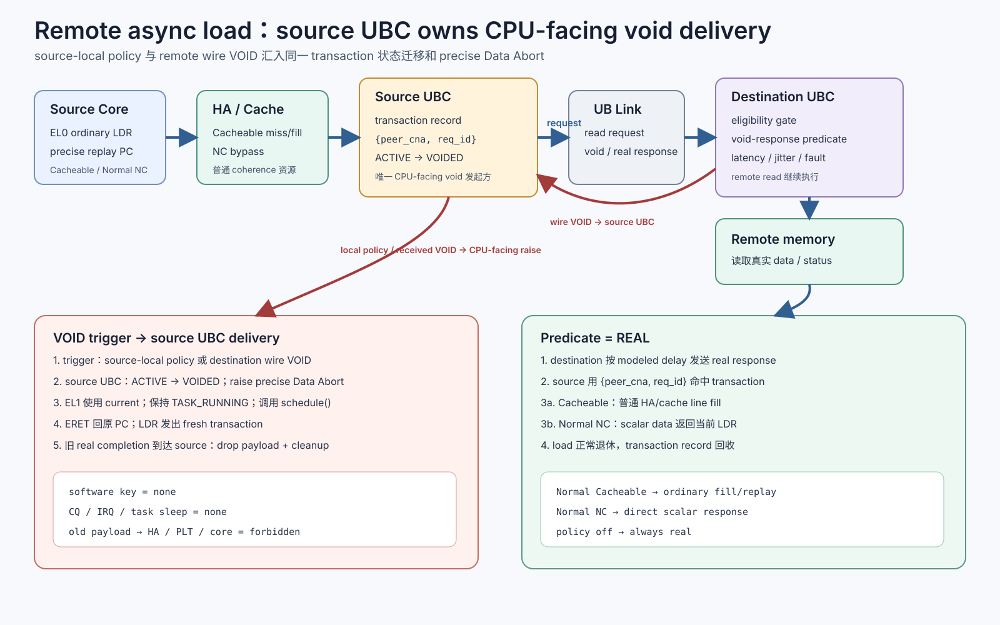
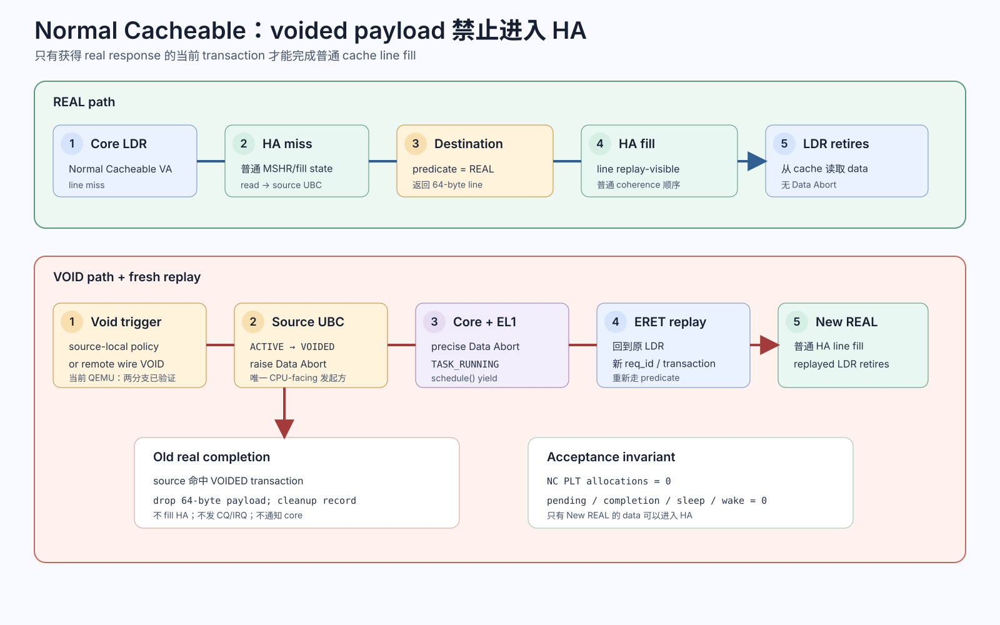
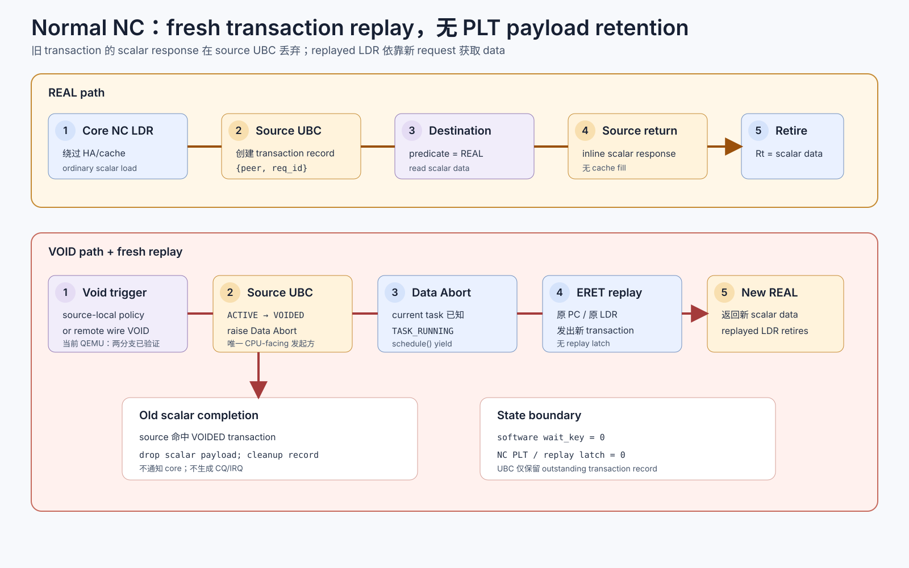
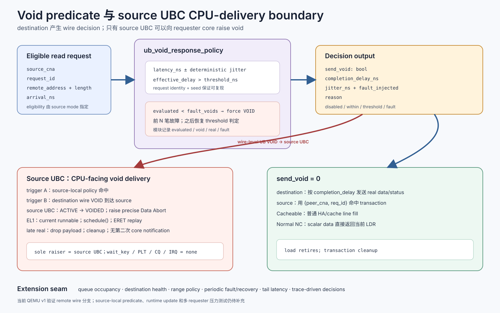

# Remote async load 整体方案

日期：2026-09-03
修订：2026-09-05

目标：EL0 application 使用普通 `LDR` 访问 remote memory。发起 UB 访存事务的 source
UBC 是唯一能够向 requester core raise CPU-facing void response 的组件。source UBC
可以因本地策略命中而 raise，也可以在收到 destination 返回的 wire-level UB VOID 后
raise。source core 随后以 precise Data Abort 进入 EL1；fault handler 保持当前 task 为
runnable，主动让出 CPU。`ERET` 返回原 `LDR` 后，该指令发起一笔新的 UB transaction。

本版 contract 不向 software 暴露 `wait_key`，也不使用 completion CQ/IRQ 唤醒 task。
voided transaction 的迟到 real completion 在 source UBC 内丢弃并完成 transaction 清理。

## 1. 系统组件与共同流程



关键约束：

- CPU-facing void 的发起方固定为创建并持有 outstanding transaction 的 source UBC；
- source UBC 的本地策略和 destination 返回的 wire-level UB VOID 是两种可独立存在的
  trigger；二者汇入同一个 `ACTIVE → VOIDED → precise Data Abort` 入口；
- destination UBC 可以根据 remote-side policy 返回 wire-level UB VOID；它不直接访问或
  signal source core；
- 当前 QEMU v1 验证的是 remote-side policy → wire VOID → source UBC raise 分支；
- `req_id + peer` 只属于 UBC 内部 transaction tracking，不进入 ESR、driver 或 task；
- fault handler 通过 precise exception 的 `current` 找到发出该 `LDR` 的 task；handler
  不保存 key，不把 task 改成 sleeping；
- 每次 replay 都是一笔新 transaction。旧 transaction 的迟到 payload 不参与新请求；
- policy 关闭或 predicate 选择 real 时，load 沿普通同步完成路径退休。

<div style="break-after: page;"></div>

## 2. Normal Cacheable



Normal Cacheable 请求经 HA/cache miss 路径到 source UBC。remote-side predicate 选择
real 时，response 沿普通 line-fill 路径进入 HA/cache，原 `LDR` 从已填充 line 读取。
source local policy 命中或 source 收到 remote wire VOID 时，source UBC 统一 raise
CPU-facing void；旧 transaction 的迟到 line data 在 source UBC 丢弃，因此不会污染
HA。replay transaction 后续获得 real response 时才进行普通 line fill。

该路径继续使用普通 cache/miss/fill/coherence 资源，不分配 NC PLT。

<div style="break-after: page;"></div>

## 3. Normal Non-cacheable



Normal NC 请求绕过 HA/cache。remote-side predicate 选择 real 时，source UBC 将 scalar
response 直接返回当前 `LDR`。source local policy 命中或 source 收到 remote wire VOID
时，source UBC raise CPU-facing void，task 经 Data Abort 做 runnable-yield，随后从原
PC replay 并发起新 transaction。旧 transaction 的迟到 scalar payload 被丢弃。

当前 contract 下 Normal NC 不分配 PLT、不保存 payload、不安装 replay latch。

<div style="break-after: page;"></div>

## 4. Destination void-response policy 模块



当前 policy 模块是 destination UBC 的独立 remote-side decision seam。输入仅包含请求
身份、地址、长度和到达时间；输出包含 `send_void`、预计 completion delay、jitter、
reason。`send_void=1` 表示 destination 在 UB 线路上返回 VOID。source UBC 收到该报文
后执行 transaction 状态迁移并向自己的 requester core raise CPU-facing void。

当前 v1 支持：

- 基准 completion latency 与 threshold；
- 按 request identity 和 seed 生成的确定性正负 jitter；
- 前 `fault_voids` 笔 eligible request 强制 void，随后自动恢复到 threshold 判定；
- evaluated、void、real 和 injected-fault counters。

QEMU 启动配置：

```text
--void-response-policy \
  'v1|enabled=1|threshold_ns=2000|latency_ns=1000|jitter_ns=200|fault_voids=2|seed=1'
```

`off` 为默认值。`jitter_ns` 不得大于 `latency_ns`；latency、jitter 和 threshold 的上限
均为 10 秒。配置由 `run_ub_dual_node_apps.sh` 与 `run_ub_obmm_eval.sh` 透传给
`ubc.void-response-policy`。

当前配置粒度为每个 QEMU UBC 实例，启动后保持不变。后续可在同一 request/decision
接口内增加 queue occupancy、destination health、地址范围、周期性故障、故障恢复窗口、
尾延迟和 trace-driven policy；UB wire response、source transaction cleanup 与 software
fault contract 无需随策略扩展。

source-local predicate 可以复用相同 decision API，但需要以 source outstanding
transaction 的等待时间、重试预算和本地拥塞状态作为输入。该分支尚未接入当前 QEMU
v1。无论采用哪一种 predicate，CPU-facing raise 的 ownership 都保留在 source UBC。
