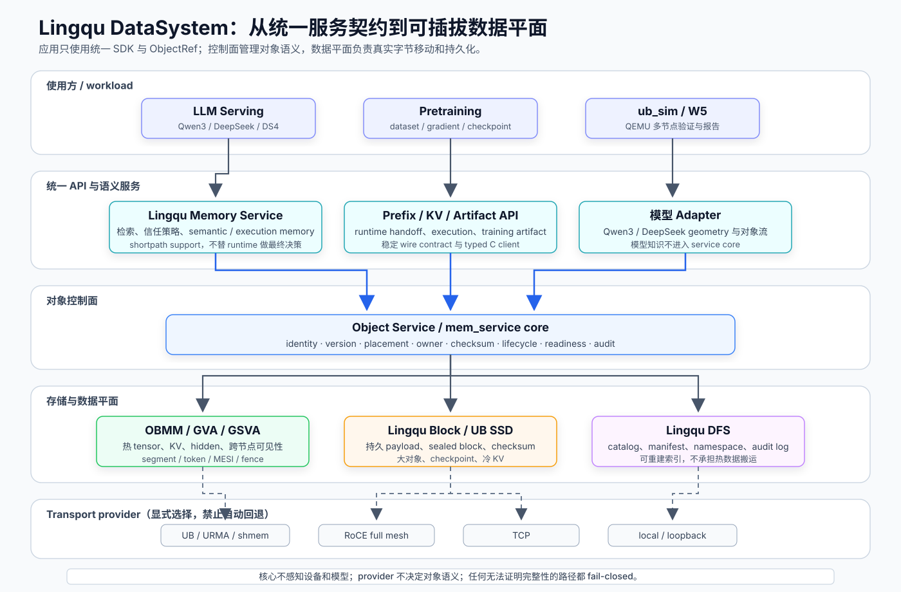
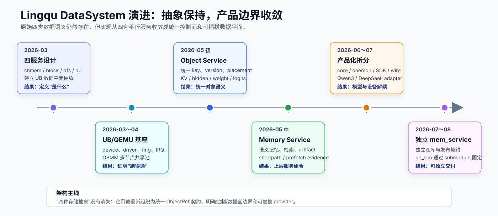

# Lingqu DataSystem 架构与实现回顾

> 回顾日期：2026-08-11
>
> 2026-08-14 审计更新：修正独立 `mem_service` 的当前锁定 revision。关于
> `ub_sim` 与 Lingqu DataSystem 的当前关系、完整 PoC 缺口和证据边界，以
> [当前状态与 PoC 差距审计](2026-08-14-ub-sim-lingqu-datasystem-poc-status-gap.md)
> 为准。
>
> 范围：`ub_sim` 的代码、设计文档与 Git 历史，以及本地
> `~/repos/pypto_ws_hu_core` 中的 Lingqu/PyPTO 上位设计。

## 1. 结论

Lingqu DataSystem 已经从“Unified Bus 上四个并列基础数据服务”的概念设计，
演进为“统一对象控制面 + 可插拔数据平面 + 上层语义服务”的实现。

当前最准确的系统定位是：

- `Memory Service`、Prefix、KV 和 Execution/Training Artifact 是上层语义；
- `Object Service / mem_service core` 统一管理对象身份、版本、放置、校验和与生命周期；
- OBMM/GSVA、Block/SSD 和 DFS 分别承担热数据、持久字节和持久命名空间；
- TCP、RoCE、UB/URMA、shared-memory 等只是数据平面 provider；
- Qwen3、DeepSeek V4 Flash 等模型知识停留在 adapter，不能进入服务核心；
- 无法证明 ownership、bounds、completion、version 或 checksum 的路径必须
  fail-closed。



这不是对原始设计的背离，而是产品边界的收敛：应用不再面对四套互相平行、
各自管理对象和传输的 API，而是通过统一 SDK/ObjectRef 使用数据能力，由控制面
选择 placement 和 provider。

## 2. 原始四服务模型

`~/repos/pypto_ws_hu_core/docs/pypto_top_level_design_documents/linqu_data_system.md`
定义了四种互补的数据抽象。

| 服务 | 原始定位 | 关键语义 | 当前主要落点 |
| --- | --- | --- | --- |
| `lingqu_shmem` | UB 上的分布式共享内存 | OpenSHMEM 风格控制面；L0–L7 可访问；L0–L2 映射为 GM/external memref | OBMM pool、GVA/GSVA、ObjectRef、MESI coherence |
| `lingqu_block` | UB attached device 的分布式块访问 | `(UB_ADDRESS, LBA)`；异步 read/write；completion 进入 tensor DAG | Rust durable/block simulation、UB SSD GSVA backend、sealed block backend |
| `lingqu_dfs` | UB 上的分布式文件系统 | L3–L7 全局 namespace；POSIX 风格文件访问；DFS manifest 引用 Block payload | Durable DFS catalog、manifest、append-only audit log |
| `lingqu_db` | 面向 UB 优化的 Redis-compatible DB | 固定二进制 descriptor；inline 小值；大值 DMA；pipeline/pub-sub | Object Service、独立 `mem_service` 元数据控制面 |

原设计的核心原则是：每个基础服务只负责一种数据抽象，高级能力通过组合产生。
例如缓存持久化、checkpoint、检索、数据生命周期和应用专用中间件，都不应该
反向污染基础数据面。

### 2.1 Runtime 背景

`linqu_runtime_design.md` 给出了四服务依赖的运行时语境：

- L0–L6 递归机器层级；
- 全局 `TaskKey` 与用户坐标映射；
- 每层、每个 scope depth 独立的 ring；
- 代码和数据“注册一次、按 handle 多次调用”；
- L0–L2 由 `simpler` 管理，L3–L6 由分布式 runtime 扩展；
- 数据就绪和消费完成事件参与 DAG 解析及 ring slot 回收。

因此，DataSystem 的本质不是附加存储，而是 runtime 数据依赖、对象生命周期和
跨层数据移动的基础设施。

## 3. 架构演进



### 3.1 2026-03：建立概念模型

`pypto_ws_hu_core` 形成四服务设计、Lingqu Runtime、机器层级以及 QEMU/UB
系统仿真架构。这个阶段回答的是：系统需要哪些稳定的数据抽象，以及它们如何
进入 PyPTO runtime。

### 3.2 2026-03～04：建立 UB/QEMU 数据平面基座

实现逐步覆盖：

- Linqu/UB QEMU device；
- arm64 guest driver、command ring 与 IRQ；
- UBC/UMMU 发现与路由；
- OBMM 跨节点 payload visibility；
- 2/4/8 节点 shared-memory pool 验证。

这个阶段证明了多节点数据面可以运行，但对象身份、版本和上层 workload 状态
仍然分散在各自模块中。

### 3.3 2026-05 初：从 `lingqu_db` 抽象出 Object Service

[Lingqu DB/Object Service 设计](lingqu_db_object_service_design.md) 指出了三个问题：

- `DbServiceStub` 只有 `key -> bytes` 和时延模型，无法描述 LLM 对象；
- `WeightsServiceStub` 已经组合 DB metadata 与 shmem/block placement，但过度
  weight-centric；
- Qwen3 decode state 仍把 token、hidden、KV cache 作为私有 host struct 传递。

Object Service 随之统一了：

| 对象维度 | 统一契约 |
| --- | --- |
| Logical identity | 稳定、人类可读的 object key，不编码物理 backend |
| Version | `LatestCommitted`、`Exact`、`AtLeast` 等 selector |
| State | Pending、Committed、Tombstoned、Quarantined |
| Placement | Inline、Shmem、OBMM、Block、DFS、External |
| Integrity | bytes、shape、dtype、layout、checksum |
| Ownership | producer、owner、requester entity |
| Operations | publish、resolve、append、subscribe/notify |

这一步的用户影响是：weight、KV、hidden boundary、token、logits 不再使用不同的
私有交接方式，而是共享一个对象语义和失败模型。

### 3.4 2026-05 中：在 Object Service 上构建 Memory Service

[W5 Lingqu Memory Service 设计](plans/2026-05-16-w5-lingqu-memory-service-design.md)
进一步把长期记忆、运行时对象和执行决策分开：

| 层 | 职责 | 明确不负责 |
| --- | --- | --- |
| Lingqu Memory Service | memory record、chunk、embedding、index、检索策略、信任策略、execution artifact、support evidence | 物理 payload transport；最终 runtime 跳转决策 |
| Hot State Materializer | 把 QueryResult 转换为 OBMM-backed tensor objects | 语义检索与模型执行 |
| Model Adapter | 把通用 hot state 转成 Qwen3/DeepSeek 所需对象布局 | 服务级对象身份和持久化策略 |
| Boundary Planner | 根据 support record、调度压力和验证策略决定 continue/jump/verify | 原始向量检索和持久化 |

Memory Service 同时管理两类相关但不同的 memory：

- **semantic memory**：record、chunk、embedding、index、QueryResult、hot state；
- **execution memory**：经过验证并绑定模型的 hidden/KV/logits artifact、boundary
  index 和 shortpath evidence。

向量命中本身不能证明可以跳过模型层。Shortpath 必须绑定 model、tokenizer、
layer range、position、shape、checksum 和 verification state。

### 3.5 2026-06～07：产品化与模型解耦

Guest 组件逐步拆成：

- model-neutral core；
- daemon/client 和 versioned wire protocol；
- typed C SDK；
- cluster、OBMM、GSVA 数据面；
- Qwen3 和 DeepSeek V4 Flash adapter；
- serving/pretraining example 与 fail-closed fixture；
- install/package/release/compat/ops certification contract。

关键变化不是文件拆分，而是依赖方向被固定：core 不依赖模型、设备或 QEMU；
adapter 依赖 core；provider 只实现中立的 region/transfer/completion 契约。

### 3.6 2026-07～08：抽取独立 `mem_service`

`mem_service` 从 `ub_sim` 的 guest 子树抽取为独立仓库，成为唯一权威来源；
`ub_sim` 改为通过 `MEM_SERVICE_ROOT` 消费源码，并将 gitlink 与
[`guest-linux/aarch64/mem_service.lock`](../guest-linux/aarch64/mem_service.lock)
同时锁定。

当前锁定信息：

| 字段 | 值 |
| --- | --- |
| Version | `0.1.0` |
| Revision | `91c20cd34fe6ad68405d0d17b3ad5481f889163c` |
| 权威来源 | 根目录 `mem_service/` Git submodule |
| 下游消费 | `ub_sim` 源码集成；DS4 安装 SDK 集成 |

## 4. 当前代码地图

| 位置 | 角色 | 当前性质 |
| --- | --- | --- |
| [`crates/sim-services`](../crates/sim-services/src/lib.rs) | `block/shmem/dfs/db` 时延与队列模型；durable sim；object model | 确定性模拟器模型 |
| [`crates/sim-memory`](../crates/sim-memory/src/lib.rs) | semantic memory、embedding/index、prefix cache、execution artifact、shortpath/prefetch audit、Paper Engram manifest | Rust 侧语义与验证模型 |
| [`mem_service/components/mem_service`](../mem_service/components/mem_service/README.md) | model-neutral object/memory service、daemon/client、wire、cluster/OBMM/GSVA、adapter | 当前产品化中心 |
| [`mem_service/apps/mem_service`](../mem_service/apps/mem_service) | CLI、构建、配置、部署、打包、manifest、release gate | 对外运维与交付入口 |
| [`guest-linux/aarch64/apps/llm_infer`](../guest-linux/aarch64/apps/llm_infer/README.md) | Qwen3/DeepSeek workload，消费 mem_service 对象流 | Guest serving consumer |
| `vendor/qemu_8.2.0_ub` + `guest-linux/kernel_ub` | GVA/GSVA、UB Link、OBMM MESI、driver/UAPI | 多节点数据平面与系统仿真 |

### 4.1 独立服务能力

独立 `mem_service` 当前已经具备：

- Unix-socket daemon 和 host daemon；
- 48-byte versioned wire header；
- 24 个 wire operations；
- object、prefix、KV、runtime handoff、execution artifact、training artifact；
- snapshot+journal、paged restore、idempotency、audit；
- sealed local/chunked/loopback/TCP block backend；
- UB SSD GSVA backend reference 和显式 data-plane I/O；
- TCP 与 RoCE provider；
- Qwen3、DeepSeek、pretraining adapter；
- Prometheus metrics、alert rules、systemd unit；
- tar/deb/rpm package gate 和 release certification verifier。

其公开入口、构建方式和安装布局见
[`mem_service/README.md`](../mem_service/README.md)，provider 边界见
[`providers/README.md`](../mem_service/components/mem_service/providers/README.md)。

## 5. 三条关键数据流

### 5.1 热 runtime object

```text
model runtime
  -> publish ObjectRef
  -> Object Service 校验 identity/version/checksum
  -> 选择 OBMM/GSVA placement
  -> consumer resolve + map
  -> provider data plane 直接搬运 payload
```

Daemon 是控制面，不应声称拥有另一个进程的 heap，也不应代理 hot-path payload。

### 5.2 持久对象

```text
payload
  -> Block write
  -> checksum / version 校验
  -> DFS manifest publish
  -> Object Service 记录 Block/DFS placement
  -> restart 后由 DFS manifest + Block ref 重建运行时索引
```

正确提交顺序是先写 Block 并验证，再发布 DFS manifest。DFS 和 Block 是并列
基础服务：DFS 负责路径和元数据，Block 负责大块字节。

### 5.3 Shortpath / Prefetch

```text
range exit hidden_ref + engram_state_ref
  -> BoundaryLookupRequest
  -> Memory Service 查找 model-bound ExecutionArtifact
  -> ShortpathSupportRecord
  -> W5 Boundary Planner
  -> continue | jump_to_layer | jump_to_terminal | require_verify
```

Prefetch 通常发生在 range start，只改变未来数据成本；shortpath 发生在 range
exit，会改变执行路径。因此二者可以共享索引，但不能共享记录类型或证据门槛。

## 6. 必须避免的误判

原始四服务的“设计目标”不等于当前已经存在四套完整产品。

| 原始承诺 | 当前真实状态 | 不能宣称的内容 |
| --- | --- | --- |
| OpenSHMEM-compatible `lingqu_shmem` | OBMM/GSVA 已实现共享对象、segment、token、MESI 和多节点路径 | 完整 OpenSHMEM API/语义兼容已经完成 |
| POSIX-style global `lingqu_dfs` | Durable DFS 提供 catalog、manifest、version、audit log | 已经是生产级 POSIX 分布式文件系统 |
| Redis-compatible `lingqu_db` | Object/mem service 提供稳定二进制对象 RPC | 已实现 Redis RESP 或完整 Redis command surface |
| UB attached `lingqu_block` | 有 durable block sim、sealed backend、UB SSD GSVA path | 已完成通用生产 UB-SSU 服务与全硬件认证 |

已经落地的是四种数据语义、组合方式和失败边界，而不是四个原样产品。

## 7. 当前成熟度

[独立部署评估](mem_service_independent_deployment_assessment.md) 给出的准确定位是：

> **L6 local-release-ready / external-evidence-blocked**

也可以表述为：本地 release-ready，外部证据 fail-closed。

| 维度 | 当前状态 | 用户影响 |
| --- | --- | --- |
| Component/core | model-neutral core、adapter 隔离、独立 daemon/SDK 已成立 | 可以被不同 workload 复用 |
| Local deployment | config、Unix socket、metrics、snapshot/journal、install/package smoke 已成立 | 本地可发布、安装、恢复和排错 |
| QEMU/UB data plane | OBMM/GVA/GSVA/MESI 已有 2/4/8 节点验证证据 | 可以验证多节点对象与 payload 流 |
| Production Linux ops | 缺真实 systemd/rpm/Prometheus/Alertmanager/upgrade-rollback bundle | 不能宣称生产运维认证完成 |
| Remote transport | TCP/RoCE 实现和 evidence verifier 已有，缺完整跨主机生产证据 | 不能宣称 production remote transport certified |
| SLA/capacity | SDK smoke 与 fixture 已有，外部 serving/pretraining 压测不足 | 不能给出生产延迟、容量和恢复承诺 |
| Security/migration | explicit-none-only encryption gate 和当前版本恢复已具备 | at-rest/data-plane encryption、key management、major-version migration 未完成 |

Durable simulation 还保留一个明确的兼容性尾项：外部 catalog JSON 路径需要在
所有下游切换到 durable catalog selector 后降级或移除，避免长期双入口。

## 8. 架构原则与用户影响

### 8.1 统一对象语义，而不是统一物理存储

统一的是 ObjectRef、version、checksum、placement 和 lifecycle；OBMM、Block、
DFS、TCP、RoCE 仍保留各自特性。

**用户影响：** workload 不需要知道对象具体落在共享内存、SSD 还是远端节点，
但仍能得到确定的版本、完整性和失败结果。

### 8.2 控制面不代理 payload

控制面决定对象是否存在、是否合法、在哪里；payload 应在 provider endpoint 之间
直接移动。

**用户影响：** daemon 可以复杂，但 hot path 不必为每个 tensor 多一次中心代理和
CPU copy。

### 8.3 Provider 不能成为策略层

Provider 只能注册 region、传输、等待 completion 和报告 capability/topology cost；
不能更改对象 metadata、选择模型策略或静默降级到另一个 provider。

**用户影响：** RoCE 故障不会悄悄变成 TCP 并产生不可解释的性能变化；系统会给出
明确失败和下一步诊断依据。

### 8.4 模型是 consumer，不是服务边界

Qwen3、DeepSeek 和 Engram 是 adapter/consumer。新增模型应提供 geometry 和对象流
builder，而不是把模型名加入 core API。

**用户影响：** 同一套 Memory Service 可以服务推理、预训练和未来模型，不需要为
每个 workload 部署一套状态服务。

### 8.5 Memory Service 不等于 Vector DB

Vector index 只是可替换 backend。Memory Service 还必须负责 provenance、trust、
retention、security、PII、audit、hot-state materialization 和 execution evidence。

**用户影响：** 一次 decode 为什么使用某条记忆、哪个版本和哪些对象可以被追溯，
模型输出也不会自动升级为可信长期记忆。

## 9. 名称约定

当前历史文件中存在三种拼写语境：

| 名称 | 建议理解 |
| --- | --- |
| `Linqu` | 旧 simulator 文档中经常等同于 UB/UnifiedBus 平台对象 |
| `Lingqu DataSystem` | 建立在 UB 之上的数据服务与对象语义体系 |
| `linqu_mem_service` | 已冻结的 binary/package 命名，属于历史兼容拼写 |

讨论系统架构时应区分“UB/Linqu 平台层”和“Lingqu DataSystem 服务层”，不要把
PyPTO hierarchy label 当成 UB 硬件对象，也不要因为二进制拼写是 `linqu_*` 就把
两层重新合并。

## 10. 后续方向

下一阶段不应继续增加新的平行 `lingqu_*` 服务，而应集中在以下工作：

1. 取得真实 Linux ops 与跨主机 transport certification evidence；
2. 用外部 serving/pretraining 系统验证 SLA、容量和故障恢复；
3. 完成 at-rest/data-plane encryption 与 key management；
4. 建立 major-version wire/catalog/store migration matrix；
5. 移除 durable catalog 的长期双入口；
6. 继续要求所有 provider 通过同一 ownership、bounds、transfer、completion、
   checksum 和 fail-closed conformance suite。

这条路线的本质是完成生产证据和契约闭环，而不是再次扩张服务命名和 API 表面。

## 11. 主要资料入口

### `pypto_ws_hu_core`

- `docs/pypto_top_level_design_documents/linqu_data_system.md`
- `docs/pypto_top_level_design_documents/linqu_runtime_design.md`
- `draft/qemu_based_linqu_simulator_architecture_spec.md`

### `ub_sim`

- [Lingqu DB/Object Service Design](lingqu_db_object_service_design.md)
- [W5 Lingqu Memory Service Design](plans/2026-05-16-w5-lingqu-memory-service-design.md)
- [Lingqu Block/DFS Durable Simulation Design](plans/2026-05-18-lingqu-block-dfs-durable-simulation-design.md)
- [GVA/GSVA/OBMM MESI 阶段总结](sim_gva_gsva_obmm_mesi_stage_status_summary.md)
- [mem_service Independent Deployment Assessment](mem_service_independent_deployment_assessment.md)
- [mem_service Independent Service Plan](plans/2026-06-25-mem-service-independent-service-plan.md)
- [`mem_service` README](../mem_service/README.md)
- [`mem_service` Architecture Design](../mem_service/docs/design.md)
- [`mem_service` Provider Contract](../mem_service/components/mem_service/providers/README.md)

## 12. 回顾方法与边界

本回顾基于两个仓库当前代码、文档、Git 历史和已归档验证报告进行只读分析。
它没有重新运行 QEMU、模型 workload 或完整测试，因此“已验证”均指仓库中已有的
测试、日志和 certification artifact 所证明的范围，不扩展为新的运行结论。
