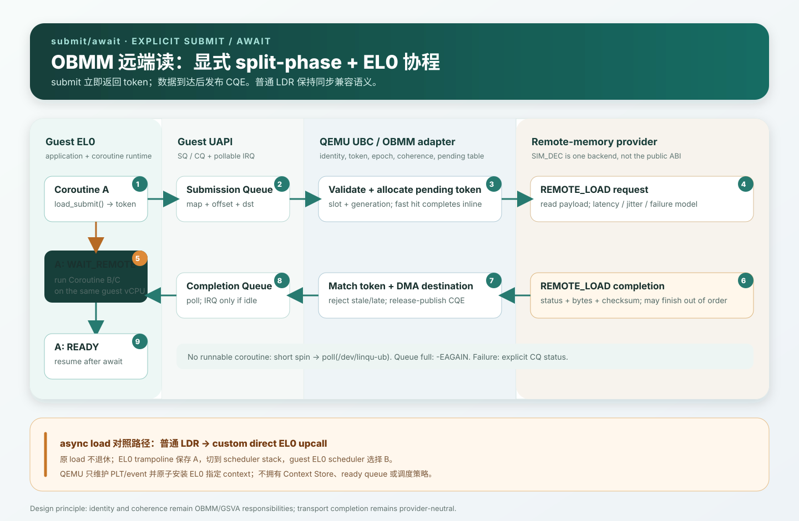
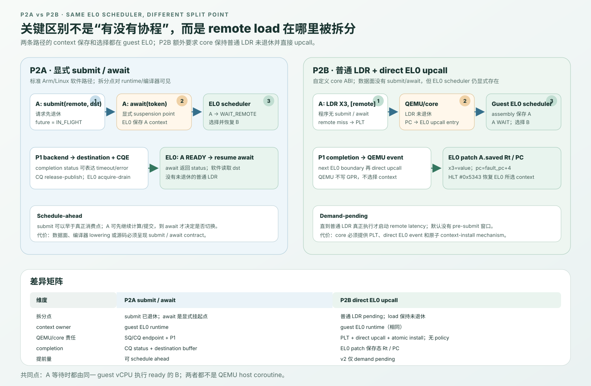
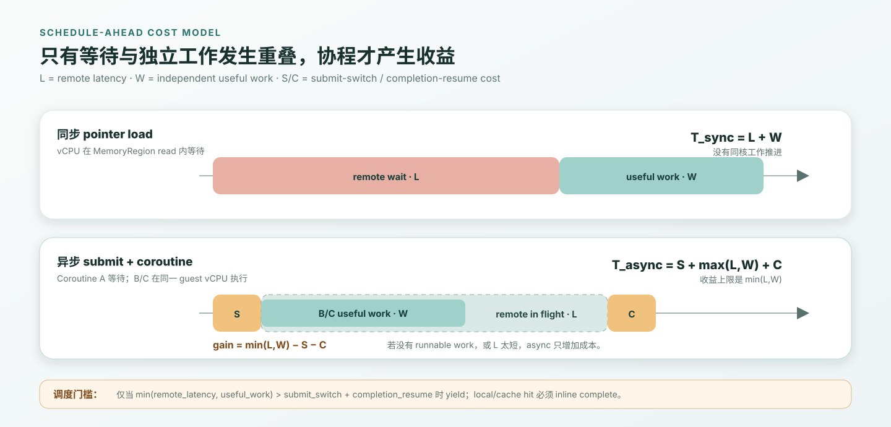
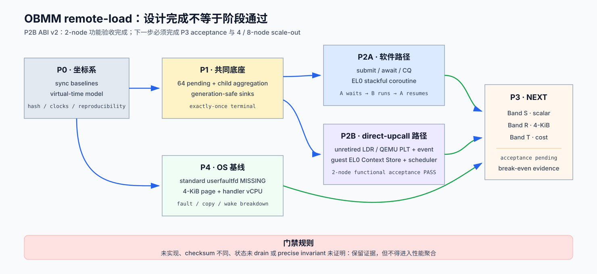

# OBMM 远端内存 Load 的 EL0 协程延迟隐藏：可行性分析与验证设计

> 状态：P0/P1/P2A/P4 沿用既有结果；P2B 已按 direct-to-EL0 upcall + guest EL0
> scheduler 的 ABI v2 重构，并在 `n4-910c` 通过 ARM64 Linux build、2-node 远端
> QEMU guest E2E 和 phase gate，2-node producer/consumer 功能目标已完成。P3 性能
> 对比评估是整体方案的下一必做阶段，其中包含 4/8-node scale-out；它不属于 P2B
> 功能验收退出条件。旧 49-case P3 结果因 P2B ABI 变更作废
>
> 日期：2026-08-11
>
> 实施与验证：[2026-08-12-obmm-remote-load-coroutine-implementation-validation.md](2026-08-12-obmm-remote-load-coroutine-implementation-validation.md)
>
> 范围：AArch64 guest EL0、QEMU TCG、OBMM/GSVA、UBC/SIM_DEC 远端读路径
>
> 结论：同时验证“显式异步读 + EL0 协程”和“普通 `LDR` + 自定义 direct EL0
> upcall + guest EL0 scheduler”两条路径；前者是标准 Arm/Linux 软件基线，后者
> 故意新增非标准 core event/resume mechanism，但 context 保存与选择仍由 EL0 完成。

详细实现设计：

- [P0：同步基线、时钟与远端延迟模型详细设计](p0-baseline-latency-model-detailed-design.md)
- [P1：provider-neutral split-phase backend 详细设计](p1-split-phase-backend-detailed-design.md)
- [P2A：submit/await + EL0 协程详细设计](p2a-submit-await-detailed-design.md)
- [P2B：普通 `LDR` + direct EL0 upcall + EL0 scheduler 详细设计](p2b-scheduler-core-detailed-design.md)
- [P3：OBMM 远端 Load 路径对比评估详细设计](p3-comparative-evaluation-detailed-design.md)
- [P4：标准 userfaultfd 透明页访问基线详细设计](p4-userfaultfd-baseline-detailed-design.md)
- [P0–P4 实施与验证报告](2026-08-12-obmm-remote-load-coroutine-implementation-validation.md)

## 1. 结论

目标是可行的。这里不把“普通 AArch64 `LDR` 收到 pending 后直接进入 EL0 调度器”
伪称为标准 Arm/Linux 行为，而是明确把它定义为本实验要求 QEMU 模拟的自定义 core
行为。

核心判断如下：

1. **标准 Arm 异常不会被取到 EL0。** EL0 发起的同步异常会进入更高异常级别，
   通常由 EL1 Linux 处理；“像 exception、但直接返回 EL0”需要自定义 CPU 语义，
   不能称为 Arm 异常。
2. **普通 `LDR` 不能以“暂时没有返回值”的状态退休。** 在得到数据或精确异常前，
   目标寄存器、PC、内存顺序和异常状态都必须保持可恢复。切换同一 core 上的另一
   个 EL0 协程，本质上要求保存并替换完整架构上下文。
3. **当前实现比上述模型更同步。** OBMM/GSVA CPU window 是 QEMU
   `MemoryRegionOps.read()`；回调进入 `ubc_sim_dec_remote_read()` 后使用单个
   `sim_dec_sync_read` 槽位轮询、休眠，直到 `READ_RESP` 或超时。当前没有一个
   可交给 guest 调度器的 split-phase load。
4. **仓库已有可复用的 split-phase 范式。** URMA READ 已有 64 项 pending table，
   响应到达后写本地 SGE 并生成 CQE。伴随工作区的 Lingqu 设计也已定义“命令 ring
   非阻塞提交、completion queue、输出 tensor 从 `PENDING` 变为 `READY`”。两条
   路径都应复用 token 化的 pending/completion backend；区别是 completion 交给
   software future，还是经 QEMU PLT/event 交给 guest EL0 Context Store。

因此把目标拆成两条可对比路径：

- **标准软件路径：** `obmm_load_submit()` + `obmm_await()`，请求和 completion
  通过队列关联，EL0 协程在 `await` 点主动切换；编译器后续可把带注解的远端访问
  降低成该 API。该路径符合 Arm/Linux，错误也能作为 completion status 返回。
- **自定义 P2B 路径：** 程序仍执行普通 `LDR`；QEMU 的 PLT 冻结未退休 load，core
  在精确边界只把 EL0 PC 导向 registered upcall entry。EL0 assembly/runtime 保存
  context、维护 ready/wait、选择 next，并以自定义 resume instruction 请求 core 原子
  安装所选 context。QEMU 不拥有 Context Store 或调度策略。





## 2. 问题定义

### 2.1 要解决的问题

OBMM 映射让远端内存表现为可访问地址，但远端 miss 的服务时间可能从普通
DRAM/HBM 的短延迟扩大到微秒级，且可能出现长尾、超时或失败。如果 core 在每个
远端 load 上同步等待，它无法利用同一线程中其他相互独立的工作。

本设计要验证：

- 当一个协程等待远端数据时，同一 guest vCPU 能否运行其他 ready 协程；
- 提前提交多少个远端读，才能覆盖给定的远端访问延迟；
- 快路径、无其他可运行工作、队列满和失败时，额外成本是否可控；
- 这一收益来自真实的等待重叠，而不是 QEMU host 线程、计时或缓存假象。

### 2.2 非目标

- 不在第一阶段让任意未修改二进制的普通 `LDR` 自动异步化；
- 不把 SIM_DEC 名称或 wire message 固化为用户 ABI；
- 不在本设计中解决远端 store、原子指令、exclusive monitor 或完整共享内存一致性；
- 不用“读失败返回 0”替代错误传播；
- 不把 QEMU host coroutine 等同于 guest EL0 coroutine。

## 3. 重构前同步基线证据

### 3.1 从 EL0 load 到远端响应

P0/P1 实施前用于界定问题的关键路径为：

```text
EL0 LDR
  -> ARM MMU / TCG TLB fill
  -> GSVA route + token/coherence validation
  -> local PA mapping
  -> SIM_DEC / GSVA CPU MemoryRegionOps.read()
  -> ubc_sim_dec_remote_read()
  -> SIM_DEC_READ_REQ
  -> poll links + g_usleep()
  -> SIM_DEC_READ_RESP
  -> MemoryRegionOps.read() returns uint64_t
  -> LDR retires
```

| 证据 | 当前行为 | 对设计的约束 |
|---|---|---|
| `target/arm/tcg/tlb_helper.c:302-383` | `arm_cpu_tlb_fill()` 在正常 Arm 地址转换后调用 GSVA translation；拒绝时由 `arm_deliver_fault()` 交付架构异常 | GSVA route hook 是地址/权限边界，不是可返回 pending 的 load completion ABI |
| `hw/ub/ub_ubc.c:1040-1128` | SIM_DEC CPU window read 最终同步调用 `ubc_sim_dec_remote_read()` | 普通指针 load 当前阻塞在 QEMU MMIO 回调 |
| `hw/ub/ub_ubc.c:1284-1406` | CPU window 的 `.read` 回调返回 `uint64_t`，单次访问宽度为 1/2/4/8 字节 | 现有 QEMU Memory API 没有“本次 read 暂无值”的返回形态 |
| `hw/ub/ub_ubc.c:6108-6209` | 一个请求占用 `sim_dec_sync_read`，循环 poll 并按 50/1000 us 休眠 | 多个协程无法形成多个 in-flight read，长尾直接变成 vCPU stall |
| `include/hw/ub/ub_ubc.h:198-225` | URMA 有 64 项 pending reads；SIM_DEC 只有一个同步槽 | split-phase 的基本实现模式已经存在，但 OBMM 身份/一致性语义不能被绕过 |
| `hw/ub/ub_ubc.c:6928-7006` | URMA READ 提交后不立即生成 CQE；`READ_RESP` 到达后再完成 | 可复用 request ID、owned destination、CQE 和 queue-full 语义 |
| `driver/linqu_ub_drv.c:38-111` | guest driver 已能通过 IRQ、wait queue 和 `poll()` 向用户态报告事件 | 没有 runnable coroutine 时，可用 pollable wakeup，没必要发明 EL0 exception |

QEMU 官方 Memory API 也把 MMIO 描述为“每次 read/write 调用 host callback”。因此，
现有 `.read()` 边界只能同步返回一个值。显式软件路径应走独立 submit/CQ 通道；
P2B 路径则必须在 TCG scalar-load path 中新增 `PENDING` 和精确 TB exit，不能让
现有 `.read()` 返回“空”或伪造数值。pending 的 load metadata 属于 QEMU PLT；
coroutine context 与 scheduling state 属于 guest EL0 runtime。

### 3.2 与 Lingqu runtime 设计的关系

伴随工作区 `pypto_ws_hu_core` 中已有两项直接相关的设计：

- `linqu_data_system.md:53-90` 已定义 block 命令非阻塞提交到 device command ring，
  completion 进入 UB completion queue，scheduler 把输出 tensor 标成 ready；
- `linqu_runtime_design.md:442-504` 已定义 orchestrator、scheduler、worker 分工，以及
  tensor 依赖驱动 `PENDING -> READY`。

本设计不复用其中的具体 block API，但复用相同的核心抽象：**远端读是一个生产
future/result slot 的异步任务，completion 使依赖者变为 ready。** 对 EL0 协程而言，
future 的依赖者是挂起的 coroutine；对更高层 Lingqu DAG 而言，依赖者也可以是 task。

### 3.3 术语修正

原设想中的 `void-response` 建议替换为：

| 原术语 | 建议术语 | 原因 |
|---|---|---|
| `void-response` | `REMOTE_LOAD_SUBMITTED` 或本地 submit success | 请求被本地队列接受不需要一次远端往返，也不是 read response |
| 第二次 `void-response with result` | `REMOTE_LOAD_COMPLETION` / CQE | completion 必须带 token、状态、长度和可选校验信息 |
| EL0 同步事件 | custom `REMOTE_LOAD_PENDING` upcall event | core 直接转入 registered EL0 entry；不伪装成标准 Arm exception |
| SIM_DEC async ABI | OBMM/GSVA remote-read ABI | SIM_DEC 是当前模拟后端，不应成为长期用户接口 |

## 4. 架构可行性边界

### 4.1 为什么普通 `LDR` 不能自然地挂起

执行 `LDR X0, [X1]` 时，处理器至少需要维护：

- faulting PC 和下一条 PC；
- 目标寄存器 `X0`；
- 地址、访问宽度、符号扩展、endianness；
- acquire/release、barrier 和观察顺序；
- precise exception、single-step 和 signal/debugger 状态。

如果 load 未完成却直接执行下一个协程，上述状态必须保存在一个 shadow context 中，
而 core 的所有可见寄存器要换成另一个协程的上下文。这已经不是“返回一个空值”，
而是一个精确的硬件线程切换协议。

此外，Arm 的异常级别模型明确规定 exception 不会被取到 EL0。标准路径只能是：

```text
EL0 fault -> EL1 exception entry -> kernel/signal/scheduler -> EL0 resume
```

本实验定义的是更窄的自定义 core mechanism：pending-load table 仍在 core/QEMU，
但 event 直接把 EL0 PC 导向 registered upcall entry；EL0 assembly 保存 context，EL0
runtime 维护 Context Store 和 policy。恢复时使用 custom resume instruction，避免普通
branch 无法精确恢复全部 GPR。该契约不属于现有 Arm/Linux architecture，但正是本次
要求 QEMU 模拟的行为。

### 4.2 方案对比

| 方案 | 标准 Arm/Linux | 保留普通 `LDR` | 同一 OS 线程运行其他协程 | 错误表达 | 复杂度 | 定位 |
|---|---:|---:|---:|---:|---:|---|
| 显式 async API + EL0 coroutine | 是 | 否，需 helper/`await` | 是 | 完整 CQ status | 中 | **推荐 MVP** |
| 编译器降低为 submit/await | 是 | 源码近似透明，机器码不是普通 `LDR` | 是 | 完整 CQ status | 中高 | 推荐演进 |
| `userfaultfd` 缺页恢复 | 是 | 是，页粒度 | 否；faulting kernel thread 阻塞，需另一线程 | 页错误/handler status | 中 | 透明基线 |
| EL1 page fault + signal trampoline | 是 | 是 | 理论可做但信号安全、重放和嵌套复杂 | signal/fault | 高 | 不推荐 |
| QEMU host coroutine | 与 guest ISA 无关 | guest load 仍未退休 | 否，只可能让其他 vCPU/host task 运行 | host 内部 | 中 | 不能满足目标 |
| direct EL0 upcall + EL0 scheduler（QEMU 模拟） | **自定义 core architecture** | 是 | 是 | 自定义 event/status | 极高 | P2B 对照验证 |
| 自定义 `LD_REMOTE_ASYNC` 指令 | 自定义 ISA | 否 | 是 | token/CQ | 高 | 比透明 upcall 更诚实的 ISA 实验 |

`userfaultfd` 具备实际基线价值：当前 guest kernel 是 6.6，构建配置包含
`CONFIG_USERFAULTFD=y`。Linux 官方文档定义了 registered range 的 page fault
通过 file descriptor 交给用户态 handler，再由 `UFFDIO_*` 解决。它能验证透明页
访问的代价，但不能证明“单一 kernel thread 内普通 load 直接切到另一个 EL0 协程”。

### 4.3 两条路径真正的差异

两者的调度算法并没有本质区别，都是：`A WAIT_REMOTE -> run B -> A READY`。真正的
架构差异发生在 remote load 的拆分边界：

- `submit/await` 在软件层把一次读拆成“请求”和“消费结果”。`submit` 已经退休，
  `await` 是编译器/runtime 明确知道的 suspension point；系统里不存在一个尚未退休
  的普通 `LDR`。
- P2B upcall 在普通 `LDR` 已经发出之后才发现 remote pending。此时
  `LDR` 必须保持未退休，pending table 必须保存 PC、目标寄存器、memop、ordering、
  fault state 和 context ID；guest EL0 scheduler 再保存并换走 coroutine context。

因此，关键问题不是“谁会不会修改 PC/SP”，而是：

| 维度 | 显式 submit/await | scheduler-core upcall |
|---|---|---|
| data-plane 可见接口 | `submit/test/await`、future/CQE | 普通 `LDR`；pending/completion 只在 core 内可见 |
| pending 状态所有者 | software runtime、destination buffer、CQ | QEMU PLT 保存 load；EL0 Context Store 保存 coroutine |
| context switch 发起者 | application core 上的 coroutine runtime | direct upcall 后的 guest EL0 scheduler runtime |
| load 结果落点 | API 指定 buffer，`await` 返回 status | 成功时由 EL0 patch 原始目标寄存器；失败时令 coroutine `FAULTED` 并 fail closed |
| schedule-ahead | 软件/编译器可在真正消费前提前 submit | 默认只能在 demand load pending 后切换；提前需 hardware prefetch/predictor |
| 主要负担 | 修改软件接口和编译器规范 | 新增 direct-upcall/resume core mechanism、PLT 与 EL0 ABI |

硬件路径虽然不暴露每次访问的 data-plane API，但仍需要 control-plane contract：
注册 upcall entry、map、home CPU 和 logical context count。context ID、stack、Context
Store 和 ready policy 是 EL0 runtime 状态。它是软件透明的数据访问接口，不是完全
没有软硬件 ABI。

## 5. P1 共同底座：provider-neutral split-phase backend

本节给出跨方案的架构边界；parent/child state、bounded result pool、terminal race、
CLI 和逐文件实现顺序以
[P1 详细设计](p1-split-phase-backend-detailed-design.md)为 canonical 定义。

### 5.1 共同的只有异步传输，不是上层协议

P2A 和 P2B 都要求 remote provider 不阻塞 application vCPU，并允许多个 request
同时处于 in-flight；两者可以共用 OBMM validation、pending request、provider token、
timeout/cancel 和 completion generation 检查。

两条路径从 backend 的两侧接入方式不同：

| 边界 | P2A | P2B |
|---|---|---|
| 谁发起 backend request | EL0 写 SQ，async endpoint 验证后提交 | 普通 `LDR` remote miss，RLA/PLT 验证后提交 |
| backend pending 的上层身份 | software token/future | PLT token + EL0 context ID |
| payload completion 落点 | registered destination buffer | PLT 的 scalar result field |
| completion 通知对象 | CQE，随后唤醒 EL0 waiter | SCC `COMPLETE/FAULT` event |
| 最终消费 | `await` 返回后软件读取 buffer | EL0 scheduler patch 保存态 `Rt/PC` |

所以 P1 不能定义 SQ/CQ、`await`、Context Store 或目标寄存器；这些分别属于 P2A
和 P2B guest runtime。P1 只定义“一项通过 OBMM 检查的 read，如何非阻塞地进入 provider，并且
恰好完成一次”。

### 5.2 Backend 内部契约

下列是 QEMU/模拟器内部语义，不是 EL0 UAPI：

```c
struct obmm_remote_result;

typedef void (*obmm_completion_fn)(void *adapter_state,
                                   uint64_t sink_id,
                                   uint64_t sink_generation,
                                   const struct obmm_remote_result *result);

struct obmm_completion_sink {
    uint64_t sink_id;
    uint64_t sink_generation;
    obmm_completion_fn complete;
    void *adapter_state;          /* QEMU-owned adapter object, never guest pointer */
};

struct obmm_remote_read_request {
    uint64_t request_token;       /* slot + generation */
    uint64_t map_id;
    uint64_t map_generation;
    uint64_t remote_offset;
    uint32_t length;
    uint32_t flags;
    uint64_t deadline_ns;
    struct obmm_completion_sink sink;
};

enum obmm_submit_result {
    OBMM_COMPLETE_INLINE,
    OBMM_PENDING_REMOTE,
    OBMM_REJECTED,
};
```

`sink` 是经过验证、带 generation 的内部 callback descriptor。P1 不根据 `type`
识别 P2A/P2B；P2A adapter 的 callback 写 registered buffer/CQ，P2B adapter 的
callback 写 PLT/SCC event。`adapter_state` 必须是 backend 生命周期内稳定的 QEMU
对象，不能是 guest pointer。provider 只把 payload/status 返回 P1，不直接调用 sink、
读取 coroutine pointer、修改 `CPUARMState` 或决定调度策略。

### 5.3 共同职责边界

| 层 | 共同职责 | 明确不做 |
|---|---|---|
| OBMM adapter | map/range、token、permission、epoch、retire 和 coherence 检查 | 暴露 SIM_DEC/URMA 名称；选择 coroutine |
| pending backend | 分配 request token、容量/backpressure、deadline/cancel、generation | 定义 SQ/CQ 或 PLT 的 guest-visible 布局 |
| remote provider | 搬运 payload、报告 completion/error、执行延迟/故障模型 | 写 GPR/PC；运行 EL0 scheduler；管理 map lifecycle |
| completion router | revalidate request/map/sink generation，恰好交付一次 | 把 failure 转成 payload 0；猜测上层消费方式 |

payload 写入和 completion publish 必须形成 release/acquire 关系，但具体 publish
对象由上层 adapter 决定：P2A 发布 `CQ_TAIL`，P2B 发布 SCC event/PLT terminal state。

### 5.4 Backend 状态机

```text
FREE
  -> ACCEPTED
  -> IN_FLIGHT
  -> COMPLETED | FAILED | TIMED_OUT | CANCELLED | RETIRED
  -> DELIVERED
  -> FREE(next generation)
```

共同不变量：

- 只有 request slot、request generation、map generation 和 sink generation 全部匹配
  才能交付 completion；
- duplicate、late、stale response 只计数，不写 buffer、PLT、GPR 或 PC；
- timeout、cancel、map retire 和 provider response 通过单一 terminal commit 点竞争；
- completion backpressure 不能覆盖或丢弃已完成结果；
- provider 不持有可被 guest 提前释放的 raw pointer；
- 固定 seed 的 latency、jitter、reorder、drop/error 注入在 P2A/P2B 中必须一致。

### 5.5 当前实现与 P1 落点

当前 `ubc_sim_dec_remote_read()` 使用单一 `sim_dec_sync_read` 槽位并在 MMIO read
回调中 poll/`g_usleep()`，不能作为 P1。现有 URMA READ 的 64 项 pending table、
response match 和 CQE 形成可复用实现范式，但 OBMM adapter 必须先完成 map/token/
epoch/coherence 检查，且 provider completion 必须经上面的 sink router 返回。

P1 完成的判断标准不是“P2A CQ 已经能用”，而是同一个 backend unit model 能分别
挂接 test sink、P2A sink 和 P2B sink，并通过 64 in-flight、乱序、duplicate、late、
timeout、cancel、retire 和 queue-full/fail-closed 测试。

## 6. P2A：显式 submit/await + EL0 协程

### 6.1 第一性原理与软件边界

P2A 要隐藏远端读，真正需要以下四个能力：

1. **提前知道该访问可能很慢；**
2. **把请求提交和结果消费分开；**
3. **用稳定 token 关联请求、结果和等待者；**
4. **等待期间存在独立且 ready 的工作。**

因此 P2A 使用显式 future：`submit` 已经退休，`await` 是明确 suspension point，
EL0 runtime 可以在此保存当前 coroutine 并运行其他 ready coroutine。该结论只属于
P2A；P2B 的普通 `LDR` 在 completion commit 前一直没有退休。

### 6.2 用户态 API 概要

以下代码只说明调用形态。v1 SQ/CQ layout、token、buffer ownership、状态机、
coroutine ABI 和实现文件已在
[P2A 详细设计](p2a-submit-await-detailed-design.md) 中冻结；本节不再作为 canonical
ABI 定义。

```c
struct obmm_async_read {
    uint64_t map_id;
    uint64_t remote_offset;
    struct obmm_async_buffer *dst;
    uint32_t dst_offset;
    uint32_t length;
    uint32_t flags;
    uint64_t deadline_ns;
    uint64_t user_data;
};

struct obmm_async_cqe {
    uint64_t token;       /* slot + generation, not a raw pointer */
    int32_t status;
    uint32_t bytes_done;
    uint64_t checksum64;
    uint64_t user_data;
};

int obmm_load_submit(struct obmm_ctx *ctx,
                     const struct obmm_async_read *req,
                     uint64_t *token);
int obmm_load_test(struct obmm_ctx *ctx, uint64_t token,
                   struct obmm_async_cqe *cqe);
int obmm_load_await(struct obmm_ctx *ctx, uint64_t token,
                    struct obmm_async_cqe *cqe);
```

协程侧的使用形态：

```c
uint64_t token;
struct obmm_async_buffer *buffer;

obmm_load_submit(ctx, &request_for(remote_ptr, buffer, sizeof(uint64_t)),
                 &token);
do_independent_work();
co_await_obmm(ctx, token);  /* 未完成则把当前 coroutine 置为 WAIT_REMOTE */
consume(*(uint64_t *)obmm_async_buffer_addr(buffer));
```

重要语义：

- `map_id + offset` 是外部身份；QEMU 内部才 resolve 为 home CNA、remote UBA、
  token 和 segment epoch；
- destination 必须来自 driver 注册/pin 的 buffer；SQ 使用 `buffer_id + offset`，
  不能携带裸 GPA，也不能指向即将退出的栈帧；
- wire token 不携带 guest coroutine 指针。runtime 本地用 `user_data` 把 CQE 映射
  回 coroutine；
- queue full 返回 `-EAGAIN`，调用方可先 drain CQ 或回退同步路径；
- timeout、retired、route missing、token denied、remote I/O error、checksum mismatch
  都是显式 status，绝不把失败静默转换为数值 0。

### 6.3 P2A 数据面分层

推荐保留三个边界：

| 层 | 责任 | 不应该承担的责任 |
|---|---|---|
| EL0 coroutine runtime | future、等待者映射、ready queue、context switch、poll/idle policy | 解析 remote UBA、伪造 Arm exception |
| guest driver + P2A async endpoint | SQ/CQ ownership、registered buffer、software token、把 SQ 转成 §5 P1 request、把 completion 转成 CQE | 实现 provider transport；替应用选择 coroutine |
| §5 P1 backend/provider | OBMM bounds/token/epoch/coherence、pending transfer、completion router | 解释 software future；暴露 SIM_DEC 私有名称 |

现有 URMA pending/CQE 代码可作为 split-phase engine 的实现参考，但不能直接绕过
OBMM/GSVA 的 map lifecycle、token 和 coherence 检查。它属于 §5 P1 的实现参考，
不是 P2A UAPI。P2A endpoint 只负责把 software token/registered buffer 转成带
generation 的 P1 completion sink。

### 6.4 P2A software-visible 状态机

```text
FREE
  -> RESERVED
  -> SUBMITTED
  -> READY | FAILED | TIMED_OUT | CANCELLED
  -> CONSUMED
  -> FREE(next generation)
```

`PENDING_REMOTE` 是 §5 backend 内部状态，不是 EL0 future 的额外可见阶段。协程状态
独立于 request 状态：

```text
RUNNING --await(not ready)--> WAIT_REMOTE
WAIT_REMOTE --CQE-----------> READY --> RUNNING
```

必须满足：

- 只有 `(slot, generation)` 都匹配的 completion 才能完成请求；
- duplicate、late 或 stale completion 只计数，不可写入复用后的 destination；
- segment retire/unmap 取消尚未开始的请求；已发出的请求完成后也必须校验 generation；
- coroutine 退出时只能 detach/cancel 自己的 waiter，不能提前释放仍被 DMA 引用的 buffer；
- CQ 满时 provider 不得覆盖未消费 CQE，必须 backpressure 或 fail closed。

### 6.5 调度策略与 schedule-ahead

仅有 coroutine 并不自动产生收益。调度器要同时利用访问预测和 runnable work：

```text
if local/cache hit:
    complete inline; do not switch
elif min(expected_latency, useful_work_window) <= switch_and_completion_cost:
    use sync or short spin
else:
    submit async; run another ready coroutine
```

建议提供以下策略参数：

| 参数 | 含义 | 初始策略 |
|---|---|---|
| `max_inflight` | 每个 scheduler 最大未完成请求数 | 从 8/16/32/64 扫描，不直接假定 64 最优 |
| `lookahead` | 提前多少次迭代/多少字节提交 | `ceil(expected_latency / compute_per_item)`，受 `max_inflight` 限制 |
| `min_yield_us` | 预测延迟低于该值不切换 | 由实测 switch + CQ cost 自适应，不硬编码平台常数 |
| `spin_us` | completion 临近时短轮询时间 | 0/1/2/5 us 扫描 |
| `batch_bytes` | 合并相邻访问的传输粒度 | 64 B、256 B、4 KiB、64 KiB 扫描 |
| `idle_mode` | 无 ready coroutine 时的等待方法 | `spin -> poll(/dev/linqu-ub)` 混合模式 |

标量 8-byte 远端读通常会被固定协议成本支配。验证必须同时测标量、cache line、
page 和批量 range；如果 8-byte 路径没有收益，不应通过放大模拟延迟掩盖这一事实。

### 6.6 P2A 时间模型

设：

- `L`：远端读延迟；
- `W`：等待期间可执行的独立工作；
- `S`：submit + coroutine switch 成本；
- `C`：completion drain + resume 成本。

理想情况下：

```text
T_sync  = L + W
T_async = S + max(L, W) + C
gain    = min(L, W) - S - C
```

当 `min(L, W) <= S + C` 时，协程只会增加开销；当没有其他 ready coroutine 时，
它也无法隐藏延迟。因此报告必须同时展示延迟、可用并行工作和调度成本。



### 6.7 P2A 执行时序

1. 应用根据 map metadata 或编译器注解识别潜在远端访问，向 SQ 写入
   `{map_id, offset, dst, len, deadline, user_data}`；
2. P2A endpoint 校验 queue owner、software token 和 registered destination，把请求
   转成带 generation 的 §5 P1 request/sink；
3. P1 校验 map range、lifecycle、token、segment epoch、coherence 和 read permission；
4. local/cache hit 直接写 destination 并发布 CQE；remote miss 分配 provider token，
   进入 P1 `IN_FLIGHT`；
5. `submit` 之后 A 可以继续独立计算或继续提交，不因 remote miss 自动挂起；
6. A 执行 `await(token)` 时先 drain CQ；若 future 尚未 terminal，才把 A 标为
   `WAIT_REMOTE` 并选择另一 ready coroutine；若没有，则短轮询后 poll IRQ；
7. remote response 到达，P1 completion router 重新校验 generations，先形成 P1-owned
   terminal result；P2A sink 再复制到 registered destination 并 release-publish CQE/
   可选 IRQ；
8. EL0 scheduler acquire-drain CQ，把对应 waiter 从 `WAIT_REMOTE` 置为 `READY`；
9. A 恢复在 `await` 之后，先检查 status，再消费 destination。

数据写入 destination 必须 happens-before CQE ready；建议 provider 侧 release publish，
scheduler 侧 acquire consume。对外暴露的 ordering 至少要区分 relaxed read 和
acquire read；普通 `LDR`、`LDAR`、barrier 的透明重放不纳入 MVP。

## 7. P2B：普通 `LDR` + direct EL0 upcall + EL0 scheduler 设计

本节给出架构概要。EL0 Context Store、PLT 字段、control-plane ABI、AArch64
scalar-load 白名单、TCG hook、TB precise exit、completion patch 和容量降级的
canonical 定义见
[P2B 详细设计](p2b-scheduler-core-detailed-design.md)。

P2B 不经过 P2A 的 EL0 API、SQ/CQ、future 或 registered destination buffer。它只在
OBMM validation 和 provider transfer 层复用 §5 的 P1 backend：RLA 以 PLT entry
作为 completion sink 提交请求，completion router 把结果交回 PLT/SCC。

### 7.1 用户代码、拆分边界与 precise invariant

P2B 的正常数据面仍是普通 load：

```c
uint64_t value = *(volatile uint64_t *)remote_ptr;
consume(value);
```

用户代码没有 `submit` 或 `await`。拆分发生在这条 `LDR` 已完成地址/权限检查、但
remote value 尚未返回时。application core 可以换出整个 context，但不能让该
`LDR` 看起来已经退休。

设 load 地址为 `PC=P`，目标寄存器为 `X3`：

| 时刻 | `PC` | `X3` | load owner | Context A |
|---|---|---|---|---|
| 执行 `LDR` 前 | `P` | old | application core | `RUNNING` |
| remote pending | `P` | old | PLT | `WAIT_REMOTE` |
| provider complete | `P` | old | PLT，result 仅在 PLT | `READY` |
| commit 后 | `P + 4` | value | 已退休 | `RUNNING` |
| provider failure | `P` | old | PLT fault record | `FAULTED` |

这里的不可破坏条件是：**pending 不能修改 `Rt` 或推进 PC；只有 EL0 completion
handler 校验 terminal event 后才能同时 patch 保存态 `Rt` 和 `PC`。** 这就是 P2B 相比 P2A 额外承担的
精确架构状态责任。

### 7.2 数据面组件与 ownership

这里按以下目标模型验证。direct PC redirection 是明确的自定义 core ABI，不是误称为
标准 Arm exception 的临时技巧：

| 硬件组件 | 责任 |
|---|---|
| application core | 执行 EL0 coroutine；在 remote load pending/completion 时直接转入 registered EL0 upcall entry |
| Remote Load Assist（RLA） | 识别白名单 load、建立 PLT、触发 precise TB exit、把 P1 completion 转成 EL0 event |
| pending-load table | 保存 `{request_token, context_id, PC, dst_reg, memop, address, ordering, state}` |
| guest EL0 Context Store | 保存可被换出的完整 coroutine architectural context |
| guest EL0 scheduler runtime | 消费 event，维护状态并选择 next；completion 时 patch `Rt/PC` |
| custom resume mechanism | QEMU 原子安装 EL0 选中的 context，不包含 scheduling policy |
| §5 P1 backend/provider | 执行 OBMM/GSVA validation 和 remote read，以 token 返回 value 或 failure status；不修改 GPR/PC |

EL0 scheduler 运行在同一个 guest EL0 task 中，使用独立 scheduler stack。它决定
“application core 接下来恢复哪个 context”；QEMU 只执行它提交的原子 resume 请求。


### 7.3 Load 与 context 双状态机

P2B 有两个相关但不能混成一个的状态机。

原始 load 由 PLT 拥有：

```text
ISSUED
  -> INLINE_COMMITTED
  -> PENDING
       -> COMPLETE -> COMMITTED
       -> FAULTED
```

coroutine context 由 guest EL0 runtime/Context Store 拥有：

```text
NEW -> READY -> RUNNING
                 -> WAIT_REMOTE -> READY -> RUNNING
                 -> DONE
WAIT_REMOTE      -> FAULTED
```

两者通过完整的 `(context slot, context generation, PLT slot, PLT generation)` 关联。
`COMPLETE` 只表示 result 已进入 PLT；在 A 被选中并经过 `COMMITTED` 前，原 load
仍未退休。late/stale completion 不能命中新 generation 的 context 或 PLT。

### 7.4 Success path：一条普通 `LDR` 的完整时序

1. Coroutine A 在 application core 上执行普通 `LDR X3, [remote]`；
2. AArch64 load hook/RLA 完成地址转换和 OBMM/GSVA map、token、epoch、permission
   检查；local/cache hit 直接返回，普通 load 正常退休；
3. remote miss 时，RLA 先把目标寄存器、PC、memop、ordering、fault metadata 和
   context generation 写入 PLT，再以该 PLT entry 作为 §5 P1 completion sink 提交；
4. backend 返回 `PENDING` 后，application core 保持 `LDR` 未退休并精确退出 TB，
   只把 PC 导向 registered EL0 upcall entry；
5. EL0 assembly 保存 A 的完整上下文并切到 scheduler stack；EL0 runtime 读取
   `REMOTE_LOAD_PENDING(context_id, plt_token)`，把 A 标为 `WAIT_REMOTE`，选择
   ready 的 Coroutine B，再用 `HLT #0x5343` 请求 core 原子恢复 B；
6. provider 返回 value；§5 completion router 校验 request/map/PLT generations，
   把 scalar result 写入 terminal event；
7. QEMU 在下一个精确 EL0 TB boundary 直接 upcall；EL0 保存当时运行的 B；
8. EL0 scheduler 校验 `REMOTE_LOAD_COMPLETE(context_id, plt_token)`，patch
   `A.x[3]=result` 和 `A.pc=next_pc`，把 A 标为 `READY`；A 被再次选中时从 `LDR`
   下一条指令继续。

这里不需要每次访问调用 `submit/await`。context switch 由 direct upcall 激活的 EL0
scheduler 执行，而不是业务 coroutine 在数据面显式调用 `await`。代价是 core 必须
支持精确 direct upcall 和原子 resume；它不是标准 Arm exception。

### 7.5 Failure、capacity 与 idle path

success path 不能代表完整的普通 `LDR` 语义。以下分支必须显式定义：

| 条件 | 原 load 状态 | A 的状态 | 系统动作 |
|---|---|---|---|
| translation/permission/token 在 P1 request 接受前失败 | 未发出 provider request，`PC=P`、`Rt=old` | 仍是当前 context | 走现有 precise Arm fault 到 EL1，不产生 SCC pending event |
| provider timeout/I/O/checksum/retire | PLT `FAULTED`，`PC=P`、`Rt=old` | `FAULTED` | EL0 scheduler 记录 status 并终止该 coroutine；绝不注入 0 |
| event/context/token invariant 破坏 | 未退休 | `FAULTED` | fail-stop SCC session，并向 Linux task 报错 |
| 没有其他 `READY` context | PLT `PENDING` | `WAIT_REMOTE` | EL0 scheduler 留在 event wait loop；completion 到达后恢复 A |
| PLT/event queue 满 | 不创建可丢失的 pending state | A 保持 `RUNNING` | 退化为同步 stall path，并增加 `capacity_stall`；不丢 event |
| context/map destroy 时仍有 request | PLT generation 仍有效 | `WAIT_REMOTE/FAULTED` | teardown 返回 busy 或先 cancel/drain；不能先复用 slot |
| duplicate/late/stale completion | 原 terminal state 不变 | 不变 | 只计数，不修改 PLT、EL0 Context Store、GPR 或 PC |
| IRQ/syscall/page fault 进入 EL1 | 取决于进入前状态 | active context 不变 | direct delivery 只发生在 EL0 TB boundary；回到 EL0 后再检查 event |

retry 必须复用 fault record 重新建立一个新 generation 的 provider request；不能简单
把 PC 恢复为 `P` 后无条件重放，否则可能重复已经产生外部副作用的检查或请求。

### 7.6 P2B 时间模型与 schedule-ahead 边界

设：

- `L`：P1 provider 从 demand `LDR` 提交到 result ready 的延迟；
- `W`：A 等待期间其他 context 实际完成的有用工作；
- `S_out`：建立 PLT、direct upcall、EL0 保存 A、选择并恢复 B 的成本；
- `S_in`：completion routing/upcall、EL0 patch/选择和恢复 A 的成本。

provider request 发出后，`L` 与 `S_out + W` 可以重叠。理想模型为：

```text
T_sync = L + W
T_p2b  = max(L, S_out + W) + S_in
gain   = T_sync - T_p2b
```

若没有 ready context，`W=0`，P2B 只能增加状态管理成本。报告必须独立展示 QEMU
PLT/event 与 EL0 Context Store bytes、save/restore/switch/scheduler time，不能把
QEMU host 调度时间或旧 QEMU scheduler-cycle 配置当成 EL0 调度成本。

P2B v2 是 **demand-pending**：直到程序真正执行普通 `LDR` 才启动 `L`。P2A 可以在
消费点之前 pre-submit，因此拥有额外的 schedule-ahead 窗口。未来若给 P2B 加硬件
prefetch/predictor，必须作为 P3 的独立变量，不能计入 P2B baseline。

### 7.7 QEMU 如何模拟该硬件

当前 `MemoryRegionOps.read()` 只能同步返回数值，因此不能用 `return 0` 表示 pending。
而且 `.read()` 不知道 AArch64 的 `Rt`、extend、instruction PC 等 metadata，不能在
MMIO callback 中猜原指令。QEMU 必须从 scalar-load translation/execution path 携带
`{address, Rt, MemOp, fault_pc, next_pc, mmu_index}`：

1. `target/arm/tcg/translate-a64.c` 的 scalar-load lowering 在 SCC-active TB 中先走
   RLA helper；非目标地址直接回到原 `qemu_ld` fast path；
2. helper 完成 §7.4 第 2/3 步；pending 时写 PLT/event，令
   `env->pc=registered_upcall_entry` 并 `cpu_loop_exit_noexc()`；
3. EL0 assembly 在调用 C 前保存完整 context，再切到独立 scheduler stack；
4. provider callback 只更新 PLT/event，不能并发修改正在运行的 `CPUARMState`；
5. active EL0 TB boundary 检到 completion 后，同样只把 PC 导向 upcall entry；
6. EL0 scheduler patch `Rt/PC` 并选择 context，以 `HLT #0x5343` 请求 resume helper
   原子安装所选 context。

“退出 TB”是 QEMU 形成 precise boundary 的实现手段；direct PC redirection、event ABI
和 resume instruction 是本实验明确增加的 guest-visible core contract。QEMU 不保存
coroutine SP/context，也不决定跳到哪个业务 coroutine。

### 7.8 Control-plane contract

data plane 可以保持普通 `LDR`，但系统仍需一个独立的控制面来定义：

```text
setup:    EL0 create local contexts -> register owner/map/upcall -> SCC_START
hot path: ordinary LDR -> RLA/PLT/P1 -> direct upcall -> EL0 schedule/resume
teardown: SCC_STOP -> cancel/drain -> EL0 destroy local contexts/maps
```

控制面只负责建立 core 可解释的 owner/map/upcall identity，不能参与每个 payload 的
搬运或 completion patch。具体需要定义：

- EL0 coroutine context 的创建、销毁、context ID、stack/TLS 和 affinity；
- EL0 ready queue policy、scheduler stack 和 resume ABI；
- 允许硬件异步化的 OBMM map ID；QEMU 从 map metadata 推导 GSVA 地址范围；
- pending-load/event 容量、满载时 stall 还是 fail；
- coroutine 被取消、map retire、process exit 时如何清理 outstanding load；
- success、timeout、token denied、retired、transport failure 如何映射为 load result
  或 EL0 FAULT event/fail-closed 状态。

这个 map ID 列表不是新的 GSVA range 类型，只是硬件 interception policy，避免普通
DRAM、代码页、EL0 Context Store 或 scheduler stack 自身访问被递归截获。

### 7.9 第一版指令边界

第一版只允许白名单内的标量、天然对齐、非原子 read。以下操作必须 fail closed，
或者在后续单独定义硬件语义：

- `LDXR`/`LDAXR`、CAS、FAA 等 exclusive/atomic；
- pair/vector/SVE load；
- unaligned 或跨页 load；
- device/strongly ordered memory；
- 同一 context 已有 unresolved remote load 时的 nested remote load；
- `LDAR`、barrier 以及需要更强透明 ordering 的访问。

### 7.10 主要风险

| 风险 | 后果 |
|---|---|
| pending-load metadata 不完整 | load 恢复后出现 silent data corruption |
| EL0 Context Store/coroutine slot 不足 | runtime 拒绝创建更多 coroutine；不得让 QEMU 偷建 context |
| completion 晚于 context/map 销毁 | value 写入已复用 context，必须依赖 generation 拒绝 |
| nested fault、signal、debugger 交错 | precise state 与用户可观察行为不一致 |
| ordering/atomic 语义不完整 | 多线程程序出现仅在远端 mapping 下发生的内存模型错误 |
| EL0 scheduler 成为瓶颈 | event rate 上升后，保存/选择/恢复成本抵消 latency overlap |
| QEMU 偷做 context/policy | 验证退化为 hardware-managed threading，不能回答目标问题 |

如果最终硬件不希望让普通 `LDR` 承担这些语义，可以再比较显式
`LD_REMOTE_ASYNC`/`WAIT_REMOTE` 指令；它仍是硬件路径，但会把 outstanding token
暴露给程序，位于当前两种方案之间。

## 8. 验证设计

### 8.1 分阶段实现

| 阶段 | 当前状态 | Canonical 设计/产物 | 退出条件 |
|---|---|---|---|
| P0：基线与延迟模型 | **已实现；gate pass** | [p0-baseline-latency-model-detailed-design.md](p0-baseline-latency-model-detailed-design.md)：四类同步基线、strong scenario schema、virtual-time fault model、三种时钟、CLI/测试 | scenario/model hash 闭环通过；四类 canonical case 和 0-delay payload 语义通过 |
| P1：split-phase backend | **已实现；gate pass** | [p1-split-phase-backend-detailed-design.md](p1-split-phase-backend-detailed-design.md)：64 parent、多 child 聚合、P1-owned result pool、generation-safe sink、terminal race、CLI/测试 | test/P2A/P2B 三种 sink 的 144 个 conformance case 通过 |
| P2A：显式软件路径 | **已实现；gate pass** | [p2a-submit-await-detailed-design.md](p2a-submit-await-detailed-design.md)：独立 endpoint、64-byte SQ/CQ、registered buffer、future、EL0 stackful coroutine、CLI/测试 | 同一 guest vCPU 上 `A await → B 推进 → A 恢复`，completion/failure generation-safe |
| P2B：direct-upcall 路径 | **功能验收完成；ABI v2 2-node producer/consumer gate pass** | [p2b-scheduler-core-detailed-design.md](p2b-scheduler-core-detailed-design.md)：RLA/PLT、direct EL0 upcall、EL0 Context Store/scheduler、resume ABI、CLI/测试 | nodeA write/export、nodeB import、两个 coroutine 普通 `LDR`、逐事件 overlap/value 及 machine phase gate 均通过 |
| P3：对比评估 | **框架已实现；下一必做阶段，正式性能 acceptance 待执行** | [p3-comparative-evaluation-detailed-design.md](p3-comparative-evaluation-detailed-design.md)：scalar/range/transparency 三个比较带、公平性规则、统计/invalid gate、CLI/产物 | 使用 ABI v2 和新 run ID 完成 2-node correctness/acceptance、4/8-node scale-out、有效统计与 break-even 结论；旧 acceptance 作废 |
| P4：透明 OS 基线 | **已实现；gate pass** | [p4-userfaultfd-baseline-detailed-design.md](p4-userfaultfd-baseline-detailed-design.md)：标准 UFFD MISSING、shadow/source range、handler vCPU、failure/shutdown、CLI/测试 | 4-KiB payload 一致；fault/read/copy/wake 可分解；失败不以 zeropage 伪装成功 |



阶段编号不是纯时间顺序：P4 只依赖 P0 的统一模型与 payload oracle，可与 P1/P2
并行实现；P3 是最终评估汇合点。P1 之前不要实现 scheduler-core context switch，
否则上层切换会掩盖当前单槽同步 backend，无法区分“调度器有效”与“QEMU 恰好让
另一个 host task 运行”。

### 8.2 CLI 验证入口

按照仓库规则，功能必须有命令行入口。建议新增：

```text
guest-linux/aarch64/apps/obmm_async_coroutine/obmm_async_coroutine
```

建议参数：

```text
--mode sync-mmio|async-poll|async-irq|userfaultfd|scheduler-core
--coroutines 1|2|4|8|32
--inflight 1|8|16|32|64
--access-bytes 1|2|4|8|64|256|4096|65536
--pattern sequential|random|dependent
--compute-us <N>
--iterations <N>
--deadline-us <N>
--seed <N>
--verify
```

其中 P2B `scheduler-core` v2 只接受 1/2/4/8-byte scalar load；P4 `userfaultfd` v1
只接受 4-KiB page；其他 range 只用于 P2A。CLI 必须按 mode fail closed，不能把大
请求静默拆成多个“普通 `LDR`”，也不能把 scalar P4 访问伪装成一次远端 operation。

输出使用单行、机器可解析的 summary：

```text
OBMM_ASYNC_SUMMARY mode=async-poll coroutines=8 inflight=32 \
latency_us_p50=... latency_us_p99=... switch_us_p50=... \
overlap_milli=... checksum=... timeouts=0 failures=0 status=pass
```

### 8.3 延迟与故障注入

配置放入 scenario YAML，而不是散落的临时环境变量。下列字段以
[P0 §4](p0-baseline-latency-model-detailed-design.md#4-canonical-scenario-schema-v1)为
canonical schema：

```yaml
remote_memory_model:
  enabled: true
  time_source: qemu_virtual
  fixed_latency_ns: 100000
  jitter:
    mode: uniform
    max_abs_ns: 20000
  tail:
    probability_ppm: 0
    extra_latency_ns: 0
  queue_depth: 64
  reorder_window: 8
  drop_ppm: 0
  error_ppm: 0
  seed: 1
```

注入点应位于请求被接受之后、completion 发布之前；数据读取与 completion 发布要
分离，才能注入延迟、乱序、timeout 和 late completion。验证报告必须区分：

- simulated service latency；
- QEMU host scheduling/wall time；
- guest-observed latency；
- coroutine switch 与 CQ drain 开销。

### 8.4 测试矩阵

| 维度 | 取值 |
|---|---|
| topology | P2B 功能验收固定 2-node；P3 先跑 2-node correctness/acceptance，再跑 4/8-node scale-out |
| mode | sync-mmio、async-poll、async-irq、userfaultfd、scheduler-core |
| fixed latency | 0、1、5、10、50、100、1000 us |
| jitter | 0、10%、100%、长尾脉冲 |
| coroutines | 1、2、4、8、32 |
| in-flight | 1、8、16、32、64、queue full |
| size | P2B scalar：1/2/4/8 B；P2A range：1/2/4/8 B、64 B、256 B、4 KiB、64 KiB；P4：4 KiB |
| pattern | sequential、random、dependent chain、mixed local/remote |
| result | success、remote error、timeout、duplicate、late、retired、token denied |
| cache/coherence | local hit、shadow/page-cache hit、remote miss、stale epoch |

### 8.5 必须新增的测试

P1 共同 backend 的轻量 unit tests：

- request/sink slot generation 分配、wrap 和 stale completion；
- §5 `FREE -> ... -> DELIVERED` 全状态转换；
- capacity full、duplicate、out-of-order、late response；
- timeout、cancel、segment retire/unmap 的 terminal commit 竞争；
- map bounds、token/epoch denied、checksum mismatch；
- test sink、P2A sink、P2B sink 都恰好调用一次；
- 固定 seed 的 latency/failure event sequence 在 P2A/P2B 中一致。

P2A contract tests：

- SQ full 返回 `-EAGAIN`，CQ full 不覆盖 CQE；
- registered destination bounds/ownership 和 buffer-free-before-completion 拒绝；
- software future 与 coroutine 状态机、CQ release/acquire；
- callee-saved registers、SIMD/FP state、shared TLS 和 stack canary；
- CLI 参数、summary schema、build/initramfs/run_app contract。

P2B contract/TCG tests：

- PLT/context generation、capacity-full synchronous stall；
- pending 时原 `Rt`/PC 不变，EL0 completion patch 只写 `Rt` 且 PC 前进一次；
- EL0 assembly 完整 context save、独立 scheduler stack、ready/wait policy；
- QEMU model 不含 Context Store、ready queue 或 scheduler decision；
- unsupported atomic/LDAR/vector load 不进入 P2B async hook，保持既有同步语义；
- EL1 entry quiesce、late completion 不修改复用后的 context。

远端 QEMU 验证：

- P2A：A 在未完成 `await` 挂起后，B 在**同一 guest vCPU** 上推进，A 从 `await`
  后恢复；
- P2B：nodeA program A 写入并 export；nodeB program B import 后，coroutine A 的普通
  `LDR` 未退休并触发 direct upcall，EL0 保存 A 并选择 B；B 必须在 A completion 前
  实际发出自己的普通 `LDR`；两次 completion 分别 patch 对应 `Rt/PC`，恢复后不重发
  load，且实际值必须等于 nodeA 写入值；
- 1/2/4/8/32 coroutine 的等待重叠与 queue depth 关系；
- injected failure 后无值 0 的 silent success；
- P2A/P2B 的 payload/checksum 与 sync baseline 相同；
- 每次 guest run 后确认没有残留 `qemu-system-aarch64` 进程。

本地开发机只运行静态检查和已知轻量的 unit/contract tests；多节点、QEMU、长延迟
和完整矩阵按仓库规则在远端目标执行。

### 8.6 指标与验收门槛

P1 共同指标：

- request latency：p50/p95/p99/max；
- provider pending depth、capacity-full、completion sink latency；
- timeout、remote error、stale/duplicate completion；
- bytes/request、requests/s、effective bandwidth；
- payload checksum 与 sync baseline 一致性。

P2A 另外报告 submit、EL0 context switch、CQ drain/resume、CQ occupancy、
ready/waiter 数、`lookahead` 和 useful work during wait。P2B 另外报告 PLT/event
occupancy、direct-upcall 数、EL0 save/restore/switch/bytes/scheduler time、capacity
stall 和 no-ready waits；QEMU context/scheduler-cycle counter 必须为 0。

定义：

```text
overlap_efficiency = (T_sync - T_async) / min(L, W)
```

建议把以下数值作为 P2/P3 的初始验收目标，实测 switch cost 后再冻结：

| 条件 | 验收目标 |
|---|---|
| correctness | 所有 success case 与 sync checksum 完全一致；所有 failure case fail closed |
| local/cache hit | 异步可预测 fast path 相对 sync 回归不超过 5% |
| 有足够工作，`L >= 10 * (S+C)` | `overlap_efficiency >= 0.70` |
| 无其他 runnable coroutine | 相对 sync 的额外开销不超过 15%，无 busy-spin 失控 |
| 64 in-flight + 乱序 | P1 无错误关联；P2A 无 destination/CQ 覆盖；P2B 无 PLT/context 错配 |
| timeout/late completion | 100% 确定性 status；late completion 不修改任何已复用 sink |
| 可重复性 | 固定 seed 下结果和事件计数稳定；wall time 波动单独报告 |

这些目标是设计门槛，不是当前仓库已达到的性能结论。

## 9. 建议落点

下表只保留跨方案的目录级索引；逐文件顺序和测试落点以各阶段详细设计为准：
[P0 §11](p0-baseline-latency-model-detailed-design.md#11-实现落点)、
[P1 §11](p1-split-phase-backend-detailed-design.md#11-实现落点)、
[P2A §10](p2a-submit-await-detailed-design.md#10-实现落点)、
[P2B §11](p2b-scheduler-core-detailed-design.md#11-实现顺序)、
[P3 §10](p3-comparative-evaluation-detailed-design.md#10-实现落点)和
[P4 §10](p4-userfaultfd-baseline-detailed-design.md#10-实现落点)。

| 层 | 位置 | 建议内容 |
|---|---|---|
| P0 | `crates/sim-config`、`crates/sim-cli`、QEMU OBMM model | scenario/manifest、virtual-time latency/failure、同步 baseline |
| P1 | `vendor/qemu_8.2.0_ub/hw/ub/ub_obmm_remote.*`、`ub_ubc.c` | provider-neutral parent/child pending、result pool、completion sink；淘汰单同步槽作为 async 主路径 |
| P2A | `guest-linux/aarch64/libs/obmm_async/` | C ABI、SQ/CQ、future、stackful coroutine scheduler |
| P2A | `guest-linux/aarch64/common/`、`driver/linqu_ub_drv.c` | P2A UAPI/status、registered buffer、queue mmap、IRQ/poll；IRQ handler 不调度 coroutine |
| P2B | QEMU `target/arm/tcg/`、`target/arm/cpu.h` | scalar-load hook、PC-only direct upcall、atomic context-install mechanism |
| P2B | QEMU `hw/ub/ub_scc.*` | PLT、event queue、backend adapter；不含 coroutine policy |
| P2B | `guest-linux/aarch64/libs/obmm_scc/` | EL0 Context Store、assembly save、scheduler stack、ready/wait policy、completion patch |
| P4 | guest app UFFD mode | standard MISSING handler、shadow/source ranges、page fault/copy metrics |
| P3 | `crates/sim-cli`、`scenarios/experiments/` | matrix expansion、gate、aggregation、report evidence |
| 共享 | `guest-linux/aarch64/apps/obmm_async_coroutine/` | P2A/P2B 使用同一 CLI/workload/checksum |
| 共享 | `scenarios/` | `remote_memory_model` 与 `scheduler_core_model` 可重复配置 |
| 共享 | `guest-linux/aarch64/tests/`、QEMU unit/qtest/TCG tests | UAPI、状态机、instruction、CLI 和脚本 contracts |

P1 不包含 guest-visible SQ/CQ 或 PLT layout；P2A/P2B adapter 分别拥有这些状态。

长期 public ABI 应使用 `remote_memory`/`obmm_async` 语义；SIM_DEC 只能出现在 provider
实现和调试日志中。

## 10. 关键决策与待验证问题

### 已确定

- 不把 `REMOTE_LOAD_PENDING` 描述为标准 Arm exception；它是 core 直接投递到已注册
  guest EL0 coroutine scheduler core 的自定义 upcall event。scheduler core 是 EL0
  软件组件和独立 scheduler stack，不是额外 vCPU，也不在 QEMU 内；
- 不让现有 `MemoryRegionOps.read()` 返回伪造值来表示 pending；
- 软件路径使用 submit/CQ/future；P2B 使用 QEMU pending-load table + guest EL0
  Context Store；
- error/timeout 使用 completion status，fail closed；
- 先解决多 in-flight backend，再做 coroutine 和 schedule-ahead；
- 保留 sync pointer load 作为兼容与基线，不在 P1/P2 改变其语义。

### 需要用 P0/P1 数据回答

1. 最小有收益的 `L/(S+C)` 比例是多少？
2. 8 B、64 B、4 KiB 各自的 break-even point 在哪里？
3. polling、IRQ/poll 和 hybrid wakeup 的 p99 差异是多少？
4. OBMM map metadata 能否在 EL0 无 syscall fast path 中判断 local/cache/remote？
5. coherence acquire 应在 submit 时完成，还是拆成独立的异步状态？
6. 现有 URMA provider 能复用到什么程度，哪些 OBMM lifecycle/token 语义必须放在
   独立 adapter 中？
7. workload 中实际存在多少独立 runnable work；如果没有，prefetch/batch 是否比
   coroutine 更重要？

## 11. 参考资料

- [Armv8-A Architecture Overview](https://developer.arm.com/-/media/Files/pdf/graphics-and-multimedia/ARMv8_Overview.pdf)：异常级别与“exception never taken to EL0”。
- [QEMU Memory API](https://qemu.readthedocs.io/en/master/devel/memory.html)：MMIO `MemoryRegionOps` host callback 模型。
- [Linux userfaultfd documentation](https://docs.kernel.org/6.6/admin-guide/mm/userfaultfd.html)：registered range、fault event 与用户态 page resolution。
- 仓库现状：`vendor/qemu_8.2.0_ub/target/arm/tcg/tlb_helper.c`、
  `vendor/qemu_8.2.0_ub/hw/ub/ub_ubc.c`、
  `vendor/qemu_8.2.0_ub/include/hw/ub/ub_ubc.h`、
  `guest-linux/aarch64/driver/linqu_ub_drv.c`。
- 伴随工作区：`pypto_ws_hu_core/docs/pypto_top_level_design_documents/linqu_data_system.md`
  与 `linqu_runtime_design.md`。
