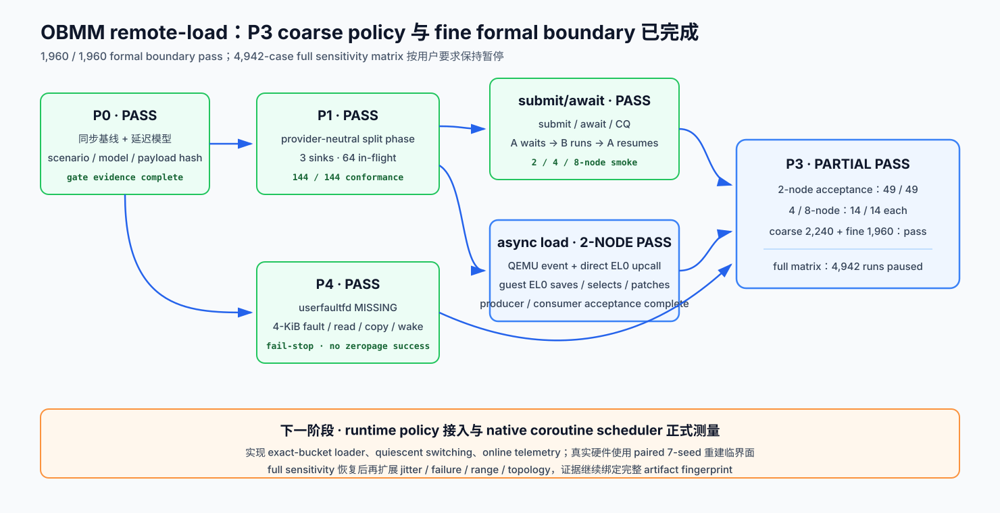

# OBMM 远端 Load 协程 P0–P4 实施与验证报告（历史证据归档）

> 状态：P0/P1/P2A/P4 证据仍有效；旧 P2B/P3 结论已作废；P2B ABI v2 已在
> `n4-910c` 通过 2-node producer/consumer 远端 QEMU guest 端到端门禁，当前 P2B
> 功能验收已完成。新 P3 性能对比评估是整体方案的下一必做阶段，其中包含 4/8-node
> scale-out；它不是 P2B 未完成项
>
> 日期：2026-08-12
>
> 上位设计：[OBMM 远端 Load 协程可行性与验证设计](2026-08-11-obmm-remote-load-coroutine-feasibility-design.md)

## 1. 结论与边界

本文原先记录的 49-case 运行绑定的是旧 P2B：QEMU 保存 coroutine context 并执行
scheduler policy。该所有权与当前目标相反，因此其中 7 个 `S3-p2b-demand` case 以及
依赖它们形成的 P3 `49/49` 总结从 2026-08-12 起均视为 **invalid legacy evidence**。
不能用旧二进制、旧 model contract 或旧 raw evidence 声明 ABI v2 P2B 已验收。

当前 ABI v2 已完成实现并通过 2-node 远端 guest 验证：QEMU 只维护 RLA/PLT、投递
direct EL0 upcall，并原子安装 EL0 指定的 context；guest EL0 coroutine scheduler core 负责完整上下文保存、
READY/WAIT 状态、调度策略、completion patch 和恢复。这里的 scheduler core 是 guest
用户态软件组件，使用独立 scheduler stack，但不占用额外 vCPU。

这证明以下链路已闭环：

- P0 的模型与同步基线能够形成可复现证据；
- P1 能同时服务 test、P2A 和 P2B sink，并处理 64 in-flight 与 terminal race；
- P2A 能在同一 guest vCPU 上执行 `A await → B 推进 → A 恢复`；
- P2B ABI v2 的 unit/contract、ARM64 Linux 原生 build、2-node QEMU guest E2E 与
  machine-readable phase gate 已通过，当前定义的 producer/consumer 功能目标已闭环；
- P4 能以标准 `userfaultfd` MISSING 路径提供 4-KiB 透明页访问对照；
- P3 对 scalar、range 和 transparency 分带汇总，invalid evidence 不进入统计。

旧 49-case 只能作为旧架构的历史记录，不能作为当前实现/证据链验收。完整矩阵仍可
确定性展开为 4,942 个 case；已有 2-node ABI v2 P2B 功能门禁不能替代新的 7-seed
acceptance 和性能证据。



## 2. 阶段结果

| 阶段 | 实现结果 | 可执行产物 | 验收结果 |
|---|---|---|---|
| P0 | strong scenario schema、四类同步基线、确定性 latency/jitter/failure 模型、三类时钟与 hash 闭环 | `obmm-remote-baseline`、`obmm-remote-phase-gate --phase p0` | pass |
| P1 | 64 parent、child aggregation、bounded result ownership、generation-safe sink、timeout/cancel/retire/capacity | `obmm-remote-conformance`、QEMU unit model | 144/144 conformance pass；gate pass |
| P2A | 独立 async endpoint、64-byte SQ/CQ、registered buffer、future、AArch64 EL0 stackful coroutine | `obmm_async_coroutine --mode async-poll` | 2/4/8-node gate smoke pass；正式 7 seeds pass |
| P2B | QEMU RLA/PLT/direct upcall + guest EL0 Context Store/scheduler + atomic resume | `obmm_async_coroutine --mode scheduler-core` | 功能验收完成：ARM64 Linux build、2-node producer/consumer remote guest E2E 与 phase gate pass |
| P3 | matrix expansion、远端 executor、raw evidence、fail-closed gate、统计与报告 | `obmm-remote-load-eval` | evaluator/dry-run 有效；正式性能 acceptance 是下一必做阶段、尚待执行；旧 49/49 因 P2B ABI 变更作废 |
| P4 | UFFD MISSING、OBMM source/shadow range、handler vCPU、page 状态机与 phase metrics | `obmm_async_coroutine --mode userfaultfd` | 2/4/8-node gate smoke pass；正式 7 seeds pass |

## 3. 实现说明

### P0：同步基线与延迟模型

`crates/sim-config` 增加了 remote-memory model 的强类型 schema；2/3/4/8-host scenario
均显式声明该模型。`crates/sim-qemu/src/obmm_remote_model.rs` 与 QEMU
`hw/ub/ub_obmm_remote_model.c` 使用同一 operation identity 和确定性决策规则，避免
host 调度顺序改变 latency、jitter、drop/error 或 duplicate 选择。

`crates/sim-cli/src/obmm_remote.rs` 提供四类 canonical baseline、manifest 生成和
phase gate。P0 gate 要求 case-specific model 语义、payload checksum、scenario hash
与 model contract hash 同时一致，不能只凭进程退出码判定通过。

### P1：provider-neutral split-phase backend

QEMU `hw/ub/ub_obmm_remote.c` 实现 parent/child lifecycle、64 项容量、result pool 和
exactly-once terminal delivery；`hw/ub/ub_ubc.c` 把 SIM_DEC/OBMM response 路由到
test、P2A 或 P2B adapter。provider 不持有 guest pointer，也不理解 SQ/CQ、future、
PLT 或目标寄存器。

P1 conformance matrix 包含 3 种 sink、8 种状态/竞态 case 和 P2A/P2B 各自允许的
访问粒度，共 144 个 case；覆盖 inline、64 in-flight、reorder、duplicate、timeout、
cancel race、retire 和 capacity full。

### P2A：显式 submit/await + EL0 协程

driver 中的独立 async endpoint 管理 queue ownership、destination registration、mmap、
poll/IRQ 和 generation；`guest-linux/aarch64/libs/obmm_async/` 管理 SQ/CQ、future 与
AArch64 stackful context。共同 workload 位于
`guest-linux/aarch64/apps/obmm_async_coroutine/`。

`submit` 退休后，应用可以继续运行；只有 `await` 发现 future 尚未 terminal 时才切换
协程。结果先落入 P1-owned result，再由 P2A sink 复制到 registered destination，最后
release-publish CQE。该顺序避免 stale completion 写入已复用的 destination。

### P2B：普通 `LDR` + guest EL0 coroutine scheduler core

QEMU `target/arm/tcg/translate-a64.c` 和 `helper-a64.c` 只对白名单 OBMM scalar load
插入 RLA hook。`hw/ub/ub_scc.c` 与 `ub_scc_device.c` 只管理 PLT/event、upcall delivery
和 resume 边界，不拥有 coroutine Context Store、ready queue 或 scheduler policy。
guest 的 EL0 scheduler runtime 位于 `guest-linux/aarch64/libs/obmm_scc/`。

pending 时原 `LDR` 不退休，QEMU 将事件直接送入注册的 EL0 trampoline。trampoline
先保存全部 ABI v2 context，再切到 scheduler stack；EL0 runtime 把当前 coroutine
置为 `WAIT_REMOTE`，从 ready queue 选择下一个 coroutine。completion 到达后，EL0
runtime 把 value 写入被挂起 context 的 `Rt`，把 `PC` 推进 4，并重新置为 READY；
自定义 `HLT #0x5343` resume 边界只负责验证并原子安装 EL0 指定的 context。

### P3：对比评估与证据链

`crates/sim-cli/src/obmm_eval.rs` 实现 strict matrix parser、deterministic expansion、
远端执行、per-case timeout、process-group 清理、pre-dispatch SSH 限定重试、raw JSONL、
invalid gate、bootstrap confidence interval 和 Band S/R/T 报告。

评估器 fail closed：dry-run、缺 gate、seed 不足、artifact hash 混用、summary 缺失或
重复、checksum/operation identity 不一致、case timeout 和非零退出都不能进入统计；
已有 output directory 和 raw file 不会被静默覆盖。

当前已有 ABI v2 的 2-node P2B gate，可作为相同 scenario/model/artifact 绑定下的新
2-node 运行前置条件；它不能追认旧 `S3-p2b-demand` raw evidence。旧 case 仍不得拼接
成新的“部分 49/49”。下一阶段正式 P3 性能评估必须使用新 run ID 和当前产物重新
执行；这不影响 P2B 功能验收已经完成的结论。

完整矩阵定义在 `scenarios/experiments/obmm_remote_load_eval_v1.yaml`；正式 acceptance
子集定义在 `obmm_remote_load_eval_acceptance_v1.yaml`。后者保留 7 seeds、操作数、
持续时间和证据要求，但每条 canonical path 只选择一个 factor point。

### P4：标准 userfaultfd MISSING 基线

`guest-linux/aarch64/common/obmm_uffd.*` 封装 capability 和 ioctl；共同 workload 的
`uffd_mode.c` 与 `uffd_state.c` 分离 OBMM source range、anonymous shadow range、handler
stack 和 staging buffer，并记录 fault/read/copy/wake 各阶段。

remote read 失败时页面进入 `POISONED` 或 `FAIL_STOP`，不会用 zeropage 把失败伪装成
成功。P4 保持“faulting Linux thread 在内核等待”的标准语义，因此需要额外 handler
thread/vCPU，不声称实现同一 kernel thread 内的 EL0 协程切换。

## 4. 旧正式验收证据（不得用于 ABI v2）

正式运行目录为 `out/obmm-remote-load/p3-acceptance-v6/`；该目录是生成物，不提交到
源码仓库。关键证据如下：

| 字段 | 值 |
|---|---|
| 状态 | `invalid_legacy_p2b_abi` |
| 正式运行 | 49 valid / 0 invalid |
| canonical path | S0、S1、S2、S3、R0、R1、R2 |
| seeds | 1–7 |
| matrix hash | `fnv1a64:edfbaf665424997b` |
| scenario hash | `fnv1a64:11efb67bb0d07d6c` |
| model contract hash | `fnv1a64:54431162a1abe3be` |
| topology | 2 hosts；`fnv1a64:566c7ce6174b0fe1` |
| QEMU binary SHA-256 | `27109cceda2ebe9f5a537f8a9419d01f98ac25083d3da742e052531b981884ac` |

这些字段只描述旧运行当时的产物，不能说明当前 ABI v2 通过。旧目录应保留只读以便
追溯，不得改写原始 JSONL；新的远端验收必须使用新 run ID、当前 QEMU hash 和 v2
model contract hash。

## 5. 测试与环境审计

| 验证 | 结果 | 说明 |
|---|---|---|
| P3 Rust focused tests | 19 passed | parser、hash、gate、timeout、process group、SSH retry、aggregation |
| guest OBMM focused contracts | 27 passed | async、SCC、UFFD build/UAPI/script contracts |
| ABI v2 QEMU OBMM tests（本地） | 20 passed | SCC 7、remote model 7、split-phase backend 6 |
| ABI v2 QEMU OBMM tests（ARM64 Linux） | 20 passed | `n4-910c` 原生 QEMU build 后重复同一组测试 |
| ARM64 Linux guest artifacts | pass | 当前 kernel Image、external driver、ABI v2 initramfs/workload 均成功构建 |
| 2-node remote QEMU guest | pass | nodeA write/export；nodeB import；2 coroutine 各自普通 `LDR`，值与 producer 一致 |
| ABI v2 P2B phase gate | pass | r15 `schema=1 phase=p2b status=pass`；逐事件 overlap 成立；final queues drained；`qemu_destroyed=1` |
| 正式 P3 acceptance | 49 passed（已作废） | 含 7 个旧 P2B case，不能作为当前结论 |
| remote `cargo test --workspace` | OBMM tests passed；full suite blocked | 远端只有 GCC 13；既有 Simpler native tests 明确要求真实 `g++-15` |
| remote Python discovery | OBMM focused tests passed；full suite blocked | 远端快照缺既有 W5 scripts、`/private/tmp` 与 zsh loadable modules |

2-node gate 的原始日志位于远端隔离工作区：

```text
/home/ll/ub_sim_p2b_v2_20260812/out/p2b_v2_remote_validation/
  p2b-v2-producer-consumer-20260812-r15.log
  gates/2node-producer-consumer-r15/p2b.json
```

该运行绑定以下证据：

| 字段 | 值 |
|---|---|
| QEMU SHA-256 | `362e7745d3fa6e55bdbdb6f33438ef2a224c64d82061a0da14d7ce3325b2958c` |
| kernel SHA-256 | `8f187f08ba0c28260ab5b6267f8dfeeee0e229938755b36e42596f684b25ccbb` |
| initramfs SHA-256 | `4cc0642a1b15daa607956c63ffd94af09dcd3409dd132270f27b7838771c4c32` |
| driver SHA-256 | `7f0f576493fb1783e2a0b82fb3e5a5790c7652cfb669c91da497636f06ce97a8` |
| scenario SHA-256 | `636feccb702d884f8c30a15d689cd11582ec3d3b5e776532a0b14d3986532837` |
| model SHA-256 | `e8d7d2e291a9612e1d8b95f78ddee56069d22bc3b4b0256cc3fb6b8cec271f04` |
| model contract | `fnv1a64:e0b3f5ef7cc0da5c` |

nodeA 在 offset `0x1000/0x2000` 写入 `4d54ca036b700e61/4d54ca036b700e60`；nodeB
两个 coroutine 分别读到完全相同的值。日志顺序严格满足
`pending(c0) < resume(c1) < LDR-issue(c1) < complete(c0)`；EL0 context
saves/restores/switches 为 2/4/3，而 QEMU context counters 全为 0。最终 SCC/backend
pending 均为 0，trace 无丢失。

旧 r8 是两端对称 workload smoke，不能证明 producer/consumer 数据归属和上述逐事件
overlap，现仅作为历史调试证据，不再作为 P2B 当前验收依据。

受环境阻塞的 full-suite 结果不能记为通过。当前 ABI v2 的详细实现与 2-node 证据见
[P2B 实现总结](p2b-implementation-summary.md)。P2B 可以标记为“2-node ABI v2 gate
pass”，但 P3 必须等新的 acceptance 产物生成后才能恢复正式通过状态。

## 6. 复现入口

完整矩阵只做展开和 gate 审计：

```text
cargo run -p sim-cli -- obmm-remote-load-eval \
  --matrix scenarios/experiments/obmm_remote_load_eval_v1.yaml \
  --scenario scenarios/mvp_2host_single_domain.yaml \
  --seeds 1..7 \
  --output-dir out/obmm-remote-load/p3-dry-run \
  --dry-run
```

下一阶段正式 P3 performance acceptance 必须在允许启动 QEMU 的远端环境运行：

```text
cargo run -p sim-cli -- obmm-remote-load-eval \
  --matrix scenarios/experiments/obmm_remote_load_eval_acceptance_v1.yaml \
  --scenario scenarios/mvp_2host_single_domain.yaml \
  --seeds 1..7 \
  --output-dir out/obmm-remote-load/p3-acceptance \
  --remote-target <host> \
  --remote-repo <repo>
```

正式执行前必须先生成并通过 P0/P1/P2A/**ABI v2 P2B**/P4 gate；当前 2-node P2B gate
只适用于与其 topology/scenario/model/artifact hash 一致的 2-node 运行。`--dry-run`
结果始终标记为 invalid evidence，不能被 aggregate-only 重新解释为正式测量。

## 7. 下一阶段工作

以下项目不属于当前 2-node P2B producer/consumer 功能验收，但 P3 性能对比是整体
方案的下一必做阶段：

- 使用新的 run ID 重跑 P3 acceptance，旧 49-case 不得复用；
- 按 P3 矩阵先完成 2-node correctness/acceptance，再扩展 4/8-node scale-out，并继续
  确认 QEMU context/scheduler counters 始终为 0；
- 执行 4,942-case 全因子性能 campaign，形成不同 latency/compute/concurrency 区间的
  break-even 结论；

以下属于额外硬化或环境认证，不阻塞 P3 基线性能结论：

- 单独执行 timeout、stale、duplicate、event overflow、generation/owner 失配与 invalid
  resume 的 fault-injection guest gate；
- 在具备真实 `g++-15`、完整 W5 scripts 和 zsh modules 的标准远端镜像重跑整个仓库
  full suite；
- 若面向真实硬件，需把 QEMU 的自定义 direct-EL0 upcall/resume architecture 落到目标
  core ISA、coherence 和 interrupt/debug 规范；当前目标仅为 QEMU 模拟行为。
