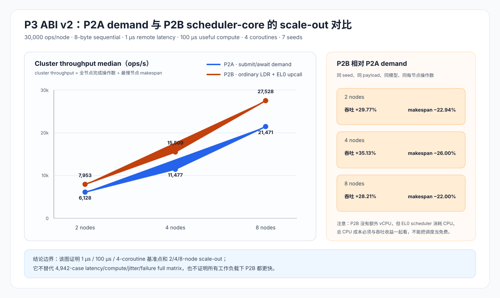

# OBMM remote-load P3 ABI v2 性能评估结果

> 日期：2026-08-13
>
> 状态：**2-node formal acceptance 与 4/8-node 定向 scale-out 已完成；4,942-case
> full matrix 于 2026-08-14 按用户要求安全暂停，尚未形成最终结论**
>
> 设计基线：[P3 对比评估详细设计](p3-comparative-evaluation-detailed-design.md)

## 1. 结论

当前可以给出三条有证据边界的结论：

1. ABI v2 的 2-node formal acceptance 为 **49/49 pass**，P0、P1、P2A、P2B、P4
   五个 phase gate 全部通过；旧 ABI v1 的 49-case 结果没有复用。
2. 在 `1 µs remote latency + 100 µs useful compute + 4 coroutines` 的 scalar
   基准点，P2B 相对 P2A demand 在 2/4/8-node 的 cluster throughput 分别高
   `29.77%`、`35.13%`、`28.21%`。
3. 这还不是完整 P3 sensitivity 结论。完整矩阵共 4,942 个 run，负责回答 latency、
   compute、concurrency、jitter、tail 和 failure 下的 break-even；当前只有 dry-run
   manifest，不能把单一基准点外推成“P2B 总是更快”。



## 2. 评估对象与公平性

### 2.1 Scalar 基准点

| 项目 | 取值 |
|---|---:|
| payload | 8 B |
| pattern | sequential |
| operations | 30,000 / node |
| warmup | 1,000 / node |
| modeled remote latency | 1 µs |
| useful compute | 100 µs / op |
| coroutines | 4 |
| seeds | 1..7 |
| P2A demand | `async-poll`，inflight=8，lookahead=0 |
| P2B demand | `scheduler-core`，inflight=1，lookahead=0 |

P2A demand 与 P2B demand 都在真实消费点发起访问。P2A lookahead 是单列实验，不能
并入 P2A demand 后再与 P2B 比较。

### 2.2 Cluster metric

4/8-node 不能只取 nodeA，也不能把各节点独立算出的 rate 简单相加。本报告统一使用：

```text
cluster_operations = sum(node.operations)
cluster_makespan = max(node.makespan_ns)
cluster_throughput = cluster_operations / cluster_makespan
```

也就是由最慢节点决定整组完成时间。`obmm-remote-load-scale-report` 会逐 run 校验：

- `OBMM_RUN_EVIDENCE` 恰好一条且 `qemu_destroyed=1`；
- node evidence 数量等于 topology node count；
- 每节点 checksum、operations、seed、mode、case、drain 和 terminal counters 正确；
- P2B 的 pending/complete 等于 operations，EL0 context/scheduler counters 为正；
- P2B 的 QEMU-owned context 和旧 `scc_*_cycles` counters 全为零；
- 同 seed 的 P2A/P2B checksum 相同；
- QEMU、kernel、initramfs hash 在所有 run 中一致。

任一条件不满足，报告状态为 `invalid`，该 run 不进入结论。

## 3. 产物身份

| Artifact | SHA-256 |
|---|---|
| QEMU | `362e7745d3fa6e55bdbdb6f33438ef2a224c64d82061a0da14d7ce3325b2958c` |
| guest kernel | `8f187f08ba0c28260ab5b6267f8dfeeee0e229938755b36e42596f684b25ccbb` |
| initramfs | `4cc0642a1b15daa607956c63ffd94af09dcd3409dd132270f27b7838771c4c32` |
| acceptance matrix | `fnv1a64:feafb00c11aecf16` |

2/4/8-node scenario SHA-256 不同，因为 topology 文件不同；QEMU、kernel 和 initramfs
保持相同。正式数据在 `n4-910c` 的 ARM64 Linux 环境执行，本地开发机没有启动 QEMU。

## 4. 2-node formal acceptance

正式目录：

```text
out/obmm-remote-load/p3-acceptance-abi-v2-20260813-r1/
```

`validation.json` 的状态为 `pass`：49 个 raw run 全部有效，7-seed requirement 满足，
P0/P1/P2A/P2B/P4 gate 均为 `pass`，`invalid_reasons=[]`。

### 4.1 Band S：单节点 canonical summary

下表沿用 evaluator 的 canonical nodeA 口径，用于与既有 `scalar.csv` 一致：

| Case | Median req/s | Median makespan | 相对 P2A demand |
|---|---:|---:|---:|
| S0 sync | 5,460.91 | 5.494 s | +78.22% throughput |
| S1 P2A demand | 3,064.13 | 9.791 s | baseline |
| S2 P2A lookahead=4 | 3,098.35 | 9.683 s | +1.12% throughput |
| S3 P2B demand | 3,979.55 | 7.539 s | +29.88% throughput |

P2B 对 P2A demand 的 median makespan 降低约 `23.0%`。但在这个 1-µs 低延迟点，
同步 scalar 仍比 P2B 快约 `37.2%`；异步路径的固定提交/调度开销大于可隐藏的 1-µs
remote wait。因此该点证明的是 **P2B 优于当前 P2A demand 实现**，并不证明异步机制
已经越过同步路径的 break-even。

P2A lookahead=4 相对 P2A demand 仅提高约 `1.12%`，对应 median makespan 减少
`108.154 ms`。由于 acceptance 只测了一个 latency 点，不能从这里推导 schedule-ahead
的完整 break-even 区间。

### 4.2 Band R：4-KiB range/page

| Case | Median req/s | Median makespan | 相对 sync range |
|---|---:|---:|---:|
| R0 sync range | 3,654.05 | 71.741 s | baseline |
| R1 P2A range | 3,842.31 | 68.226 s | +5.15% throughput |
| R2 userfaultfd | 2,031.74 | 129.024 s | −44.40% throughput |

每个 case 处理 262,144 个 4-KiB logical operation，即 1 GiB payload。该 Band 只比较
相同 4-KiB 粒度；P2B v2 的 1/2/4/8-byte scalar load 不进入该表。

## 5. 2/4/8-node P2A 与 P2B scale-out

### 5.1 Cluster throughput

| Nodes | P2A demand ops/s | P2B demand ops/s | P2B throughput gain | P2B makespan reduction |
|---:|---:|---:|---:|---:|
| 2 | 6,128.257 | 7,952.771 | +29.77% | 22.94% |
| 4 | 11,476.680 | 15,508.576 | +35.13% | 26.00% |
| 8 | 21,470.680 | 27,527.730 | +28.21% | 22.00% |

每个 topology 的 P2A 和 P2B 都是 7/7 valid seeds；4-node 与 8-node 各有 14/14
有效 run。2-node cluster 行由同一个 scale reporter 从 formal acceptance JSONL 中重新
聚合，避免 nodeA 口径与 scale-out 口径混用。

### 5.2 Scale efficiency

以 2-node throughput 为基准：

| Path | 4-node speedup / ideal efficiency | 8-node speedup / ideal efficiency |
|---|---:|---:|
| P2A demand | 1.8727× / 93.64% | 3.5036× / 87.59% |
| P2B demand | 1.9501× / 97.50% | 3.4614× / 86.54% |

P2B 在 2→4 节点的扩展效率更高；到 8 节点时两条路径都低于理想线性扩展。P2B 的
绝对 throughput 仍更高，但 4→8 的边际 scale efficiency 为 88.75%，低于 P2A 的
93.54%。这说明 P2B 的优势没有随 node count 单调扩大，不能只看 4-node 的最高
`+35.13%` 就外推。

### 5.3 CPU 成本

| Nodes | P2A application CPU | P2B application CPU | P2B EL0 scheduler | P2B total vs P2A |
|---:|---:|---:|---:|---:|
| 2 | 18.902 s | 14.731 s | 6.354 s | +11.55% |
| 4 | 37.641 s | 30.038 s | 13.211 s | +14.90% |
| 8 | 80.849 s | 66.490 s | 29.964 s | +19.30% |

P2B 不需要额外 helper vCPU，QEMU 也不保存 guest coroutine context；但 guest EL0
scheduler 的执行时间是真实 CPU 成本。P2B 用更高的总 CPU 消耗换取了更短的
cluster makespan 和更高 throughput。对用户的影响是：延迟/吞吐敏感且 CPU 有余量时
P2B 更有吸引力；CPU 配额紧张时不能只看 throughput 柱状图。

## 6. Gate scenario 为什么是 10 ms，而性能点是 1 µs

P2B phase gate 需要观测一个强时序事实：coroutine 0 的普通 `LDR` 进入 pending 后，
EL0 scheduler 必须切到 coroutine 1，并让 coroutine 1 在 coroutine 0 complete 前发出
自己的 `LDR`。在 100-µs gate latency 下，QEMU 的 host scheduling 抖动会让 complete
先于第二条 `LDR`，强 gate 会正确地 fail-closed。

因此五个 phase gate 使用
`scenarios/mvp_2host_p2b_remote_10ms.yaml`，为功能时序留出确定窗口。正式 evaluator
为每个 performance case 生成独立 model manifest；acceptance 的实际 timed case 仍是
1 µs，并没有把 10 ms 当成性能数据。gate scenario hash 与 case model hash 分开记录，
二者不能混为一谈。

## 7. 执行异常与处理

4-node seed 5 的第一次 P2A 启动遇到 serial TCP port 被远端另一个隔离 cgroup 占用，
nodeB 在 QEMU 启动前退出。该尝试没有 summary/evidence，未计入结果；遗留的 nodeA/C/D
QEMU 按精确 PID 清理，失败日志放在 `attempts/`。重新随机选择空闲端口后，同一 seed
通过。最终 4/8-node 运行结束后均确认无残留 `qemu-system-aarch64`。

SSH executor 同时显式使用 `ControlMaster=no` 和 `ControlPath=none`，避免用户级 SSH
复用连接把一个失效 control socket 传播到后续 case。只有能证明发生在 dispatch 之前的
banner/connect 失败才允许重试；已下发但状态不明的 case 不自动重跑。

## 8. Full matrix 的真实状态

完整矩阵 dry-run 目录：

```text
out/obmm-remote-load/p3-full-abi-v2-dry-run-20260813-r1/
```

它展开出 4,942 个 run：3,640 scalar、1,302 range；其中包含 latency/compute、
correctness、jitter/tail、duplicate、error 和 drop-timeout sweep。dry-run 目录只有
manifest 和 model documents，所以状态按设计为 `invalid dry-run`。

正式 campaign 曾在 `n4-910c` 的隔离工作区后台启动。r1/r2/r3 只保留为历史
证据；当前唯一可续跑的 campaign 是 r4：

```text
/home/ll/ub_sim_p2b_v2_20260812/out/obmm-remote-load/
  p3-full-abi-v2-20260813-r4/
```

2026-08-14 审计时，r4 evaluator PID `419618` 处于 `Tl`（SIGSTOP）状态，canonical
raw 为 `541/4,942`，`raw-attempts=3`，campaign 自身 QEMU 为 0。外部 QEMU 污染窗口
内的证据已移入 `raw-quarantine/`，不得进入正式聚合。用户已经明确要求暂停 P3，
所以即使主机当前空闲也不得自动恢复。它使用 `--local-repo` 直接在远端执行；每个
case 仍有独立外层 deadline、process-group cleanup 和 immutable raw JSONL。本文只有在
P3 被明确恢复、`OBMM_EVAL_COMPLETE` 出现、4,942 个 canonical raw run 完整聚合且
`validation.status=pass` 后，才会把 full matrix 改写为完成。

因此当前阶段的准确表述是：

- **P3 ABI v2 acceptance：完成；**
- **P3 2/4/8-node 基准点 scale-out：完成；**
- **P3 full sensitivity / break-even campaign：已安全暂停，待明确恢复和最终聚合。**

在 full matrix 完成前，不发布“在哪个 latency/compute/concurrency 区间异步路径必然转正”
的外推结论。

## 9. 复现入口

2-node formal evaluator：

```text
sim-cli obmm-remote-load-eval \
  --matrix scenarios/experiments/obmm_remote_load_eval_acceptance_v1.yaml \
  --scenario scenarios/mvp_2host_p2b_remote_10ms.yaml \
  --bands scalar,range \
  --seeds 1..7 \
  --gate-dir out/obmm-remote-load/gates-p3-abi-v2-10ms-20260813 \
  --remote-target n4-910c \
  --remote-repo /home/ll/ub_sim_p2b_v2_20260812 \
  --output-dir out/obmm-remote-load/p3-acceptance-abi-v2-20260813-r1
```

2/4/8-node raw evidence 的统一聚合入口：

```text
sim-cli obmm-remote-load-scale-report \
  --manifest <run-manifest.json> \
  --raw-dir <raw-evidence-dir> \
  --output-dir <scale-summary-dir> \
  --case-ids S1-p2a-demand,S3-p2b-demand
```

`out/` 是生成物，不提交 Git；本报告只提交可复核的指标、hash、规则和结论边界。
