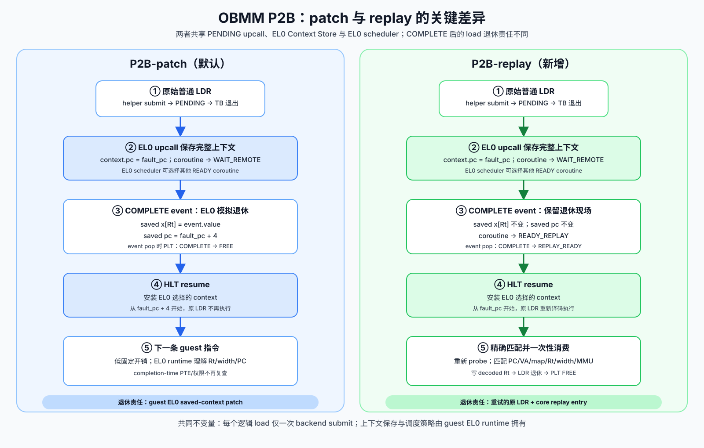

# OBMM P2B patch 与 replay 模式对比及 replay 设计

> 日期：2026-08-17
> 范围：AArch64 EL0 普通标量 `LDR`、direct EL0 upcall、guest EL0
> coroutine scheduler
> 兼容策略：ABI v2 保持默认 `patch`，通过 capability 与 session flag
> 显式启用 `replay`

## 1. 结论

P2B 可以支持 page-fault 风格的原指令重试。新增模式称为
`P2B-replay`：远端读完成后，EL0 调度器保留协程保存上下文中的 `PC` 和
目标寄存器；协程恢复到原 `LDR`，core 重新执行地址生成、MMU/MTE/权限探测和
指令退休，并从只可消费一次的 replay entry 取得远端结果。

现有 `P2B-patch` 继续作为默认模式。它在 COMPLETE upcall 中由 EL0 runtime
把结果写入保存上下文的 `Rt`，再令 `PC=fault_pc+4`。保留该模式有三个原因：

- 已有 ABI v2 程序、P2B 功能证据和 P3 数据继续有效；
- patch 的固定控制开销更低，适合作为轻量 PoC 与性能基线；
- replay 增加 completed PLT 保留、精确匹配、一次性消费和取消回收状态，适合
  验证更接近硬件退休语义的路径。

两种模式共享远端 backend、PENDING/COMPLETE upcall、EL0 Context Store、ready
queue 和 `HLT #0x5343` 原子 resume。差异集中在 COMPLETE 之后的退休责任。

## 2. 当前 patch 模式的准确行为

当前实现没有让 QEMU 在 COMPLETE callback 中直接修改 live CPU register。完整
路径如下：

1. AArch64 translator 在受支持的无符号标量 `LDR` 前插入
   `obmm_scc_remote_load` helper；
2. helper 先执行标准地址访问探测，再向 SCC/remote backend 提交一次读；
3. PENDING 时，helper 令当前 TB 退出并把 EL0 `PC` 指向 upcall entry；原
   `qemu_ld` 尚未执行；
4. guest EL0 upcall entry 保存完整上下文，EL0 scheduler 切换到其他 ready
   coroutine；
5. COMPLETE event 到达后，`libobmm_scc` 将 `event.value` 写入目标保存上下文的
   `x[Rt]`，令保存的 `PC=fault_pc+4`；
6. 后续 resume 从下一条指令继续执行。

因此，patch 模式的 load 退休由 EL0 runtime 模拟。QEMU 负责 pending-load、event
与原子安装 EL0 选择的上下文；协程策略和保存上下文仍归 EL0 所有。

## 3. replay 的目标语义

`P2B-replay` 要满足以下可观察语义：

- 一个逻辑 load 只提交一次远端 backend 请求；
- COMPLETE upcall 不写保存上下文的 `Rt`，也不前移保存的 `PC`；
- resume 后从 `fault_pc` 重新译码和执行同一条 `LDR`；
- 重试时再次执行标准 MMU/MTE/权限探测；
- replay result 只允许匹配的 load 消费一次；
- 消费完成后才释放 PLT entry；
- duplicate、stale、descriptor mismatch 和多 entry 歧义全部 fail-stop；
- session stop、owner generation 变化或 device reset 可以回收尚未消费的结果。

这里模拟的是 precise restart/retirement。它保留 direct EL0 upcall 与 EL0 coroutine
scheduler，没有构造真实的 EL0→EL1 Data Abort。真实 Linux page fault 路径由 P4
userfaultfd baseline 覆盖，会安装 4 KiB page 后通过 `ERET` 重试原 load；P2B-replay
保留 1/2/4/8-byte 标量粒度，结果存放在 core-side replay entry。

## 4. 状态机与一次性消费

### 4.1 patch

| 时刻 | PLT 状态 | EL0 coroutine 状态 | 结果所有者 |
|---|---|---|---|
| submit | `PENDING` | `WAIT_REMOTE` | backend/PLT |
| complete | `COMPLETE` | `WAIT_REMOTE` | PLT/event |
| COMPLETE event pop | `FREE` | `READY` | EL0 saved `Rt` |
| resume | `FREE` | `RUNNING` at `fault_pc+4` | coroutine |

### 4.2 replay

| 时刻 | PLT 状态 | EL0 coroutine 状态 | 结果所有者 |
|---|---|---|---|
| submit | `PENDING` | `WAIT_REMOTE` | backend/PLT |
| complete | `COMPLETE` | `WAIT_REMOTE` | PLT/event |
| COMPLETE event pop | `REPLAY_READY` | `READY_REPLAY` | PLT replay entry |
| resume | `REPLAY_READY` | `RUNNING` at `fault_pc` | PLT replay entry |
| retried `LDR` matches | `FREE` | `RUNNING` after retired `LDR` | decoded `Rt` |

`REPLAY_READY` 延长了 PLT 占用时间。它使 `scc_pending_current=0` 成为强 drain
证据：所有完成结果都已由重试的 `LDR` 消费。相应代价是，ready coroutine 长时间
得不到调度时会占用 PLT，可能触发 capacity stall。

## 5. replay 匹配键

重试 load 不能仅按 `PC` 匹配。两个 coroutine 可以执行同一函数中的同一条
`LDR`，地址映射也可能在等待期间变化。实现按以下字段做全等匹配：

| 字段 | 作用 |
|---|---|
| owner generation + context ID | 隔离进程/session 与 coroutine |
| `fault_pc` | 确认原指令位置 |
| effective VA | 确认重新计算的地址未变化 |
| map ID + map generation | 拒绝 unregister/re-register 后的旧结果 |
| remote offset | 确认映射内地址身份 |
| `Rt` | 确认写回目标 |
| access bytes | 区分 `LDRB/LDRH/LDR W/LDR X` |
| MMU index | 区分访问上下文 |
| endian + sign class | 确认 load 数据解释；当前只支持 unsigned scalar |

token 用于 backend completion 找到 PLT；重试指令本身没有 token，因此 core 先按
active context 找到唯一 `REPLAY_READY` entry，再验证完整 descriptor。一个 blocked
coroutine 当前最多持有一个 pending/replay load。发现两个候选 entry 会 fail-stop。

## 6. ABI 与 CLI

ABI version 保持 2，结构体原有字段和 ioctl 编号均保持。新增项如下：

| 项目 | 定义 | 作用 |
|---|---|---|
| capability | `OBMM_SCC_CAP_REPLAY_RETIRE` | driver/QEMU 声明 replay 支持 |
| start flag | `OBMM_SCC_START_REPLAY_RETIRE` | 按 session 选择退休模式 |
| event flag | `OBMM_SCC_EVENT_RETIRE_REPLAY` | COMPLETE event 声明结果留在 PLT |
| stats ioctl | `OBMM_SCC_IOCTL_GET_REPLAY_STATS` | 导出 consume/mismatch/high-water |
| application CLI | `--p2b-completion patch\|replay` | 用户显式选择模式，默认 `patch` |

新 guest runtime 请求 replay 时会检查 capability；旧 QEMU 缺少该 capability 时返回
`-EOPNOTSUPP`，不会静默回退到 patch。patch 对旧配置保持兼容，也不会调用旧 driver
没有实现的 replay stats ioctl。

### 6.1 实现落点

| 层 | 文件 | 新增职责 |
|---|---|---|
| UAPI | `guest-linux/kernel_ub/include/uapi/ub/obmm_scc.h` | capability、session/event flag、replay stats ioctl |
| QEMU model | `vendor/qemu_8.2.0_ub/hw/ub/ub_scc.c` | `REPLAY_READY`、精确匹配、一次性消费、fail-stop |
| QEMU device | `vendor/qemu_8.2.0_ub/hw/ub/ub_scc_device.c` | session mode、MMIO stats、replay consume 路由；upcall/scheduler 窗口禁止误消费 |
| AArch64 TCG | `vendor/qemu_8.2.0_ub/target/arm/tcg/helper-a64.c`、`translate-a64.c` | 原 `LDR` 重试、probe、写回 decoded `Rt`、跳过第二次 mapped load |
| guest driver | `guest-linux/aarch64/driver/linqu_ub_drv.c` | capability 协商、session flag、stats 导出 |
| EL0 runtime | `guest-linux/aarch64/libs/obmm_scc/obmm_scc.c` | `READY_REPLAY` 与 COMPLETE 分流 |
| application | `guest-linux/aarch64/apps/obmm_async_coroutine/obmm_async_coroutine.c` | CLI、mode-specific pass gate、日志字段 |
| host/guest 转发 | `run_ub_obmm_eval.sh`、`run_ub_dual_node_apps.sh`、`initramfs/run_app` | host CLI 到 guest CLI 的完整传递与证据校验 |

## 7. QEMU/TCG 详细设计

### 7.1 初次执行

初次 `LDR` 的 helper 行为保持：检查 session/owner/EL0/remote range，执行
`probe_access`，创建 PLT，提交 backend，产生 PENDING upcall，并在正常 `qemu_ld`
前退出 TB。

### 7.2 COMPLETE delivery

patch session 在 COMPLETE event pop 时回收 PLT。replay session 将
`COMPLETE -> REPLAY_READY`，event 带 `RETIRE_REPLAY` flag，payload 继续保留在 PLT。

### 7.3 重试执行

EL0 resume 安装的上下文仍指向 `fault_pc`。重试 `LDR` 再次进入同一个 helper：

1. 重新确认 active session、owner TTBR0、EL0 与 remote range；
2. 再次调用标准 access probe；若 PTE/权限当前无效，先产生标准 fault，replay entry
   保留；
3. 解析当前 map descriptor，执行完整 replay key 比对；
4. 匹配成功后读取缓存 payload、递增 `replay_consumed`、回收 PLT；
5. helper 返回 value 并设置一次性 TCG disposition；
6. translator 走 replay 分支，把 value 写入本次重新译码得到的 `Rt`，跳过会再次
   访问 mapped remote range 的普通 `qemu_ld`，随后按原 `LDR` 正常退休；
7. disposition 在每次 helper 入口先清零，无法被后续指令重复使用。

重试确实从原 PC 重新执行并重新完成地址/权限/目标寄存器语义。普通 `qemu_ld` 在
replay 命中时被替换为一次性 result consume，因为远端 payload 没有被安装成 guest
page；继续执行普通 mapped load 会产生第二次远端访问。

### 7.4 upcall/scheduler 窗口

`active_context_id` 在 direct upcall 期间仍标识被中断的 coroutine，方便 EL0 保存和
校验上下文；此时 `upcall_active=true`，CPU 正在执行 trampoline 与 EL0 scheduler，
其中也会出现普通本地 `LDR`。replay entry 只允许在 `HLT #0x5343` 恢复目标
coroutine、`upcall_active=false` 后成为 CPU 的预期消费对象。

若忽略这一区分，scheduler 自己的本地 `LDR` 可能被误判为“原远端 `LDR` 已不再命中
remote map”。循环实跑曾触发该问题并由 QEMU fail-stop。最终实现让
`ub_scc_cpu_replay_expected()` 在 upcall 窗口返回 false；恢复 coroutine 后仍执行完整
descriptor 匹配，错误地址、PC、map generation 或 decode metadata 继续 fail-stop。

## 8. EL0 runtime 详细设计

EL0 Context Store 新增本地状态 `READY_REPLAY`。COMPLETE handler 按 session mode
执行：

| 操作 | patch | replay |
|---|---:|---:|
| 校验 token/context/fault PC | 是 | 是 |
| 写 `context.x[Rt]` | 是 | 否 |
| 写 `context.pc=fault_pc+4` | 是 | 否 |
| 清 waiting token | 是 | 是 |
| ready 状态 | `READY` | `READY_REPLAY` |

round-robin scheduler 同时选择 `READY` 和 `READY_REPLAY`。它仍通过
`HLT #0x5343` 原子安装完整目标上下文，QEMU 不保存 coroutine context，也不决定
下一个 coroutine。

## 9. 两种模式的工程对比

| 维度 | `P2B-patch` | `P2B-replay` |
|---|---|---|
| saved `Rt/PC` 处理 | EL0 COMPLETE handler 写 `Rt`、前移 PC | EL0 不改，原 `LDR` 重试 |
| 指令退休一致性 | EL0 模拟当前 scalar load 退休 | decoder/TCG 完成目标写回和退休 |
| completion-time PTE/权限复查 | 无 | 有，重试 probe |
| backend exact-once | event pop 后自然结束 | replay entry 一次性 consume 保证 |
| PLT 生命周期 | COMPLETE event pop 即释放 | 原 `LDR` consume 后释放 |
| 固定开销 | 较低 | 多一次 TB/helper、匹配与 probe |
| PLT 压力 | 较低 | 调度延迟会延长 completed entry 占用 |
| EL0 ABI 与 A64 decode 耦合 | event 需要 value/`Rt`/width，runtime 模拟写回 | runtime 只处理状态，core 使用 decode metadata |
| 扩展复杂度 | sign-ext/SIMD/pair/writeback 各需 EL0 写回规则 | 更容易沿 decoder 扩展，仍需逐类定义 replay payload |
| debug/single-step/PMU 逼真度 | 较弱 | 更接近 precise restart；当前模拟仍需专项验证 |
| 适用重点 | 最低控制开销、已有 PoC/基线 | 退休语义、映射变化、硬件化路径 |

## 10. 失败与资源规则

- descriptor mismatch、同 context 多个 replay candidate、duplicate consume：fail-stop；
- backend duplicate/stale completion：沿现有 generation/token 规则拒绝；
- COMPLETE 已交付后 map generation 变化：重试 mismatch 并 fail-stop；
- PTE 暂时无效：标准 fault 优先，PLT 保留到成功重试或 session reset；
- coroutine 永久不再调度：PLT 保留并形成可观测 backpressure；
- session stop/owner exit：device reset 取消 backend future 并清除 pending/replay PLT；
- replay capacity 满时，其他没有 replay result 的 load 沿既有 sync-stall 路径处理。

## 11. 验证门槛

### 11.1 静态、编译与单元测试

- UAPI layout 与 capability/start/event flag 编译断言；
- AArch64 `libobmm_scc`、assembly 和共享 CLI 以
  `-Wall -Wextra -Werror` 交叉编译；
- QEMU 完整构建，覆盖 TCG helper 返回值与 replay branch；
- QEMU model unit：retain、exact consume once、mismatch fail-stop；
- 既有 OBMM remote backend unit 全部继续通过；
- Rust P2B phase gate 接受 replay exact-once 证据并拒绝少消费。

### 11.2 双节点功能验收

patch 与 replay 各跑一次相同 producer/consumer case，要求：

- nodeA export 并写入每个 coroutine 对应值；
- nodeB import，至少两个 EL0 coroutine 执行普通 `LDR`；
- 每个 coroutine 有 issue → pending → complete → resume → retire 因果链；
- expected/actual 完全一致；
- `pending == complete == coroutine count`；
- replay：`replay_consumed == coroutine count`、`replay_mismatch == 0`；
- patch：`replay_consumed == 0`；
- 两种模式最终 `scc_pending=backend_pending=0`，无残留 QEMU。

### 11.3 同负载性能对比

两种模式必须使用同一 QEMU、kernel/initramfs、scenario、model manifest、seed、
coroutine 数、iterations、warmup 与 compute。至少采集：

| 指标 | 解释 |
|---|---|
| makespan / ops/s | 整体吞吐影响 |
| guest p50/p99/max | load 可见延迟及尾延迟 |
| application CPU ns | 总用户态 CPU 成本 |
| EL0 scheduler ns | 调度器成本 |
| context save/restore/switch | 控制路径是否一致 |
| pending/replay high-water | replay 的 PLT 占用影响 |
| backend accepted/delivered | 两模式远端提交次数是否相同 |
| replay consumed/mismatch | replay 精确消费证据 |

## 12. 实现与测试状态

代码实现已覆盖 QEMU model/device/TCG、UAPI、driver、EL0 runtime、application
CLI、日志字段和 Rust P2B gate。远端构建和 2-node 实跑使用 n4-910c 上的独立工作区
`/home/ll/ub_sim_p2b_replay_20260817`；暂停的 P3 campaign 保持 `Tl`，本次没有恢复或
续写 P3 evidence。

| 验证 | 结果 |
|---|---:|
| guest ABI/runtime contract | 9/9 pass |
| host/initramfs 参数转发 contract | 10/10 pass |
| QEMU SCC unit | 9/9 pass，其中 replay 2/2 |
| QEMU common remote unit | 6/6 pass |
| QEMU remote-model unit | 7/7 pass |
| QEMU aarch64-softmmu/TCG ARM64 native build | pass |
| Rust replay phase-gate focused test | 1/1 pass |
| ARM64 kernel、`linqu_ub_drv.ko`、应用、initramfs | pass |
| patch/replay 2-node producer/consumer | 各 1 次 pass；各自 P2B phase gate pass |
| patch/replay 同负载性能日志 | 3 组配对、共 6 次 pass |
| 最终队列与进程清理 | 每次 `qemu_destroyed=1`；最终无残留 QEMU |

首次 8192-op replay 诊断运行
`p2b-replay-perf-seed1-20260817-r1.log` 触发 7.4 节所述 fail-stop。该日志保留为缺陷
证据，不进入结果聚合。修复后重新构建 QEMU，所有正式结果只接受最终 QEMU 指纹。

## 13. 运行日志对比

### 13.1 证据边界与制品身份

最终 6 个性能样本共享以下唯一 fingerprint：

| 项目 | 值 |
|---|---|
| host/workspace | `n4-910c:/home/ll/ub_sim_p2b_replay_20260817` |
| scenario SHA-256 | `636feccb702d884f8c30a15d689cd11582ec3d3b5e776532a0b14d3986532837` |
| model file SHA-256 | `3825aed1343e4643e79d1df4caadba046c9bcd7f5a9be2de0becdc8bf73a3690` |
| model contract | `fnv1a64:6c9d5e87ee2039c4` |
| QEMU SHA-256 | `4e6cd1d3012c6ecd0e8a4ae0a4d13d5e9c18dd40f232658407ac770c8b3a100a` |
| kernel SHA-256 | `b0ce3fae15c68e370ed3e5ed6fcf718b01dbc275668296246e03f62086520ecd` |
| initramfs SHA-256 | `a39d393d7bcc455204d7a91380c56a30f1529788eb0e560706c3d4c248495663` |

性能负载固定为：2-node、10 ms fixed remote latency、无 jitter/drop/error/duplicate、
8 个 coroutine、8-byte sequential scalar load、8192 measured operations、warmup 256、
`compute_us=0`、`min_duration_ms=2000`、model seed 1。workload seed 取 1、2、3；每个
seed 的 patch/replay 除 completion mode 与 case label 外参数完全一致。运行采用交错
顺序，未与其他 QEMU workload 并发。

### 13.2 2-node 功能结果

seed 29 的 producer/consumer 用例由 nodeA 写两个确定值，nodeB 的两个 EL0 coroutine
分别执行普通 `LDR`。两种模式均证明
`issue -> pending -> schedule other -> complete -> resume -> retire`，两个 actual value
与 producer value 完全一致。

| 检查 | patch | replay |
|---|---:|---:|
| completed / values verified | 2 / 2 | 2 / 2 |
| PENDING / COMPLETE / FAULT | 2 / 2 / 0 | 2 / 2 / 0 |
| blocked-load switches | 1 | 1 |
| EL0 save / restore / switch | 2 / 4 / 3 | 2 / 4 / 3 |
| replay consumed / mismatch / high-water | 0 / 0 / 0 | 2 / 0 / 1 |
| final SCC / backend pending | 0 / 0 | 0 / 0 |
| P2B phase gate | pass | pass |

最终功能日志和 gate：

- `out/obmm-p2b-replay-comparison/p2b-patch-functional-20260817-r2.log`；
  `gates/functional-patch-final/p2b.json`；
- `out/obmm-p2b-replay-comparison/p2b-replay-functional-20260817-r2.log`；
  `gates/functional-replay-final/p2b.json`。

### 13.3 三组配对性能数据

以下数值取每次 runner 发布的 nodeA canonical `OBMM_EVAL_SUMMARY`：

| seed | mode | makespan ms | ops/s | p50 us | p99 us | app CPU ms | EL0 scheduler ms | save / switch | replay consume / mismatch |
|---:|---|---:|---:|---:|---:|---:|---:|---:|---:|
| 1 | patch | 10474.471 | 782.092 | 10140.144 | 10360.480 | 3070.590 | 10037.320 | 8391 / 8398 | 0 / 0 |
| 1 | replay | 10493.753 | 780.655 | 10142.624 | 10438.272 | 3065.164 | 10025.656 | 8542 / 8549 | 8192 / 0 |
| 2 | patch | 10519.302 | 778.759 | 10153.360 | 10577.264 | 3100.293 | 10058.173 | 9012 / 9019 | 0 / 0 |
| 2 | replay | 10480.356 | 781.653 | 10138.752 | 10394.016 | 3093.554 | 10029.438 | 8494 / 8501 | 8192 / 0 |
| 3 | patch | 10494.334 | 780.612 | 10139.056 | 10502.848 | 3118.049 | 10058.151 | 8593 / 8600 | 0 / 0 |
| 3 | replay | 10475.018 | 782.051 | 10141.056 | 10358.240 | 3057.083 | 10018.866 | 8374 / 8381 | 8192 / 0 |

聚合结果：

| 指标 | patch | replay | 解释 |
|---|---:|---:|---|
| mean makespan ms | 10496.036 | 10483.043 | replay 相对 patch 为 -0.124% |
| mean throughput ops/s | 780.488 | 781.453 | 差异约 +0.124% |
| median p50 us | 10140.144 | 10141.056 | 基本相同 |
| median p99 us | 10502.848 | 10394.016 | 本组 replay 较低，样本数不足以声明稳定优势 |
| mean app CPU ms | 3096.310 | 3071.933 | 差异落在运行波动范围 |
| mean EL0 scheduler ms | 10051.215 | 10024.653 | 差异落在运行波动范围 |
| replay consumed total | 0 | 24576 | replay 每个 measured load 恰好消费一次 |
| replay mismatch total | 0 | 0 | 无 descriptor mismatch |

逐 seed 的 replay 相对 patch makespan 差异依次为 `+0.184%`、`-0.370%`、
`-0.184%`，方向并不一致。当前数据支持的结论是：在 10 ms fixed latency、8-way
coroutine overlap 下，两种模式的吞吐和可见延迟没有可分辨的稳定差异；replay 多出的
一次 TB/helper/probe/descriptor consume 成本被远端等待和调度波动覆盖。数据没有证明
replay 更快，也没有显示可观测的性能回退。

### 13.4 证据路径与尚未覆盖的范围

正式聚合只使用以下 6 个 canonical 日志，避免把修复前的诊断运行或同 seed 的旧运行
混入结果：

- seed 1：`p2b-patch-perf-seed1-20260817-r2.log`、
  `p2b-replay-perf-seed1-20260817-r2.log`；
- seed 2：`p2b-patch-perf-seed2-20260817-r1.log`、
  `p2b-replay-perf-seed2-20260817-r1.log`；
- seed 3：`p2b-patch-perf-seed3-20260817-r1.log`、
  `p2b-replay-perf-seed3-20260817-r1.log`。

这些文件位于远端独立工作区的 `out/obmm-p2b-replay-comparison/`。每次的 per-node
guest/QEMU 日志位于
`guest-linux/aarch64/logs/<run-id>_headless8/`。6 次运行均为 `failures=0`、
`timeouts=0`、`model_pending_final=backend_pending_final=scc_pending_final=0`、
`qemu_destroyed=1`。

这组定向数据回答了两个模式能否真实运行及其在 10 ms 场景下的相对成本。它没有覆盖
1/10/100 us 等低延迟区间、不同 coroutine 数、PLT capacity 压力、映射变化、
permission fault、debug/single-step/PMU 或 4/8-node。上述边界需要后续独立 matrix；
暂停的 P3 4,942-case campaign 未被本次工作恢复，因此本节不能作为 P3 完成声明。
