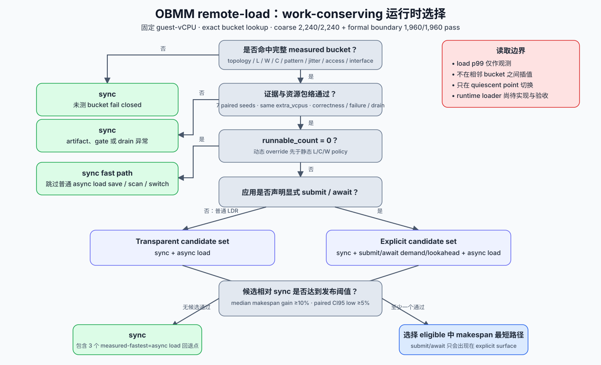

# OBMM remote-load sync/P2A/P2B 运行时选择表

> 日期：2026-08-17
>
> 状态：**2-node、8-byte sequential、无 jitter 的 2,240-case / 7-seed
> coarse matrix 已完成，`validation.status=pass`**
>
> 详细设计：[P3 对比评估详细设计](p3-comparative-evaluation-detailed-design.md)

## 1. 结论

三种机制应在同一数据面中共存，并在 mapping/session 的 quiescent point 按策略选择。
本轮 80 个已测 bucket 使用默认保守门槛：median makespan gain 至少 10%、paired
95% gain CI 下界至少 5%、p99 regression 不超过 5%、CPU tax 不超过 25%，并要求
failure、duplicate 和 drain gate 全部通过。

按这些门槛，运行时选择表为：

| Remote latency | Coroutines | Useful compute/op | 透明普通 `LDR` | 显式 submit/await | 结论 |
|---:|---:|---:|---|---|---|
| 0/1/10 µs | 2/4/8/32 | 0/10/100/1000 µs | sync | sync | 异步固定开销高于可隐藏等待 |
| 100 µs | 2/4/8/32 | 0/10/100/1000 µs | sync | sync | P2B makespan 最快，但 p99 或 CPU gate 未通过 |
| 1000 µs | 2 | 0 或 10 µs | P2B | P2B | P2B gain、paired CI、p99 和 CPU gate 全部通过 |
| 1000 µs | 2 | 100 µs | sync | sync | P2A/P2B 的 p99 regression 超过 5% |
| 1000 µs | 2 | 1000 µs | sync | P2A | P2A 显式路径通过；P2B gain 不足 |
| 1000 µs | 4/8/32 | 0/10/100/1000 µs | sync | sync | 异步 makespan 有收益，tail latency gate 未通过 |
| 未测 bucket | 任意 | 任意 | sync | sync | 缺少 7-seed paired evidence，fail closed |



这张表只对以下测量域有效：2-node、8-byte scalar load、sequential pattern、无 jitter、
remote latency `{0,1,10,100,1000}` µs、useful compute `{0,10,100,1000}` µs、
coroutine `{2,4,8,32}`。策略不在测量点之间插值，也不外推到 dependent/mixed、jitter、
failure 或 4/8-node bucket。

## 2. 三个获准使用异步机制的 bucket

| L | C | W | 选择 | Sync makespan | 选择后 makespan | 降低 | Sync/选择后 p99 | p99 变化 | CPU 变化 |
|---:|---:|---:|---|---:|---:|---:|---:|---:|---:|
| 1000 µs | 2 | 0 µs | P2B | 74.261 s | 37.972 s | 48.87% | 1277/1307 µs | +2.35% | +17.36% |
| 1000 µs | 2 | 10 µs | P2B | 74.809 s | 38.188 s | 48.95% | 1273/1299 µs | +2.07% | +16.00% |
| 1000 µs | 2 | 1000 µs | P2A | 140.420 s | 79.898 s | 43.10% | 1275/1326 µs | +3.97% | -43.05% |

两个 P2B bucket 都有 7/7 positive seed pairs。`W=0` 的 P2B paired gain 95% CI 为
`[48.6%, 48.8%]`，`W=10` 为 `[48.6%, 49.1%]`。P2A bucket 只进入 explicit
policy；普通 `LDR` 透明接口不能选择 P2A。

## 3. Makespan 最快路径与发布策略的区别

如果完全忽略 p99 和 CPU budget，80 个 bucket 的 makespan winner 分布为：

| Winner | Bucket 数 | 测量区域 |
|---|---:|---|
| sync | 48 | L=0/1/10 µs 的全部 C/W |
| P2B | 25 | L=100 µs 的 16 个 bucket；L=1000 µs 下 C=8/32 全部和 C=4、W=1000 |
| P2A | 7 | L=1000 µs 下 C=2 全部，以及 C=4、W=0/10/100 |

严格策略的分布为：

| Policy surface | sync | P2A | P2B |
|---|---:|---:|---:|
| transparent policy | 78 | 0 | 2 |
| explicit policy | 77 | 1 | 2 |

差异来自 SLO gate。例子如下：

- L=100 µs 时，P2B 在 16 个 bucket 中都是 makespan winner，但 p99 regression 或
  CPU tax 超出预算，发布策略保持 sync。
- L=1000 µs、C=4/8/32 时，P2A/P2B 能明显缩短 makespan，p99 regression 随并发
  增大，严格策略保持 sync。
- L=1000 µs、C=2、W=0/10 时，P2A makespan 更短，p99 达到 4.4--4.9 ms；P2B
  保持约 1.3 ms p99，因此严格策略选择 P2B。
- L=1000 µs、C=2、W=1000 时，P2A 同时降低 makespan、p99 受控且 CPU 更低，
  explicit policy 选择 P2A。

因此，“吞吐优先”profile 可以参考 `measured_fastest`，“默认生产”profile 必须使用
`transparent_policy` 或 `explicit_policy`。前者不具备默认 SLO 保证。

## 4. 运行时使用规则

策略键为：

```text
(topology, latency, compute, coroutines, pattern, jitter, access_bytes,
 interface_surface)
```

选择只允许发生在 pending remote load 已清空的 quiescent point：

1. mapping/session 建立时读取机器可读 `summary/policy.json`；
2. 找不到完整 bucket、健康状态异常或 drain 未完成时选择 sync；
3. 普通 `LDR` 接口只在 sync/P2B 之间选择；
4. 应用声明支持显式 submit/await 后，选择域扩展为 sync/P2A/P2B；
5. 切换前清空旧机制的 pending/completion，禁止逐 load 抖动切换；
6. 运行时 p99、failure 或 CPU tax 越过 profile budget 时回退 sync。

本轮已经生成离线策略表和机器可读 policy。runtime policy loader、在线 telemetry
闭环和 quiescent 切换尚未实现，不能把离线表描述成已经完成动态切换验收。

## 5. 正式证据与审计

合并输出：

```text
out/obmm-remote-load/policy-coarse-7seed-20260817-r1/
```

| 项目 | 结果 |
|---|---|
| Source campaigns | 4 |
| Seeds | 1..7 |
| Coroutines | 2/4/8/32 |
| Canonical raw | 2240/2240 |
| Valid runs | 2240 |
| Invalid runs | 0 |
| Source attempts | 13，全部留在 source，未进入 merged raw |
| Source quarantine | 0 |
| Merged attempt/quarantine | 0/0 |
| Validation | `status=pass`、`formal_seed_count_met=true` |

Source campaign 的 simulator/evaluator 指纹分别为：

```text
sim-cli:    280983a55050a04363f2796fb16560887f91c959a3a903f22126091cecb35c50
evaluator:  4b9a96b93de08d3abb6c37ede113fe988e1bb2a085f7c39c8da18e998f165db6
```

四个 source 的 artifact fingerprint 唯一且一致：

```text
scenario:   636feccb702d884f8c30a15d689cd11582ec3d3b5e776532a0b14d3986532837
QEMU:       5c5a86c6031e0cfaaaff376ef0334c5b35fa1eb8ef152d5e81104becf5c9dccc
kernel:     33ef13442271674316c8e7d1adff87273619122e9b09ebaecfc54a248be8199e
initramfs:  d52c703c68dda57b0abb39511cf5703aa335665e4db2ad5f8d019ed726a19485
```

合并器从提交 `0e98c72` 的 detached clean worktree 构建。`source-provenance.json`
单独记录 merge binary `7948069a...e60d` 和 merge evaluator
`3878e884...df02`，不会把合并工具指纹混入 source campaign 指纹。性能 case 全部在
n4-910c/n4-910c1 执行；本地 arm64 只执行确定性的离线复制、聚合和报表生成，没有
启动 QEMU。

机器可读完整表位于：

```text
summary/policy.csv
summary/policy.json
summary/break-even.csv
summary/scalar.csv
```

核心输出 SHA-256：

```text
policy.csv:             2b396e498298785d33c0584777413b539473e3bb93a96281605081a9872cf1ac
policy.json:            3c4cfd76f460dde7db9c547d9b8f32d43bbe8b002cc2e8a0a2cc423614595d3f
validation.json:        96c922b701bf2a6aae7f92276feecfdac97b6b1af53d97efce4267af2edb142e
source-provenance.json: a7766e7e23b4d8e03124bb031723205b1411f07d6a9c76adc1b104ebfc40ac40
```

`policy.csv` 保存全部 80 个 bucket 的 sync/P2A/P2B makespan、p99、total CPU、
paired-seed CI、eligibility 和拒绝原因；本文件的表格是它的无外推摘要。

## 6. 后续边界收敛

coarse 结果把下一轮测量集中到三个边界：

1. latency 100--1000 µs：定位 sync 到异步机制的精确 crossing；
2. coroutine 2--4：定位 P2B tail regression 开始越过 5% 的位置；
3. C=2 下 compute 10--1000 µs：细化 P2B、sync、P2A 的切换点。

boundary refinement 还需要加入 dependent/mixed pattern、jitter/tail 和 4/8-node
定向点。完整 4,942-case P3 campaign 仍按用户要求暂停，coarse policy 的通过不会改变
该 campaign 的暂停状态。
