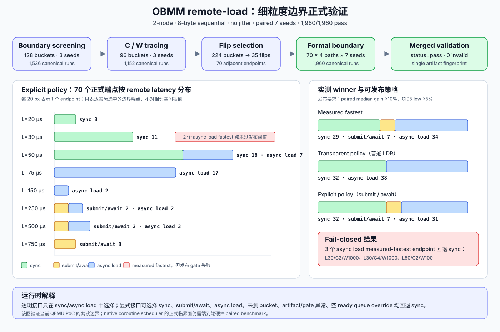
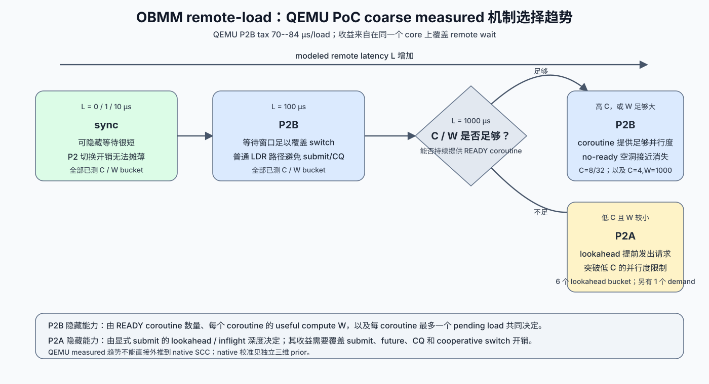
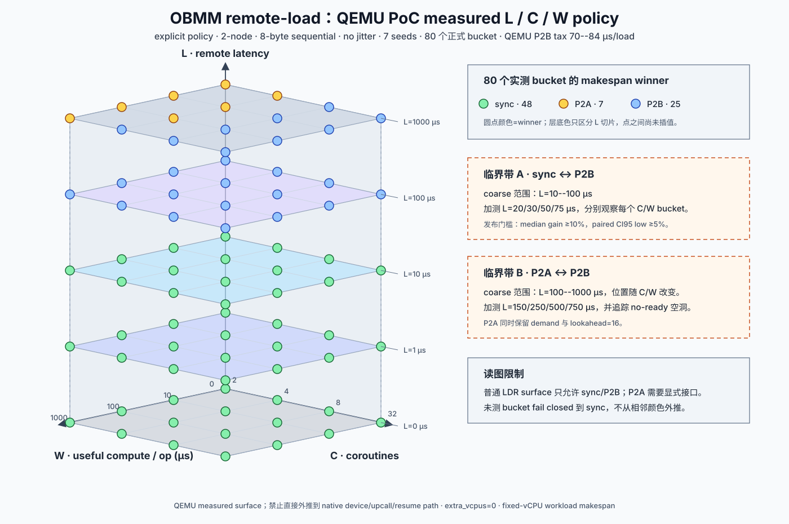
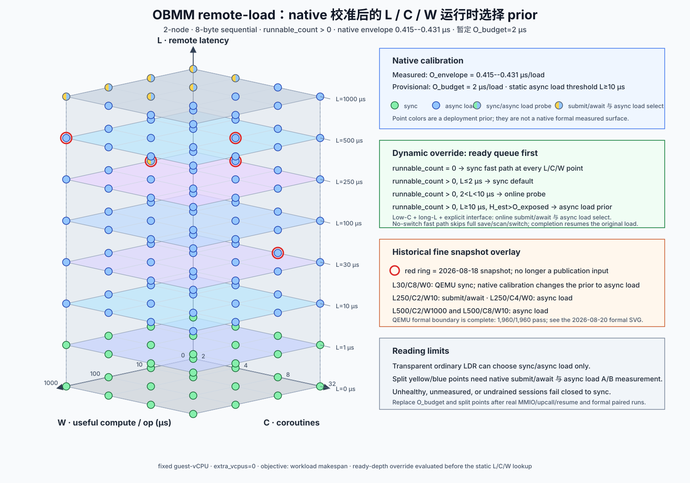

# OBMM remote-load sync、submit/await、async load work-conserving 运行时选择表

> 命名说明：当前机制名为 `async load`。文中小写 `p2b` 仅用于引用改名前的性能
> evidence 目录原名。

> 日期：2026-08-20
>
> 状态：**2-node、8-byte sequential、无 jitter 的 2,240-case / 7-seed
> coarse matrix 已完成，`validation.status=pass`；policy schema v2 已按固定 guest-vCPU
> 下的 workload makespan 重新聚合；Arm64 native async load path-tax microbenchmark 已完成；
> fine-grained screening 1,536/1,536、C/W tracing 1,152/1,152、formal boundary
> 1,960/1,960 均已完成；formal merge 的 `validation.status=pass`**
>
> 详细设计：[P3 对比评估详细设计](p3-comparative-evaluation-detailed-design.md)

## 1. 结论

sync、submit/await 和 async load 应在同一数据面共存，并在 mapping/session 的 quiescent point 选择。
submit/await 与 async load 会增加单次 remote load 的 suspend、schedule 和 resume 开销；它们的目标是让
同一个 guest core 在 remote wait 窗口内执行其他 coroutine，从而缩短固定 workload 的
总完成时间。

policy schema v2 使用以下发布条件：

1. sync 与候选路径的 `extra_vcpus` 必须相等；
2. 7 个正式 seed 全部有效，correctness、failure、duplicate 和 drain gate 通过；
3. 相对 sync 的 paired median workload-makespan gain 至少 10%；
4. paired 95% gain CI 下界至少 5%。

`guest_p99` 保留为单次 load-to-resume 观测量，不参与默认路径否决。旧 policy 的
`total CPU tax` 混合了 core 占用、process CPU 和 EL0 scheduler elapsed time，schema v2
已将其移出选择面。

细粒度正式验证从 224 个 screening/tracing bucket 中找出 35 条相邻 latency winner
翻转，选取翻转两侧共 70 个 endpoint，使用四条路径和 7 个 paired seed 完成 1,960 次
正式运行。70 个 endpoint 中的 measured-fastest 分布为 sync 29、submit/await 7、async load 34；应用
发布阈值后，transparent policy 为 sync 32、async load 38，explicit policy 为 sync 32、
submit/await 7、async load 31。三个 measured-fastest=async load 的 endpoint 因收益或置信区间不足回退 sync。

### 1.1 QEMU PoC 正式 measured policy

80 个 7-seed 已测 bucket 的建议如下：

| Remote latency | Coroutines | Useful compute/op | 透明普通 `LDR` | 显式 submit/await | 结论 |
|---:|---:|---:|---|---|---|
| 0/1/10 µs | 2/4/8/32 | 0/10/100/1000 µs | sync | sync | P2 固定开销超过可覆盖的 remote wait |
| 100 µs | 2/4/8/32 | 0/10/100/1000 µs | async load | async load | async load workload gain 为 11.1%--41.4%，paired CI 全部通过 |
| 1000 µs | 2 | 0/10/100/1000 µs | async load | submit/await | submit/await 的 workload 总完成时间最短；W=1000 µs 选择 demand，其余选择 lookahead=16 |
| 1000 µs | 4 | 0/10/100 µs | async load | submit/await | submit/await makespan 最短 |
| 1000 µs | 4 | 1000 µs | async load | async load | async load makespan 最短 |
| 1000 µs | 8/32 | 0/10/100/1000 µs | async load | async load | async load makespan 最短 |
| 未测 bucket | 任意 | 任意 | sync | sync | 缺少完整 paired evidence，fail closed |


这张表只对以下测量域有效：2-node、8-byte scalar load、sequential pattern、无 jitter、
remote latency `{0,1,10,100,1000}` µs、useful compute `{0,10,100,1000}` µs、
coroutine `{2,4,8,32}`。策略不在测量点之间插值，也不外推到 dependent/mixed、jitter、
failure 或 4/8-node bucket。

### 1.2 QEMU PoC 细粒度正式 endpoint policy

formal boundary 只覆盖 winner 翻转两侧的 70 个离散 endpoint。下表中的计数表示该
latency 上被选入 formal matrix 的 endpoint 数量，不能解释成整个 latency 平面的占比：

| Remote latency | Formal endpoints | Measured fastest：sync / submit/await / async load | Published explicit：sync / submit/await / async load | Published transparent：sync / async load |
|---:|---:|---:|---:|---:|
| 20 µs | 3 | 3 / 0 / 0 | 3 / 0 / 0 | 3 / 0 |
| 30 µs | 11 | 9 / 0 / 2 | 11 / 0 / 0 | 11 / 0 |
| 50 µs | 25 | 17 / 0 / 8 | 18 / 0 / 7 | 18 / 7 |
| 75 µs | 17 | 0 / 0 / 17 | 0 / 0 / 17 | 0 / 17 |
| 150 µs | 2 | 0 / 0 / 2 | 0 / 0 / 2 | 0 / 2 |
| 250 µs | 4 | 0 / 2 / 2 | 0 / 2 / 2 | 0 / 4 |
| 500 µs | 5 | 0 / 2 / 3 | 0 / 2 / 3 | 0 / 5 |
| 750 µs | 3 | 0 / 3 / 0 | 0 / 3 / 0 | 0 / 3 |

L=30 µs 的 `C=2/W=1000`、`C=4/W=1000` 和 L=50 µs 的 `C=2/W=100`
三个 endpoint 的 measured-fastest 为 async load；前两个的 paired median gain 只有 1.1% 和
1.2%，第三个的 median gain 为 1.0% 且 CI95 low 为 -0.2%，因此全部 fail closed 到
sync。L=50 µs 已进入 C/W 相关的混合区：`W=300` 下 C=`3/5/6/12/16/24`，以及
`C=32/W=1000` 的 endpoint 发布 async load，其余 18 个 endpoint 发布 sync。L=75 µs 的 17 个
正式 endpoint 全部发布 async load。

L≥250 µs 的低 C endpoint 开始出现 submit/await 与 async load 分化。transparent surface 无法选择 submit/await，
所以这 7 个 submit/await measured-fastest endpoint 在普通 `LDR` 上发布 async load；explicit surface
按精确 bucket 选择 submit/await。任何没有出现在 `summary/policy.json` 的 bucket 继续选择 sync。



### 1.3 Native-calibrated 暂定建议

n4-910c 的 Arm64 benchmark 将两次 upcall 对应的 user-space context/event 工作测为
`0.09--0.12 µs/load`，加入两次真实 Linux syscall envelope 后为
`0.42--0.43 µs/load`。该 envelope 没有覆盖 async-load MMIO、真实 upcall entry、ack、barrier
和 resume，因此当前不能直接把 `0.43 µs` 当作完整硬件路径税。

暂定 policy 使用以下两个数：

- `O_envelope=0.43 µs`：本轮实测 lower bound；
- `O_budget=2 µs`：完整 native coroutine scheduler 路径的临时工程预算，等待真实硬件 benchmark 替换。

下表假设 correctness、failure、drain 和资源包络 gate 全部通过。`R` 表示除当前 blocked
coroutine 以外的 runnable coroutine 数量。表中的“async load 优先”还要求近期 telemetry
满足 `H_est>O_exposed`；缺少 `H_est` 时先走 probe，probe 不可用时选择 sync：

| 运行时条件 | L | C/W 特征 | 透明普通 `LDR` | 显式 submit/await | 证据与理由 |
|---|---:|---|---|---|---|
| `R=0` | 任意 | 任意 | sync fast path | sync fast path | 没有可覆盖工作；跳过完整 save/switch，completion 直接恢复原 context |
| `R>0` | `L≤2 µs` | 任意 | sync 默认；允许受控 async load probe | sync 默认；允许受控三路径 probe | 完整 coroutine scheduler 路径尚未实测，等待窗口相对 `O_budget` 太小 |
| `R>0` | `2<L<10 µs` | 任意 | async load online probe | submit/await 与 async load online probe | native envelope 已有收益空间，静态发布仍缺少端到端硬件证据 |
| `R>0` | `10≤L<250 µs` | 任意 | async load 优先 | async load 优先 | `L/O_budget≥5`；QEMU 在 L=30 µs 的 sync 结果受到 70--84 µs 模拟路径税主导 |
| `R>0` | `250≤L<1000 µs` | `C≥4` | async load 优先 | async load 优先 | QEMU formal endpoint 在 L=500/C=4/W=0/10 发布 async load；native 仍需 paired 复测 |
| `R>0` | `250≤L<1000 µs` | `C=2` | async load 优先 | submit/await 与 async load online select | QEMU formal endpoint 在 L=250/C=2/W=0/10 与 L=500/C=2/W=100 选择 submit/await，在 L=250/C=2/W=100 与 L=500/C=2/W=1000 选择 async load |
| `R>0` | `L≥1000 µs` | `C≥8`，或 `C=4/W=1000 µs` | async load | async load | 7-seed QEMU coarse winner 为 async load，native 更低路径税继续有利于 async load |
| `R>0` | `L≥1000 µs` | `C=2`，或 `C=4/W≤100 µs` | async load | submit/await 与 async load online select | QEMU coarse 的 submit/await schedule-ahead 有优势；native async load 校准可能移动该边界 |

submit/await 的目标区域是显式接口、低 coroutine 并行度、长 remote latency，以及 lookahead 能
显著增加 backend pending depth 的负载。async load 的目标区域是普通 `LDR` 透明访问、存在
runnable coroutine，且等待窗口足以覆盖 upcall/switch/resume。sync 覆盖低延迟、空
ready queue、未测 bucket 和异常回退。

这张 native 表属于**校准后的部署 prior**。正式 native policy 仍需真实 coroutine scheduler/MMIO 的
端到端 path-tax、submit/await native submit/CQ 成本和 paired makespan 数据。运行时应记录实际
`L`、`R`、no-ready 比例和三条路径 makespan，在 quiescent point 更新选择。

## 2. 为什么不需要重跑 coarse workload

旧结论的问题位于 evaluator 的 eligibility 规则。原始运行没有按 policy gate 改变
workload，也没有丢弃 p99 较高的 canonical evidence。现有 raw 已包含重新决策需要的：

- 每条路径的 workload makespan；
- 相同 seed 的 sync、submit/await、async load paired delta；
- 7-seed bootstrap CI；
- `extra_vcpus`、checksum、operation count、failure、timeout 和 drain evidence；
- QEMU、kernel、initramfs 和 scenario fingerprint。

因此本轮复用同一组 2,240 个 canonical raw，只重新构建 CLI 并执行离线 merge/aggregate。
`validation.json` 的 SHA-256 与旧聚合相同，说明 raw case universe 和有效性判定没有变化。

以下情况需要新建 campaign，不能复用本轮 raw：

1. 修改 QEMU、kernel、initramfs、scenario 或 timed workload；
2. 新增 completion-ready 到 upcall/resume 的分段时间戳；
3. 扩展 dependent/mixed、jitter/tail、range 或 4/8-node 测量域；
4. 在 10--100 µs latency crossing 附近增加更细的测试点。

## 3. 单次 load latency 与 workload makespan

同一个 remote access 下，P2 的单次 load-to-resume 时间包含额外机制开销：

```text
L_sync = remote_memory_latency

L_p2 = remote_memory_latency
     + suspend
     + ready-queue delay
     + schedule/resume
```

所以单次 `L_p2` 通常高于 `L_sync`。P2 的收益来自多 coroutine 重叠：

```text
sync: A wait ── A compute ── B wait ── B compute
P2:   A wait ───────────────────────────────┐
         B load / B compute / other work ───┘
```

默认 policy 的优化对象是固定 guest-vCPU 下完成相同 workload 的 makespan。应用若有明确
的单请求绝对延迟 SLO，可以在 schema v2 建议之上增加独立的 latency-isolation profile；
该 profile 必须使用业务给出的绝对上限，不能用“相对 sync 增加 5%”代替产品 SLO。

### 3.1 async load 路径税与 break-even

async load 只有在成功隐藏的 remote-wait 时间超过增量路径税后，才能缩短 workload
makespan：

```text
async load net gain = H(L, C, W) - O_async_load(C, W, implementation)

async load wins when H(L, C, W) > O_async_load
```

- `H(L,C,W)` 是 remote load 等待期间实际执行其他 coroutine 工作后隐藏的时间；
- `O_async_load` 包含 pending/completion upcall、上下文保存与恢复、READY 选择和 resume；
- `H` 受 coroutine 数量、READY useful work 和 backend 并行度限制，通常随 `L` 增长；
- `O_async_load` 越高，sync/async load break-even 所需的 `L` 越大。

当前 QEMU/TCG PoC 的 `O_async_load` 较高。L=0、W=0/10 µs 的 7-seed workload 中，async load
相对 sync 多花 4.6--5.5 s/65,536 loads，对应约 70--84 µs/load 的端到端路径税。
该数值由完整 workload 差分得到，包含 guest EL0 和 QEMU 仿真路径，不能解释成单条
硬件 context-switch 指令的预计耗时。

L=10 µs 的 65,536 次 load 只有 0.655 s modeled wait。此时 async load 路径税没有被等待
窗口覆盖：

| L | C | W | sync makespan | async load makespan | async load 相对 sync |
|---:|---:|---:|---:|---:|---:|
| 10 µs | 4 | 10 µs | 9.808 s | 11.128 s | 慢 13.5% |
| 10 µs | 32 | 10 µs | 9.679 s | 11.776 s | 慢 21.7% |
| 100 µs | 4 | 10 µs | 13.358 s | 11.542 s | 快 13.6% |
| 100 µs | 32 | 10 µs | 13.353 s | 11.786 s | 快 11.7% |

从 L=10 µs 增加到 L=100 µs 后，C=4/W=10 µs 的 sync makespan 增加 3.550 s，
async load 只增加 0.414 s。async load 已经覆盖大部分新增 remote wait，并在 L=100 µs 跨过
当前实现的 break-even。W=100/1000 µs 时，L=10 µs remote wait 在总 workload 中的
比例较低，即使存在 READY work，能隐藏的绝对时间也不足以抵消路径税。

当前每个 8-byte remote load 触发约 1.7--2.0 次 direct EL0 upcall。L=10 µs 的
65,536-load bucket 记录了约 11.2万--13.1万次 context save、9.3万--13.0万次
context switch，以及约 187--218 MB 的逻辑 context save/restore 字节数。主要路径为：

1. QEMU remote-load helper 获取 I/O-thread lock，生成 pending 事件，改写 EL0 PC 并
   `cpu_loop_exit_noexc()` 退出当前 TB；
2. [`obmm_coroutine_scheduler_aarch64.S`](../../guest-linux/aarch64/libs/obmm_coroutine_scheduler/obmm_coroutine_scheduler_aarch64.S)
   保存 GPR、SIMD、FP 和 TLS，共 832 bytes；
3. [`obmm_coroutine_scheduler.c`](../../guest-linux/aarch64/libs/obmm_coroutine_scheduler/obmm_coroutine_scheduler.c) 中的 EL0 scheduler
   通过 ioctl 取事件、选择 READY context；
4. `HLT #0x5343` 进入 QEMU resume helper，读取并安装 832-byte context，再次退出 TB；
5. completion-ready 在后续 TB boundary 触发第二类 upcall。

QEMU helper、TB exit、I/O-thread lock、MMIO/ioctl 和 TCG context install 都属于当前
仿真实现的成本。真实硬件仍需承担状态保存、调度和恢复，其绝对成本预计不同；硬件若
提供 context banking、lazy SIMD save 或直接 completion-ready 队列，break-even 可以
向更低的 `L` 移动。因此本轮细粒度测试收敛的是**当前 QEMU PoC 的临界面**。硬件临界面
需要独立的分段成本测量和校准模型。

n4-910c native Arm64 microbenchmark 已完成第一轮校准。每个 logical load 模拟 pending
和 completion 两次 upcall，context image 使用 ABI v2 的 832 bytes；正式配置为 CPU 280
绑核、每种模式 2,000,000 iterations × 15 rounds：

| C | context + scheduler delta | 加 event ring | 加两次 syscall envelope |
|---:|---:|---:|---:|
| 2 | 0.086 µs/load | 0.104 µs/load | 0.415 µs/load |
| 4 | 0.094 µs/load | 0.113 µs/load | 0.421 µs/load |
| 8 | 0.095 µs/load | 0.111 µs/load | 0.422 µs/load |
| 32 | 0.099 µs/load | 0.118 µs/load | 0.431 µs/load |

`ioctl-envelope` 使用 pipe `FIONREAD` 提供两次真实 system-call crossing。它没有执行 coroutine scheduler
设备 MMIO，也没有真实硬件 upcall entry/resume。该结果给出 native compute/syscall
envelope，QEMU 的 70--84 µs/load 约为它的 162--202 倍。完整结果与原始日志位于：

```text
out/obmm-remote-load/p2b-native-path-tax-20260818-r1/
```

因此 QEMU 的 10--100 µs sync/async load crossing 只适用于当前模拟器。native 部署 prior
使用 `O_budget=2 µs` 保留 MMIO/upcall 余量，并将静态 async load 启用点暂定为 `L≥10 µs`；
`2<L<10 µs` 使用 online probe，`L≤2 µs` 默认 sync。真实 coroutine scheduler benchmark 完成后必须用
实测分位数替换 `O_budget`。

async load campaign 保持 `extra_vcpus=0`。`el0_scheduler_ns` 是从 upcall dispatch 到 resume
的 elapsed time，可能包含 `GET_EVENT` 等待；它不能当作额外 CPU 资源，也不能单独用来
推导纯 context-switch 成本。

### 3.2 空 ready queue 与 no-switch fast path

`O_async_load<L` 只说明等待窗口具有容纳路径税的容量。没有 runnable coroutine 时，隐藏的
有效工作 `H=0`，completion/resume 仍可能暴露在关键路径上。把 pending 和 completion
侧成本分别写成 `P` 和 `R_resume`：

```text
T_sync              = L
T_async_load(no runnable)  ≈ max(L, P) + R_resume
```

pending 侧成本可以与已经发出的 remote request 重叠。结果 ready 之后的 resume 成本
通常无法继续藏在同一个等待窗口中。因此，即使 `P+R_resume<L`，空 ready queue 的 async load
仍可能比 sync 多出约 `R_resume`，并产生 event、cache 和 energy 开销。

运行时需要提供 no-switch fast path：

1. remote request 已经发出后，pending upcall 检查 `runnable_count`；
2. `runnable_count>0` 时保存 blocked context，并切到 READY coroutine；
3. `runnable_count=0` 时跳过完整 context save、READY scan 和普通调度；
4. completion 到达后直接恢复原 load context；
5. core/coroutine scheduler 若支持 runnable hint，可在 `runnable_count=0` 时抑制 pending upcall；外部
   completion 使其他 coroutine 变为 READY 后再按需触发。

对应的收益条件为：

```text
capacity condition: L > O_async_load
profit condition:   H(L, C, W, ready_depth) > O_exposed
fallback condition: runnable_count == 0 => sync fast path
```

这样可以把无可调度工作时的行为压缩到接近 sync，同时保留有 READY work 时利用等待
窗口的能力。`runnable_count` 必须成为 runtime policy telemetry 和三维选择图之外的
动态 override；仅使用静态 `L/C/W` bucket 无法表达 ready queue 的瞬时状态。

`L=1000 µs、C=2、W=100 µs` 展示了两类指标的差异：

| 路径 | Workload makespan | 相对 sync paired median gain | Load p99 |
|---|---:|---:|---:|
| sync | 80.270 s | baseline | 1.272 ms |
| submit/await | 21.022 s | 73.8% | 6.207 ms |
| async load | 41.640 s | 48.0% | 1.413 ms |

透明普通 `LDR` 只能在 sync/async load 中选择，因此该 bucket 选择 async load；显式接口允许 submit/await，
因此选择 makespan 更短的 submit/await。两条 P2 路径的单次 load 都承担调度代价，同时在同一个
core 上把 workload 总完成时间显著缩短。

## 4. 新旧选择分布

| Policy surface | sync | submit/await | async load |
|---|---:|---:|---:|
| 旧 schema v1 transparent | 78 | 0 | 2 |
| 旧 schema v1 explicit | 77 | 1 | 2 |
| schema v2 transparent | 48 | 0 | 32 |
| schema v2 explicit | 48 | 7 | 25 |

schema v2 与已测 workload 总完成时间最短路径的分布一致：

| 总完成时间最短路径 | Bucket 数 | 测量区域 |
|---|---:|---|
| sync | 48 | L=0/1/10 µs 的全部 C/W |
| async load | 25 | L=100 µs 的 16 个 bucket；L=1000 µs 下 C=8/32 全部和 C=4、W=1000 |
| submit/await | 7 | L=1000 µs 下 C=2 全部，以及 C=4、W=0/10/100；其中 6 个 bucket 选择 lookahead=16，C=2/W=1000 选择 demand |

L=100 µs 的 16 个 bucket 中，async load paired median makespan gain 为
`11.1%--41.4%`，95% CI 下界为 `10.9%--40.2%`。L=1000 µs 的 16 个 bucket 中，
async load gain 为 `33.5%--85.2%`；submit/await gain 为 `43.1%--80.7%`。运行时仍需按完整 bucket
键选择，不能只凭 latency 一项推断。

### 4.1 Fine-grained boundary 正式结果

细粒度验证使用增量矩阵收敛临界面，没有恢复已暂停的 4,942-case full matrix：

| 阶段 | Buckets | Seeds | Canonical runs | Validation role | 结果 |
|---|---:|---:|---:|---|---|
| Boundary screening | 128 | 3 | 1,536/1,536 | 发现 coarse L crossing | canonical 全部 pass；3 seeds 不满足 formal gate |
| C/W tracing | 96 | 3 | 1,152/1,152 | 在 crossing 内补 C/W | canonical 全部 pass；3 seeds 不满足 formal gate |
| Flip selection | 224 | 3 | 0 个新 run | 识别 35 条相邻 L winner 翻转 | 选择 70 个不重复 endpoint |
| Formal boundary | 70 | 7 | 1,960/1,960 | paired 正式发布判定 | `validation.status=pass`，0 invalid |

screening 与 tracing 总计覆盖 224 个离散 L/C/W bucket。selection 只沿相同 C/W 的相邻
latency 点寻找 measured-fastest 翻转，并把翻转两侧都纳入 formal matrix。这样能验证
临界面两侧，同时避免把 7-seed 测试扩成完整笛卡尔积。

正式 endpoint 的三种输出需要分开读取：

| 输出面 | sync | submit/await | async load | 含义 |
|---|---:|---:|---:|---|
| Measured fastest | 29 | 7 | 34 | 7-seed median makespan 最小，不含发布余量 |
| Transparent policy | 32 | 0 | 38 | 普通 `LDR` 只能在 sync/async load 中选择 |
| Explicit policy | 32 | 7 | 31 | submit/await 可在三条路径中选择 |

三个 async load measured-fastest endpoint 没有达到“median gain ≥10% 且 paired CI95 low ≥5%”
的发布要求，策略回退 sync。这个差异说明 measured winner 只能用于定位 crossing；线上
policy 必须使用带置信区间的 eligibility 结果。

L=30 µs 的 formal endpoint 全部发布 sync，L=75 µs 的 formal endpoint 全部发布 async load。
L=50 µs 形成清晰的 C/W 混合层：25 个 endpoint 中 7 个发布 async load、18 个发布 sync。
L≥250 µs 的低 C 区域出现 submit/await 与 async load 分化，证明 submit/await 的 schedule-ahead 优势同时依赖
latency、coroutine 数量、useful compute 和 lookahead；沿 L 单轴外推会给出错误选择。

## 5. 趋势与三维离散选择空间

现有 coarse 数据呈现四个区域：低延迟由 sync 占优；100 µs 层由 async load 占优；
1000 µs 层需要继续看 coroutine 数量和 useful compute，低 C/W 区域由 submit/await 的
schedule-ahead 填补 async load 的 no-ready 空洞，高 C 或高 W 区域重新由 async load 占优。



下图把 QEMU explicit policy 的 80 个正式已测 bucket 投影到 `L × C × W` 三维离散
空间。每个圆点对应一个真实 7-seed bucket；颜色只表示该点的 workload 总完成时间
最短路径。相邻点之间没有插值。普通 `LDR` 的 transparent surface 不包含 submit/await：
L=0/1/10 µs 的 48 个点选择 sync，L=100/1000 µs 的 32 个点选择 async load。



native-calibrated 图使用 native envelope、`O_budget=2 µs` 和正式 coarse points。它表示
`runnable_count>0` 时的部署 prior：绿色为 sync，蓝色为 async load，黄蓝分割点要求 submit/await 与 async load
online select，绿蓝分割点要求 sync/async load probe；图顶的 override 表示空 ready queue
直接走 sync fast path。图中的红色外环来自 2026-08-18 partial snapshot，仅用于保留
当时的校准过程；上面的 formal-boundary SVG 和 `summary/policy.json` 已取代这些点的
发布判定。



细粒度 formal endpoint 把当前 QEMU PoC 的 sync/async load crossing 收敛到 30--75 µs 之间，
L=50 µs 是明显的 C/W 混合层。native 图把保守静态 async load 启用点移到 10 µs，2--10 µs
保留 probe；这一移动来自 0.42--0.43 µs envelope 和 2 µs 工程预算。QEMU formal 数据
不能替代 native coroutine scheduler 的端到端 paired 测量，因此 native 图继续标为部署 prior。

## 6. 运行时使用规则

策略键为：

```text
(topology, latency, compute, coroutines, pattern, jitter, access_bytes,
 interface_surface, platform_cost_profile)
```

选择只允许发生在 pending remote load 已清空的 quiescent point：

1. mapping/session 建立时读取机器可读 `summary/policy.json`；
2. 找不到完整 bucket、健康状态异常或 drain 未完成时选择 sync；
3. 普通 `LDR` 接口只在 sync/async load 之间选择；
4. 应用声明支持显式 submit/await 后，选择域扩展为 sync、submit/await、async load；
5. `runnable_count=0` 时触发 sync fast-path override，跳过普通 async load save/switch；
6. native profile 在真实 coroutine scheduler 数据到位前使用 `O_budget=2 µs`，并持续记录 probe 结果；
7. 候选路径必须保持与 sync 相同的 guest-vCPU 资源包络；
8. 切换前清空旧机制的 pending/completion，禁止逐 load 抖动切换；
9. 运行时 correctness、failure 或 drain gate 失败时回退 sync；
10. 产品声明绝对 latency SLO 后，由独立 latency-isolation profile 做二次约束。

本轮已经生成离线策略表和机器可读 policy。runtime policy loader、在线 telemetry
闭环和 quiescent 切换尚未实现，不能把离线表描述成动态切换已经通过验收。

## 7. 正式证据与审计

schema v2 离线聚合输出：

```text
out/obmm-remote-load/policy-coarse-7seed-work-conserving-20260817-r5/
```

| 项目 | 结果 |
|---|---|
| Source campaigns | 4 |
| Seeds | 1..7 |
| Coroutines | 2/4/8/32 |
| Canonical raw | 2240/2240 |
| Valid runs | 2240 |
| Invalid runs | 0 |
| Source attempts | 13，保留在 source，未进入 merged raw |
| Source quarantine | 0 |
| Validation | `status=pass`、`formal_seed_count_met=true` |
| Policy schema | 2 |
| Selection objective | `fixed-vcpu-workload-makespan` |
| p99 role | `observation-only` |
| CPU role | `excluded-from-selection` |

Source campaign 的 simulator/evaluator 指纹保持原值：

```text
sim-cli:    280983a55050a04363f2796fb16560887f91c959a3a903f22126091cecb35c50
evaluator:  4b9a96b93de08d3abb6c37ede113fe988e1bb2a085f7c39c8da18e998f165db6
```

四个 source 的 artifact fingerprint 唯一且一致：

```text
scenario:   636feccb702d884f8c30a15d689cd11582ec3d3b5e776532a0b14d3986532837
QEMU:       5c5a86c6031e0cfaaaff376ef0334c5b35fa1eb8ef152d5e81104becf5c9dccc
kernel:     33ef13442271674316c8e7d1adff87273619122e9b09ebaecfc54a248be8199e
initramfs:  d52c703c68dda57b0abb39511cf5703aa335665e4db2ad5f8d019ed726a19485
```

r5 离线聚合器和核心输出 SHA-256：

```text
merge binary:       b9116e507bfc4253ed2e45ea1ab3259db8831b4e835518676e0fbd4d0e0b88ae
merge evaluator:    d2c346f7b4f8e5bdf93539861680a848da51fb2b4c29e641c76a35820ee15916
policy.csv:          9d812f7abeb20df0a7a2a082922f728d06f2e6e956d95ef46d90d2dfabc98a0f
policy.json:         742f0510251ba0aa24f37c4e5fba4004de55183fa3e09546d74d788827dff32c
validation.json:     96c922b701bf2a6aae7f92276feecfdac97b6b1af53d97efce4267af2edb142e
source-provenance:   d4aa9db5addf6e4c6ebffef4c380a950bab65d6a37a0aac2e3fba8a700986cb7
```

性能 case 全部在 n4-910c/n4-910c1 执行；本地只执行确定性的离线复制、聚合和报表
生成，没有启动 QEMU。

Native path-tax evidence：

```text
host:               n4-910c / CPU 280 / aarch64
source SHA-256:     f471014beeec6b214c38e06a24b4d14607664218790e389f2677daed7b616170
binary SHA-256:     a1104de9a6b57d982a34bebe04defdbf4def8896a330bda89d8d07176511562c
iterations/rounds:  2,000,000 / 15
CPU migrations:     0
```

Fine-grained formal boundary evidence：

```text
screening sources:  out/obmm-remote-load/policy-boundary-screen-complete-20260819-r1/
tracing sources:    out/obmm-remote-load/policy-boundary-trace-complete-20260819-r1/
selection report:   out/obmm-remote-load/policy-boundary-formal-selection-20260820-r2/
formal sources:     out/obmm-remote-load/policy-boundary-formal-complete-20260820-r1/
formal merge:       out/obmm-remote-load/policy-boundary-formal-merged-20260820-r2/
formal matrix:      scenarios/experiments/obmm_remote_load_policy_boundary_formal_v1.yaml
matrix SHA-256:     4cbd59c1dfa999250d282dfae4db0c71284239c983c955353fc051eab28f7b85
selection SHA-256:  97c26a3a35d0b709cf0d6c38676880846a9c84eb8b317822b3f1a2cc9bf25610
sim-cli SHA-256:    f441561fda5966a66455524d88dd2a2aa49094e427549d88c3f2dfc25c4bad3d
evaluator SHA-256:  31781c58a0069aa25bc5290402a5566be78bbe0866b33ed6539bd83a8eec2467
```

Formal merge 审计结果：

| 项目 | 结果 |
|---|---|
| Source campaigns | 2（n4-910c 952；n4-910c1 1008） |
| Seeds | 1..7 |
| Canonical raw | 1960/1960 |
| Valid / invalid runs | 1960 / 0 |
| Source attempts | 7 + 5，保留在 source，未进入 merged raw |
| Source quarantine | 0 + 0 |
| Artifact fingerprint | 1 个；scenario/QEMU/kernel/initramfs 跨 source 一致 |
| Validation | `status=pass`、`formal_seed_count_met=true` |

Formal merge 核心输出 SHA-256：

```text
merge binary:       6484f97014c8857608c69c46c32b698ec3659589e54c48753ce2275f4bbd9373
merge evaluator:    7452f89aba8ba42edc998b7513fcbf0ca5948ea40bc795b7682d5cbd0d2091b3
policy.csv:          21b0ec35fbba9335d7f6283f5187326d3ebca9779a86d4811b3852424ac31dfc
policy.json:         a45ba31e95d700f5e505899b40d14ad19d7c6ea13191cf4edab677389881e5ca
validation.json:     b9ae480005bea5a5aeb3907994392f66ecd99195c79dcb5467cf12c7c0ceee98
source-provenance:   a1328eded9fe8bc8b23a217b29ca263590854cd67ac0b93b7ca58299a2a53e10
report.md:           dff925da39d30b9d3f154c3df407948c3692112eb7468becacf39e78eacc9728
```

Selection r2 修复了 provenance 语义：`template_sha256` 现在记录 trace template 的真实
SHA-256 `42514a0ece088e572aefb8b1ef96d21f8483657cd9a46d1c7cfeae9984bc2f9e`；
生成的 formal matrix SHA-256 与实际运行矩阵保持一致。旧 r1 selection report 只读保留，
其误标为 `template_sha256` 的 FNV 值不再作为正式 provenance 使用。

screening 的 n4-low-c source 保留 7 个 native benchmark overlap quarantine 文件；这
7 个文件没有进入 canonical raw、selection 或 formal merge。formal 两个 source 的
quarantine 均为 0。`out/` 证据属于生成物，没有加入 Git。

## 8. 下一步工作

本轮 boundary screening、C/W tracing、formal endpoint 和 7-seed merge 已全部完成。
当前 QEMU PoC 在已测 endpoint 上具备可审计的离线选择表；剩余工作集中在运行时接入、
机制分段测量和测量域扩展：

1. **Runtime policy loader**：实现 `summary/policy.json` 的 guest/runtime loader，使用
   完整 bucket key 查表，缺失项 fail closed 到 sync；
2. **Quiescent switching**：在 mapping/session quiescent point 切换 sync、submit/await、async load，
   验证旧路径 pending/completion 全部 drain，禁止逐 load 抖动切换；
3. **Online telemetry**：采集 `L`、ready depth、no-ready 比例、submit/await pending depth、
   async load exposed path tax 和实际 makespan，支持受控 probe 与策略更新；
4. **Mechanism attribution**：补充 pending/completion upcall、context save/schedule/
   restore、resume 和 submit/await submit/CQ 的分段时间戳，解释 L=50 µs 混合层的因果来源；
5. **Native coroutine scheduler formal policy**：在真实 MMIO/upcall/resume 路径上执行 paired 7-seed
   makespan benchmark，用实测值替换 `O_budget=2 µs`；
6. **Coverage expansion**：按业务需要扩展 dependent/mixed、jitter/tail、range、failure
   和 4/8-node bucket；每个新增测量域继续使用相同发布阈值。

完整 4,942-case P3 campaign 继续按用户要求暂停。本轮 fine validation 没有恢复它，
也没有把 70 个 formal endpoint 外推成稠密三维 policy surface。
