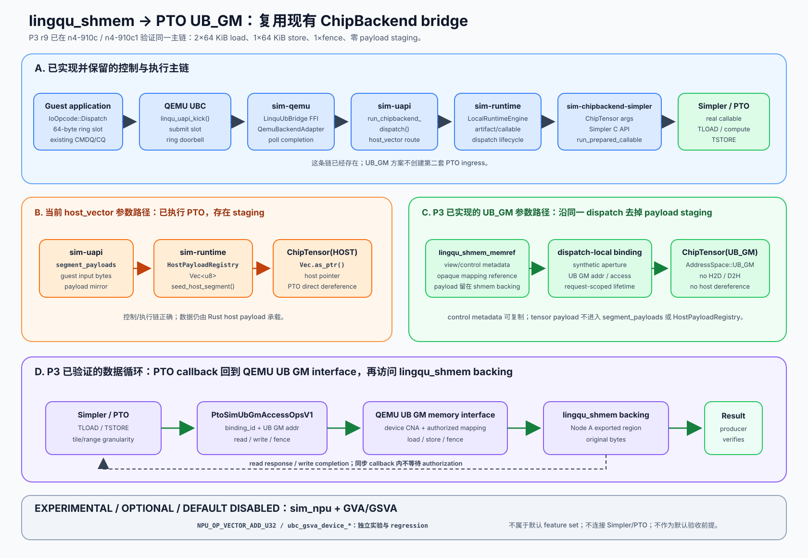
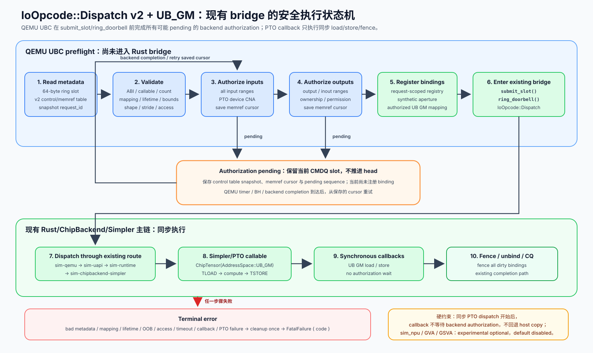
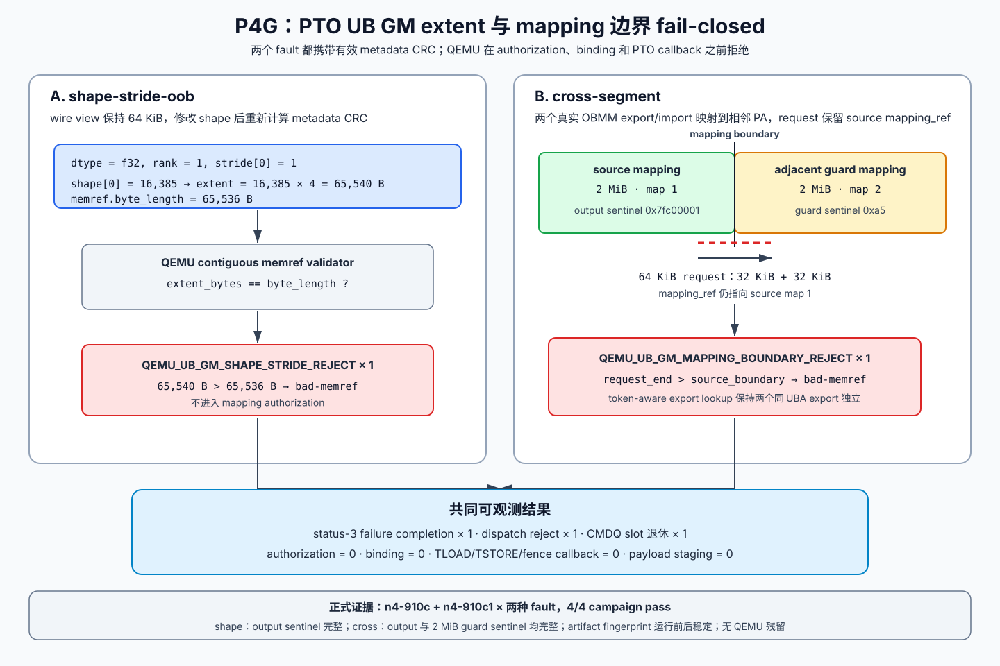
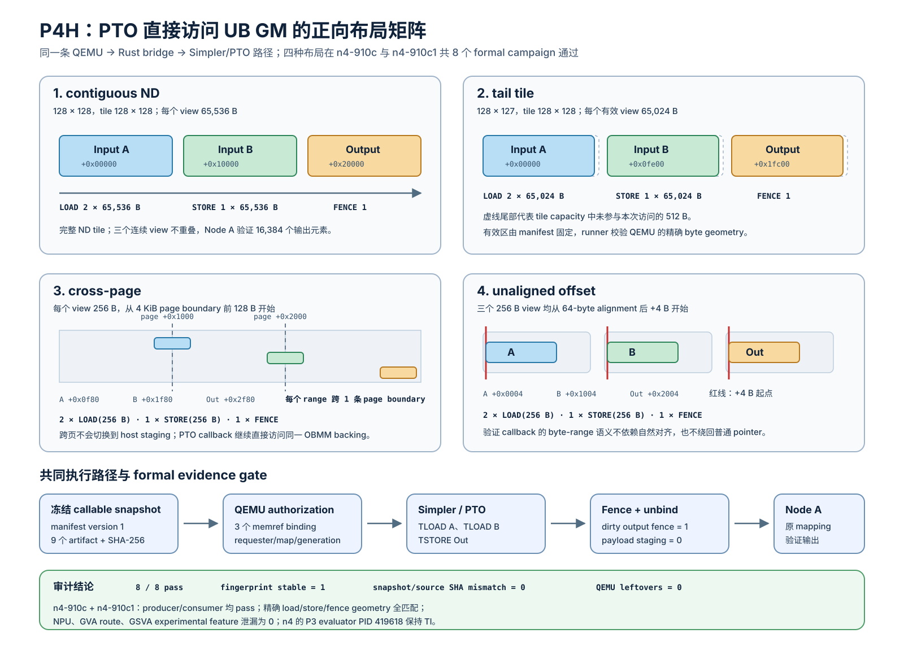
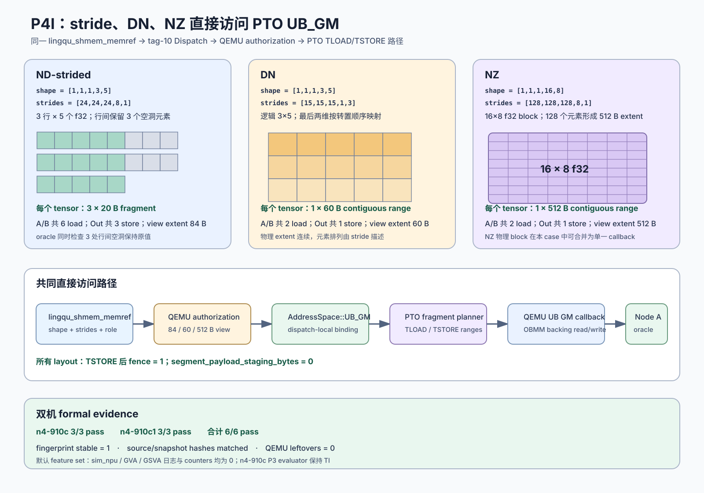
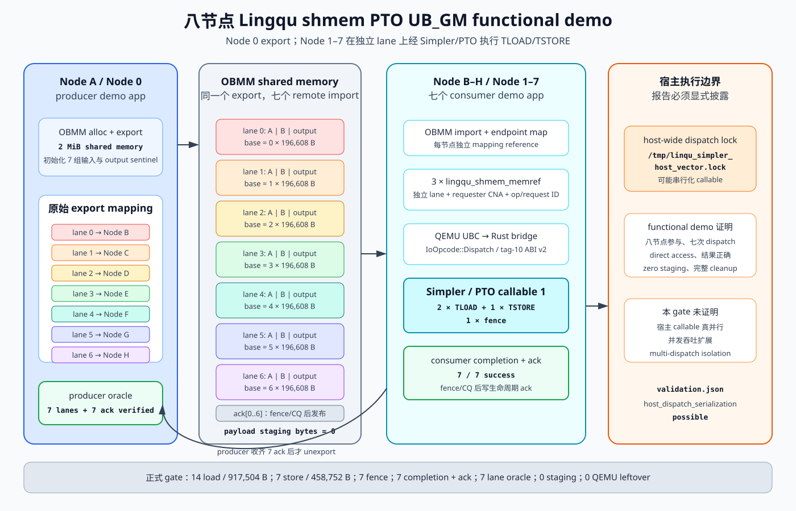
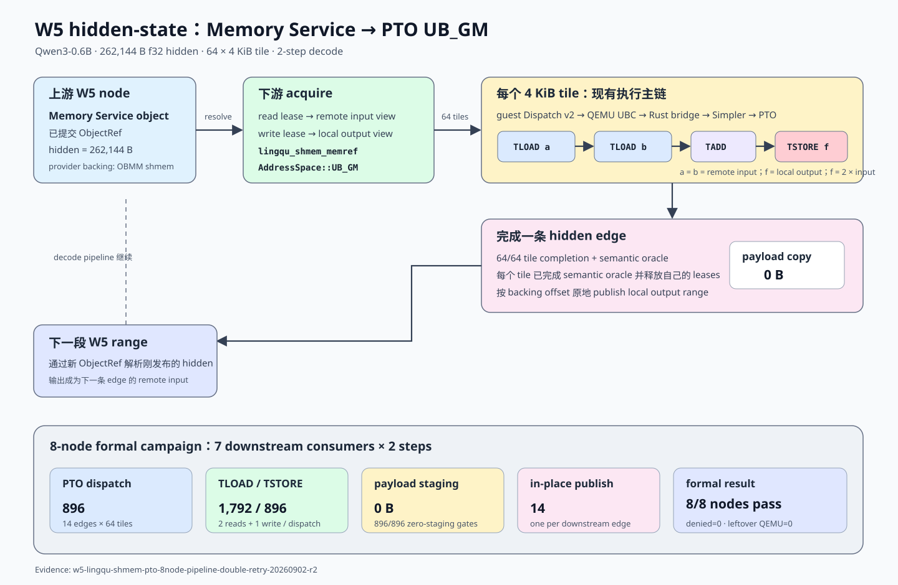
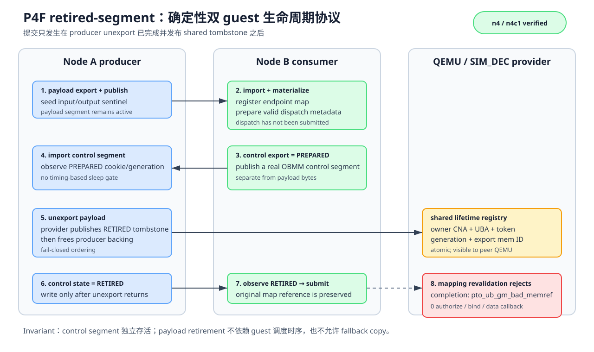

# 支持 PTO 通过`TLOAD/TSTORE` 直接访问 `UB_GM`

> 日期：2026-08-29；W5 Memory Service 集成复核：2026-09-02
>
> 审计基线：`ub_sim` `299888a84a77`
>
> 范围：guest Linux、QEMU UBC、`sim-qemu`、`sim-uapi`、`sim-runtime`、
>`sim-chipbackend-simpler`、Simpler、PTO ISA、Memory Service、OBMM、W5

## 1. 结论

现有 `host_vector`/ChipBackend workload 已经贯通以下执行链：

`guest IoOpcode::Dispatch` → QEMU UBC `linqu_uapi_kick()` →
`sim-qemu` bridge → `sim-uapi` → `sim-runtime` →
`sim-chipbackend-simpler` → Simpler/PTO callable。

因此，不需要创建一条从 attached-NPU opcode 进入 PTO 的并行执行链。正确的实施方向是在已贯通的 ChipBackend bridge 上增加 `UB_GM` 参数类型和 simulator UB GM memory interface，消除当前`segment_payloads → Vec<u8> → host pointer` 的 payload staging。

当前仓库中存在两条名称接近、语义不同的 vector 路径，分别为：

| 路径 | 当前真实执行链 | 已经证明 | 当前限制或剩余工作 |
| --- | --- | --- | --- |
| ChipBackend `host_vector` | QEMU UBC → `sim-qemu` → `sim-uapi` → `sim-runtime` → `sim-chipbackend-simpler` → Simpler/PTO | guest/QEMU bridge 能调起实际 Simpler/PTO callable；新增 `lingqu_shmem_memref` 分支已在两节点直接访问 UB GM backing；authorization lifecycle、ingress/preflight、released-import、retired-segment、shape/stride extent、跨 segment、ND/tail/cross-page/unaligned/stride/DN/NZ layout 和 PTO callback 执行阶段的 access conflict 已在同一两节点链路通过；一个 producer 加七个 consumer 的八节点 demo 已通过统一 CLI 正式门禁；Qwen3-0.6B W5 已在两节点和八节点把 Memory Service hidden object 直接交给 PTO，执行 `pipeline_double` 后原地发布输出 | 传统 `host_vector` 参数继续使用 host payload staging；单 QEMU 多 slot 隔离、系统性 recovery、通用 Lingqu `task/gm_tensor` callable 封装，以及 P5 性能/coalescing 属于后续工作 |
| experimental `sim_npu` / `NPU_OP_VECTOR_ADD_U32` | QEMU `ub_npu.c` → `g_malloc()` → `ubc_gsva_device_read()` → C 循环 → `ubc_gsva_device_write()` | 可选实验路径中的 device CNA、GSVA acquire/read/write/fence 能工作 | 没有进入 Rust bridge、Simpler 或 PTO ISA；不属于默认 feature set |

设计决定：

1. 用户可见类型命名为 `lingqu_shmem_memref`。
2. PTO/Simpler 地址空间命名为 `AddressSpace::UB_GM`。
3. 继续使用现有 `IoOpcode::Dispatch`、QEMU UBC `linqu_uapi` ring 和 `sim-qemu` bridge。
4. 不新增 `NPU_OP_PTO_DISPATCH`，主路径不依赖 `ub_npu.c` command processor。
5. OBMM 负责 `lingqu_shmem` 的 alloc、export、import、映射和生命周期。
6. QEMU 为 PTO CPU simulator 提供通用 UB GM load/store/fence interface；具体 mapping、权限和一致性实现留在 QEMU adaptor 内部。
7. `sim-chipbackend-simpler` 把 `lingqu_shmem_memref` materialize 为 `ChipTensor(AddressSpace::UB_GM)` 和 dispatch-local binding。
8. PTO kernel 继续使用 `GlobalTensor<T>`、`TLOAD` 和 `TSTORE`；kernel 内不出现 OBMM payload API。
9. 数据 payload 不进入 `sim-uapi::segment_payloads`，控制 metadata 可以通过现有 UAPI ring 和版本化 control table 传递。
10. mapping、bounds、access、lifetime、ordering 或 callback 检查失败时 fail-closed。
11. `sim_npu`、GVA 和 GSVA 统一标记为 `experimental`、`optional`、`default disabled`；它们不进入默认 feature set，也不构成 UB GM direct-access 的架构依赖或验收前提。

目标架构如下。



## 2. 上位目标与“直接访问”的验收口径

Upstream 设计 [`linqu_data_system.md`](https://github.com/xwhu/pypto_workspace/blob/f43b084e281d/docs/pypto_top_level_design_documents/linqu_data_system.md) 规定：

- `lingqu_shmem` 提供 UB 网络上的分布式共享内存；
- L0–L2 将其映射到 GM space；
- `gm_tensor` 可以放置在该区域；
- PTO `TLOAD/TSTORE` 可以直接访问；
- 数据面不增加额外软件 copy。

文件名保留历史拼写 `linqu_data_system.md`，服务名使用`lingqu_shmem`。本文的新 API、ABI、日志和测试统一使用 `lingqu_*`。

### 2.1 “直接访问”的可验证定义

`TLOAD` 会把 GM 数据搬入 tile，`TSTORE` 会把 tile 数据写回 GM；这些 ISA 定义内的数据移动属于正常执行。本文的“直接访问”采用以下可观测定义：

- kernel 参数引用 `lingqu_shmem` 中的原始 tensor view；
- Simpler 参数被标记为 `AddressSpace::UB_GM`；
- PTO `TLOAD` 经 simulator UB GM memory interface 读取原始 backing；
- PTO `TSTORE` 经同一受控路径写回原始 backing；
- requester 使用配置给 PTO/ChipBackend 模拟设备的 device CNA；
- guest runtime、Rust bridge、`sim-uapi` 和 `sim-runtime` 不创建 payload 镜像；
- input 不执行 H2D，output 不执行 D2H；
- producer 从原始 `lingqu_shmem` mapping 观察到 consumer 的 PTO 写入结果。

### 2.2 不计入完成的路径

| 路径 | 不能作为完成证据的原因 |
| --- | --- |
| guest 先 `memcpy()` 到普通 tensor，再 dispatch | PTO 访问复制后的 tensor |
| `sim-uapi` 从 `segment_payloads` 取得 bytes 再构造 host `Vec` | payload 经 host staging |
| `prepare_simpler_capi_args()` 把 `Vec` pointer 填入 `Tensor::new()` | `ChipTensor` 仍指向 HOST memory |
| 把 guest EL0 VA 写入宿主 `ChipTensor.buffer.addr` | 宿主 PTO CPU simulator 不能解引用 guest VA |
| 把 QEMU host backing pointer 直接暴露给 PTO | 绕过 mapping、bounds、access、lifetime 和 ordering |
| 仅运行 experimental `NPU_OP_VECTOR_ADD_U32` | 覆盖可选 GSVA device operation，未覆盖 PTO callable |
| 仅运行 Simpler 自带的 POSIX SHM/global-domain 示例 | 未覆盖 `lingqu_shmem` mapping 和 QEMU UB GM interface |
| UB GM 失败后回退到 host copy | 破坏 fail-closed 与 no-staging 语义 |

控制 metadata 的复制不计为 payload staging。`h2d_bytes`、`d2h_bytes` 和
`segment_payload_staging_bytes` 必须分别为零。

### 2.3 Feature status 记录

本文记录以下 feature classification：

| Feature | Status | 默认 feature set | 对 UB GM direct-access 的地位 |
| --- | --- | ---: | --- |
| `lingqu_shmem_memref` + `AddressSpace::UB_GM` + PTO `TLOAD/TSTORE` | target | 包含 | 默认主目标 |
| existing QEMU UBC → `sim-qemu` → ChipBackend → Simpler/PTO dispatch | baseline | 包含 | 默认控制/执行主链 |
| `sim_npu` / QEMU attached-NPU semantic operations | experimental、optional | 不包含，default disabled | 独立实验与 regression |
| GVA | experimental、optional | 不包含，default disabled | 可选地址映射实验 |
| GSVA | experimental、optional | 不包含，default disabled | 可选 QEMU/OBMM adaptor 实验 |

该 classification 已进入实际默认配置：`vendor/qemu_8.2.0_ub@76942965`
要求显式 `UB_SIM_EXPERIMENTAL_FEATURES=npu` 才创建设备，隐式 GSVA route 同样需要
`gsva` token；`vendor/qemu_8.2.0_ub@3f54db3b` 进一步关闭默认 GSVA ARM-MMU
mode。专用 NPU/GSVA regression runner 会显式传入对应 token，普通 PTO UB GM
acceptance 不设置这些 token。

## 3. 当前实现审计

### 3.1 审计与实施输入

| 仓库或 submodule | Revision |
| --- | --- |
| `ub_sim` | `299888a84a77` |
| `guest-linux/kernel_ub` | `70c7272a8b66` |
| `vendor/obmm` | `53011eed1071` |
| `vendor/pto-isa` | `ecb6c303f797` |
| `vendor/qemu_8.2.0_ub` | `15951308ea8f` |
| `vendor/simpler` | `8a6a28f405c8` |
| `pypto_ws_hu_core` 上位设计 | `f43b084e281d` |

这些 revision 记录最初审计输入。随后完成的 P0–P4I 和 W5 集成证据如下；表中的 revision
均为已经提交的阶段性代码。P2 的同步与可恢复 authorization 正向路径已经完成，
P4A authorization timeout、P4B authorization lifecycle、P4C ingress/preflight
负向矩阵、P4D callback execution access conflict、P4E released-import lifetime 和
P4F retired-segment lifetime、P4G shape/stride extent 与跨 segment 边界已完成双机
验证；P4H 又完成 contiguous ND、tail、cross-page 和 unaligned 四种正向布局的双机
验证，P4I 完成 stride、DN 和 NZ 三种布局的双机验证。2026-09-02 又完成 W5
Memory Service hidden-state 两节点与八节点集成。扩展并发、系统性 recovery、通用
Lingqu callable 封装以及 P5 性能/coalescing 继续作为后续工作。

| 阶段 | 仓库 | Revision | 已提交内容 |
| --- | --- | --- | --- |
| P0 | `ub_sim` | `a05ca02` | `AddressSpace::UB_GM` C++/Rust ABI 与 layout contract |
| P0 | `ub_sim` | `ff25e17` | dispatch v2、memref、callback、binding、counter ABI |
| P0 | `vendor/simpler` | `d31717be` | `UB_GM = 2` C++ tensor address space |
| P0 | `vendor/qemu_8.2.0_ub` | `ace22c26` | default-disabled `pto-device-cna` property |
| P1 | `vendor/simpler` | `70350b51` | UB_GM tensor host-staging bypass |
| P1 | `ub_sim` | `0c52386` | UB_GM runtime arg、view、binding materialization 与 fail-closed tests |
| P1 | `vendor/pto-isa` | `594817f2` | CPU `TLOAD/TSTORE` checked callback 与 mock vector-add tests |
| P2 | `vendor/simpler` | `6cf285cb` | 跨 DSO 传播 UB GM worker-local run context |
| P2 | `ub_sim` | `70fb8b5`、`0903675` | Simpler callback adaptor 与 authorized bridge dispatch |
| P2 | `ub_sim` | `3b7945f`、`6eb8c22` | tag-10 slot ABI 与 QEMU ingress contract tests |
| P2 | `vendor/qemu_8.2.0_ub` | `0da2a94a`、`dc8d9633` | tag-10 ingress、同步 OBMM authorization、opaque OBMM map handle 与 request-scoped callback/binding |
| P2 | `vendor/qemu_8.2.0_ub` | `001eb084` | PTO worker callback 执行期间释放 QEMU BQL |
| P2 | `vendor/qemu_8.2.0_ub` | `915a7ebe` | authorization slot snapshot、memref cursor、monotonic sequence、CMDQ head 保留与 timer completion resume |
| P2 | `ub_sim` | `8ef0b95` | authorization delay/timeout CLI、pending/resume evidence gates、runner 修正与 QEMU gitlink |
| P3 | `ub_sim` | `5f88743`、`bc69fa1`、`81b157e` | guest dispatch builder、queue endpoint、opaque memref 与 lifetime |
| P3 | `ub_sim` | `504f411`、`18f55b2`、`c3bbe93` | 两节点 workload、initramfs wiring 与 acceptance CLI |
| P3 | `ub_sim` | `0770b01`、`f3a7e3f`、`182ef9b`、`b2abe0d` | import aperture、mapping sync、BQL callback 安全与 callable-1 对齐 |
| P3 | `vendor/qemu_8.2.0_ub` | `76942965`、`3f54db3b` | experimental NPU/GSVA 与 GSVA ARM-MMU 默认关闭 |
| P3 | `ub_sim` | `4f33311`、`53fd476` | 默认路径与 GVA/GSVA 解耦、契约 gate 与最终 QEMU pin |
| P4A | `vendor/qemu_8.2.0_ub` | `5059f33` | fail-closed CQ failure completion 的精确结构化日志 |
| P4A | `ub_sim` | `b5960a6`、`bad2e0b`、`90d6658` | authorization-timeout expected-result CLI、严格门禁、source hashes 与 guest 健康退出 |
| P4B | `vendor/qemu_8.2.0_ub` | `48cf46e3` | pending authorization cancel/reset cleanup、迟到和重复 completion guard |
| P4B | `ub_sim` | `16a6da9` | cancel expected-result CLI、exact-once CQ/sequence 门禁与双机 runner |
| P4B | `vendor/qemu_8.2.0_ub` | `264a042e` | reset 时退役 SIM_DEC mapping、重建 OBMM async endpoint 并保留单调 map ID |
| P4B | `ub_sim` | `28fcd2d` | strict QMP reset campaign、重启恢复/sequence gate、QEMU gitlink 与契约测试 |
| P4C | `ub_sim` | `86b4bb4` | mapping/requester/bounds/role-access fault injection、有效 CRC、精确错误与零数据回调门禁 |
| P4D | `vendor/simpler` | `fb060537` | 精确传播 PTO callback access failure，避免 scheduler timeout 覆盖原始错误 |
| P4D | `ub_sim` | `5a68bca` | execution access fault artifact、guest CLI、严格门禁、契约测试与 Simpler gitlink |
| P4E | `ub_sim` | `92e25b8` | released-import lifetime fault、exact-count gate 与双机 runner |
| P4F | `guest-linux/kernel_ub` | `149518e2510b` | export-retire callback、import lifetime ABI v3 与独立 SIM_DEC map-v2 operation |
| P4F | `vendor/qemu_8.2.0_ub` | `b631266c49` | 五元 export lifetime tombstone、原子发布与 mapping 重校验拒绝 |
| P4F | `ub_sim` | `7bc05b0` | retired-segment workload、严格 runner、artifact 诊断、契约测试与两个 gitlink |
| P4G | `vendor/qemu_8.2.0_ub` | `371b33976e` | shape/stride extent 校验、mapping 边界拒绝与 token-aware export lookup |
| P4G | `ub_sim` | `7b14988` | 两类边界 workload、双 export guard、严格 runner、契约测试与 QEMU gitlink |
| P4H | `ub_sim` | `9570fad`、`25382ae` | 四种正向 layout workload、manifest-bound geometry 与非法 vector shape 拒绝 |
| P4H | `ub_sim` | `64deaf3`、`787f0d8`、`59ed5aa` | formal artifact snapshot、guest artifact 隔离与 immutable callable manifest |
| P4I | `vendor/pto-isa` | `66213f99` | stride-aware UB GM tile range planning、fragment load/store 与 mock coverage |
| P4I | `vendor/qemu_8.2.0_ub` | `6e59331e3e` | strided PTO UB GM memref validation 与授权 view |
| P4I | `ub_sim` | `09ef8af`、`c702e68`、`5e94760`、`b667ef9` | PTO/QEMU gitlink、三种 layout artifact、guest workload 与执行入口 |
| P4I | `ub_sim` | `96b8a2c`、`58563d2`、`caac3ff` | strided public memref、PTO materialization 与 bridge view 传播 |
| W5-A | `mem_service` | `5878d6e` | W5 hidden object view 与 OBMM provider-backed memref 集成契约 |
| W5-A | `guest-linux/kernel_ub` | `ed9ac25` | W5 hidden mapping 与 guest execution 支持 |
| W5-A | `ub_sim` | `edbd0fb` | Memory Service adapter、W5 hidden 接入和原地 publish |
| W5-B | `ub_sim` | `1d21d6f`、`9c309c6`、`26e7b64`、`d475ccf`、`83dc22b` | 完整 hidden range tile 化、`pipeline_double`、语义门禁和原地发布门禁 |
| W5-C | `vendor/qemu_8.2.0_ub` | `9a13cc9265`、`1a43e84b89` | SIM_DEC transient read 有界重试与并发 ERS2 event clear |
| W5-C | `ub_sim` | `54227ae`、`aece55d` | QEMU pin、W5 remote-read completion 与并发 event clear 验证 |
| Regression | `ub_sim` | `e7dfda2` | Python 3.9 contract infrastructure 兼容性修复 |

P4D 的四组正式 campaign 已使用 `source-sha256.txt` 和完整 artifact fingerprint
完成审计，详见 9.9 节。承载 P4D 的 `vendor/simpler@fb060537` 与
`ub_sim@5a68bca` 已独立提交，正式 evidence 中的 source hash 与提交内容一致。
P4E 的两组正式 campaign 同样通过 source/artifact SHA-256 绑定实际执行内容，详见
9.10 节；实现已归档为 `ub_sim@92e25b8`。P4F 的 n4-910c r6 与 n4-910c1 r8
正式 campaign 进一步完成 producer retired-segment 验证，详见 9.11 节。P4G 的
四组正式 campaign 又完成 shape/stride extent 和跨相邻 mapping 的 fail-closed 验证，
详见 9.12 节。P4H 的八组正式 campaign 在两个远端主机完成四种正向 layout，详见
9.13 节。P4I 的六组正式 campaign 进一步完成 stride、DN 和 NZ，详见 9.14 节。
W5 2/8-node hidden-state evidence 见 9.16 节。

### 3.2 已贯通的 ChipBackend/Simpler/PTO 主链

代码证据如下：

| 层 | 当前代码证据 | 结论 |
| --- | --- | --- |
| QEMU UBC bridge 初始化 | [`ub_ubc.c`](../../vendor/qemu_8.2.0_ub/hw/ub/ub_ubc.c) 的 `linqu_uapi_init_bridge()` 调用 `linqu_ub_bridge_new_from_yaml()` | QEMU 内已经嵌入 Rust bridge |
| guest descriptor ingress | `linqu_uapi_kick()` 读取 64-byte slot，调用 `linqu_ub_bridge_submit_slot()` 和 `linqu_ub_bridge_ring_doorbell()` | guest dispatch 进入 `sim-qemu` |
| `sim-qemu` FFI | [`ffi.rs`](../../crates/sim-qemu/src/ffi.rs) 暴露 new/register/submit/ring/poll C ABI | QEMU 与 Rust bridge 已可同步交互 |
| adapter | [`adapter.rs`](../../crates/sim-qemu/src/adapter.rs) 将 descriptor 送入 `LocalGuestUapiSurface` | descriptor 到达 `sim-uapi` |
| dispatch 路由 | [`sim-uapi/src/lib.rs`](../../crates/sim-uapi/src/lib.rs) 的 `IoOpcode::Dispatch` 调用 `run_chipbackend_dispatch()` | ChipBackend 路由已存在 |
| `host_vector` | `run_w4_chipbackend()` 选择 `run_host_vector_chipbackend()` | vector workload 沿主链运行 |
| runtime | `run_host_vector_chipbackend()` 构造 `BackendDispatchOperation` 并提交 `LocalRuntimeEngine` | 已进入 `sim-runtime` |
| Simpler C API | [`sim-runtime/src/lib.rs`](../../crates/sim-runtime/src/lib.rs) 加载 artifacts、创建 callable、调用 `run_prepared_callable()` | 实际进入 Simpler runtime/PTO artifact |

这条链已经回答了执行入口问题：PTO callable 由现有 QEMU bridge 和`sim-chipbackend-simpler` 执行。本文后续改动必须保留这条链。

### 3.3 当前主链的数据 staging

既有 `host_vector` 继续使用 host memory：

1. `sim-uapi::run_chipbackend_dispatch()` 从 `segment_payloads` 取得 guest input；
2. `run_host_vector_chipbackend()` 构造 `input_a_bytes`、`input_b_bytes`，并通过`seed_host_segment()` 写入 runtime 的 host segment；
3. `sim-runtime::prepare_simpler_capi_args()` 从 `HostPayloadRegistry` 取得`Vec<u8>`；
4. `Tensor::new()` 接收该 `Vec` 的 `as_ptr()`/`as_mut_ptr()`；
5. Simpler 以普通 HOST tensor 执行 callable。

P1 已增加独立的 UB_GM materialization 分支。该分支构造 synthetic aperture pointer、
`AddressSpace::UB_GM` tensor 和 dispatch-local binding，不读取 `HostPayloadRegistry`，
Simpler 也不执行 H2D/D2H copy。PTO CPU `TLOAD/TSTORE` 已能通过 mock byte-array
callback 访问这一地址，并在 OOB、权限冲突、callback 失败和 unbind 后访问时
fail-closed。

P2 已把 QEMU access callback 注册到现有 Rust bridge，并通过既有
Simpler/ChipBackend adaptor 把 request-scoped run context 传播到执行 PTO callable 的
worker。`linqu_uapi_kick()` 能识别 tag-10 slot，DMA 读取 control/memref/scalar/shape/
stride table，校验 ABI、CRC、callable fingerprint、requester CNA、layout、bounds、
access 和 opaque OBMM mapping reference，再注册 binding 并进入现有 bridge。
mapping reference 绑定到 EL0 已注册的 OBMM endpoint map；QEMU 先校验 map slot 与
generation，再解析其私有 SIM_DEC route。每次 `TLOAD/TSTORE/fence` callback 都重新
校验 endpoint map 和底层 route；completion、bridge submission failure 和 doorbell
failure 会执行 unbind。

P3 已补齐 guest tag-10 control table、opaque map reference、producer/consumer workload
与统一 acceptance runner。2026-08-30 的 r9 在 n4-910c 和 n4-910c1 分别从精确
`ub_sim@53fd476a`、`QEMU@3f54db3b` worktree 完整重建并通过两节点 acceptance：

- Node A 从原始 export mapping 验证 16,384 个 `u32` 输出；
- Node B 沿既有 bridge 执行 callable 1，日志包含两次 65,536-byte load、一次
  65,536-byte store 和一次 fence；
- completion unbind 记录 `load_bytes=131072`、`store_bytes=65536`、`fences=1`、
  `segment_payload_staging_bytes=0`；
- 两台机器的默认日志均没有 `UB_NPU: created`、`SIM_DEC: GVA_MAP`、
  `GVA_S3_MAP`、`GVA_ROUTE_DUMP`、`GSVA_MODE` 或 `GSVA_`；
- 两份 `validation.status` 均为 `pass`，`runner_exit_code=0`，结束后没有 QEMU
  进程残留。

这组证据证明了同步 OBMM authorization 路径的 PTO direct access。P2 随后增加
可恢复 authorization 正向路径：QEMU 在显式 delay 触发 pending 时冻结当前 CMDQ slot、
control/memref/scalar/shape/stride metadata、memref cursor 和 monotonic sequence，保持
CMDQ head 不变；timer completion 到达后重新校验 mapping identity，从保存的 cursor
继续。全部 memref 获权后才注册 binding 并进入 bridge。默认 delay 为零，原同步路径
不增加 pending/resume 事件。

2026-08-30 的 P2 r2 在 n4-910c 和 n4-910c1 使用相同源内容分别完整构建 QEMU，
对三个 memref 各注入 1,000,000 ns authorization delay。两台机器均观测到 3 次
pending、3 次 ready resume 和 3 次 `pending_head=0 tail=1`；sequence 固定为
`0:1,1:2,2:3`，全部授权完成后 head 才推进到 1。后续两次 load、一次 store、一次
fence、producer original-mapping verify 和零 payload staging 全部通过。P4A 随后完成
authorization timeout 的双机 fail-closed 验证。P4B 又完成 cancel、cancel 后迟到
completion、正常完成后的重复 completion，以及 QMP reset、旧 mapping 退役、迟到
事件拒绝与重启后恢复的双机验证。P4C 进一步完成错误 mapping generation、stale
mapping、错误 requester、OOB、地址加法溢出和 role/access preflight 不一致的双机
fail-closed 验证。P4D 进一步完成实际 PTO callback 执行阶段的 READ 上 `TSTORE` 和
WRITE 上 `TLOAD` access conflict 双机验证。P4E 又证明 consumer 释放 OBMM import
以后，保留下来的 endpoint-map reference 会在 authorization 前被拒绝。P4F 进一步
证明 producer 退役原 export 后，consumer 保留的 import、endpoint map 与已准备
dispatch 会依据完整 export lifetime identity 在 authorization 前被拒绝。P4G 随后
补齐 shape/stride extent 超过 view 以及一个 request 携带 source mapping reference
跨入相邻 active mapping 的双机拒绝；两类 fault 均在 authorization 前终止。复杂
layout 已由 P4H/P4I 补齐；多 dispatch 压力和其他 recovery case 保留为后续扩展。

### 3.4 Experimental `sim_npu` / `NPU_OP_VECTOR_ADD_U32` 的真实位置

[`ub_npu.c`](../../vendor/qemu_8.2.0_ub/hw/ub/ub_npu.c) 中的`ub_npu_op_vector_add_u32()` 执行以下操作：

1. 校验三个 GSVA descriptor；
2. 对输入执行 read acquire；
3. 用 `g_malloc()` 分配 `a`、`b`、`c`；
4. 调用 `ubc_gsva_device_read()` 读入 `a` 和 `b`；
5. 在 QEMU C 循环中执行 `c[i] = a[i] + b[i]`；
6. 对 output 执行 write acquire；
7. 调用 `ubc_gsva_device_write()` 和 `ubc_gsva_device_fence()`。

这条路径没有调用 `linqu_ub_bridge_*`、`sim-uapi`、`sim-runtime`、`sim-chipbackend-simpler` 或 PTO ISA。它可以作为以下机制的独立 regression oracle：

- GSVA descriptor validation；
- device CNA；
- read/write acquire；
- GSVA device read/write/fence；
- pending coherence 状态处理。

它不承担 PTO dispatch 入口职责。`sim_npu` 及其 GVA/GSVA data path 统一属于 experimental optional features，默认 feature set 不启用。

### 3.5 当前能力与缺口

| 能力 | 当前状态 | 目标改动 |
| --- | --- | --- |
| guest → QEMU UBC → Rust bridge | 已实现 | 保留 |
| `IoOpcode::Dispatch` → ChipBackend | v2 control metadata 已实现 | 保留并继续覆盖多 slot 并发 |
| Simpler/PTO callable execution | 已实现 | 保留 |
| `host_vector` payload | 传统参数使用 host `Vec` staging；`lingqu_shmem_memref` 参数绕过 staging | 保留两类参数的明确语义 |
| OBMM export/import 与共享内存 backing | 已实现，并由 Memory Service provider 交给 W5 hidden object view | 保持 provider 边界和生命周期门禁 |
| experimental GVA/GSVA mapping | 已实现部分实验能力 | 可选 adaptor；默认路径不依赖 |
| experimental `sim_npu` GSVA read/write/fence | 已实现 | 保留独立 regression；不接入默认 PTO ingress |
| `lingqu_shmem_memref` | ABI/type、runtime view、guest materialization 与 QEMU parser 已实现并通过两节点 E2E；authorization timeout/cancel 保持原输出不变，reset 后可重新 import/map；P4C mapping/requester/OOB/overflow/role-access preflight、P4D callback execution access conflict、P4E released-import、P4F retired-segment lifetime、P4G shape/stride/cross-segment 负向矩阵、P4H 四种正向 layout 和 P4I stride/DN/NZ 均通过 | 扩展并发矩阵属于后续稳健性工作 |
| `AddressSpace::UB_GM` | C++/Rust 同值 `2`、Simpler pass-through、worker run context、真实 guest E2E、P4G 单 mapping 边界约束、P4H cross-page/unaligned byte-range 及 P4I strided view 均已实现 | 当前 direct-access PoC 范围已闭环 |
| PTO CPU UB GM hook | P1 已实现 contiguous range callback 与 fail-closed；P4H 已验证 ND、tail、cross-page 和 unaligned；P4I 已实现并验证 stride-aware fragment、DN 和 NZ | range coalescing 与更复杂一致性语义属于后续优化 |
| QEMU UBC access callback | P2 已实现 read/write/fence、逐次 mapping 重校验和 completion cleanup；P3 同步、P4A timeout、P4B lifecycle、P4C preflight、P4D actual access conflict、P4E released-import、P4F retired-segment、P4G extent/mapping-boundary、P4H 四种正向 layout 和 P4I stride/DN/NZ E2E 通过 | 通用 callback failure 与并发矩阵属于后续稳健性工作 |
| backend authorization 后进入 bridge | P2 已实现同步 fast path 与 pending slot snapshot/resume；P4A/P4B 已验证 timeout/cancel exact-once failure completion、duplicate guard 和 reset 无 CQ cleanup/recovery | 多 slot、多 binding 和其他失败竞争属于后续压力扩展 |
| 两节点 PTO direct E2E | n4-910c、n4-910c1 的同步、delayed-ready、timeout、cancel、duplicate、reset/recovery、六类 P4C preflight fault、两类 P4D execution fault、P4E released-import、P4F retired-segment、两类 P4G bounds fault、P4H 四种正向 layout 与 P4I stride/DN/NZ 均通过，默认路径无 NPU/GVA/GSVA 泄漏 | 扩展并发和其他 recovery coverage 属于后续工作 |
| 八节点 PTO direct functional demo | n4-910c 上统一 CLI 已通过；Node 0 export，Node 1–7 分别在独立 lane 运行同一 Simpler/PTO callable；14 load、7 store、7 fence、7 completion ack、7 lane oracle、零 staging 和零 QEMU leftover 均通过 | 宿主 callable 真并行仍未证明；正式报告将当前 Simpler host-wide lock 记录为潜在串行化边界 |
| W5 Memory Service hidden-state direct access | Qwen3-0.6B 2-step 已在 2/8-node 实跑通过；下游节点直接 acquire 已提交的 hidden ObjectRef，按 64 个 4 KiB tile 执行 PTO `pipeline_double`，随后把同一 local arena range 原地 publish；八节点累计 896 dispatch、1,792 `TLOAD`、896 `TSTORE`、零 staging | 当前 callable 是集成语义探针；生产模型算子、通用 `task/gm_tensor` API、真并行、完整 recovery 和性能边界仍需补齐 |

## 4. 修正后的目标架构

### 4.1 控制与执行路径

目标继续使用现有路径：

| 顺序 | 模块 | 目标职责 |
| ---: | --- | --- |
| 1 | guest application | 创建 `lingqu_shmem_memref`，提交 `IoOpcode::Dispatch` v2 control block |
| 2 | QEMU UBC `linqu_uapi` | DMA 读取 control table，解析并授权 UB GM mapping |
| 3 | `sim-qemu` bridge | 注册已授权的 dispatch-local binding，提交原有 dispatch descriptor |
| 4 | `sim-uapi` | 解析 callable 与 memref metadata，禁止读取 payload segment |
| 5 | `sim-runtime` | 构造 UB GM runtime args，管理 dispatch/completion |
| 6 | `sim-chipbackend-simpler` | 构造 `ChipTensor(AddressSpace::UB_GM)`，绑定 callback |
| 7 | Simpler/PTO | 执行真实 callable 和 `TLOAD/TSTORE` |
| 8 | QEMU UB GM interface | 将 binding + UB GM address 转换为 backend load/store/fence |
| 9 | existing CQ path | 经 `sim-qemu` poll 与 QEMU `linqu_uapi_flush_cq()` 返回 guest |

### 4.2 数据路径

目标数据循环为：

`PTO TLOAD/TSTORE` → `PtoSimUbGmAccessOpsV1` → QEMU UB GM memory implementation → `lingqu_shmem` backing → callback result。

QEMU 内部负责 mapping resolution、access、lifetime、ordering 和 requester identity。
Rust bridge 负责 dispatch 与 binding 生命周期，不保存 payload 镜像。experimental GSVA adaptor 可以在内部实现 `PtoSimUbGmAccessOpsV1`，默认路径不引用 GSVA 类型、状态机或 counters。

### 4.3 为什么复用 `IoOpcode::Dispatch`

现有 dispatch 已经覆盖以下能力：

- guest ring/CQ；
- QEMU UBC ingress；
- Rust FFI；
- `sim-uapi` dispatch routing；
- `sim-runtime` lifecycle；
- Simpler artifact/callable execution；
- completion 返回。

新增 attached-NPU opcode 会形成第二套 command、completion、callable registry 和错误模型，也会绕开已经验证的 ChipBackend route。复用现有 dispatch 能把新增范围收敛到 memref metadata、backend authorization、UB GM binding 和 PTO load/store hook。

## 5. 公共编程模型

### 5.1 `lingqu_shmem_memref`

公共 API 使用 opaque `lingqu_shmem_memref`，至少表达：

- 所属 `lingqu_shmem` region/import；
- byte offset 和 length；
- dtype；
- rank、shape 和 stride；
- READ、WRITE 或 READ_WRITE 权限；
- 对 imported mapping 的强生命周期引用。

示例接口属于待冻结草案：

```cpp
lingqu_shmem_region region =
    lingqu_shmem_import(export_handle);

lingqu_shmem_memref input_a =
    lingqu_shmem_memref_create(
        &region,
        input_a_offset,
        input_bytes,
        LINGQU_DTYPE_F32,
        input_shape,
        input_strides,
        LINGQU_SHMEM_ACCESS_READ);

lingqu_shmem_memref input_b =
    lingqu_shmem_memref_create(
        &region,
        input_b_offset,
        input_bytes,
        LINGQU_DTYPE_F32,
        input_shape,
        input_strides,
        LINGQU_SHMEM_ACCESS_READ);

lingqu_shmem_memref output =
    lingqu_shmem_memref_create(
        &region,
        output_offset,
        output_bytes,
        LINGQU_DTYPE_F32,
        output_shape,
        output_strides,
        LINGQU_SHMEM_ACCESS_WRITE);

lingqu_pto_dispatch_builder dispatch =
    lingqu_pto_dispatch_create(vector_add_program_id);

lingqu_pto_dispatch_add_memref(&dispatch, "input_a", &input_a);
lingqu_pto_dispatch_add_memref(&dispatch, "input_b", &input_b);
lingqu_pto_dispatch_add_memref(&dispatch, "output", &output);
lingqu_pto_dispatch_add_u64(&dispatch, "count", element_count);
lingqu_pto_dispatch_submit(&dispatch);
```

公共对象不暴露 QEMU host pointer，也不包含 GVA/GSVA key、token 或 epoch。
版本化 control table 只传递 opaque mapping reference、UB GM address/view metadata、access 和 callable metadata；QEMU adaptor 自行解析其私有 mapping state。

simulator adaptor 当前把一个有效的 `obmm_async_map` slot 与 generation 编码成
64-bit mapping reference。编码仅用于 guest/QEMU 的 simulator wire ABI；
`lingqu_shmem_memref` API 返回 opaque 值，应用不读取 slot 或 generation。QEMU 必须
在提交时和每次 PTO access 时验证该 reference 仍对应同一个活动 OBMM map，并核对其
底层 route identity、range、token、peer CNA 和权限。map unregister 或 generation
变化会使旧 reference 立即失效。

### 5.2 PTO kernel 与 `UB_GM` 参数

#### 5.2.1 kernel 源码中的 `__gm__`

PTO kernel 的参数继续写成 `__gm__ T *`。这里的 `__gm__` 表达 PTO ISA 的
global-memory operand 类别，不指定 simulator backing 来自 HOST、DEVICE 还是
`UB_GM`。`AddressSpace::UB_GM` 是 dispatch 时附着在 `ChipTensor` 上的运行时属性，
不会引入 `__ub_gm__` 之类的新 kernel qualifier。

下面的 kernel 可以用于普通 GM 和 `UB_GM`。每个 tile 通过偏移后的 GM pointer
构造 `GlobalTensor`；`TLOAD/TSTORE` 是唯一允许触碰 global payload 的指令：

```cpp
__aicore__ void vector_add(
    __gm__ float *input_a,
    __gm__ float *input_b,
    __gm__ float *output,
    uint32_t count)
{
    using Global = pto::GlobalTensor<
        float,
        VectorShape,
        VectorStride,
        pto::Layout::ND>;

    InputTile ta;
    InputTile tb;
    OutputTile tout;

    for (uint32_t offset = 0; offset < count; offset += TILE_ELEMENTS) {
        Global ga(input_a + offset);
        Global gb(input_b + offset);
        Global gout(output + offset);

        TLOAD(ta, ga);
        TLOAD(tb, gb);
        TADD(tout, ta, tb);
        TSTORE(gout, tout);
    }
}
```

kernel source 看不到 `AddressSpace::UB_GM` 是有意设计。这样，同一份 PTO binary
可以由普通 GM 参数调用，也可以由 `lingqu_shmem_memref` materialize 出来的
`UB_GM` 参数调用。两条路径的差别发生在 callable 参数构造和 PTO CPU memory
access dispatch 中。

#### 5.2.2 普通 GM 参数与 `UB_GM` 参数的调用差异

| 层次 | 普通 GM 参数 | `UB_GM` 参数 |
| --- | --- | --- |
| PTO kernel signature | `__gm__ float *` | `__gm__ float *` |
| `ChipTensor.address_space` | `AddressSpace::HOST` 或 `DEVICE` | `AddressSpace::UB_GM` |
| `ChipTensor.buffer.addr` | CPU 可解引用 pointer 或 device address | 当前 dispatch 内的 synthetic aperture address |
| dispatch binding | 不需要 UB GM binding | 必须存在 request-scoped `PtoSimUbGmBindingV1` |
| `TLOAD` | 现有 CPU/device GM load | binding lookup → QEMU UB GM `read` callback |
| `TSTORE` | 现有 CPU/device GM store | binding lookup → QEMU UB GM `write` callback |
| payload staging | 当前 `host_vector` 会进入 `HostPayloadRegistry` | 禁止进入 `segment_payloads` 和 `HostPayloadRegistry` |

下面是目标内部实现的等价伪代码，用于展示一个 `lingqu_shmem_memref` 如何成为
真正的 `UB_GM` callable 参数。函数名将在 P0/P1 冻结；这段代码不表示当前仓库已经
提供这些 API：

```cpp
// QEMU 已完成 mapping、bounds、access 和 lifetime authorization。
QemuResolvedUbGmView input_a_resolved =
    qemu_resolve_ub_gm_memref(input_a.opaque_mapping_ref, input_a.byte_offset);
QemuResolvedUbGmView output_resolved =
    qemu_resolve_ub_gm_memref(output.opaque_mapping_ref, output.byte_offset);

PtoSimUbGmBindingV1 input_a_binding = {
    .request_id = request_id,
    .binding_id = 41,
    .aperture_base = 0x700000000000,
    .aperture_length = input_bytes,
    .ub_gm_base = input_a_resolved.ub_gm_addr,
    .mapped_length = input_bytes,
    .access = PTO_SIM_UB_GM_READ,
    .backend_cookie = input_a_resolved.backend_cookie,
};

PtoSimUbGmBindingV1 output_binding = {
    .request_id = request_id,
    .binding_id = 43,
    .aperture_base = 0x700000020000,
    .aperture_length = output_bytes,
    .ub_gm_base = output_resolved.ub_gm_addr,
    .mapped_length = output_bytes,
    .access = PTO_SIM_UB_GM_WRITE,
    .backend_cookie = output_resolved.backend_cookie,
};

ChipTensor input_a_arg = make_tensor_external(
    reinterpret_cast<void *>(input_a_binding.aperture_base),
    input_shape,
    input_rank,
    DataType::FLOAT32,
    false,
    0,
    AddressSpace::UB_GM);

ChipTensor output_arg = make_tensor_external(
    reinterpret_cast<void *>(output_binding.aperture_base),
    output_shape,
    output_rank,
    DataType::FLOAT32,
    false,
    0,
    AddressSpace::UB_GM);
```

`input_b` 按相同方式生成 READ binding。`ChipStorageTaskArgs` 最终携带三个
`ChipTensor` 和 `count` scalar。这里最关键的两个字段是：

- `address_space = UB_GM`：要求 Simpler 跳过 H2D/D2H、拒绝 HOST pointer 路径；
- `buffer.addr = aperture_base`：kernel 接收到的 `__gm__ float *` 是 synthetic
  address，只用于地址计算，不能由 CPU 直接解引用。

Simpler 展开 callable 参数后，kernel entry 实际观察到的值等价于：

```cpp
// 这些值来自三个 AddressSpace::UB_GM ChipTensor，不来自 host allocation。
__gm__ float *input_a = reinterpret_cast<__gm__ float *>(0x700000000000);
__gm__ float *input_b = reinterpret_cast<__gm__ float *>(0x700000010000);
__gm__ float *output  = reinterpret_cast<__gm__ float *>(0x700000020000);

vector_add(input_a, input_b, output, element_count);
```

这段代码展示的是 callable argument unpacking 后的逻辑值，不能在普通应用代码中
直接构造或解引用这些 pointer。只有 bridge 注册过的 binding 和本次 run context
可以解释这些地址。

synthetic aperture 必须来自 simulator 预留且不可读写的虚拟地址区间，长度至少覆盖
整个 tensor view。这样可避免它与真实 host allocation 冲突，意外直接解引用也会立即
失败。PTO CPU resolver 把 pointer value 转成 `uintptr_t` 后执行 checked range
arithmetic；callback 返回前不把该地址交给普通 CPU load/store。

Rust materialization 的目标分支等价于：

```rust
match runtime_arg {
    SimplerRuntimeArg::UbGmMemref { binding, view } => {
        ub_gm_bindings.register(request_id, binding)?;
        tensors.push(Tensor::from_ub_gm(
            binding.aperture_base,
            binding.aperture_length,
            view.shape,
            view.strides,
            view.dtype,
        )?);
    }
    SimplerRuntimeArg::InputSegment { .. } => {
        // 现有 staged HOST 路径。
    }
    _ => { /* output, inout, scalar */ }
}
```

目标实现需要新增 `Tensor::from_ub_gm()` 或等价的显式构造函数。现有
`Tensor::new()` 固定生成 HOST tensor，不能用于 `UB_GM` 参数。

#### 5.2.3 `UB_GM` 在实际执行时如何生效

单独增加 `AddressSpace::UB_GM = 2` 不足以改变 `TLOAD/TSTORE` 行为。完整生效链
包含以下步骤：

| 步骤 | 组件 | 生效动作 |
| ---: | --- | --- |
| 1 | guest/QEMU UBC | 从 dispatch control table 读取 `lingqu_shmem_memref`，校验 mapping、view、bounds、access 和 lifetime |
| 2 | QEMU UBC | 在进入同步 PTO dispatch 前完成 backend authorization，并为每个 memref 建立 `PtoSimUbGmBindingV1` |
| 3 | `sim-qemu` bridge | 把 binding metadata 绑定到 `request_id`；只传 metadata，不复制 payload |
| 4 | `sim-uapi` / `sim-runtime` | 生成 `SimplerRuntimeArg::UbGmMemref`，跳过 `segment_payloads` 和 `HostPayloadRegistry` |
| 5 | `sim-chipbackend-simpler` | 构造 `address_space=UB_GM`、`buffer.addr=aperture_base` 的 `ChipTensor` |
| 6 | Simpler CPU run context | 把当前 `request_id`、binding registry、callback table 和 QEMU context 关联到本次 run，并传播到执行 callable 的 CPU worker |
| 7 | PTO kernel | `GlobalTensor` 保存 synthetic pointer；普通 C++ pointer arithmetic 只改变 aperture 内的地址值 |
| 8 | PTO CPU `TLOAD/TSTORE` | 在任何 pointer dereference 之前用 current run context 查询 binding；命中后改走 UB GM read/write callback |
| 9 | QEMU UB GM implementation | 把 `ub_gm_addr` 解析到 `lingqu_shmem` 原始 backing，执行 read/write；output 在完成前执行 fence |
| 10 | completion | 释放 bindings，经原有 CQ 返回；producer 从原始 mapping 读取 PTO 写入结果 |

这条链包含三个用途不同的生效机制：

1. `ChipTensor.address_space = UB_GM` 控制参数 materialization 和 copy policy；
2. `buffer.addr = aperture_base` 为每条 PTO memory instruction 提供 binding lookup key；
3. per-run context 把 lookup 结果关联到本次 `request_id`、QEMU callback 和 backing。

第一项不会独自触发 callback，第二项也不能脱离第三项解析。三项同时成立时，UB GM
参数才具有完整执行语义。

Simpler 当前若用 `is_device_memory()` 判断是否跳过 H2D/D2H，那么仅添加枚举值仍会把
`UB_GM` 当成 HOST。目标实现需要把 copy decision 改为完整的 `AddressSpace` 分派：

```cpp
switch (tensor.address_space) {
case AddressSpace::HOST:
    prepare_host_transfer(tensor);
    break;
case AddressSpace::DEVICE:
    use_child_device_allocation(tensor);
    break;
case AddressSpace::UB_GM:
    require_dispatch_binding(tensor);
    skip_h2d_and_d2h(tensor);
    break;
default:
    fail("unsupported_address_space");
}
```

第 6 步需要一个 per-run context。其逻辑内容如下：

```cpp
struct PtoSimUbGmRunContextV1 {
    uint64_t request_id;
    const PtoSimUbGmBindingRegistryV1 *bindings;
    const PtoSimUbGmAccessOpsV1 *access_ops;
    void *qemu_context;
};
```

该 context 必须随 Simpler run 传播到所有执行该 callable 的 CPU worker。禁止使用一个
无 request identity 的进程级可变 singleton，否则并发 dispatch 可能解析到其他请求的
binding。

#### 5.2.4 一个 `TLOAD` 的地址解析实例

假设一个 READ binding 为：

```text
request_id       = 9001
binding_id       = 41
aperture_base    = 0x7000_0000_0000
aperture_length  = 4096
ub_gm_base       = 0x0020_0000
```

kernel 执行到第 64 个 `float` 时，`input_a + 64` 产生 synthetic address
`0x7000_0000_0100`。`TLOAD` 请求读取 256 bytes 时，resolver 执行：

```text
relative_offset = 0x7000_0000_0100 - 0x7000_0000_0000 = 0x100
end             = 0x100 + 0x100 = 0x200 <= aperture_length
ub_gm_addr      = 0x0020_0000 + 0x100 = 0x0020_0100
```

随后调用：

```c
access_ops->read(
    qemu_context,
    9001,
    41,
    0x00200100,
    tile_scratch,
    256);
```

QEMU 把 `lingqu_shmem` backing 的 256 bytes 写入 `tile_scratch`，现有 PTO layout
逻辑再把 scratch materialize 成 `InputTile`。`TSTORE` 执行逆向过程：先把
`OutputTile` 转换为连续 fragments，再对每个 fragment 调用 `write`，最后对 dirty
output binding 调用 `fence`。

因此，PTO kernel 中看到的仍是 `GlobalTensor` 和 `TLOAD/TSTORE`；实际 payload
访问已经由 synthetic address + current run context 转入 QEMU UB GM callback。

#### 5.2.5 fail-closed 条件与当前实现状态

resolver 必须按以下顺序处理地址：

1. 地址完整落入当前 request 的 UB GM binding：执行 callback；
2. 地址落入保留的 synthetic aperture 区域，但当前 request 没有 matching binding：
   返回 `pto_ub_gm_unbound`，禁止直接解引用；
3. 地址属于 HOST/DEVICE 参数：进入对应的现有实现；
4. range 跨 binding、越界、权限不符、callback 缺失或 lifetime 已失效：失败并清理
   当前 dispatch。

P1 已实现 synthetic aperture 到 PTO callback 的 mock/CPU 生效链。对应代码证据为：

| 文件 | 当前行为 |
| --- | --- |
| `vendor/simpler/src/common/task_interface/data_type.h` | `AddressSpace` 定义 `HOST = 0`、`DEVICE = 1`、`UB_GM = 2` |
| `crates/sim-chipbackend-simpler/src/lib.rs` | `Tensor::from_ub_gm()` 构造保留区 pointer、shape、stride、dtype 和 `UB_GM` descriptor |
| `crates/sim-runtime/src/lib.rs` | UB_GM arg 校验 request/binding/access/bounds 后 materialize；该分支不访问 `HostPayloadRegistry` |
| `vendor/simpler` HBG/TMRB runtime | HOST 沿用 copy；DEVICE/UB_GM 直接传递 descriptor pointer，不做 H2D/D2H |
| `vendor/pto-isa/include/pto/cpu/ub_gm_access.hpp` | 从当前 run context 解析 binding、权限、range 与 callback，保留区未绑定时 fail-closed |
| `vendor/pto-isa/include/pto/cpu/TLoad.hpp` | 在 pointer dereference 前识别 synthetic address；contiguous ND 按 range read 到 scratch |
| `vendor/pto-isa/include/pto/cpu/TStore.hpp` | 在 pointer dereference 前识别 synthetic address；contiguous ND 从 scratch 按 range write |

P1 测试使用 mock byte-array backend 运行真实 PTO `TLOAD → TADD → TSTORE`，覆盖
64×64、3×5 tail tile、OOB、read-only output、callback failure 和 unbind-after-use。
ASan 下 6 个 UB_GM 用例全部通过；普通 HOST 64×64 vector-add 回归也通过。

P2 已实现真实 QEMU callback 注册、worker-local run context、同步 OBMM
authorization 和 completion cleanup。callback 缺失、binding 过期、mapping
generation 改变、range 越界或权限冲突时继续 fail-closed，不会回退到 host staging
或直接解引用 synthetic pointer。P3 guest 已提交真实 tag-10 descriptor；n4-910c 和
n4-910c1 r9 两节点 runtime acceptance 均通过，并在同一个 request 中观察到
`TLOAD/TSTORE` 对应的 QEMU UB GM load/store/fence callback。

## 6. ABI 与内部数据结构

### 6.1 `AddressSpace::UB_GM`

Simpler C++ ABI 增加：

```cpp
enum class AddressSpace : uint8_t {
    HOST = 0,
    DEVICE = 1,
    UB_GM = 2,
};
```

Rust mirror 增加同值枚举：

```rust
#[repr(u8)]
pub enum AddressSpace {
    Host = 0,
    Device = 1,
    UbGm = 2,
}
```

`ChipTensor` 已经包含 1-byte `address_space` 和预留 padding。P0 必须用 C++ `static_assert` 和 Rust layout test 证明 `sizeof(ChipTensor)` 仍为 128 bytes。

`UB_GM` tensor 的规则：

- 禁止 H2D 和 D2H；
- `buffer.addr` 只存 synthetic aperture address，宿主代码禁止直接解引用；
- tensor 全范围必须落入当前 dispatch 的 binding；
- dtype、shape、stride 和 view offset 推导的最大 extent 必须在 bounds 内；
- `TSTORE` 要求 WRITE，`TLOAD` 要求 READ；
- binding 释放、mapping 失效、lifetime 过期或 callback 缺失时 dispatch 失败；
- 禁止隐式转换成 HOST tensor。

### 6.2 dispatch-local synthetic aperture

PTO CPU `GlobalTensor` 当前通过 typed pointer 做 address arithmetic。V1 为每个 UB GM memref 分配不可解引用的 synthetic aperture；registry 保存 aperture 与 opaque UB GM mapping 的对应关系：

```cpp
struct PtoSimUbGmBindingV1 {
    uint64_t request_id;
    uint64_t binding_id;
    uint64_t aperture_base;
    uint64_t aperture_length;
    uint64_t ub_gm_base;
    uint64_t mapped_length;
    uint32_t access;
    uint32_t flags;
    uint64_t backend_cookie;
};
```

registry 的作用域是一次 dispatch。正常完成、异常、取消和 QEMU reset 都必须执行 unbind。不同 dispatch 的 `binding_id` 不能交叉解析。

`backend_cookie` 由 QEMU adaptor 解释。默认 ABI 不定义其内容；experimental GSVA adaptor 可以在 QEMU 私有表中把它解析为 GSVA key/token/epoch，相关结构不得进入 PTO、Simpler、`lingqu_shmem_memref` 或默认 dispatch control table。

### 6.3 QEMU UBC access callback

callback table 只属于 simulator 内部 ABI：

```c
typedef struct PtoSimUbGmAccessOpsV1 {
    uint32_t abi_version;
    uint32_t struct_bytes;

    int (*read)(
        void *qemu_context,
        uint64_t request_id,
        uint64_t binding_id,
        uint64_t ub_gm_addr,
        void *dst,
        uint64_t length);

    int (*write)(
        void *qemu_context,
        uint64_t request_id,
        uint64_t binding_id,
        uint64_t ub_gm_addr,
        const void *src,
        uint64_t length);

    int (*fence)(
        void *qemu_context,
        uint64_t request_id,
        uint64_t binding_id,
        uint64_t ub_gm_addr,
        uint64_t length,
        uint32_t flags);
} PtoSimUbGmAccessOpsV1;
```

现有 bridge 新增注册接口，保留已有 new/register/submit/ring/poll 接口：

```c
int linqu_ub_bridge_register_ub_gm_access_v1(
    LinquUbBridge *bridge,
    const PtoSimUbGmAccessOpsV1 *ops,
    void *qemu_context,
    uint32_t pto_device_cna);
```

QEMU 在 `linqu_uapi_init_bridge()` 成功后注册 callback 和 device CNA。默认 callback 接收 `binding_id + UB GM address + length`，解析 opaque mapping，再执行 simulator load/store/fence。

experimental GSVA adaptor 可以在其私有实现中调用 `ubc_gsva_device_read/write/fence()`。这些函数不进入默认 callback ABI；callback 也不在同步 PTO dispatch 内等待实验性 GSVA acquire。

### 6.4 `IoOpcode::Dispatch` v2 control table

现有 ring slot 为 64 bytes，不适合内嵌任意数量的 memref。P0 增加 versioned dispatch control table；ring slot 继续表达 `IoOpcode::Dispatch` 和 control table reference。

P0 将最终 byte layout 固定在
`crates/sim-qemu/include/linqu_shmem_pto_abi.h`。C/C++ 和 Rust mirror 使用下列
尺寸：

| ABI 对象 | 固定尺寸 | 用途 |
| --- | ---: | --- |
| `LingquPtoDispatchSlotV2` | 64 bytes | ring 中现有 Dispatch v2 的 control-table reference |
| `LingquPtoDispatchControlV2` | 64 bytes | ring slot 引用的 dispatch control |
| `LingquShmemMemrefV1` | 80 bytes | 一个 `lingqu_shmem_memref` wire view |
| `LingquPtoScalarV1` | 24 bytes | 一个 scalar 参数 |
| `PtoSimUbGmBindingV1` | 64 bytes | QEMU 授权后的 dispatch-local binding |
| `PtoSimUbGmAccessOpsV1` | 32 bytes | QEMU UBC callback table |
| `LingquPtoUbGmCountersV1` | 96 bytes | no-staging 和 byte accounting |

control 的精确字段为：

```c
struct LingquPtoDispatchControlV2 {
    uint32_t abi_version;
    uint32_t struct_bytes;
    uint64_t request_id;
    uint64_t callable_id;
    uint32_t memref_count;
    uint32_t scalar_count;
    uint64_t memref_table_iova;
    uint64_t scalar_table_iova;
    uint64_t artifact_fingerprint;
    uint32_t metadata_crc32;
    uint32_t requester_cna;
};
```

ring slot 使用 transport tag `10` 表示现有 `IoOpcode::Dispatch` 的 v2
control-table 形式。byte 0 为 tag，byte 1..8 为 little-endian `op_id`，byte
9..16 为 little-endian `control_table_iova`，byte 17..63 必须为零。该 tag 只区分
64-byte descriptor 的 wire layout，不增加 NPU opcode，也不改变 dispatch 的
ChipBackend/Simpler/PTO 生命周期。精确布局由
`LingquPtoDispatchSlotV2`、`LINGQU_PTO_DISPATCH_SLOT_OP_ID_OFFSET` 和
`LINGQU_PTO_DISPATCH_SLOT_CONTROL_IOVA_OFFSET` 固定。

`metadata_crc32` 使用 IEEE CRC-32。计算时先把 control 中该字段清零，然后按 wire
顺序拼接 control、memref table、scalar table，再按 memref table 顺序拼接各 memref
的 `rank * sizeof(uint32_t)` shape 和 stride table。合法 CRC 值可以为零，QEMU 必须
计算后比较，不能把非零检查当作 CRC 校验。

每个 80-byte memref entry 固定包含 ABI version/size、opaque mapping reference、
UB GM address、byte offset/length、shape/stride table IOVA、argument index、rank、
dtype、role、access、flags 和两个必须为零的 reserved fields。QEMU DMA 读取 control
table，完成 bounds、version、count、CRC、mapping 和权限校验。QEMU 只把经过授权的
binding metadata 注册给 Rust bridge；payload bytes 留在 `lingqu_shmem` backing。

Rust 内部可以增加 `UapiDescriptor::DispatchUbGmV2`，但它必须进入现有 `run_chipbackend_dispatch()`/ChipBackend lifecycle。该类型表示现有 semantic opcode 的版本化参数，不形成新的 NPU command family。

## 7. 安全执行状态机

某些 QEMU UB GM memory implementations 可能需要异步 mapping authorization，而
Simpler/PTO C API dispatch 当前同步执行。P2 已把可恢复 preflight 状态机实现到
QEMU UBC：任何可能 pending 的 backend authorization 都在调用
`linqu_ub_bridge_ring_doorbell()` 之前完成。默认状态机不规定 GVA/GSVA 协议；
experimental GSVA adaptor 可以在内部把 authorization 实现为 acquire/ACK。



当前已实现顺序：

1. QEMU 读取 64-byte ring slot 和 versioned control table；
2. 校验 callable、artifact fingerprint、memref count、shape/stride extent、mapping、bounds 和 access；
3. 使用 PTO/ChipBackend device CNA 授权全部 input range；
4. 授权全部 output/inout range；
5. backend authorization pending 时冻结 slot、control/memref/scalar/shape/stride
   snapshot、memref cursor 和 monotonic sequence，保持 CMDQ head 不变；
6. backend completion 到达后重新校验 mapping identity，并从保存的 cursor 重试；
7. 全部 range 授权成功后，在 bridge 注册 dispatch-local bindings；
8. 提交原有 `IoOpcode::Dispatch` 并 ring doorbell；
9. `sim-uapi → sim-runtime → sim-chipbackend-simpler → Simpler/PTO` 同步执行；
10. `TLOAD/TSTORE` callback 只进行已获权 range 的同步 read/write；
11. 对 dirty output fence，unbind，再经已有 CQ path 返回 completion。

`pto-authorization-delay-ns=0` 为默认同步 fast path。正值用于确定性触发 pending/
resume validation，并不把 timer delay 定义成唯一 provider 协议。若在同步 PTO callback
内等待 backend authorization，QEMU event loop 可能正被同一 callback 占用，进而形成
死锁。当前实现只在 bridge dispatch 前暂停和恢复 authorization；进入 PTO callback
后不等待 authorization。

## 8. PTO `TLOAD/TSTORE` 的 CPU 仿真实现

### 8.1 address-space 分派

`ChipTensor.address_space` 在 callable materialization 阶段决定 copy policy 和参数构造。
进入 kernel 后，当前 `GlobalTensor` 只保留 pointer、shape 和 stride，没有保存
`ChipTensor.address_space`。因此，PTO CPU load/store 必须在进入现有 layout
implementation 和任何 pointer dereference 前，通过 synthetic address 与 current run
context 完成分派。

示意逻辑如下：

```cpp
PtoSimUbGmRunContextV1 *run = pto_sim_current_run_context();
PtoSimUbGmResolution resolution = pto_sim_resolve_ub_gm(
    run,
    reinterpret_cast<uint64_t>(global_address),
    requested_ranges,
    Access::READ);

if (resolution.matched) {
    pto_sim_ub_gm_tload(run, resolution, tile, requested_ranges);
    return;
}

if (pto_sim_is_reserved_ub_gm_aperture(global_address, requested_ranges)) {
    fail("pto_ub_gm_unbound");
}

cpu_local_tload(tile, global_address, valid_region);
```

`TSTORE` 使用相同 resolver，并把 access 改为 WRITE。UB GM range lookup、bounds、
access 或 lifetime 检查失败时返回确定错误；地址只要落入 synthetic aperture 保留区，
代码就禁止继续走普通 pointer dereference。

P1 已在 `TLOAD_TILE_IMPL()` 和 `TSTORE_IMPL()` 的公共入口、任何 pointer dereference
之前增加保留区检查。普通 HOST/DEVICE 地址继续进入原实现；synthetic UB_GM 地址先
解析当前 run context。P4I 已把同一 fail-closed 分派扩展到 stride、DN 和 NZ：PTO 根据
shape/stride 生成连续 fragment，逐个调用 UB GM callback，并在 tile scratch 与逻辑
layout 之间转换。atomic store 继续返回 `pto_ub_gm_bad_memref`，不会绕回普通 pointer
路径。

### 8.2 callback 粒度

callback 粒度采用 tile 或合并后的连续 fragment：

1. 根据 shape、stride、layout 和 valid region 计算 byte ranges；
2. 合并相邻 ranges；
3. `TLOAD` 按 range 读取到 tile scratch；
4. 复用现有 layout conversion；
5. `TSTORE` 把 tile 转换为连续 fragments；
6. 批量写入并标记 binding dirty；
7. kernel 完成后 fence dirty bindings。

禁止为每个 scalar element 调一次 QEMU callback。P4I 的 ND-strided case 把三行有效
数据聚合为 3 个 20 B fragment；DN 的 60 B extent 与 NZ 的 512 B extent 都能合并成
单个 callback range。该行为已由 QEMU exact address/length counters 验证。

### 8.3 分阶段 layout 覆盖

| 版本 | 支持范围 |
| --- | --- |
| V1 | contiguous ND、自然对齐、tail tile、普通 READ/WRITE |
| V1.1 | cross-page、unaligned offset |
| V1.2 | stride、DN、NZ；P4I 已完成代码与双机验证 |
| V1.3 | range coalescing、多个相邻 tensor view |
| V2 | atomic store、重叠写和更复杂的一致性语义 |

## 9. 最小可信两节点 PoC

### 9.1 workload

Node A producer：

1. 创建并 export 一个 `lingqu_shmem` region；
2. 在 region 内划分 A、B 和 Out；
3. 写入 A/B，清零 Out；
4. 发布 export handle 和 view metadata；
5. 等待 Node B completion；
6. 从原始 mapping 验证 `Out[i] == A[i] + B[i]`。

Node B consumer：

1. import Node A 的 region；
2. 创建三个 `lingqu_shmem_memref`；
3. 提交现有 `IoOpcode::Dispatch` 的 v2 control block；
4. QEMU UB GM implementation 完成 input/output mapping authorization；
5. 现有 bridge 路由到 Simpler/PTO vector-add callable；
6. PTO 执行真实 `TLOAD/TADD/TSTORE`；
7. 等待现有 CQ completion；
8. release memrefs 和 import mapping。

### 9.2 关联日志

当前 r9 同步 acceptance 与 P2 r2 pending/resume acceptance 对同一
`op_id`/`request_id` 检查以下实际日志契约：

```text
LINGQU_SHMEM_PTO role=producer stage=published
LINGQU_SHMEM_PTO role=consumer stage=prepared ... mapping_ref=...
QEMU_UB_GM_ACCESS_REGISTER pto_device_cna=...
QEMU_UB_GM_INPUT_AUTHORIZE
QEMU_UB_GM_OUTPUT_AUTHORIZE
QEMU_UB_GM_AUTHORIZATION_PENDING ... slot=... cursor=... sequence=...
QEMU_UB_GM_AUTHORIZATION_RESUME ... slot=... cursor=... sequence=... status=ready
SIM_QEMU_UB_GM_BIND_REGISTER
name=simpler_run.bind
QEMU_UB_GM_LOAD
QEMU_UB_GM_STORE
QEMU_UB_GM_FENCE
QEMU_UB_GM_UNBIND ... segment_payload_staging_bytes=0
LINGQU_SHMEM_PTO role=consumer stage=completion ... completion_status=1
LINGQU_SHMEM_PTO role=producer producer_verify=pass
```

`QEMU_UB_GM_LOAD/STORE/FENCE` 由执行 callable 的 PTO worker callback 产生；紧邻的
`simpler_run.*` spans 证明 callback 位于现有 Simpler/PTO 执行窗口内。acceptance 还会
拒绝 `UB_NPU: created`、GVA mapping/route 和任意 `GSVA_`/`GSVA_MODE` 日志。
默认 delay 为零时，runner 要求 pending/resume 日志数量为零；显式 delay 为正时，
runner 要求每个 memref 恰好出现一次 pending 和一次 ready resume，并检查 CMDQ head
在 pending 窗口内保持不变。

### 9.3 machine-checkable counters

对 16,384 个 `u32` 元素，r9 的 machine-checkable 实际值为：

| 指标 | n4-910c | n4-910c1 | 断言 |
| --- | ---: | ---: | --- |
| input authorization | 2 | 2 | 每个 65,536 bytes |
| output authorization | 1 | 1 | 65,536 bytes |
| QEMU UB GM load | 2 | 2 | 合计 131,072 bytes |
| QEMU UB GM store | 1 | 1 | 合计 65,536 bytes |
| QEMU UB GM fence | 1 | 1 | output range 65,536 bytes |
| `segment_payload_staging_bytes` | 0 | 0 | 必须为 0 |
| producer original-mapping verify | pass | pass | 必须为 pass |
| experimental path leakage | 0 | 0 | 必须为 0 |
| QEMU leftovers | 0 | 0 | 必须为 0 |

验收断言：

```text
h2d_bytes == 0
d2h_bytes == 0
segment_payload_staging_bytes == 0
pto_ub_gm_read_bytes == qemu_ub_gm_load_bytes
pto_ub_gm_write_bytes == qemu_ub_gm_store_bytes
qemu_ub_gm_fence_count >= 1
producer_verify == pass
```

P1 的 Simpler pass-through tests 独立证明 UB_GM tensor 不触发 H2D/D2H；r9 进一步
证明实际 guest dispatch 的 `segment_payload_staging_bytes` 为零。当前结构化 unbind
记录尚未单独输出 `h2d_bytes`/`d2h_bytes` 字段，P5 会把这些路径级 counters 汇总到
同一报告。

### 9.4 r9 双机证据

| 项目 | n4-910c | n4-910c1 |
| --- | --- | --- |
| run id | `pto-ub-gm-p3-e2e-n4-20260830-r9` | `pto-ub-gm-p3-e2e-n4c1-20260830-r9` |
| root revision | `53fd476af2e974cf83648231b1602b987cb82495` | 同左 |
| QEMU revision | `3f54db3bc3c993420b76d69459689d672e2971a9` | 同左 |
| callable fingerprint | `0x46fb4d59b4d3e5ce` | 同左 |
| manifest SHA-256 | `04820fadd8032b31ad193361ff1b398121a9f0ff9b1390f72207f52fbcb6038d` | 同左 |
| Image SHA-256 | `bfde80c070846d146d7360112e14b66457bde3e3423f9798d7f5330410f623f1` | `21c97eaa3b6d7853db325bc3c1238595f49574ec6ab092448997fba752d15fe2` |
| initramfs SHA-256 | `547b3b685fa01b95830dcb2c62c466cbd7d522e5cb320a8fa87566d578b3fa52` | `06571305a976638ac7018080db32edec525e6d4e074f360d343d789c90b5d2c7` |
| QEMU SHA-256 | `56567aa53a4d077081a86caeb05b76e30f6c87fe7e81658eb56fd38c78c033d4` | `16a0f420a18ef47084a8573d18fb955980be816e5bb5db329644c9f5105e63cd` |
| `validation.status` | pass | pass |

完整 evidence 已保存到仓库外的远端 worktree，并复制到本地忽略目录
`out/lingqu-shmem-pto-e2e/<run-id>/`。r8 失败 evidence 保持只读；其唯一失败原因是
默认 `GSVA_MODE arm_mmu` 日志泄漏，数据路径本身已经完成。r9 修正后重新完整构建，
没有覆盖或混用 r8 文件。

当显式启用 experimental GSVA adaptor 时，可以额外输出 `qemu_gsva_device_*` diagnostics；这些字段不进入默认验收契约。

### 9.5 P2 authorization pending/resume 双机证据

P2 在两台机器各运行一组默认同步回归和一组显式 delayed authorization。默认同步
回归证明 delay 为零时原数据路径不产生 pending/resume；下表记录 delayed r2 的正式
通过证据：

| 项目 | n4-910c | n4-910c1 |
| --- | --- | --- |
| run id | `pto-ub-gm-p2-auth-delay-n4-20260830-r2` | `pto-ub-gm-p2-auth-delay-n4c1-20260830-r2` |
| 后续归档的实现 commit | `ub_sim@8ef0b95`、`QEMU@915a7ebe` | 同左 |
| authorization delay / timeout | 1,000,000 ns / 1,000,000,000 ns | 同左 |
| pending / ready resume | 3 / 3 | 3 / 3 |
| pending 时 CMDQ head | 3 次均为 `pending_head=0 tail=1` | 同左 |
| cursor / sequence | `0:1,1:2,2:3` | 同左 |
| 全部授权后的 CMDQ head | `pending_head=1 tail=1` | 同左 |
| load / store / fence | 2 / 1 / 1 | 2 / 1 / 1 |
| `segment_payload_staging_bytes` | 0 | 0 |
| producer verify / experimental leakage | pass / 0 | pass / 0 |
| `validation.status` / QEMU leftovers | pass / 0 | pass / 0 |

两次正式 run 发生在 commit 之前；其 `revisions.txt` 如实记录 root/QEMU baseline 和
working-tree modifications。远程 worktree 的实现源内容随后分别归档为
`ub_sim@8ef0b95` 和 `QEMU@915a7ebe`。这项时间顺序不等同于“在干净 commit checkout
上复跑”；正式证据以保存的 source state、artifact hashes、结构化日志和 runner
结果为准。最初的 delayed r1 数据也保留为诊断证据，它只因旧 leftover detector
把外层 SSH 命令行中的 QEMU 字符串误判为残留而失败；修正后的 r2 使用
`pgrep -af '[q]emu-system-aarch64'` 并在两台机器得到空 leftover 文件。

### 9.6 P4A authorization timeout 双机证据

P4A 使用 `authorization_delay_ns=1,000,000` 和
`authorization_timeout_ns=100,000`，让第一个 memref 的 backend authorization
确定性超过 dispatch deadline。正式 r2 结果如下：

| 项目 | n4-910c | n4-910c1 |
| --- | --- | --- |
| run id | `pto-ub-gm-p4a-auth-timeout-n4-20260830-r2` | `pto-ub-gm-p4a-auth-timeout-n4c1-20260830-r2` |
| 对应实现 commit | `ub_sim@90d6658`、`QEMU@5059f33` | 同左 |
| callable fingerprint | `0x46fb4d59b4d3e5ce` | 同左 |
| manifest SHA-256 | `04820fadd8032b31ad193361ff1b398121a9f0ff9b1390f72207f52fbcb6038d` | 同左 |
| initramfs SHA-256 | `72c26818006bf35617f25276d8a3326914146052ed3e8df7fc0fda59ebec8f47` | `81478ae4e067321da27205755263219343cc4cd3d8be6afb9f3d4ea05006ffed` |
| QEMU SHA-256 | `c2e7b5ffaa95d25bcd25d16bd84d435749ee6504acab07e4bd89652c65c66f4a` | `bcb558200770c9c21374531fd6ea0a347992e53c0444acbecf7ad431aa4337d5` |
| pending / timeout resume | 1 / 1 | 1 / 1 |
| timeout / failure CQ / dispatch reject | 1 / 1 / 1 | 1 / 1 / 1 |
| input/output authorization、load/store/fence | 全部 0 | 全部 0 |
| producer 输出 | 16,384 个元素全部保持 `0x7fc00001` sentinel | 同左 |
| consumer completion | status 3，`pto_ub_gm_authorization_timeout` | 同左 |
| guest panic / warning / call trace | 0 / 0 / 0 | 0 / 0 / 0 |
| `validation.status` / QEMU leftovers | pass / 0 | pass / 0 |

这组结果证明 timeout 在 binding 注册和 PTO callable 执行前 fail-closed：CMDQ head
在 pending 时保持 0，timeout completion 发布后推进到 1；CQ 只产生一个 status 3
completion，且没有 input/output authorization、`TLOAD`、`TSTORE` 或 fence。producer
对完整输出 tensor 扫描 sentinel，排除 partial store。

同一 initramfs 随后在两台机器各运行一组 delay=0 的同步回归：

| 项目 | n4-910c | n4-910c1 |
| --- | --- | --- |
| run id | `pto-ub-gm-p4a-sync-regression-n4-20260830-r1` | `pto-ub-gm-p4a-sync-regression-n4c1-20260830-r1` |
| producer / consumer | pass / pass | pass / pass |
| input/output authorization | 2 / 1 | 2 / 1 |
| load / store / fence | 2 / 1 / 1 | 2 / 1 / 1 |
| timeout markers / payload staging | 0 / 0 | 0 / 0 |
| `validation.status` / QEMU leftovers | pass / 0 | pass / 0 |

最初的 timeout r1 保留为诊断证据。r1 已正确产生 fail-closed completion，但 guest
workload 把预期错误作为进程失败返回；它作为 PID 1 退出后触发 Linux
`Attempted to kill init` panic，健康门禁据此拒绝证据。`ub_sim@90d6658` 增加
`--expect authorization-timeout`：producer 仅在完整输出保持 sentinel 时成功，consumer
仅在 status 3 和精确错误码同时匹配时成功。r2 因而保留严格错误判断，同时让 guest
正常进入 idle shell。r1、r2 和同步回归均已复制到本地忽略目录
`out/lingqu-shmem-pto-e2e/<run-id>/`；两台远端结束后均无 QEMU 残留，n4-910c 上
暂停的 P3 PID `419618` 始终保持 `Tl`。

### 9.7 P4B authorization lifecycle 双机证据

P4B 把 authorization snapshot 的 terminal lifecycle 分成四组独立 campaign：
guest cancel、正常完成后的重复 completion、QEMU reset 后恢复，以及默认同步回归。
它们使用相同 callable fingerprint `0x46fb4d59b4d3e5ce` 和 manifest SHA-256
`04820fadd8032b31ad193361ff1b398121a9f0ff9b1390f72207f52fbcb6038d`。

| Case | 配置 | n4-910c run id | n4-910c1 run id | 双机结果 |
| --- | --- | --- | --- | --- |
| cancel + late completion | delay 1 s、timeout 10 s、guest 10 ms 后 cancel、注入一次 late event | `pto-ub-gm-p4b-auth-cancel-n4-20260830-r1` | `pto-ub-gm-p4b-auth-cancel-n4c1-20260830-r1` | pass / pass |
| duplicate completion | delay 1 ms、timeout 1 s、每个 range 正常完成后注入一次 duplicate event | `pto-ub-gm-p4b-auth-duplicate-n4-20260830-r1` | `pto-ub-gm-p4b-auth-duplicate-n4c1-20260830-r1` | pass / pass |
| reset + late completion + reboot recovery | delay 5 s、timeout 30 s、首个 pending 后 QMP `system_reset`、注入一次 late event | `pto-ub-gm-p4b-auth-reset-n4-20260830-r2` | `pto-ub-gm-p4b-auth-reset-n4c1-20260830-r2` | pass / pass |
| default sync regression | delay 0、timeout 1 s、无 cancel/reset/injection | `pto-ub-gm-p4b-sync-regression-n4-20260830-r2` | `pto-ub-gm-p4b-sync-regression-n4c1-20260830-r2` | pass / pass |

cancel 和 duplicate 的 exact-count 结果如下；n4-910c 与 n4-910c1 在表中各项完全
一致：

| 观测项 | cancel（每台） | duplicate（每台） |
| --- | ---: | ---: |
| authorization pending | 1 | 3 |
| ready resume | 0 | 3 |
| status 3 failure CQ / dispatch reject | 1 / 1 | 0 / 0 |
| cancel cleanup | 1 | 0 |
| ignored completion | 1，`cancel-late-injection/no_pending` | 3，`duplicate-injection/already_completed` |
| input/output authorization | 0 / 0 | 2 / 1 |
| load / store / fence | 0 / 0 / 0 | 2 / 1 / 1 |
| producer 原始 output | 全部保持 sentinel | 16,384 元素验证通过 |
| `validation.status` / QEMU leftovers | pass / 0 | pass / 0 |

cancel case 证明 snapshot 只终结一次：CMDQ head 推进、CQ 发布一个 status 3
`pto_ub_gm_authorization_cancelled` completion，随后 timer event 找不到 pending
snapshot 并被拒绝；binding 和 PTO 数据访问均未发生。duplicate case 证明正常
completion 的 operation/request/sequence guard 会拒绝已经完成的 timer event，且不会
重复授权、重复进入 bridge 或重复发布 CQ。

reset r2 的 exact-count 和 sequence 证据如下：

| 观测项 | n4-910c | n4-910c1 |
| --- | --- | --- |
| QEMU SHA-256 | `3425b0fcea6150ba754f00efc6a4c7941728908a4aee05c34530fb5d4462e58b` | `c6767d9a6e9c4ae1323c738c63f735c35404c6bd8090e984995c6acd3fd247c3` |
| pre-reset pending | cursor 0、sequence 1 | 同左 |
| reset cleanup | 1 次，`authorization_pending=1`、`cq_completion=0` | 同左 |
| SIM_DEC cleanup | `RESET_UNMAP count=1 next_map_id=2` | 同左 |
| OBMM async endpoint | reset 后重建 1 次 | 同左 |
| post-reset pending sequence | cursor/sequence `0:2,1:3,2:4` | 同左 |
| post-reset ready resume | 3 | 3 |
| ignored late event | 1，`reset-late-injection/no_pending` | 同左 |
| failure CQ / reject / timeout / cancel | 0 / 0 / 0 / 0 | 同左 |
| input/output authorization | 2 / 1 | 2 / 1 |
| load / store / fence | 2 / 1 / 1 | 2 / 1 / 1 |
| producer / consumer | pass / pass | pass / pass |
| `segment_payload_staging_bytes` | 0 | 0 |
| `validation.status` / QEMU leftovers | pass / 0 | pass / 0 |

reset 语义与 cancel 有意不同：reset 丢弃旧 snapshot 且不向已经重启的 guest CQ
写 completion；设备同时退役 active SIM_DEC map、detach CPU window、重建 OBMM
async endpoint，并保留 authorization sequence 和 `next_map_id` 的单调性。重启后的
consumer 重新 import，取得 map ID 2，并提交新的 dispatch。sequence 从 reset 前的 1
继续为 2/3/4，随后沿正常数据面完成。

首个 n4-910c1 reset r1 保留为诊断证据。该 run 已完成 QMP reset、snapshot cleanup
和 late-event rejection，但 reboot 后的第二次 import 返回 `-EBUSY`；日志证明旧
SIM_DEC map ID 1 仍处于 active list。`QEMU@264a042e` 据此增加 reset mapping retirement
和 OBMM async endpoint 重建，`ub_sim@28fcd2d` 增加 strict QMP、map/sequence/count
门禁。r2 使用的 QEMU 源 SHA-256 为
`33cc38d5770037c71163fd17ab8a5cd4af658d61ba18659920a61b8588c4859f`，与该 QEMU
commit 内容一致。

reset r2 与随后同步回归都发生在 root commit 之前。evidence 的 `revisions.txt` 如实
记录当时的 baseline 和 working-tree modifications，`source-sha256.txt` 记录 runner、
wrapper 和 QEMU 源内容；这些内容随后归档为 `ub_sim@28fcd2d` 和
`QEMU@264a042e`。四组 P4B evidence 均已复制到本地忽略目录
`out/lingqu-shmem-pto-e2e/<run-id>/`，rsync checksum 复核无差异。两台机器结束后均
无 QEMU 残留；n4-910c 上暂停的 P3 PID `419618` 始终保持 `Tl`。

### 9.8 P4C ingress/preflight 负向矩阵双机证据

P4C 从公开 `lingqu_shmem` API 构造正常 memref，并先调用
`lingqu_shmem_pto_dispatch_prepare()` 生成完整有效的 wire object。测试程序随后只修改
自己的 metadata 副本；除 `stale-mapping` 外，每个 fault 都重新计算 control、memref、
shape 和 stride tables 的 CRC。`stale-mapping` 保持原 metadata 与 CRC 不变，在 submit
前注销其 SIM_DEC map，以单独验证 lifetime revalidation。该做法确保 QEMU 拒绝的是
目标 mapping/requester/bounds/access 条件，测试不会被更早的 CRC 错误短路。

两台机器各运行以下六个独立 campaign：

| Fault | 实际注入 | 预期错误 | n4-910c run id | n4-910c1 run id |
| --- | --- | --- | --- | --- |
| `bad-mapping-ref` | 保留合法 opaque encoding，修改 generation | `pto_ub_gm_bad_memref` | `pto-ub-gm-p4c-bad-mapping-ref-n4-20260830-r1` | `pto-ub-gm-p4c-bad-mapping-ref-n4c1-20260830-r1` |
| `stale-mapping` | materialize 后 unregister map，日志要求 `map_active=0` | `pto_ub_gm_bad_memref` | `pto-ub-gm-p4c-stale-mapping-n4-20260830-r1` | `pto-ub-gm-p4c-stale-mapping-n4c1-20260830-r1` |
| `wrong-requester` | requester CNA 改成有效但错误的 CNA | `pto_ub_gm_access_denied` | `pto-ub-gm-p4c-wrong-requester-n4-20260830-r1` | `pto-ub-gm-p4c-wrong-requester-n4c1-20260830-r1` |
| `oob` | output view 末端超出 registered map 1 byte | `pto_ub_gm_bad_memref` | `pto-ub-gm-p4c-oob-n4-20260830-r1` | `pto-ub-gm-p4c-oob-n4c1-20260830-r1` |
| `address-overflow` | UB GM view 的 address + offset 发生 `uint64_t` 溢出 | `pto_ub_gm_bad_memref` | `pto-ub-gm-p4c-address-overflow-n4-20260830-r1` | `pto-ub-gm-p4c-address-overflow-n4c1-20260830-r1` |
| `role-access-mismatch` | `OUTPUT` role 只声明 `READ` access | `pto_ub_gm_bad_memref` | `pto-ub-gm-p4c-role-access-mismatch-n4-20260830-r1` | `pto-ub-gm-p4c-role-access-mismatch-n4c1-20260830-r1` |

12 个 campaign 的独立审计结果一致：

| 门禁 | 每个 campaign 的结果 |
| --- | --- |
| guest producer / consumer | pass / pass；producer 的 16,384 个 output 元素全部保持 `0x7fc00001` sentinel |
| QEMU failure CQ | 1 次，`cq_slot=0 cq_tail=1 status=3`，错误码与上表精确匹配 |
| QEMU dispatch reject | 1 次，错误码与 failure CQ 精确匹配 |
| CMDQ retirement | 1 次 `queued=0 consumed=1 pending_head=1 tail=1` |
| metadata CRC failure | 0；五个 wire mutation 有重算后的 CRC，stale case 保留原有效 CRC |
| authorization activity | 0 |
| authorize / bind / load / store / fence / unbind | 全部为 0 |
| `validation.status` / runner exit / QEMU leftovers | pass / 0 / 0 |

所有 campaign 使用 callable fingerprint `0x46fb4d59b4d3e5ce` 和 manifest
SHA-256 `04820fadd8032b31ad193361ff1b398121a9f0ff9b1390f72207f52fbcb6038d`。
关键 source hash 在两台机器及六个 case 间唯一：

| 文件 | SHA-256 |
| --- | --- |
| `lingqu_shmem_pto_direct.c` | `5379d0c165353b6622e4077d705c604a3c2a70391719e0c2a71fdffe26675c3d` |
| `run_app` | `9284c14939236d346289c9ebbc3d703e521474b2e32daa1b717eb87f2f1c4aac` |
| generic dual-node runner | `bd8c11aec0131df13b92ed0a5aad75b92fa457fa04fe97accc9b13c12a2b5d0b` |
| dedicated PTO runner | `479a1ecc3dc454b6666f051c3f82e8e3f13c9979bc3608b01acf4ee72d0c836f` |
| QEMU `ub_ubc.c` | `33cc38d5770037c71163fd17ab8a5cd4af658d61ba18659920a61b8588c4859f` |

| Artifact | n4-910c SHA-256 | n4-910c1 SHA-256 |
| --- | --- | --- |
| QEMU binary | `3425b0fcea6150ba754f00efc6a4c7941728908a4aee05c34530fb5d4462e58b` | `c6767d9a6e9c4ae1323c738c63f735c35404c6bd8090e984995c6acd3fd247c3` |
| kernel Image | `bfde80c070846d146d7360112e14b66457bde3e3423f9798d7f5330410f623f1` | `21c97eaa3b6d7853db325bc3c1238595f49574ec6ab092448997fba752d15fe2` |
| initramfs | `f853d131f27c9a28f1f9e0f66775480ff4881515e0a9ad4518d27de5093ea543` | `f6c0c900d6977eb754a0d2fbfd6c9df21d5d47cff572eae6433705b65437c810` |

P4C workload、runner 和契约测试已归档为 `ub_sim@86b4bb4`。远端 worktree 的
`revisions.txt` 如实保留执行时 baseline 和 working-tree state，最终判定同时使用
`source-sha256.txt`，没有把远端旧 HEAD 当作新实现 revision。12 份 evidence 已复制到
本地忽略目录 `out/lingqu-shmem-pto-e2e/<run-id>/`；复制验证使用 rsync checksum 或
完整目录 file-SHA-256 manifest，源端和本地逐文件一致。两台机器均无 QEMU 残留；
n4-910c 上暂停的 P3 PID `419618` 保持 `Tl`。

该矩阵证明 QEMU 在进入 authorization、binding 和 PTO callback 前完成上述
ingress/preflight 检查。它没有覆盖 callback 执行阶段的 `READ` 上 `TSTORE`、`WRITE`
上 `TLOAD`、复杂 shape/stride extent、跨 segment、retired-segment lifetime、layout
或并发行为；released-import lifetime 后续由 P4E 补齐，retired-segment lifetime
后续由 P4F 补齐，shape/stride extent 与跨 segment 后续由 P4G 补齐，V1/V1.1
positive layout 后续由 P4H 补齐，stride、DN/NZ 由 P4I 补齐；并发压力和其他
failure 保留为后续稳健性扩展。

### 9.9 P4D PTO callback access conflict 双机证据

P4D 把 access conflict 从 wire preflight 推进到实际 PTO 指令执行阶段。两个 fault
artifact 保持正常 dispatch ABI、角色和权限声明不变：两个 input 都是
`INPUT/READ`，output 是 `OUTPUT/WRITE`。因此，QEMU 能完成正常 metadata 校验、
authorization 和 binding，故障只由 kernel 内实际执行的非法访问触发：

- `tstore-on-read` 先从两个合法 READ input 执行 `TLOAD`，随后尝试通过第一个
  READ input 执行 `TSTORE`；
- `tload-on-write` 先完成两个合法 input `TLOAD`，随后尝试通过 WRITE-only output
  执行 `TLOAD`；
- workload 根据 manifest 顶层 `ub_gm_access_fault` 选择对应 fault，runner 要求
  manifest marker 与 CLI case 精确一致；执行型 fault 不修改 wire role/access。

最初的诊断 run 发现 Simpler simulated AICore 在 PTO guard 返回 `-EACCES` 后只退出
当前执行线程，scheduler 等待其他 AICore 直至 30 秒超时，最终错误被 scheduler
timeout 覆盖。修正后的共同 helper 在 A2A3/A5 DeviceRunner 中完成以下动作：

1. 把 PTO guard 的正错误号规范化为负 errno；
2. 由 first-writer 原子记录精确 `sched_error_code`；
3. 只把发生 unwind 的模拟 AICore 标记为 exited；
4. 交给既有 emergency shutdown 结束其他 AICore；
5. 让 runtime 直接返回 `sched_error_code=-5`、`runtime_status=-5`。

四组正式 campaign 如下。早期用于定位 callable signature 和 scheduler timeout 的
诊断 run 保留为只读证据，不进入本表，也不参与通过判定。

| Fault | n4-910c run id | n4-910c1 run id | Artifact fingerprint |
| --- | --- | --- | --- |
| READ memref 上 `TSTORE` | `pto-ub-gm-p4d-tstore-on-read-n4-20260830-r5` | `pto-ub-gm-p4d-tstore-on-read-n4c1-20260830-r4` | `0x5e96ed70d5f7b948` |
| WRITE memref 上 `TLOAD` | `pto-ub-gm-p4d-tload-on-write-n4-20260830-r1` | `pto-ub-gm-p4d-tload-on-write-n4c1-20260830-r1` | `0xe24c88328577e77f` |

四个 campaign 的 exact-count 审计结果完全一致：

| 门禁 | 每个 campaign 的结果 |
| --- | --- |
| `validation.status` / runner exit / QEMU leftovers | pass / 0 / 0 |
| fault 选择 | 1 次 `stage=fault_selected ... source=callable-artifact`；0 次 wire `fault_injected` |
| authorization | 2 次 INPUT、1 次 OUTPUT |
| binding | 1 次 register，包含 3 个 binding |
| 合法 callback | 2 次 65,536-byte load，共 `load_bytes=131072` |
| 被拒绝访问之后的数据动作 | `store_bytes=0`、`fences=0`、`segment_payload_staging_bytes=0` |
| runtime 错误 | 1 次 `sched_error_code=-5 runtime_status=-5` |
| cleanup | 1 次 `reason=completion_failure` unbind |
| scheduler timeout | 0 |
| guest producer / consumer | pass / pass；producer output sentinel 保持完整 |

两种 fault manifest SHA-256 分别为：

- `tstore-on-read`：
  `ed4415cf323cd0146e50efd6a0ffa92b83e751bb829503cdc4e3aef7aa556b20`；
- `tload-on-write`：
  `16b0ca512888b58e309c9b54da31bb1a7d4888c5195475e000f6c8dce45c753a`。

两台机器使用同一份修正后的 Simpler `runtime_host.bin`，SHA-256 为
`52de9dbc21822bd7b74f05999b4d5731677f402cce5f17a28680332b3d8b6da2`。
n4-910c 与 n4-910c1 的 QEMU、kernel 和 initramfs 各自有独立构建指纹；每个
campaign 的 `sha256.txt`、`source-sha256.txt` 和 `revisions.txt` 均保留这些值。
四份 evidence 已复制到本地忽略目录
`out/lingqu-shmem-pto-e2e/<run-id>/`，源端与本地完整目录 file-SHA-256 manifest
逐文件一致。n4-910c 上暂停的 P3 PID `419618` 在验证前后保持 `Tl`。

P4D 证明 access capability 在真实 PTO callback 执行点生效，而且错误可以穿过
PTO、Simpler、Rust bridge 和 QEMU completion path 精确返回，未被 scheduler timeout
覆盖。该阶段仍未覆盖 retired-segment lifetime、复杂 extent、跨 segment、layout、
并发、write fence failure、通用 callback failure、PTO exception 和 guest exit；
released-import lifetime 后续由 P4E 补齐，retired-segment lifetime 后续由 P4F
补齐，shape/stride extent 与跨 segment 后续由 P4G 补齐。

### 9.10 P4E released-import lifetime 双机证据

P4E 验证 consumer 已经 materialize 出普通 dispatch 以后，OBMM import 被释放时的
fail-closed 行为。该 case 与 P4C 的 `stale-mapping` 覆盖不同的生命周期断点：

- `stale-mapping` 注销 endpoint-map registry entry，wire 中保留旧 generation；
- `released-import` 保持 endpoint map 和原始 wire metadata 不变，先 unmap guest VA，
  再调用 `obmm_do_unimport()` 退役底层 SIM_DEC import mapping；
- consumer 随后提交已经准备好的 dispatch。QEMU 再次解析 mapping reference 时无法
  取得仍然有效的 backing range，因此在 authorization 和 binding 前返回
  `pto_ub_gm_bad_memref`。

实现把 `released-import` 作为 test-only `--fault-case` 暴露给 workload、通用两节点
runner 和专用 PTO runner。严格门禁要求 guest 只出现一次 import release、QEMU 只
出现一次 `SIM_DEC: UNMAP success`、failure completion 和 dispatch reject 各一次，
并禁止 authorization、binding、load、store、fence 和 unbind。

两组正式 campaign 如下：

| 主机 | Run id | Generation | Artifact fingerprint | 结果 |
| --- | --- | ---: | --- | --- |
| n4-910c | `pto-ub-gm-p4e-released-import-n4-20260830-r3` | 220 | `0x4e04988326d20c3e` | pass |
| n4-910c1 | `pto-ub-gm-p4e-released-import-n4c1-20260830-r1` | 222 | `0x4e04988326d20c3e` | pass |

两组 campaign 的 exact-count 结果一致：

| 门禁 | 每个 campaign 的结果 |
| --- | --- |
| import lifetime | 1 次 `import_active=0 map_active=1`，原 `map_id=1`、`map_generation=1` 保留 |
| SIM_DEC lifetime | guest 1 次 `OBMM unimport unmapped map_id=0x1`；QEMU 1 次 `SIM_DEC: UNMAP success id=1` |
| completion | 1 次 status 3 `pto_ub_gm_bad_memref` failure completion |
| dispatch retirement | 1 次 `QEMU_UB_GM_DISPATCH_REJECT`，CMDQ slot 正常退休 |
| 数据路径 | 0 authorization、0 binding、0 load、0 store、0 fence、0 unbind |
| producer oracle | 16,384 个 output element 全部保持 `0x7fc00001` sentinel |
| guest / runner / QEMU leftovers | producer pass、consumer pass、runner exit 0、leftovers 0 |

正式 artifact 从 clean `vendor/simpler@fb060537` source tree 和
`vendor/pto-isa@594817f2` 构建，使用 `HostVector` profile、128×128 vector tile。
两台机器的 callable manifest 和所有 Simpler/PTO runtime payload 完全相同：

| Artifact | SHA-256 |
| --- | --- |
| `host_vector_manifest.json` | `e44fcdce7dc8bc6dcbf9407a90e0dd5669c50457822690345fe1359f6b185f8f` |
| `runtime_host.bin` | `6fa7a53c8191fc182a13ebed0b48d767cd23f93afc55b4ce60b1bd58e461b1f8` |
| `runtime_aicpu.bin` | `f64eed63bdd087d95cf566cda32eb64e8473968f738cf8ca3f3f88c44e08ab3a` |
| `runtime_aicore.bin` | `cee1a5cf057f15d24a5a79495876f73ec81fbf79b5289725e5eb2f3133253d48` |

主机相关构建保持独立指纹：n4-910c 的 QEMU/initramfs SHA-256 为
`3425b0fc...62e58b` / `f095a6c3...e0ecad`，n4-910c1 为
`c6767d9a...247c3` / `c9aa736e...a23c8`。workload、通用 runner 和专用 runner
在两台机器上的 source SHA-256 分别固定为 `0bc3f567...e879a`、
`13605766...3daf` 和 `a3d3d54d...5c54f`。完整值保存在每个 evidence 目录的
`sha256.txt` 与 `source-sha256.txt`；源端与本地副本已逐文件校验一致。

早期 n4-910c r1/r2 诊断 campaign 没有进入正式证据。诊断发现 root bridge 会比较
manifest 中的五个 runtime payload 与当前 root `vendor/simpler/build/lib`；旧 runtime
baseline 触发自动 artifact regeneration 后，runner 之前计算的 fingerprint 已失效，
最终表现为 `unsupported_callable`。正式 campaign 使用单一 clean source 重新构建
artifact，并在运行前把 root runtime baseline 对齐到相同五个 payload；正常正向
smoke 和 released-import fault 都通过。后续 artifact preflight 应把这种 baseline
不一致提前报告为确定错误，避免运行期改写待测 artifact。

回归审计结果为：远端 `cargo test --workspace -- --test-threads=1` 产生 106 组
`test result: ok`；guest Python 全量 333 个用例中 321 个由系统 Python 3.9 直接
通过，其余用例按环境要求复验——四个 Python 3.12 模块 29/29 通过，补齐 cargo
PATH 的四个 W5 validate-only 用例 4/4 通过。本地 PTO ABI/direct/endpoint 聚焦回归
29/29 通过。两台机器结束后均无 QEMU 残留，n4-910c 的 P3 PID `419618` 保持 `Tl`。

P4E 代码已归档为 `ub_sim@92e25b8`。该阶段只覆盖 consumer released import；
producer retired segment 所需的确定性双 guest 同步协议随后由 P4F 补齐。

### 9.11 P4F retired-segment lifetime 双机证据

P4F 验证 producer 退役 payload export 后，consumer 仍然持有旧 import、endpoint
map 和已经准备好的 dispatch 时，系统能够依据原 export 的精确生命周期拒绝该
dispatch。判定身份冻结为以下五元组：

| 字段 | 来源 | 作用 |
| --- | --- | --- |
| `owner_cna` | producer OBMM export CNA | 区分 export owner；它和 PTO device CNA 属于两类身份 |
| `remote_uba` | producer export address | 定位被导出的远端范围 |
| `token_id` | OBMM export token | 绑定该 export 的访问 token |
| `generation` | workload/bootstrap generation | 隔离同地址、同 token 的后续 campaign 或再发布 |
| `export_mem_id` | producer kernel export record | 区分同 generation 内的不同 export 对象 |

完整五元组解决了只用 CNA/UBA/token 时的 ABA 问题：某个 export 退役后，后续
export 即使复用 UBA 和 token，只要 generation 或 export mem ID 不同，就不会命中
旧 tombstone。

实现跨越三层：

1. `ub_sim@7bc05b0` 的 guest workload 使用 `obmm_do_import_lifetime()`，通过
   simulator-private OBMM import ABI v3 传递 source `generation` 和
   `export_mem_id`。普通
   `obmm_do_import()` 仍使用既有 v1 默认语义；新增
   `SIM_DEC_OP_OBMM_MAP_V2 = 0x0e` 独立承载 lifetime 字段，没有移动现有
   experimental GVA/GSVA opcode 的 wire value；
2. `guest-linux/kernel_ub@149518e2510b` 记录 export 是否已经发布给 SIM_DEC，并在
   释放 backing 前调用 export-retire callback。callback 未注册或 provider 发布失败
   时返回错误，unexport fail-closed；
3. `vendor/qemu_8.2.0_ub@b631266c49` 校验 retire 请求与本地 export record 一致，
   以临时文件加原子 rename 向共享 FM 目录发布五元 tombstone，然后移除本地
   export entry。consumer QEMU 在每次 mapping reference 重校验时查询精确
   tombstone，命中后返回 `pto_ub_gm_bad_memref`。

双 guest 的测试时序不依赖固定 sleep：consumer 先 import payload、注册 endpoint
map 并完成 dispatch prepare，再通过独立的 2 MiB OBMM control export 发布
`PREPARED`；producer 观察到该状态后 unexport payload，成功返回后把 control state
写为 `RETIRED`；consumer 观察到 `RETIRED` 才提交原 dispatch。control export 的
生命周期独立于 payload，确保 payload 退役后双方仍能完成握手和清理。

两组正式 campaign 如下：

| 主机 | Run id | Generation | Artifact fingerprint | 结果 |
| --- | --- | ---: | --- | --- |
| n4-910c | `pto-ub-gm-p4f-retired-segment-n4-20260830-r6` | 481 | `0x8aef63cab146f75c` | pass |
| n4-910c1 | `pto-ub-gm-p4f-retired-segment-n4c1-20260830-r8` | 472 | `0x8aef63cab146f75c` | pass |

两组 campaign 的 exact-count 门禁一致：

| 门禁 | 每个 campaign 的结果 |
| --- | --- |
| guest 时序 | producer `consumer_prepared`、`payload_retired` 各 1 次；consumer `prepared_signal`、`retired_observed` 各 1 次 |
| producer tombstone | 1 次 `SIM_DEC: OBMM export retired`，身份包含 `mem_id=1 owner_cna=0xc4c2 generation=<campaign>` |
| consumer revalidation | 1 次 `SIM_DEC: OBMM remote export retired map_id=1`，五元身份与 producer 完全一致 |
| completion | 1 次 status 3 `QEMU_UB_GM_FAILURE_COMPLETION`，错误为 `pto_ub_gm_bad_memref` |
| dispatch retirement | 1 次 `QEMU_UB_GM_DISPATCH_REJECT`，CMDQ slot 只消费一次 |
| 数据路径 | 0 authorization、0 binding、0 `QEMU_UB_GM_DATA_ACCESS`；consumer SIM_DEC data counters 全零 |
| producer oracle | 16,384 个 output element 全部保持 `0x7fc00001` sentinel |
| guest / runner / QEMU leftovers | producer pass、consumer pass、runner exit 0、leftovers 文件为 0 byte |

runner 从 producer `stage=payload_retired` 取得 payload `mem_id`，再回到同一
`stage=published` record 提取 `export_cna`。该关联避免把 PTO device CNA `0xf001`
错当作 OBMM owner CNA `0xc4c2`，并在解析前清理 guest serial log 的 CR 字符。

两台机器使用相同 Simpler/PTO runtime payload，manifest 只因绝对路径重写而具有
不同 JSON SHA-256：n4-910c 为
`5fb5beb73b0bf44130f7916a14a9be31b07cdc6a9d412e0fb840617cd4dd434f`，n4-910c1
为 `a49147de0b411e2851b2932dad3d2e3b2fb3cb240c926e41df73b05de048bf9a`。
内容指纹和每个 runtime payload 的 SHA-256 保持一致：

| Artifact | SHA-256 |
| --- | --- |
| `runtime_host.bin` | `88f6081a179972f0c884a97fd2a2ec83515122e2424ff7ac6bf2f78f1209f3d7` |
| `orchestration.so` | `2ab521917177adf92c6540ac64efe71757e080d51917c1c2483ee06289cdccaf` |
| `runtime_aicpu.bin` | `c24f833d8f8537f3d7d4b40d678fbcc91fdf69ec19bf7bc923e69b311e40e98d` |
| `runtime_aicore.bin` | `e59cd4b4a973ffa7e0f9721d3afa1042b3ec626d5f43d55492f780832abb6330` |
| `kernel_func_0.bin` | `b896b4b5e76b234b8f85d6895c8c7ec61154500b8c2f8bc5094fd452f66c4a05` |
| `kernel_func_1.bin` | `4f6022bc0f1022b69ba87105632589f67fd4c02f541a34e600a0f2be9c7e1d96` |
| `kernel_func_2.bin` | `1cfa39f04d1612379c8cb35ade76b3459aa39cc1c7c68af2427a7836f2818610` |

n4-910c 的 QEMU/kernel/initramfs SHA-256 为
`a8d3814057d21fff11d8f5ff952ecaadf72d07c68aacc2187f1094529793f9a1`、
`ab9893d7644c4d75ddc5d532914807333ec41e07a9de6f14b12b8bd7a1a701d8`、
`999e90177effb01a0c65c829f99ba525765fb25a79b846b8f331a4888fbf6d76`；
n4-910c1 分别为
`aa11d16714209d625fa5d44ddd1ea928f01bb8c7aa388ab2fca3a37944bde50d`、
`53b1a9ebf0c904fb594c18d379bc52b716bf49edf59ccb5a30cfdb0339c04c06`、
`0ca4e747af450e60be09c8d72103515b5e854997e7aebc72b0aeec8ff1134df1`。
两台机器的 workload、通用 runner、专用 runner 与 QEMU UBC source SHA-256 完全
一致，分别为
`83b68853675a71f7565cf246a8256de0df3dc803e0f284f70d097a6984192ea0`、
`aff68254c7c02ad7b3eb4f9b15f58b5dfe2d3394eecf5caa45eca469ddb2d92d`、
`337ce6f1433da7ffdb6444f1367e57a0f65cdac7828ec498f6b68fb03c1ce51c` 和
`fe4007970e4a93421a8c3480e17aa80f022435e74f101889253c4042756e10f7`。
完整路径与哈希保存在各 evidence 目录的 `sha256.txt` 和 `source-sha256.txt`。

诊断 campaign r1–r7 保留为失败证据，没有并入正式结果。其中一类失败来自
n4-910c1 存在不完整的 `vendor/simpler/build/lib`：旧逻辑只要看到该目录就把它
当作完整 reference build，并尝试重新生成已经自包含、指纹正确的外部 artifact；
缺失 `libaicore_kernel.so` 后 regeneration 失败，最终只暴露为 callable query
失败。`sim-uapi` 现只在当前 build 的五个 runtime 文件全部存在时执行逐文件
staleness 比较；完整 build 仍严格拒绝 byte mismatch。`sim-qemu` 与 QEMU 同时增加
callable query 的原始错误、requested/expected fingerprint 和 manifest 路径日志，
使 artifact producer 失败可以在运行前定位。

回归结果覆盖实现与证据生成链：n4-910c 的
`cargo test --workspace -- --test-threads=1` 退出码为 0；系统 Python 3.9 的全量
discovery 枚举 336 个用例，首轮暴露 1 个新增 contract assertion 作用域问题和 12 个
已知运行时环境问题。bootstrap assertion 已限制在对应函数内并以 10/10 focused
用例复验；需要 Cargo PATH 的 OBMM/W5 模块在 n4-910c1 以 70/70 通过；需要
Python 3.10+ 的四个模块以 Python 3.14 复验 29/29 通过。本地 PTO direct 与 OBMM
contract 聚焦回归合计 27/27 通过，`cargo fmt --all --check`、SVG XML 校验和
`git diff --check` 均通过。两台机器结束后没有 QEMU 残留，n4-910c 的 P3 PID
`419618` 保持 `Tl`。

P4F 已完成 producer retired-segment lifetime 这一项。shape/stride extent 与跨
segment 随后由 P4G 补齐；layout、多 dispatch 竞争、write fence failure、通用
callback failure、PTO exception 和 guest exit 保留为后续恢复能力扩展。

### 9.12 P4G shape/stride extent 与跨 segment 双机证据

P4G 补齐 P4 bounds 表中的两项缺口：shape/stride 计算出的实际 extent 超过
memref view，以及一个 request 使用 source mapping reference 跨入相邻 active
mapping。两条路径都保留有效 metadata CRC，确保 QEMU 拒绝的是目标 bounds
条件；损坏 CRC 的通用 metadata rejection 没有参与本阶段判定。



两类 fault 的构造与判定如下：

| Fault | guest 构造 | QEMU 判定点 | 预期结果 |
| --- | --- | --- | --- |
| `shape-stride-oob` | output view 保持 65,536 B；一维 `f32` shape 从 16,384 改为 16,385，重新计算 metadata CRC | contiguous memref validator 计算 `16,385 × 4 = 65,540 B`，与 65,536 B view 不相等 | 1 次 `QEMU_UB_GM_SHAPE_STRIDE_REJECT`，返回 `pto_ub_gm_bad_memref` |
| `cross-segment` | producer 创建两个独立 2 MiB export；consumer 映射到相邻 PA 并注册两个 endpoint map。64 KiB output request 从 source boundary 前 32 KiB 开始，仍携带 source map 1 的 mapping reference | `ub_obmm_async_crosses_mapping_boundary()` 解析 source map 的精确 generation，确认 request 后 32 KiB 落入相邻 active map 2 | 1 次 `QEMU_UB_GM_MAPPING_BOUNDARY_REJECT`，返回 `pto_ub_gm_bad_memref` |

`cross-segment` 使用的两个 export 在当前 OBMM allocator 中具有相同
`remote_uba=0xffffffe00000` 和 owner CNA。它们通过 token、export mem ID 与
generation 区分：source 为 `token=96, mem_id=1, generation=520`，guard 为
`token=97, mem_id=2, generation=521`。P4G 同时把 QEMU export lookup 改为
token-aware，并把 export dedup identity 扩展为
`remote_uba/export_cna/token_id/export_mem_id/generation`。因此两个 export 可以
独立解析、读写和退役；同地址复用不会把 guard backing 错绑定到 source entry。

四组正式 campaign 如下：

| 主机 | Fault | Run id | Generation | Artifact fingerprint | 结果 |
| --- | --- | --- | ---: | --- | --- |
| n4-910c | shape/stride | `pto-ub-gm-p4g-shape-stride-oob-n4-20260830-r2` | 510 | `0x46b67fee45d77b47` | pass |
| n4-910c | cross-segment | `pto-ub-gm-p4g-cross-segment-n4-20260830-r1` | 520/521 | `0x46b67fee45d77b47` | pass |
| n4-910c1 | shape/stride | `pto-ub-gm-p4g-shape-stride-oob-n4c1-20260830-r1` | 510 | `0x8aef63cab146f75c` | pass |
| n4-910c1 | cross-segment | `pto-ub-gm-p4g-cross-segment-n4c1-20260830-r2` | 520/521 | `0x8aef63cab146f75c` | pass |

每组 `validation.status=pass`、`runner_exit_code=0`，并记录运行前后 artifact
fingerprint；四组的 `artifact_fingerprint_stable=1`。两台机器使用不同的既有
callable artifact 目录，因此 fingerprint 不同；P4G 属于 correctness gate，没有用
这些结果做跨主机性能比较。实际执行的 root/QEMU 源内容保持一致：

| 文件 | SHA-256 |
| --- | --- |
| `lingqu_shmem_pto_direct.c` | `a536872044100e4e4eb743c6ce1adb0c27579de5fb752d78a3e4fb5d5d5a70f8` |
| `run_ub_dual_node_apps.sh` | `966456aadc368091a1335e0a8f3c03be336b6baeb4e89f44aad6e882b084acc0` |
| PTO direct 专用 runner | `f6f9017090a5d9e03cea947bdd350ece0c921fae956a19b5a3be94477dc2d7ec` |
| Rust `ub_gm_abi.rs` | `d485ae91c3511d1b95e16c2140f3cabe27b4730b94530b45d7b58dcac97dddc5` |
| QEMU `ub_obmm_async.c` | `3162a5591972749aefac5b9eee2c2ef5e8516b9ad0e0c11a4596d5540baac4e4` |
| QEMU `ub_ubc.c` | `95a49e12743f54d84d3543182ba6e1d5a83ac922a851ffe16568bc6f7fd6217e` |
| QEMU `ub_obmm_async.h` | `8923561c0fef76f3620b9d432f0d78f8f58740a87e7d60f7bd56f797e65b973d` |

n4-910c 与 n4-910c1 的 QEMU binary SHA-256 分别为
`27bd2cde563fb34330fb925718423055ed1cc5189dc01e4b0f767e765a1d4bc6` 和
`cf9f32927e11257a9daec15a022fdad87b1414225d5814524ca1ee29916e976b`；
两台机器都通过项目 wrapper 从同一组 QEMU source hashes 完整构建。runner 还将
QEMU source/build 目录、build stamp、binary、kernel、initramfs、scenario、manifest
和 runtime payload hashes 一并写入 evidence。

四组 campaign 的共同 exact-count 门禁为：

| 门禁 | 结果 |
| --- | --- |
| bounds rejection | 对应 fault marker 精确 1 次；另一类 bounds marker 为 0 |
| completion/retirement | status 3 failure completion 精确 1 次；dispatch reject 精确 1 次；CMDQ slot 只退休一次 |
| data path | authorization、binding、`QEMU_UB_GM_DATA_ACCESS`、TLOAD/TSTORE/fence callback 均为 0 |
| source output | 16,384 个 output element 全部保持 `0x7fc00001` |
| adjacent guard | `cross-segment` 的 2 MiB guard 全部保持 `0xa5`；两个 export 各退役一次 |
| artifact/cleanup | 运行前后 fingerprint 一致；runner exit 0；结束后没有 QEMU 残留 |

诊断 campaign 保持只读并排除在正式结果之外。n4-910c shape r1 暴露 callable
artifact 在 campaign 内发生变化，专用 runner 因而新增运行后 fingerprint gate，r2
使用稳定 artifact 通过。n4-910c1 cross r1 暴露 QEMU 旧 export dedup key 会把两个
同 UBA/owner 的 export 合并，导致 primary unexport 失败；token-aware lookup 和完整
dedup identity 修复后，r2 证明两个 export 独立退役。

回归测试覆盖如下：

- n4-910c：`cargo test --workspace -- --test-threads=1` 退出 0；
- n4-910c1：Python 3.12.14 执行
  `python -m unittest discover guest-linux/aarch64/tests`，346/346 通过；
- 本地 focused contract：PTO direct 19/19、`sim-qemu` library 37/37 通过；
- `cargo fmt --all --check`、shell syntax、`git diff --check` 通过；
- n4-910c 的已暂停 P3 evaluator PID `419618` 始终保持 `Tl`，没有被恢复。

正式 evidence 已复制到本地忽略目录
`out/lingqu-shmem-pto-e2e/p4g-complete-20260830-r1/`。实现提交为
`vendor/qemu_8.2.0_ub@371b33976e` 与 `ub_sim@7b14988`。P4G 完成 bounds 表中的
shape/stride extent 与跨 segment 两项；tail、cross-page、unaligned 正向 layout 随后
由 P4H 完成，stride、DN/NZ 由 P4I 完成。concurrency 压力和
fence/callback/PTO/guest-exit failure 保留为后续扩展。

### 9.13 P4H ND、tail、cross-page 与 unaligned 双机正向证据

P4H 完成 8.3 节 V1 和 V1.1 的正向 layout gate。四种 layout 使用同一个
`lingqu_shmem_memref`、tag-10 dispatch、QEMU authorization/binding 和
Simpler/PTO callable 路径；差异只来自 manifest 中冻结的 logical shape 与 guest
region 内三个 view 的 byte geometry。



四种实际访问 geometry 如下：

| Layout | Global / tile | Elements | A / B / Out offset | 每个 view | QEMU callback |
| --- | --- | ---: | --- | ---: | --- |
| `nd` | `128×128 / 128×128` | 16,384 | `0x0 / 0x10000 / 0x20000` | 65,536 B | 2×load、1×store、1×fence |
| `tail` | `128×127 / 128×128` | 16,256 | `0x0 / 0xfe00 / 0x1fc00` | 65,024 B | 2×load、1×store、1×fence |
| `cross-page` | `1×64 / 1×64` | 64 | `0xf80 / 0x1f80 / 0x2f80` | 256 B | 2×load、1×store、1×fence |
| `unaligned` | `1×64 / 1×64` | 64 | `0x4 / 0x1004 / 0x2004` | 256 B | 2×load、1×store、1×fence |

`cross-page` 的每个 256 B range 从 4 KiB boundary 前 128 B 开始。`unaligned`
的三个 range 都从 64-byte alignment 后 4 B 开始。两种情况都沿 PTO callback
读取或写入 OBMM backing；runner 要求
`segment_payload_staging_bytes=0`，并逐条匹配 QEMU 记录的地址和长度。

八组 formal campaign 如下：

| 主机 | Layout | Run id | Generation | Artifact fingerprint | 结果 |
| --- | --- | --- | ---: | --- | --- |
| n4-910c | ND | `pto-ub-gm-p4h-pinned-nd-n4-910c-20260830-r1` | 58591874611409 | `0x1dd1e954ca46af92` | pass |
| n4-910c | tail | `pto-ub-gm-p4h-pinned-tail-n4-910c-20260830-r1` | 58591875055753 | `0x633f7de56e316a4c` | pass |
| n4-910c | cross-page | `pto-ub-gm-p4h-pinned-cross-page-n4-910c-20260830-r1` | 58591875473801 | `0x065513c7588a9f30` | pass |
| n4-910c | unaligned | `pto-ub-gm-p4h-pinned-unaligned-n4-910c-20260830-r1` | 58591875941047 | `0x065513c7588a9f30` | pass |
| n4-910c1 | ND | `pto-ub-gm-p4h-pinned-nd-n4-910c1-20260830-r1` | 58591874695900 | `0x5a954a73c094ba6b` | pass |
| n4-910c1 | tail | `pto-ub-gm-p4h-pinned-tail-n4-910c1-20260830-r1` | 58591875131430 | `0x285a4ede9fa1dc55` | pass |
| n4-910c1 | cross-page | `pto-ub-gm-p4h-pinned-cross-page-n4-910c1-20260830-r1` | 58591875569985 | `0xc8bd48ef54c247e5` | pass |
| n4-910c1 | unaligned | `pto-ub-gm-p4h-pinned-unaligned-n4-910c1-20260830-r1` | 58591876007488 | `0xc8bd48ef54c247e5` | pass |

每组 evidence 都满足以下 machine-checkable gate：

| 门禁 | 八组共同结果 |
| --- | --- |
| guest result | producer 与 consumer 各有且只有一个 pass result |
| access geometry | 恰好 2 次 load、1 次 store、1 次 fence；地址、长度和累计 bytes 与上表一致 |
| direct access | completion-success unbind 恰好一次，`segment_payload_staging_bytes=0` |
| callable identity | 运行前后 fingerprint JSON byte-identical，`artifact_fingerprint_stable=1` |
| frozen artifacts | snapshot manifest `version=1`，每组冻结 9 个 artifact；snapshot/source SHA-256 mismatch 均为 0 |
| default feature set | `UB_NPU: created`、GVA mapping/route、`GSVA_` 和 `GSVA_MODE` 日志均为 0；SIM_DEC GVA CPU/DMA counters 均为 0 |
| completion/cleanup | `validation.status=pass`、`runner_exit_code=0`、`qemu-leftovers.txt` 为 0 B |

正式运行使用的 QEMU binary SHA-256 为：

| 主机 | QEMU SHA-256 | initramfs SHA-256 |
| --- | --- | --- |
| n4-910c | `88f8c8bad1798ef6af3b040fa9bd25d01e4a7f869cf6c423fa1ca38c0debfc7f` | `d16fdca89cc53210010ab9ad7fd1b1a2ad86ae959dd5745f941898e4fd8be452` |
| n4-910c1 | `4aea99275dbeb44190ee324cfb95b4e0b3959edaf8b69f402c5889e9cfc68824` | `17c4cc54df0aa6a35847930845748309d1a04e337ba3e6a487b0b31b2e2e246e` |

P4H 同时修正了 formal artifact 的可复现性。早期 n4-910c 诊断运行发现，
`simpler_manifest_path()` 会把显式 evidence manifest 当作开发期 cache，并在 host
toolchain freshness 不满足时原地生成默认 `32×32` artifact。正式 runner 现在先把
source manifest 和 9 个依赖 artifact 复制为 evidence-local snapshot，再设置
`SIMPLER_HOST_VECTOR_MANIFEST_IMMUTABLE=1`。immutable 模式继续校验 C API v5、
TLS policy 和 static `libgcc` contract，同时关闭开发期 cache refresh。普通开发流程
仍保留自动 refresh。

对应实现提交为：

- `9570fad`：新增四种 positive layout、manifest-bound guest geometry 与 exact-count
  runner gate；
- `25382ae`：拒绝零 global dimension 和 global 超过 tile 的非法 vector shape；
- `64deaf3`：增加 formal artifact snapshot 和运行前后 fingerprint/hash gate；
- `787f0d8`：formal runner 跳过 guest artifact preparation，隔离运行期 artifact
  mutation；
- `59ed5aa`：增加 immutable manifest 语义，阻止 `sim-uapi` 原地刷新 evidence。

早期 `snapshot`/`immutable` 诊断目录保持只读，没有进入本节聚合。正式 evidence 的
小文件、manifest 和完整日志已复制到本地忽略目录
`out/lingqu-shmem-pto-e2e/p4h-complete-20260830-r1/`；大体积 `.bin` artifact 继续
保留在两台远端 evidence 目录，并由 snapshot manifest 与 SHA-256 绑定。两台机器
结束后没有 QEMU 残留；n4-910c 的 P3 evaluator PID `419618` 保持 `Tl`。

### 9.14 P4I stride、DN 与 NZ 双机正向证据

P4I 完成 8.3 节 V1.2。公开 `lingqu_shmem_memref` 现在保留五维 shape/stride，
Rust materialization 将该信息写入 `AddressSpace::UB_GM` tensor，PTO CPU 在
`TLOAD_TILE_IMPL()`/`TSTORE_IMPL()` 中生成连续 fragment。QEMU 仍只接收经过
authorization 的 view 和 dispatch-local binding，PTO 不接触 host backing pointer。



三种实际 geometry 与 callback 结果如下：

| Layout | Shape | Strides | 每个 view extent | 每个 tensor 的 callback | 两 input / 一 output |
| --- | --- | --- | ---: | --- | --- |
| ND-strided | `[1,1,1,3,5]` | `[24,24,24,8,1]` | 84 B | 3 × 20 B fragment | 6 load / 3 store，120 B / 60 B |
| DN | `[1,1,1,3,5]` | `[15,15,15,1,3]` | 60 B | 1 × 60 B range | 2 load / 1 store，120 B / 60 B |
| NZ | `[1,1,1,16,8]` | `[128,128,128,8,1]` | 512 B | 1 × 512 B range | 2 load / 1 store，1,024 B / 512 B |

ND-strided 的三行分别位于 element offset 0、8 和 16，每行包含 5 个有效 `f32`；
两段行间空洞各包含 3 个 `f32`。producer oracle 除了验证 15 个 output 元素，还要求
空洞保持原 sentinel。DN 的逻辑索引通过最后两维 stride `1,3` 映射到连续 60 B
extent；NZ 使用 16×8 的连续 512 B block。三种 layout 均在写回后执行一次 fence。

六组正式 campaign 如下：

| 主机 | Layout | Run id | Artifact fingerprint | 结果 |
| --- | --- | --- | --- | --- |
| n4-910c | ND-strided | `pto-ub-gm-p4i-nd-strided-n4-910c-20260830-r1` | `0x8b6309f2df09f0e0` | pass |
| n4-910c | DN | `pto-ub-gm-p4i-dn-n4-910c-20260830-r1` | `0xedfe11d3acbf2f5c` | pass |
| n4-910c | NZ | `pto-ub-gm-p4i-nz-n4-910c-20260830-r1` | `0x60d2a6b8a59c3bd7` | pass |
| n4-910c1 | ND-strided | `pto-ub-gm-p4i-nd-strided-n4-910c1-20260830-r4` | `0x0b4c4722a87e0cc1` | pass |
| n4-910c1 | DN | `pto-ub-gm-p4i-dn-n4-910c1-20260830-r1` | `0xeba17ce5736473d9` | pass |
| n4-910c1 | NZ | `pto-ub-gm-p4i-nz-n4-910c1-20260830-r1` | `0xb55db78c51eee59e` | pass |

每组 evidence 都满足以下 gate：

| 门禁 | 六组共同结果 |
| --- | --- |
| guest result | producer 与 consumer 各有且只有一个 pass result，Node A 原始 mapping oracle 通过 |
| access geometry | load/store 次数、逐条地址、长度和累计 bytes 与上表精确一致；fence 恰好一次 |
| strided integrity | ND-strided 的全部空洞保持原值；DN/NZ 的逻辑 output 与 producer oracle 一致 |
| direct access | `segment_payload_staging_bytes=0`，completion-success unbind 正常完成 |
| callable identity | 运行前后 artifact fingerprint 稳定，source/snapshot hashes 匹配 |
| default feature set | `sim_npu`、GVA route、GSVA 日志与 counters 均为 0 |
| completion/cleanup | `validation.status=pass`、runner exit code 为 0、QEMU leftovers 为 0 |

正式运行使用的二进制指纹如下：

| 主机 | QEMU SHA-256 | initramfs SHA-256 |
| --- | --- | --- |
| n4-910c | `4589eeaa4c300e3607ef89f04b249bbd10e5490815bd8800677ef3a9eb880563` | `7953326369c494134bf2d47eab13874de29fa75927ba438a2d8835d2cc58a2be` |
| n4-910c1 | `8b2e3e155e75756b02f5612fa083865eb553194961fe3aaa1927627cac54154a` | `ecb3ccf6d0c6d21dd7b903d3bc1e85e1e543333997c58c950ecdafa7c7a3089b` |

对应实现已提交为 `vendor/pto-isa@66213f99`、
`vendor/qemu_8.2.0_ub@6e59331e3e` 以及根仓库 `09ef8af`、`c702e68`、
`5e94760`、`b667ef9`、`96b8a2c`、`58563d2`、`caac3ff`。n4-910c 的
guest contract suite 为 358/358 pass；两台机器结束后没有 QEMU 残留，n4-910c 的
P3 evaluator PID `419618` 全程保持 `Tl`。

P4I 完成当前 direct-access PoC 的复杂 layout 正向范围。W5 Memory Service
hidden-state 接入随后由 9.16 节补齐。多 dispatch 压力、通用
callback/PTO/fence failure、guest exit 竞争、正式性能评估与通用 Lingqu
`task/gm_tensor` 封装列为后续扩展。

### 9.15 八节点 functional demo 验收契约与正式结果

八节点 functional demo 采用一个 producer 和七个 consumer：Node 0 创建并 export
一块 2 MiB OBMM shared memory，Node 1–7 import 同一个 export，并分别在独立 tensor
lane 上运行 callable 1。每个 lane 包含 input A、input B 和 output 三个 view；七个
output view 不重叠。Node 0 从原始 export mapping 验证全部七组结果。



八节点 ND demo 的冻结契约如下：

| 项目 | 单个 consumer | 七个 consumer 合计 |
| --- | ---: | ---: |
| PTO callable | callable 1 | 同一个 artifact fingerprint |
| logical elements | 16,384 | 114,688 |
| load calls | 2 | 14 |
| load bytes | 131,072 B | 917,504 B |
| store calls | 1 | 7 |
| store bytes | 65,536 B | 458,752 B |
| fences | 1 | 7 |
| successful completions | 1 | 7 |
| completion acknowledgements | 1 | 7 |
| payload staging bytes | 0 | 0 |

2 MiB export 在七个 data lane 之后保留七个 64-bit completion ack。consumer 只有在
PTO completion 成功、`TSTORE` 和 fence 都已经完成后，才用普通 remote-mapping
store 写入本节点的 ack。该 store 属于 guest 间生命周期控制 metadata，不承载
tensor payload，也不计入 PTO load/store callback 数。producer 必须同时满足两项条件
后才允许 unexport：

1. 七个 output lane 全部通过数值 oracle；
2. 七个 completion ack 全部匹配当前 generation 和 node identity。

这个握手关闭了一个真实竞态。诊断运行 r5 中，Node D 的 65,536 B `TSTORE` 已成功，
producer 随即观察到七个正确 output 并回收 export；Node D 尚未执行的 fence 在 mapping
lifetime 重校验处返回 `pto_ub_gm_callback_failed`。补入 ack 后，producer 会在相同
窗口记录 `output_verified_waiting_for_completion_acks` 并继续持有 export，直到七个
consumer 都报告 completion。

每个 consumer 使用独立的 PTO device CNA、`op_id`、`request_id` 和 lane。Node 1–7
的 lane 编号依次为 0–6，lane base 由 guest app 根据 `node_id` 确定；任何 view
超出 2 MiB export 都必须在 dispatch 前失败。正式 evidence 必须包含：

- 1 条 producer pass result 和 7 条 consumer pass result；
- 7 个唯一的 requester CNA、`op_id`、`request_id` 和 output range；
- 14 次 load、7 次 store、7 次 fence 的逐节点 QEMU callback 记录；
- 7 条 consumer completion ack 与 1 条 producer `completion_acks=7` 记录；
- Node 0 对全部七个 output lane 的 oracle；
- `segment_payload_staging_bytes=0`，且没有 H2D/D2H payload operation；
- artifact fingerprint 在运行前后保持一致；
- `sim_npu`、GVA 和 GSVA 保持 default disabled；
- runner 结束后没有残留 QEMU。

当前 host-vector dispatch 使用 host-wide lock
`/tmp/linqu_simpler_host_vector.lock`。七个 QEMU consumer 可以同时提交，进入
Simpler/PTO callable 的阶段可能在宿主机上依次执行。该串行化允许作为本节
functional demo 的执行边界，正式报告必须明确记录。多 callable 真并行属于独立的
multi-dispatch concurrency gate，不纳入本节完成条件。

2026-09-01 在 n4-910c 完成两次正式运行：

| Gate | Run ID | 结果 | 关键结果 |
| --- | --- | --- | --- |
| 两节点回归 | `two-node-completion-ack-20260901-r13` | `validation.status=pass`、runner exit 0 | 2 load / 131,072 B，1 store / 65,536 B，1 fence，1 ack，producer oracle pass，零 staging，零 QEMU leftover |
| 八节点统一 CLI | `eight-node-cli-completion-ack-20260901-r6` | `validation.status=pass`、runner exit 0 | 14 load / 917,504 B，7 store / 458,752 B，7 fence，7 ack，7/7 lane oracle，零 staging，零 QEMU leftover |

八节点结构化报告给出：

- `artifact_fingerprint=0x8271b18803bfcd72`，运行前后稳定；
- `producer.completion_acks=7`，ack base 为 1,376,256 B；
- `host_dispatch_serialization=possible`；
- `host_callable_parallelism_proven=false`；
- `qemu-leftovers.txt` 长度为 0。

本地冻结 evidence 位于
`out/lingqu-shmem-pto-e2e/two-node-completion-ack-20260901-r13/` 和
`out/lingqu-shmem-pto-eight-node/eight-node-cli-completion-ack-20260901-r6/`。
八节点 `sha256.txt` 记录的关键输入如下：

| 输入 | SHA-256 |
| --- | --- |
| source artifact manifest | `166c9aff9bc90c4023d97c469c36f2f5113303de282d3695dfacbdb54ac4df78` |
| frozen artifact manifest | `5d6dd901ab85b8656c9eea535158ccd9e016cf629afd7dab548ca4f6c19e7584` |
| guest `Image` | `a8f482a625fa6e56e0aa17d3e79419bab43714a754b667e935f4ec05fb763f0e` |
| initramfs | `241b31b11c2bd484e16c815a9f42c076ac6e04e0d2a0881da8e06e877af7332c` |
| QEMU binary | `00aceb40b7d0b8d2d211b6fe244aeb4761bc679a7ace0940d3aeb4777c0a04cf` |
| orchestration shared object | `63703d812bf43ca66db9009ec7713156824c1c9e0fc30b24fbaa3872d047a5d9` |
| guest demo app source | `6764e1b6a7d6f763730e6c87c2c324e3f71051669024175adc2458ed6104c8d9` |

最终回归在同一台 n4-910c 上完成：

| 回归 | 运行时 | 结果 |
| --- | --- | --- |
| Rust workspace | 项目固定的 PTO ISA revision 与远端 AArch64 toolchain | `cargo test --workspace` 退出码 0；`sim-cli` 294/294 通过，workspace 其余 crate 与 doc tests 全部通过 |
| guest contract discovery | `/home/ll/.local/envs/ub-sim-py312/bin/python`，Python 3.12 | 365/365 通过 |
| 八节点/direct focused contracts | Python 3.12 | 36/36 通过 |
| Simpler A2A3 rank-5 scene test | 隔离 PyTorch 2.13 / Python 3.12 环境 | `TestVectorExampleHostBuildGraph::default PASSED` |
| Simpler A5 rank-5 scene test | 同一隔离环境 | `TestVectorExampleHostBuildGraphA5::default PASSED` |
| A5 manifest direct execution | `sim-cli host-vector`，16,384 elements | `completion=Success`，`all_match_expected=true` |
| XML / format / whitespace | 本地轻量检查 | `xmllint`、`cargo fmt --all -- --check` 与 `git diff --check` 通过 |

n4-910c 的系统 `python3` 为 3.9.9。2026-09-01 的旧版 discovery 曾在 DGX/W5
脚本的 `Path.write_text(newline=...)` 和 `Path | None` 处暴露 Python 3.9
兼容性问题，当时使用 `ub-sim-py312` 完成 365/365 验证。该兼容性缺口已由
`ub_sim@e7dfda2` 修复；2026-09-02 系统 Python 3.9 的全量 discovery 已达到
388/388。Simpler scene tests 使用 `out/test-envs/` 下的一次性 PyTorch 环境，未改写
共享 Python 环境。测试结束后主机没有 QEMU 或 `sim-console` 残留，两份正式
evidence 的 `qemu-leftovers.txt` 均为 0 byte。

这组结果完成了“两个/八个 node 上的 demo app 通过现有 QEMU bridge 和 Simpler
运行 PTO kernel，并用 `TLOAD/TSTORE` 访问 OBMM shared memory”的目标。宿主执行
并行度、通用多 dispatch 隔离、更多 recovery case、Lingqu `task/gm_tensor` 上层
封装与 P5 性能优化继续作为独立后续工作。9.16 节进一步记录 W5 Memory Service
hidden-state 的实际接入结果。

### 9.16 W5 Memory Service hidden-state 两/八节点正式结果

2026-09-02 已把 direct-access 机制接入 Qwen3-0.6B W5 两步 decode 的 hidden-state
边界。每个下游节点从 Memory Service 取得上游已提交 hidden ObjectRef 对应的
OBMM-backed read view，同时为本节点 local arena 取得 write view。guest 将
262,144 B hidden 切分为 64 个 4,096 B rank-5 tile；每个 tile 提交同一
`pipeline_double` callable：输入 `a` 和 `b` 指向同一个 remote tile，输出 `f`
指向 local tile，PTO 执行 `TLOAD(a)`、`TLOAD(b)`、`TADD` 和 `TSTORE(f)`。
因此输出语义固定为 `f = 2 * input`。



每个 tile 在 PTO completion 和数值校验后释放自己的 input/output lease。64 个
tile 的输出必须形成一个连续 local arena range；全部通过后，程序使用首 tile 的
backing offset 发布刚才写入的完整 range。这个步骤不会复制 262,144 B hidden。
下一段 W5 range 通过正常 Memory Service ObjectRef 解析获得该输出。首节点没有上游
hidden，所以每个 decode step 保留一次 copy-publish；下游节点均执行 PTO transform
和原地 publish。

#### 9.16.1 为什么这属于实际 W5 集成

这条验证链同时满足以下约束：

- W5 model code 接收 Memory Service view 与 geometry，不直接选择 OBMM transport；
- OBMM provider 负责把已提交对象 materialize 为 `lingqu_shmem_memref`；
- payload 不进入 `segment_payloads`，每个 dispatch 的
  `segment_payload_staging_bytes=0`；
- QEMU bridge、Rust/Simpler/PTO 和真实 `TLOAD/TSTORE` 全部处于执行路径；
- 输出使用原 local Memory Service arena 的准确 range 原地 publish；
- 两步 decode 继续产生最终 token，证明 transform 后的数据实际进入下一段计算。

`pipeline_double` 是集成语义探针。它有意修改 hidden，用于同时验证 remote input、
local output、数值语义、分 tile 链接和后续消费。最终 token 证明整条 decode 流程
继续运行；它不承担生产模型质量 oracle。生产部署仍需把该 callable 替换为实际
模型算子，并建立模型级数值门禁。

#### 9.16.2 两节点正式 campaign

正式 evidence 位于远端：

`n4-910c1:/home/ll/ub_sim_w5_pto_20260902_r2/out/w5-lingqu-shmem-pto/`
`w5-lingqu-shmem-pto-2node-pipeline-double-final-20260902-r1/`

结构化结果为 `validation.json status=pass`、runner exit 0、artifact fingerprint
前后一致、QEMU leftover 为空。计数如下：

| 节点 | dispatch / semantic / completion | `TLOAD` | `TSTORE` | zero-staging | publish |
| --- | ---: | ---: | ---: | ---: | ---: |
| Node A | 0 / 0 / 0 | 0 | 0 | 0 | 2 copy |
| Node B | 128 / 128 / 128 | 256 | 128 | 128 | 2 in-place |

Node B 的 `128 = 2 decode steps × 64 tiles`。运行遇到 2 次 transient SIM_DEC
shared-memory read timeout，QEMU 各执行一次有界重试；最终 read error 为 0，
reentrant block、panic 和 non-finite 检查均为 0。最终 token IDs 为 `[264, 3644]`，
文本为 `" a global"`。

#### 9.16.3 八节点正式 campaign

正式 evidence 位于远端：

`n4-910c1:/home/ll/ub_sim_w5_pto_20260902_r2/out/w5-lingqu-shmem-pto/`
`w5-lingqu-shmem-pto-8node-pipeline-double-retry-20260902-r2/`

八节点结果同样为 `validation.json status=pass`、runner exit 0、artifact fingerprint
前后一致、QEMU leftover 为空。Node A 完成 2 次 copy-publish；Node B 至 Node H
各自完成 128 个 dispatch、128 个 semantic oracle、128 个 completion、256 个
`TLOAD`、128 个 `TSTORE`、128 个 zero-staging gate 和 2 次 in-place publish。

| 八节点总量 | 实测值 | 计算依据 |
| --- | ---: | --- |
| downstream hidden edges | 14 | 7 consumers × 2 decode steps |
| PTO dispatch | 896 | 14 edges × 64 tiles |
| `TLOAD` | 1,792 | 2 loads × 896 dispatch |
| `TSTORE` | 896 | 1 store × 896 dispatch |
| zero-staging dispatch | 896 | 每个 dispatch 均为 0 payload staging |
| in-place publish | 14 | 每条 downstream hidden edge 一次 |
| denied access / final read error | 0 / 0 | 结构化日志 gate |

运行遇到 7 次 transient SIM_DEC read timeout，全部经一次有界重试完成；最终
reentrant block、panic 和 non-finite 检查为 0。最终 token IDs 为 `[43065, 17]`，
文本为 `" snippet2"`。W5 summary 同时记录 8/8 nodes pass、14 次 Memory Service
boundary observation、`hidden_backend=obmm_shmem` 和 262,144 B f32 hidden。

两份失败证据也被保留且没有计入正式结果：初始 r1 的 Node C 在一次 remote read
timeout 后终止，推动 QEMU 增加只在 remote fault model 关闭时生效的有界重试；
后续 r1 在 Node D 触发 `Blocked re-entrant IO on MemoryRegion: ubc-ers2`，推动 ERS2
event clear 支持当前调用链的并发重入。最终 r2 的相同 8-node gate 中，两类问题的
终态计数均为 0。

#### 9.16.4 Artifact 与回归绑定

| 项目 | SHA-256 或 revision |
| --- | --- |
| source host-vector manifest | `548d152c855b8bdadaaf0482e5298c5122414d92e70289bfa01d40514ad965aa` |
| 2-node snapshot manifest | `5a7e3daf07c6a5000d35aac024181d496befec62f30ffb0780cdf7c7bd84dba3` |
| 8-node snapshot manifest | `5c30f2431905023d3338ca06207c9e61a918781d2803ad3146f54f5b4465e343` |
| artifact fingerprint | `0x7742272dc5b4e999` |
| initramfs | `41e2208de36d47e930ddbadba39dbbc8a6e4c300eeabcd4f4667d51211bcd72c` |
| QEMU binary | `7fb4c42013b9f4c2e28b093e5607e0c92ad715c038a6083b9f1b736ac820e101` |
| root / QEMU / kernel / Memory Service | `e7dfda2` / `1a43e84b89` / `ed9ac25` / `5878d6e` |

最终回归在 n4-910c1 完成：系统 Python 3.9 执行 guest contract discovery
388/388 通过；`cargo test --workspace` 退出码为 0，workspace crate 与 doc tests
全部通过。Rust 完整日志为
`n4-910c1:/tmp/ub-sim-cargo-test-e7dfda2-r4.log`。运行结束后没有 QEMU 残留。

#### 9.16.5 代码落点

| 层 | 主要文件 | 已实现职责 |
| --- | --- | --- |
| 目标型 CLI | [`run_w5_lingqu_shmem_pto.py`](../../guest-linux/aarch64/scripts/run_w5_lingqu_shmem_pto.py) | 解析 2/8-node 参数、冻结 artifact、设置 W5 profile、汇总结构化 counters 和 leftover |
| W5 model consumption | [`llm_infer.c`](../../guest-linux/aarch64/apps/llm_infer/llm_infer.c) | 取得 pre-resolved hidden view、执行 64-tile transform、逐 tile oracle、连续 range 检查和原地 publish request |
| Memory Service compute adapter | [`lingqu_shmem_mem_service.c`](../../guest-linux/aarch64/libs/lingqu_shmem_pto/lingqu_shmem_mem_service.c) 与 [`lingqu_shmem_mem_service_obmm.c`](../../guest-linux/aarch64/libs/lingqu_shmem_pto/lingqu_shmem_mem_service_obmm.c) | 将 object payload view 与 local arena allocation materialize 为 read/write `lingqu_shmem_memref`，管理 mapping lease |
| Memory Service publish | [`mem_service_model_range_publish_flow.c`](../../mem_service/components/mem_service/mem_service_model_range_publish_flow.c) | 校验 arena 范围、pointer 与 backing offset，跳过 hidden `memcpy` 并建立 runtime output ObjectRef |
| Simpler artifact | [`prepare_simpler_host_artifacts.py`](../../guest-linux/aarch64/scripts/prepare_simpler_host_artifacts.py) | 生成 `pipeline_double` orchestration，使 `f = a + b` 且 `a`、`b` 可绑定同一 remote memref |
| 多节点 gate | [`run_llm_infer_eight_node_guest.sh`](../../guest-linux/aarch64/scripts/run_llm_infer_eight_node_guest.sh) | 校验逐节点 transform/publish、精确 `TLOAD/TSTORE/fence` 和 zero-staging 数量 |
| QEMU reliability | [`ub_ubc.c`](../../vendor/qemu_8.2.0_ub/hw/ub/ub_ubc.c) | shared-memory SIM_DEC read 有界重试；允许 ERS2 protocol event clear 的安全重入 |
| Contract tests | [`test_w5_lingqu_shmem_pto.py`](../../guest-linux/aarch64/tests/test_w5_lingqu_shmem_pto.py) 与 [`test_lingqu_shmem_mem_service.py`](../../guest-linux/aarch64/tests/test_lingqu_shmem_mem_service.py) | CLI、manifest、adapter、公式、publish、counter 与 lifetime 合同 |

#### 9.16.6 当前边界

W5 hidden-state 机制接入和两/八节点 functional gate 已完成。以下项目仍需独立补齐：

1. 用生产 PTO 算子替换 `pipeline_double`，增加模型级误差与 token oracle；
2. 把专用 W5 adapter 收敛为通用 Lingqu `task/gm_tensor` callable API；
3. 验证单 QEMU 多 slot 的真实重叠执行、binding 隔离与公平性；
4. 系统覆盖 callback、fence、PTO failure 和 guest-exit 竞争恢复；
5. 完成 P5 分段性能、tile size 与 callback/range coalescing 评估。

## 10. 分阶段实施计划

### P0：冻结 ABI、device identity 与验收契约（已完成）

改动：

- 固定 `lingqu_shmem_memref` 语义；
- 固定 `AddressSpace::UB_GM = 2`；
- 定义 `IoOpcode::Dispatch` v2 control table 和 memref table；
- 定义 callback ABI、binding lifetime、error code 和 counters；
- 在 topology/QEMU device 配置中明确 `pto_device_cna`；
- 固定 `sim_npu`、GVA、GSVA 为 experimental optional、default disabled；
- 预留统一 CLI：`lingqu-shmem-pto-e2e`。

退出条件：

- C/C++/Rust layout tests 草案通过；
- malformed v2 metadata 返回确定错误；
- 文档、header 和 contract tests 使用一致字段；
- 新接口中没有 `EXTERNAL_GM`、`external_memref` 或新的 NPU opcode。

预计工作量：2–3 个工程日。

### P1：PTO/Simpler mock `UB_GM`（已完成）

主要改动位置：

- `vendor/simpler/src/common/task_interface/data_type.h`；
- `vendor/simpler/src/common/task_interface/tensor.h`；
- `vendor/pto-isa/include/pto/cpu/TLoad.hpp`；
- `vendor/pto-isa/include/pto/cpu/TStore.hpp`；
- Simpler runtime dispatch-local registry；
- `crates/sim-chipbackend-simpler/src/lib.rs`；
- `crates/sim-runtime/src/lib.rs`。

工作内容：

- 增加 C++/Rust `UB_GM` address-space value；
- 增加 synthetic aperture registry；
- 用 mock byte array callback 运行真实 PTO vector-add callable；
- 为 `prepare_simpler_capi_args()` 增加 UB GM arg 分支；
- 保持 HOST/DEVICE 既有 fast path；
- OOB、read-only write、callback error 和 unbind-after-use fail-closed。

退出条件：

- mock UB GM vector-add 通过；
- `ChipTensor` ABI 仍为 128 bytes；
- callback 以 tile/range 为粒度；
- 既有 HOST/DEVICE vector tests 通过；
- sanitizer 证明 synthetic address 没有被直接解引用。

完成证据：

- `vendor/simpler@70350b51`：HBG/TMRB 的 A2A3/A5 路径均把 UB_GM descriptor
  直接传给 callable， focused pass-through tests 通过；
- `ub_sim@0c52386`：runtime arg/view/binding materialization、zero host staging、
  bounds/access fail-closed unit tests 通过；
- `vendor/pto-isa@594817f2`：真实 PTO CPU `TLOAD → TADD → TSTORE` 在 mock
  UB_GM backend 上通过，6 个 UB_GM tests 与 HOST vector-add regression 通过；
- 同一 6 个 UB_GM tests 在 AddressSanitizer 构建下通过。

这里的“已完成”限定为 P1 mock/CPU 范围。P2 随后接入 QEMU callback、真实 run
context 和同步 OBMM authorization；`lingqu_shmem` 双节点 backing 的运行证据归入
P3。

预计工作量：5–8 个工程日。

### P2：扩展现有 QEMU UBC bridge（仿真正向路径已完成）

主要改动位置：

- QEMU `vendor/qemu_8.2.0_ub/hw/ub/ub_ubc.c` 与 device-facing header；
- `crates/sim-qemu/include/linqu_ub_bridge.h`；
- `crates/sim-qemu/src/ffi.rs`；
- `crates/sim-qemu/src/types.rs`；
- `crates/sim-qemu/src/adapter.rs`；
- `crates/sim-uapi/src/lib.rs`；
- `crates/sim-runtime/src/lib.rs`；
- `crates/sim-chipbackend-simpler/src/lib.rs`。

工作内容：

- 在 bridge 初始化时注册 `PtoSimUbGmAccessOpsV1` 和 `pto_device_cna`；
- 解析 `IoOpcode::Dispatch` v2 control table；
- 在 `linqu_uapi_kick()` 提交 Rust bridge 前完成 backend mapping authorization；
- authorization pending 时保留当前 slot 并安全恢复；
- 将已校验 binding 注册到 bridge，再进入原有 `submit_slot → ring_doorbell`；
- `sim-uapi` 的 UB GM 分支不读取 `segment_payloads`；
- completion 清理 binding，错误精确映射为现有 `CompletionStatus::FatalFailure { code }`；
- 增加 no-staging 与通用 UB GM byte counters。

P2 不修改 `guest-linux/kernel_ub/include/uapi/ub/ub_npu.h`，不增加 `NPU_OP_PTO_DISPATCH`。

当前实施状态：

- `vendor/qemu_8.2.0_ub@0da2a94a` 已实现 tag-10 decode、CRC/metadata 验证、
  synchronous OBMM mapping authorization、request-scoped binding registry、
  read/write/fence callback 和完成/错误 cleanup；
- `vendor/qemu_8.2.0_ub@dc8d9633` 把 wire mapping reference 绑定到已注册的
  OBMM endpoint map，并在每次 callback 中同时重校验 endpoint generation 和底层
  route identity；
- `vendor/qemu_8.2.0_ub@001eb084` 在 PTO worker callback 期间释放 BQL，避免跨
  QEMU/Rust/Simpler/PTO 同步调用形成 BQL 自锁；
- `vendor/qemu_8.2.0_ub@76942965`、`3f54db3b` 使 NPU、隐式 GSVA route 与
  GSVA ARM-MMU mode 都成为显式 opt-in；
- `vendor/qemu_8.2.0_ub@915a7ebe` 增加 resumable authorization state：冻结
  CMDQ slot 和全部 control metadata，按 memref cursor/sequence 暂停并恢复，
  resume 时重新校验 mapping identity，全部授权后才进入 bridge；
- `ub_sim@8ef0b95` 增加显式 authorization delay/timeout CLI、sync/delayed evidence
  断言、CMDQ head retention gate，并更新 QEMU gitlink；
- QEMU diff-only `checkpatch` 的代码项为 0 error/0 warning；n4-910c 使用
  `guest-linux/aarch64/scripts/build_qemu_binary.sh` 完整构建成功；
- 远程验证工作树为
  `/home/ll/pto_ub_gm_p2_bridge_20260830-r1`；五份 QEMU 候选源文件的 SHA-256 与
  本地内容一致，生成的 Arm64 `qemu-system-aarch64` SHA-256 为
  `57bb74b667de6cb38ab9a28f3890941e8f2572a8e9db8c45714698e78d9b53e3`；
- `sim-qemu` 35 个 unit tests、8 个 ABI/QEMU contract tests，以及远程 QEMU
  `obmm-remote` 6 个、`obmm-remote-model` 7 个、`async-load` 9 个 unit cases 通过；
- 同步 OBMM authorization、guest producer/consumer 和双节点 E2E 已完成；
- n4-910c 与 n4-910c1 的默认同步回归均通过且 pending/resume 计数为零；
- n4-910c 与 n4-910c1 的 delayed r2 均通过：每台 3 次 pending、3 次 ready
  resume，pending 窗口内 CMDQ head 保持 0，全部授权后推进到 1；
- PTO callback 内没有 authorization wait，数据路径保持 2 load、1 store、1 fence、
  zero staging 和 producer verify pass。

退出条件：

- 单节点 local UB GM + existing bridge + PTO vector-add 通过；
- trace 同时包含 bridge dispatch 和真实 PTO `TLOAD/TSTORE`；
- requester 为配置的 PTO device CNA；
- pending authorization 能退出并恢复；
- 同步 callback 内不等待 backend authorization；
- `segment_payload_staging_bytes == 0`。

上述退出条件已经满足。P2 的“仿真正向路径已完成”覆盖同步 fast path，以及由显式
QEMU delay 确定性触发的可恢复 authorization 正向路径。真实异步 provider 将来仍需
接入相同状态机；P4A 已完成 timeout fail-closed 验证，P4B 已完成 cancel、迟到/重复
completion 与 reset/recovery。多 dispatch 压力和其他负向保留为后续扩展。

预计工作量：5–8 个工程日。

### P3：`lingqu_shmem_memref` 与双节点 OBMM E2E（同步路径已完成）

主要改动位置：

- guest Lingqu/OBMM adaptor；
- `guest-linux/aarch64/common/obmm_common.h`；
- 新 guest app `guest-linux/aarch64/apps/lingqu_shmem_pto_direct/`；
- guest artifact/initramfs wiring；
- `sim-cli` 的 `lingqu-shmem-pto-e2e` 子命令；
- Python contract 和远端 QEMU E2E tests。

工作内容：

- 创建 opaque `lingqu_shmem_memref`；
- 实现 region/view/in-flight dispatch lifetime；
- materialize v2 memref table；
- 实现 Node A producer 与 Node B consumer；
- 汇总结构化日志、counters 和 artifact fingerprints；
- 失败后清理 guest、QEMU、mapping 和临时 evidence。

当前实施状态：

- `5f88743`、`bc69fa1`、`81b157e` 已实现 guest v2 materialization、queue
  endpoint、opaque memref 与 region/view/in-flight lifetime；
- `504f411`、`18f55b2`、`c3bbe93` 已实现 producer/consumer workload、guest image
  wiring 和 `run_ub_dual_node_lingqu_shmem_pto_direct.sh` acceptance CLI；
- `0770b01`、`f3a7e3f`、`182ef9b`、`b2abe0d` 已修正映射同步、OBMM import
  aperture、BQL callback 和实际 callable-1 ABI；
- `4f33311`、`53fd476` 把默认 PTO path 与 NPU/GVA/GSVA 解耦并固定最终 QEMU
  revision；
- n4-910c 与 n4-910c1 r9 均以 `validation.status=pass`、
  `runner_exit_code=0` 结束，退出条件中的 positive synchronous path 全部满足。

退出条件：

- 两节点 producer/consumer 实跑通过；
- Node A 原始 mapping 观察到 PTO `TSTORE` 结果；
- no-staging counters 全为零；
- PTO bytes 与 QEMU UB GM backend bytes 精确相等；
- evidence 记录 QEMU/initramfs/kernel/OBMM/Simpler/PTO hashes；
- 结束后无残留 QEMU。

预计工作量：5–8 个工程日。

### P4：负向、layout 与并发验证（direct-access PoC 的 P4A–P4I 已完成）

“负向与生命周期”指主动制造无效 mapping、越界、权限错误、authorization timeout、
import/export 释放和 reset 等条件，验证系统返回确定错误、保持 producer 数据完整并
清理 binding/QEMU 资源。它验证 fail-closed，不增加新的用户功能。当前 PoC 已覆盖
主要 mapping、bounds、access、authorization 和 import/export 生命周期断点。

“并发安全性”指两个或更多 dispatch 同时存在时，每个 request 的 slot、sequence、
binding、callback 和 completion 互不串扰。八节点正式 acceptance 已覆盖七个独立
QEMU consumer 同时提交、各自完成一个 dispatch；宿主 Simpler 可在 host-wide lock
处依次执行。这个结果证明跨七个 QEMU bridge 的 fan-out 功能正确。单个 QEMU UAPI
queue 中同时保留多个 slot、同一个 mapping 上的重叠 view 竞争，以及无 host-wide
lock 的 callable 真并行仍属于压力扩展。

| 类别 | Cases | 当前状态 |
| --- | --- | --- |
| Mapping | bad mapping generation、stale mapping、wrong requester | P4C 双机通过 |
| Lifecycle | dispatch 中途 cancel、cancel 后迟到 completion | P4B 双机通过 |
| Lifecycle | released import | P4E 双机通过；保留 endpoint map 时释放 backing，authorization 前返回 `bad-memref` |
| Lifecycle | retired segment | P4F 双机通过；完整五元 export lifetime tombstone 在 authorization 前返回 `bad-memref` |
| Bounds | OOB、整数溢出 | P4C 双机通过 |
| Bounds | shape/stride extent 超界、跨 segment | P4G 双机通过；有效 CRC 的 65,540 B extent/65,536 B view 与 64 KiB request 跨两个相邻 2 MiB mapping 均在 authorization 前返回 `bad-memref` |
| Access | role/access preflight 不匹配 | P4C 双机通过 |
| Access | READ memref 上 TSTORE、WRITE memref 上 TLOAD | P4D 双机通过；实际 PTO callback 返回 `-EACCES` |
| Ordering | authorization timeout | P4A 双机通过 |
| Ordering | duplicate completion | P4B 双机通过 |
| Ordering | remote holder、write fence failure | 后续扩展；不阻塞当前 direct-access PoC |
| Layout | ND、tail、cross-page、unaligned | P4H 双机通过；四种 layout 共 8 个 formal campaign，精确地址/长度、load/store/fence、零 staging 与 artifact immutability gate 全部通过 |
| Layout | stride、DN、NZ | P4I 双机通过；三种 layout 共 6 个 formal campaign，fragment geometry、producer oracle、零 staging 和 artifact fingerprint gate 全部通过 |
| Concurrency | 七个独立 QEMU consumer fan-out | 八节点正式 gate 通过；7 个独立 CNA、op、request、lane 和 completion ack，无跨节点串扰；宿主 callable 可能依次执行 |
| Concurrency | 单 QEMU 多 slot、相同 object 重叠 view、读写竞争、无锁真并行 | 后续压力与稳健性扩展；不阻塞当前 direct-access PoC |
| Recovery | QEMU reset、旧 map 退役、重启后重新 import/dispatch | P4B 双机通过 |
| Recovery | callback failure、PTO exception、guest exit | 后续恢复能力扩展；不阻塞当前 direct-access PoC |

P4A 当前实施状态：

- `QEMU@5059f33` 为 fail-closed CQ completion 增加 exact-once 可审计日志；
- `ub_sim@b5960a6` 增加 `authorization-timeout` expected-result CLI 与 QEMU/guest
  严格门禁，`bad2e0b` 将 QEMU binary 和关键源文件 hashes 纳入 evidence；
- `ub_sim@90d6658` 让 guest workload 在精确观测预期 timeout 时健康返回，同时要求
  producer 完整 sentinel 扫描、consumer status 3 与错误码精确匹配；
- n4-910c、n4-910c1 的 timeout r2 与同步回归均通过，证据见 9.6 节；
- P4A 未覆盖其他 lifetime、mapping、bounds、access、layout、concurrency 或 recovery
  case；其中 cancel、迟到/重复 completion 和 QEMU reset/recovery 已由 P4B 补齐。

P4B 当前实施状态：

- `QEMU@48cf46e3` 增加 pending authorization cancel/reset cleanup，以及
  operation/request/sequence 驱动的迟到和重复 completion guard；
- `ub_sim@16a6da9` 增加 `authorization-cancelled` expected-result CLI，要求 exact-once
  status 3 CQ、完整 sentinel、零 binding/数据访问和健康 guest；
- `QEMU@264a042e` 在 device reset 时退役 active SIM_DEC maps、detach CPU windows、
  重建 OBMM async endpoint，并保留 `next_map_id` 单调性；
- `ub_sim@28fcd2d` 增加 strict QMP `system_reset` campaign，验证 reset 无 CQ、旧
  snapshot 的 late event 被拒绝、sequence 单调递增和重启后正常数据路径；
- n4-910c、n4-910c1 的 cancel、duplicate、reset r2 和同步回归均通过，证据见
  9.7 节；
- P4B 没有覆盖的 mapping/requester/OOB/overflow/role-access preflight 已由 P4C
  补齐，实际 `TLOAD/TSTORE` access conflict 已由 P4D 补齐，released import 已由
  P4E 补齐，producer retired segment 已由 P4F 补齐，shape/stride extent 与跨
  segment 已由 P4G 补齐，ND/tail/cross-page/unaligned 已由 P4H 补齐，stride/DN/NZ
  已由 P4I 补齐；多 dispatch 压力和 callback/PTO/fence/guest-exit recovery 属于后续
  扩展。

P4C 当前实施状态：

- `ub_sim@86b4bb4` 增加六类显式 `--fault-case`、`bad-memref`/
  `access-denied` expected-result、有效 metadata CRC 和 exact-count gate；
- fault 在公开 API 生成有效 wire object 后注入，生产者 sentinel 保持完整；
- bad generation、map unregister、requester CNA mismatch、OOB、地址加法溢出和
  role/access preflight mismatch 在 n4-910c、n4-910c1 共 12 个 campaign 全部通过；
- 每个 campaign 都只有一个 status 3 CQ 和一个 dispatch reject，CMDQ slot 只退休
  一次，authorization、binding 和 PTO data callback 计数全部为零；
- 双机 artifact fingerprint 唯一，关键 source hash 在 case 间一致，证据见 9.8 节；
- P4C 没有覆盖的 actual `TSTORE`/`TLOAD` access conflict 已由 P4D 补齐，released
  import 已由 P4E 补齐，retired segment 已由 P4F 补齐，shape/stride extent 与跨
  segment 已由 P4G 补齐，ND/tail/cross-page/unaligned 已由 P4H 补齐，stride/DN/NZ
  已由 P4I 补齐；并发压力和 callback/fence/PTO failure 属于后续扩展。

P4D 当前实施状态：

- fault artifact 保持正常的两个 `INPUT/READ` 和一个 `OUTPUT/WRITE` wire contract，
  只在实际 kernel 指令序列中注入 `TSTORE` on READ 或 `TLOAD` on WRITE；
- Simpler A2A3/A5 的共同 failure helper 将 PTO guard 错误原子传播为 runtime
  `-EACCES`，同时触发既有 emergency shutdown，消除了原先 30 秒 scheduler timeout
  对精确错误的覆盖；
- n4-910c、n4-910c1 共四个正式 campaign 全部通过；每组完成 2/1 input/output
  authorization、3 个 binding 和 2 次合法 load，非法访问后保持 0 store、0 fence、
  0 payload staging；
- runner 要求 exact-one artifact fault marker、精确 runtime `-5`、completion-failure
  unbind、完整 producer sentinel、健康 guest 和零 QEMU 残留；证据见 9.9 节；
- P4D 代码已归档为 `vendor/simpler@fb060537` 与 `ub_sim@5a68bca`；正式 evidence
  通过 source/artifact SHA-256 绑定到实际执行内容；
- P4D 没有覆盖的 released import 已由 P4E 补齐，retired segment 已由 P4F 补齐；
  shape/stride extent 与跨 segment 已由 P4G 补齐，ND/tail/cross-page/unaligned 已由
  P4H 补齐，stride/DN/NZ 已由 P4I 补齐；并发、write fence failure、通用 callback
  failure、PTO exception 或 guest exit 属于后续扩展。

P4E 当前实施状态：

- `ub_sim@92e25b8` 增加 test-only `released-import` fault。consumer 在正常 prepare
  之后执行 unmap/unimport，同时保留 endpoint map 和原始有效 wire metadata；
- 通用 runner 和专用 runner 要求该 fault 只能配合 `bad-memref`，并精确检查 guest
  unimport、SIM_DEC unmap、status 3 failure completion 与 dispatch reject；
- n4-910c 与 n4-910c1 两个正式 campaign 都在 authorization/binding/data callback
  之前拒绝 dispatch，producer 的 16,384 个 sentinel 全部保持不变；
- 两台机器使用相同 `0x4e04988326d20c3e` artifact fingerprint 和相同 runtime
  payload；runner exit 均为 0，结束后没有 QEMU 残留，证据见 9.10 节；
- P4E 只覆盖 consumer released import。producer 明确发送“已退役”同步事件后再
  让 consumer 提交已经准备好的 dispatch 已由 P4F 实现和验证。

P4F 当前实施状态：



- consumer 先完成 payload import、endpoint-map register 和 dispatch prepare，再用
  独立 OBMM control export 发布 `PREPARED`；producer 观察后 unexport payload，成功
  返回后发布 `RETIRED`，consumer 此时才提交原 dispatch；
- kernel export-retire callback 在释放 backing 前调用 simulator provider；callback
  缺失或 tombstone 发布失败时 unexport fail-closed；
- shared tombstone key 包含 owner CNA、UBA、token、generation 和 export mem ID；
  consumer QEMU 的 mapping reference 重校验只拒绝精确匹配的 export lifetime；
- ABI v3 和独立 `SIM_DEC_OP_OBMM_MAP_V2` 传递新增 lifetime 字段，普通 import ABI v1
  与 experimental GVA/GSVA opcode 保持兼容；
- n4-910c r6、n4-910c1 r8 均通过，artifact fingerprint 同为
  `0x8aef63cab146f75c`；每组只有一个 bad-memref completion 和一个 dispatch reject，
  authorization、binding、数据 callback 与 QEMU leftovers 全为零；
- 实现已提交为 `guest-linux/kernel_ub@149518e2510b` 和
  `vendor/qemu_8.2.0_ub@b631266c49`，root workload、runner、tests 与 gitlink 已提交
  为 `ub_sim@7bc05b0`，完整证据见 9.11 节。

P4G 当前实施状态：


- `shape-stride-oob` 保持 65,536 B output view，把一维 `f32` shape 改为
  16,385，使计算 extent 达到 65,540 B；QEMU 记录一次精确 shape/stride reject；
- `cross-segment` 使用两个真实 2 MiB export/import 和相邻 local PA。64 KiB request
  携带 source map 1 reference，从 boundary 前 32 KiB 跨入 guard map 2；QEMU 记录
  一次精确 mapping-boundary reject；
- 两种 fault 都在有效 metadata CRC 下返回 `pto_ub_gm_bad_memref`，authorization、
  binding 和数据 callback 为零；source output sentinel 完整，cross case 的 2 MiB
  guard sentinel 也完整；
- QEMU export lookup 现在匹配 token，export dedup identity 同时匹配 UBA、owner CNA、
  token、export mem ID 和 generation，支持同 UBA 的两个 export 独立存活和退役；
- n4-910c 与 n4-910c1 共四组正式 campaign 全部通过，运行前后 artifact
  fingerprint 稳定，无 QEMU 残留；代码已提交为
  `vendor/qemu_8.2.0_ub@371b33976e` 与 `ub_sim@7b14988`，完整证据见 9.12 节。

P4H 当前实施状态：


- ND、tail、cross-page 和 unaligned 统一使用 manifest-bound layout，guest view
  geometry 与 PTO artifact logical shape 由 runner 双向校验；
- n4-910c 与 n4-910c1 共八组 formal campaign 全部通过；每组各有 2 次 load、1 次
  store、1 次 fence，地址、长度、累计 bytes 和 producer output oracle 精确匹配；
- 每组 formal run 使用 evidence-local immutable snapshot，包含 manifest 与 9 个
  artifact；source/snapshot SHA-256 全部匹配，运行前后 fingerprint 稳定；
- `segment_payload_staging_bytes=0`，默认 feature set 的 NPU、GVA route 和 GSVA
  泄漏为零，结束后没有 QEMU 残留；
- 实现已提交为 `ub_sim@9570fad`、`25382ae`、`64deaf3`、`787f0d8` 和
  `59ed5aa`，完整证据见 9.13 节；
- P4H 完成 V1/V1.1 positive layout，P4I 随后完成 stride、DN/NZ。并发、remote
  holder、write fence failure、通用 callback failure、PTO exception 和 guest exit
  继续作为后续稳健性扩展。

P4I 当前实施状态：


- PTO ISA 依据 shape/stride 生成连续 fragment，ND-strided 为每个 tensor 3 × 20 B，
  DN 与 NZ 分别合并为 60 B 和 512 B range；
- public memref、guest materialization、Rust bridge、QEMU authorized view 和 PTO
  callable 全链保留相同 geometry；
- n4-910c 与 n4-910c1 共六个正式 campaign 全部通过，producer oracle、空洞完整性、
  exact callback geometry、一次 fence、零 staging 和 fingerprint stability 均通过；
- 代码已归档为 `vendor/pto-isa@66213f99`、`vendor/qemu_8.2.0_ub@6e59331e3e`
  以及根仓库 `09ef8af` 至 `caac3ff` 的七个阶段提交，完整证据见 9.14 节。

退出条件：

- 负向 case 返回确定错误；
- 没有 fallback copy 和 partial success；
- layout oracle 与 producer 验证一致；
- 当前单 dispatch 的 binding、completion 和 cleanup 无串扰；
- 远端 guest/QEMU regression 全部通过。

预计工作量：5–8 个工程日。

### P5：性能、coalescing 与通用上层封装（部分完成）

W5 Qwen3-0.6B Memory Service hidden-state 机制接入已完成，详见 9.16 节。P5 剩余的
“性能”工作是把一次 dispatch 拆成
validate、authorization、binding、TLOAD、layout transform、TSTORE、fence 和
completion，评估 callback 次数、bytes、相对开销与可合并空间；QEMU wall-clock
不用于承诺真实硬件绝对时延。

当前 W5 专用 adapter 已让模型边界自然取得 Memory Service hidden object view，
runtime 会把它 materialize 为 `AddressSpace::UB_GM`。剩余的“通用上层封装”指把
这套能力提升为 Lingqu `task/gm_tensor` 的公共 callable contract，让其他模型和
算子无需复制 W5 专用 glue code。Simpler L3+ mailbox 只在 memref 确实需要穿越该
边界时扩展。

工作内容：

- 分段统计 validate、authorization wait、binding、TLOAD read、layout transform、TSTORE write、fence 和 completion；
- 对比当前 staged `host_vector` 与 `lingqu_shmem` `UB_GM`；
- 评估 tile size、range coalescing 和 callback 数量；
- 将 W5 已验证的 adapter 收敛为更高层 Lingqu callable/task submission；
- memref 需要穿越 Simpler L3+ mailbox 时再设计对应 wire extension。

退出条件：

- 正确性 gates 保持通过；
- 每项开销可独立归因；
- QEMU wall-clock 数据不用于推断真实硬件绝对时延；
- 形成可复现的性能报告与启用条件。

预计剩余工作量：4–6 个工程日，不包含生产模型算子开发。

## 11. CLI 与验证 gates

### 11.1 统一 CLI

通用 direct-access vector demo 使用：

```bash
cargo run --release -p sim-cli -- \
  lingqu-shmem-pto-e2e \
  --manifest /path/to/host_vector_manifest.json \
  --nodes 8 \
  --scenario scenarios/mvp_8host_single_domain.yaml \
  --kernel vector-add \
  --elements 16384 \
  --layout nd \
  --verify \
  --evidence-dir out/lingqu-shmem-pto-eight-node/run-001
```

W5 Memory Service hidden-state 集成使用独立的目标型 CLI：

```bash
python3 guest-linux/aarch64/scripts/run_w5_lingqu_shmem_pto.py \
  --manifest /path/to/pipeline_double/host_vector_manifest.json \
  --node-count 8 \
  --profile qwen3_0_6b_decode \
  --qwen-weights-path /path/to/Qwen3-0.6B \
  --decode-steps 2 \
  --run-id w5-lingqu-shmem-pto-8node-run-001 \
  --evidence-dir out/w5-lingqu-shmem-pto/run-001
```

Qwen profile 会自动启用完整 262,144 B hidden transform 和原地 publish。CLI 会冻结
artifact snapshot、验证 `pipeline_double` manifest、锁定 fingerprint、生成
`run-plan.json` 与 `validation.json`，并检查逐节点 dispatch/semantic/completion、
`TLOAD/TSTORE`、零 staging、publish mode 和 QEMU leftover。

通用 vector CLI 负责：

- 检查 artifact manifest、ND geometry 和运行前后 fingerprint；
- 根据 `--nodes 2|8` 选择专用 QEMU runner；
- 八节点模式为 Node 0 配置 producer，为 Node 1–7 配置独立 consumer lane 和 PTO CNA；
- 驱动 export/import/dispatch；
- 汇总 guest 日志和逐节点 QEMU callback counters；
- 执行验收断言；
- 检查本 campaign 的残留 QEMU；
- 八节点模式生成 `validation.json` 和 `validation.status`；
- 两节点模式继续保留现有 `validation.status`、原始日志和 formal evidence contract。

八节点 `validation.json` 必须包含
`host_dispatch_serialization=possible` 和 host-wide lock 路径。这个字段明确表达
七个 consumer 的 Simpler callable 可能在同一宿主机上依次执行。

### 11.2 分级 gates

| Gate | 环境 | 必须通过的内容 |
| --- | --- | --- |
| G0 | 本地轻量测试 | ABI、mock callback、bounds、HOST/DEVICE regression |
| G1 | `n4-910c` 单节点 QEMU | existing bridge + local UB GM + PTO `TLOAD/TSTORE` |
| G2 | `n4-910c`/`n4-910c1` 双节点 | OBMM export/import + remote read/write + producer verify |
| G3 | 远端 QEMU | mapping/lifetime/OOB/access/timeout 负向矩阵 |
| G4 | 远端 QEMU | tail/cross-page/stride/DN/NZ |
| G5 | 远端 QEMU | no-staging counters 与 request trace correlation |
| G6 | 远端 QEMU | W5 Memory Service hidden 2/8-node、完整 range transform、原地 publish 与 decode continuity |
| G7 | 空闲远端性能环境 | 分段性能、range coalescing、重复 seeds |

本地开发机只运行已知轻量的 unit/contract/static checks。QEMU、多节点、集成和完整 suit 在远端目标执行。

### 11.3 保留两个 vector regression

两条现有路径都应保留测试，各自承担明确职责：

| Regression | 目的 |
| --- | --- |
| ChipBackend `host_vector` | 防止 QEMU bridge → Simpler/PTO control/execute path 回退 |
| experimental `NPU_OP_VECTOR_ADD_U32` | 显式启用实验 feature 后检查 GSVA device mechanism；不进入默认 gate |
| 新 UB GM vector-add | 证明 existing bridge 与 UB GM access 在同一 `IoOpcode::Dispatch` 中贯通且 no-staging |

## 12. 错误与可观测性

UB GM 分支沿用 `CompletionStatus::FatalFailure { code }`，增加稳定字符串 code：

| Code | 含义 |
| --- | --- |
| `pto_ub_gm_unsupported_callable` | callable 未注册或 artifact fingerprint 不匹配 |
| `pto_ub_gm_bad_control_table` | v2 table version/count/CRC/length 无效 |
| `pto_ub_gm_bad_memref` | dtype/shape/stride/range 无效 |
| `pto_ub_gm_unbound` | PTO 访问未注册 aperture |
| `pto_ub_gm_access_denied` | TLOAD/TSTORE 与权限冲突 |
| `pto_ub_gm_authorization_timeout` | backend mapping authorization 超时 |
| `pto_ub_gm_authorization_cancelled` | guest 在 backend authorization pending 时取消 dispatch |
| `pto_ub_gm_callback_failed` | QEMU UBC callback 失败 |
| `pto_ub_gm_execution_failed` | Simpler/PTO runtime 失败 |

已有 mapping、lifetime、bounds、access 和 ordering 错误应保留精确信息。所有层共享 `request_id`，并记录 `binding_id`、memref index、callable ID、requester CNA 和 artifact fingerprint。显式启用 experimental adaptor 时，其私有 token/epoch/coherence 错误可以作为附加 diagnostics 返回。

## 13. 主要困难

### 13.1 typed pointer 与 UB GM aperture

PTO CPU `GlobalTensor` 依赖 pointer arithmetic。synthetic aperture 能保留地址计算语义，同时阻止 host dereference。难点在于必须覆盖所有 `TLOAD/TSTORE` layout 分支，任何遗漏都会造成非法宿主访问或静默绕过 capability。

### 13.2 QEMU pending authorization 与同步 bridge

`linqu_uapi_kick()` 的 bridge dispatch 保持同步。P2 已在推进 CMDQ head 前实现 slot
和 control metadata snapshot，并在 timer completion 到达后按 memref cursor 恢复。
binding 只在全部 range 授权成功后注册，进入 PTO callback 后没有 authorization wait。

P4A 已证明 timeout 会销毁 pending snapshot、发布一次 failure CQ、推进 CMDQ head，
并阻止 binding 和数据访问。P4B 已进一步证明 cancel 发布一次 failure CQ，cancel
后的迟到 completion 与正常完成后的 duplicate completion 都会被 guard 拒绝；QEMU
reset 会在不写旧 CQ 的前提下丢弃 snapshot、退役 SIM_DEC map、重建 OBMM async
endpoint，并让 reboot 后的新 dispatch 继续使用单调 sequence。

八节点 gate 已证明七个独立 QEMU bridge 的 fan-out dispatch 可以同时提交并正确
完成。authorization lifecycle 的主要剩余难点收窄为单个 QEMU UAPI queue 内的
multi-slot 并发：需要证明不同 slot、binding 和 sequence 不串扰，并覆盖
callback/PTO/fence failure 与 guest exit 同 pending dispatch 竞争时的 cleanup 顺序。

experimental GSVA adaptor 可以把该内部过程实现成 acquire/ACK；默认状态机和公开接口不使用 GSVA 名称。

### 13.3 callback 的线程与生命周期

callback 从 Simpler/PTO 经 Rust FFI 回到 QEMU。当前 V1 已固定 BQL 释放边界、
request-scoped registry，以及 timeout/cancel/reset 的单 dispatch cleanup。八节点
fan-out 通过 host-wide lock 约束宿主 Simpler 调用。剩余工作是固定单 QEMU 多 slot
dispatch 的串行/重入策略，并验证 callback 同 reset、guest exit 和 completion 竞争时
的 QEMU context 生命周期。

### 13.4 device CNA 的来源

PTO CPU simulator 在宿主执行，语义 requester 仍应代表模拟计算设备。P0 需要在 topology/QEMU device configuration 中提供 `pto_device_cna`。如果现有 attached NPU 与 ChipBackend 表示同一设备，可以显式复用其 CNA；若两者是不同设备，则分配独立 CNA。

验收证据必须记录最终选择，不能默认为 guest CPU CNA。

### 13.5 layout 与 callback 放大

若直接拦截每次 scalar pointer access，FFI 调用量会淹没 workload。V1 应在 tile/range 层聚合 read/write，再复用现有 layout conversion。

### 13.6 多 submodule 协调

改动跨 QEMU、Simpler 和 PTO ISA submodule。每个 submodule 先形成可独立测试、可远端fetch 的 commit，再更新根仓库 gitlink。若改动涉及根级 `mem_service`，其 gitlink 与 `guest-linux/aarch64/mem_service.lock` 必须同步；本 PoC 默认不修改 Memory Service core。

## 14. 工作量与完成度

现有 bridge、ChipBackend/PTO、guest memref 和双节点同步数据路径已经贯通。原始
工作量估算保留如下，实际状态以其后的能力表为准：

| 范围 | 预计工作量 |
| --- | ---: |
| P0：ABI 与契约 | 2–3 天 |
| P1：PTO/Simpler mock UB GM | 5–8 天 |
| P2：现有 QEMU bridge 的 UB GM authorization/callback | 5–8 天 |
| P3：双节点 `lingqu_shmem_memref` E2E | 5–8 天 |
| P4/P5：负向、layout、性能与文档 | 6–10 天 |

当前完成度：

| 能力 | 状态 |
| --- | --- |
| `lingqu_shmem` 上位 GM/TLOAD/TSTORE 需求 | 已定义 |
| `lingqu_shmem`/OBMM 多节点共享内存基座 | 已有实现和既有验证 |
| QEMU UBC → `sim-qemu` → `sim-uapi` | 已实现 |
| `sim-runtime` → `sim-chipbackend-simpler` → Simpler/PTO | 已实现 |
| ChipBackend `host_vector` bridge/PTO E2E | 已实现，数据为 host staging |
| experimental `sim_npu` + GVA/GSVA oracle | 已有实验实现；optional、default disabled |
| `lingqu_shmem_memref` | ABI、runtime view、guest materialization、QEMU parser 和两节点 lifetime 已实现 |
| `AddressSpace::UB_GM` | P0/P1 已实现 C++/Rust/Simpler ABI、128-byte layout tests 与 pass-through |
| Dispatch v2/callback/binding/counter ABI | P0 已实现 header、Rust mirror、malformed metadata validators 与 contract CLI |
| `pto_device_cna` | P0 已加入 scenario config 与 default-disabled property；P2 已按非零 CNA 注册 callback |
| PTO CPU UB GM callback | P1 已实现 contiguous ND、tail、range callback、fail-closed 与 ASan tests；P4I 已实现 stride-aware fragment、DN/NZ layout transform 与双机 E2E |
| existing bridge 的 UB GM authorization/binding | P2 已实现同步 fast path、pending slot snapshot/resume、opaque endpoint-map reference、resume/callback mapping 重校验与 completion cleanup |
| 两节点 PTO direct-access acceptance | n4-910c 与 n4-910c1 r9 均通过；默认 acceptance 无 NPU/GVA/GSVA 依赖 |
| 两/八节点 demo app acceptance | n4-910c 的 completion-ack r13/r6 均通过；八节点为一个 producer、七个 consumer、七个独立 lane 和 dispatch，14 load、7 store、7 fence、7 ack、7 lane oracle、零 staging、零 leftover 均匹配 |
| W5 Memory Service hidden-state 两/八节点 | Qwen3-0.6B 两步 decode 已通过；下游从已提交 ObjectRef acquire remote input 和 local output view，按 64 个 4 KiB tile 执行 `pipeline_double` 并原地 publish；八节点累计 896 dispatch、1,792 `TLOAD`、896 `TSTORE`、14 次 in-place publish、零 staging、零 denied access 和零 leftover |
| authorization timeout fail-closed | P4A 已在 n4-910c 与 n4-910c1 通过；exact-once status 3 completion、零数据访问、完整 sentinel 和健康 guest 均有 evidence |
| authorization cancel/duplicate/reset lifecycle | P4B 已在 n4-910c 与 n4-910c1 通过；覆盖 cancel exact-once CQ、late/duplicate guard、reset 无 CQ cleanup、旧 map 退役、sequence 单调和 reboot recovery |
| mapping/requester/bounds/access preflight | P4C 已在 n4-910c 与 n4-910c1 共 12 个 campaign 通过；覆盖 bad generation、stale map、wrong requester、OOB、overflow 和 role/access mismatch，并证明零 authorization/binding/data callback |
| PTO callback execution access conflict | P4D 已在 n4-910c 与 n4-910c1 共 4 个 campaign 通过；READ 上 `TSTORE` 和 WRITE 上 `TLOAD` 均在实际 PTO callback 返回 `-EACCES`，错误未被 scheduler timeout 覆盖；代码已归档为 `vendor/simpler@fb060537` 与 `ub_sim@5a68bca` |
| released-import lifetime | P4E 已在 n4-910c 与 n4-910c1 通过；保留 endpoint map 时释放 consumer import，QEMU 在 authorization 前返回 `pto_ub_gm_bad_memref`，producer sentinel 完整；代码已归档为 `ub_sim@92e25b8` |
| retired-segment lifetime | P4F 已在 n4-910c r6 与 n4-910c1 r8 通过；producer unexport 在 backing 释放前原子发布五元 export lifetime tombstone，consumer 原 import/map/dispatch 在 authorization 前返回 `pto_ub_gm_bad_memref`；root/kernel/QEMU 已归档为 `7bc05b0` / `149518e2510b` / `b631266c49` |
| shape/stride extent 与跨 segment bounds | P4G 已在 n4-910c 与 n4-910c1 共 4 个 campaign 通过；65,540 B extent/65,536 B view 和携带 source mapping reference 的 64 KiB 跨 mapping request 均在 authorization 前返回 `pto_ub_gm_bad_memref`；source/guard sentinel 完整；root/QEMU 已归档为 `7b14988` / `371b33976e` |
| ND/tail/cross-page/unaligned 正向 layout | P4H 已在 n4-910c 与 n4-910c1 共 8 个 formal campaign 通过；四种 layout 的 exact address/length、2×load、1×store、1×fence、producer oracle 与零 staging 全部匹配；每组冻结 9 个 artifact，source/snapshot SHA 与运行前后 fingerprint 稳定；实现已归档为 `9570fad` / `25382ae` / `64deaf3` / `787f0d8` / `59ed5aa` |
| stride/DN/NZ 正向 layout | P4I 已在 n4-910c 与 n4-910c1 共 6 个 formal campaign 通过；ND-strided 3 × 20 B fragment、DN 60 B range、NZ 512 B range 的 exact callback geometry、producer oracle、空洞完整性、一次 fence、零 staging 与 fingerprint stability 全部匹配；实现已归档为 PTO `66213f99`、QEMU `6e59331e3e` 与根仓库 `09ef8af` 至 `caac3ff` |
| no-staging 结构化证明 | P1 pass-through tests、P3 r9 与 P4H/P4I formal evidence 共同覆盖；`segment_payload_staging_bytes=0`，direct path 不生成 H2D/D2H operation；P5 的统一分段性能报告属于后续工作 |

P0、P1、P2 仿真正向路径、P3、P4A timeout、P4B lifecycle、P4C preflight、
P4D callback execution access conflict、P4E released-import lifetime、P4F
retired-segment lifetime、P4G extent/mapping bounds、P4H V1/V1.1 positive layout 与
P4I stride/DN/NZ 已完成运行验证。第 15 节定义的 direct-access PoC 已闭环：默认
ChipBackend route 通过 PTO `TLOAD/TSTORE` 直接访问 `lingqu_shmem` backing，两节点
与八节点 oracle、精确 callback bytes、completion ack、零 staging、代码/构建指纹和
cleanup gate 全部通过。W5 Memory Service hidden-state 机制接入也已在两节点和
八节点通过。单 QEMU 多 slot 并发、系统性 recovery、正式性能评估、通用
`task/gm_tensor` callable 封装和生产模型算子作为后续工作。
任意复杂 layout、atomic store 和真实硬件验证不计入该最小 PoC 估算。

## 15. 最终验收标准

以下条件均已有代码和远端 evidence，因此本轮 direct-access PoC 可以声明完成：

- 存在可用的 `lingqu_shmem_memref` API；
- memref materialize 为 `AddressSpace::UB_GM`；
- guest 仍通过 `IoOpcode::Dispatch` 和现有 QEMU/Rust bridge 提交；
- `sim-uapi → sim-runtime → sim-chipbackend-simpler → Simpler/PTO` trace 完整；
- PTO kernel 使用普通 `GlobalTensor<T>` 和真实 `TLOAD/TSTORE`；
- simulator 数据访问经过 PTO device CNA 和通用 QEMU UB GM memory interface；
- mapping、bounds、access、lifetime、ordering 和 fence 生效；
- input/output 均不经过 H2D、D2H 或 host payload staging；
- Node A 从原始 `lingqu_shmem` mapping 验证 Node B 的 PTO output；
- PTO UB GM bytes 与 QEMU UB GM backend bytes 精确匹配；
- 负向 case fail-closed；
- 提供统一 CLI 和自动化测试；
- 双节点 QEMU acceptance 在远端实跑通过；
- 八节点 QEMU acceptance 在远端实跑通过，并明确记录宿主 Simpler 潜在串行化；
- W5 下游节点通过 Memory Service ObjectRef 取得 OBMM-backed hidden input；
- W5 PTO callable 覆盖完整 262,144 B hidden range，并把输出原地 publish；
- Qwen3-0.6B 两步 decode 在 2/8-node 均完成，结构化计数和数值 oracle 通过；
- evidence 记录完整代码和构建指纹；
- 测试结束后无残留 QEMU。

experimental `NPU_OP_VECTOR_ADD_U32`、GVA 或 GSVA 的启用与通过不计作上述目标完成；默认 acceptance 必须在不依赖这些 experimental features 的条件下成立。

## 16. 已冻结决策与后续评审

以下代码级决策已经实现并通过相应 gate：

1. `lingqu_shmem_memref` 位于 `ub_sim` Lingqu adapter；接口稳定后再评估进入上游 `libobmm`。
2. `IoOpcode::Dispatch` v2 control table 已固定 byte layout、CRC 和 memref 数量约束。
3. `pto_device_cna` 由默认 ChipBackend topology 明确分配，不从 experimental `sim_npu` 隐式继承。
4. synthetic aperture 使用 dispatch-local binding；当前单 dispatch 生命周期已经验证。
5. registry 由 Simpler runtime 管理，PTO CPU ISA 负责 range interception。
6. V1 支持 tail tile，V1.2 的 stride/DN/NZ 已由 P4I 完成。
7. W5 通过 Memory Service adapter 获取 hidden object view，OBMM provider 细节不进入 model code。
8. W5 output 在 PTO completion 和 lease cleanup 后按 backing offset 原地 publish。

后续评审只覆盖仍未冻结的范围：单 QEMU 多 slot 并发策略、通用
`task/gm_tensor` callable API、failure recovery 矩阵、生产 PTO 算子和 P5 性能策略。
attached-NPU opcode 与通用 external-memory provider 当前均无扩展计划；Simpler L3+
wire 仅在 memref 需要穿越该边界时设计。`sim_npu`、GVA、GSVA 保持 experimental、
optional、default disabled，不进入默认 feature set。
