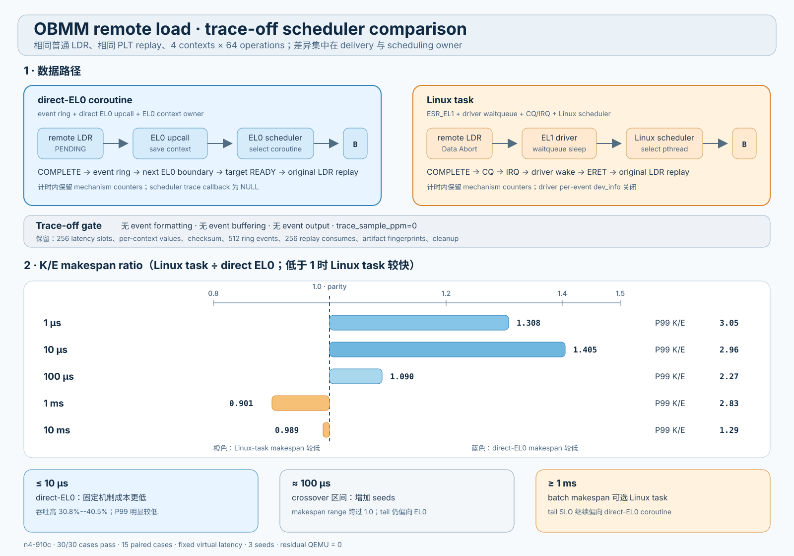

# OBMM remote load：EL0 coroutine 与 Linux task 的 trace-off 对比

> 2026-09-02 适用范围：本文数据绑定 2026-09-01 artifact，早于私有 HLT 删除、
> SVC/WFE 收敛和 Normal Cacheable 实现。数值只描述该历史 QEMU revision；当前
> replay-only revision 需要重新执行 paired matrix。

日期：2026-09-01
执行主机：`n4-910c`
正式 campaign：`scheduler-compare-trace-off-20260901-r5`

## 1. 结论

关闭逐事件日志后，direct-EL0 coroutine 在 1--10 µs 模型延迟区间保持清楚的
吞吐和 makespan 优势；Linux-task 路径在 1 ms 达到较低 makespan；10 ms 时两者
的总完成时间接近。direct-EL0 coroutine 在全部五档延迟上都取得更低的单次 load
P99，Linux-task 的 P99 中位比值为 1.29--3.05 倍。

按本轮 4-context、256-operation、无计算负载结果，可采用以下初始策略：

| 场景 | 初始选择 | 依据 |
|---|---|---|
| remote latency ≤ 10 µs | direct-EL0 coroutine | 吞吐高 30.8%--40.5%，P99 低约 2.0--7.6 倍（逐 seed 范围） |
| remote latency 约 100 µs | 继续采样后决策；tail-sensitive 先选 direct-EL0 | makespan 的逐 seed 比值跨过 1.0；direct-EL0 的配对 P99 仍占优 |
| remote latency 约 1 ms，目标是 batch makespan | Linux task 可优先 | makespan 配对比值中位为 0.901；吞吐高约 8.3% |
| remote latency 约 1 ms，目标是单请求尾延迟 | direct-EL0 coroutine | Linux-task P99 配对比值中位为 2.83 |
| remote latency 约 10 ms | makespan 可视为接近；按编程模型与 tail SLO 选择 | makespan 比值中位为 0.989；Linux-task P99 比值中位为 1.29 |

这里的分界只适用于当前 QEMU/TCG PoC 和当前 workload。真实硬件策略还需要加入
CPU 频率、IRQ batching、runnable task 数、协程数量、计算占比和真实 remote
latency 分布。



## 2. 公平对比边界

两条路径共享以下条件：

| 条件 | 取值 |
|---|---|
| topology | 2-node QEMU；nodeA export/write，nodeB import/load |
| load | 普通 AArch64 8-byte scalar `LDR` |
| retirement | replay；completion 后重新执行原 `LDR`，精确消费一个 PLT entry |
| contexts | 4 个 coroutine 或 4 个 pthread，全部继承同一个 home-vCPU affinity |
| operations | 每个 case 256 次；每个 context 64 次 |
| compute | `compute_us=0` |
| remote latency | 1、10、100、1000、10000 µs |
| remote model | fixed latency、`qemu_virtual` time、无 jitter/tail/drop/error/duplicate |
| seeds | 1、2、3；每个 latency/mode 组合 3 次 |
| execution order | 每个 latency/seed 内交替 mode 顺序，降低固定先后顺序偏差 |
| event logging | application causal log off、EL0 scheduler trace callback 为 `NULL`、driver per-event `dev_info` off、operation trace sampling 为 0 |
| retained evidence | aggregate counters、256 个 latency slot、per-context value、checksum、replay exact-once、artifact SHA-256、QEMU cleanup |

计时区间也保持同一语义：

- direct-EL0 在所有 coroutine 创建完成后、进入 coroutine scheduler 前开始计时，
  scheduler 返回后结束；
- Linux-task 在所有 pthread 到达 start barrier 后开始计时，释放 barrier，全部
  pthread join 后结束；
- 两者都排除 guest boot、OBMM export/import、map registration 和 session setup；
- 两者都包含 load、pending delivery、调度、completion delivery、resume、replay
  和逐 operation latency 采样。

## 3. 两条数据路径

### 3.1 direct-EL0 coroutine

1. 普通 `LDR` 命中 remote mapping，QEMU 建立 PLT entry 并发布 PENDING event。
2. QEMU 在精确 EL0 boundary 把 PC 导向注册的 upcall entry。
3. EL0 assembly 保存 coroutine context，EL0 scheduler 选择另一个 READY
   coroutine，并通过 context-install assist 恢复它。
4. completion 写入 ABI v3 event ring；QEMU 在后续 EL0 boundary 发起 completion
   upcall。
5. EL0 scheduler 将目标 coroutine 置为 READY；目标恢复后重新执行原 `LDR`，
   PLT replay entry 返回值并被消费。

### 3.2 Linux task

1. 普通 `LDR` 命中 remote mapping，QEMU 建立 PLT entry 并发布 PENDING event。
2. QEMU 产生 implementation-defined lower-EL data abort；`ESR_EL1.DFSC=0x3a`。
3. `linqu_ub_drv` 匹配 PENDING，以 waitqueue 阻塞当前 task；Linux scheduler
   选择另一个 runnable pthread。
4. completion 写入同一 ABI v3 ring，dedicated IRQ 进入 driver；driver drain CQ、
   ACK IRQ 并唤醒目标 task。
5. 异常返回保持 faulting PC；目标 task 重新执行原 `LDR`，PLT replay entry
   返回值并被消费。

两者的数据传输、PLT 和 replay 语义相同。差异集中在 pending/completion 的
delivery、上下文 owner 和调度器：一条由 EL0 runtime 负责，另一条由
EL1 driver 与 Linux scheduler 负责。

## 4. 正式结果

下面的 makespan、P50、P95 和 P99 均为三个 seed 的中位数。P50/P95/P99 先在
每个 256-operation case 内计算，再对三个 case 的结果取中位数。`K/E` 表示
Linux-task 数值除以 direct-EL0 数值；makespan 比值低于 1 表示 Linux-task
完成得更快，percentile 比值高于 1 表示 Linux-task 单次 load 延迟更高。

| 模型延迟 | EL0 makespan | Kernel makespan | K/E makespan | EL0 ops/s | Kernel ops/s | K/E P50 | K/E P95 | K/E P99 |
|---:|---:|---:|---:|---:|---:|---:|---:|---:|
| 1 µs | 52.688 ms | 68.919 ms | 1.308 | 4,858.8 | 3,714.5 | 6.34 | 4.27 | 3.05 |
| 10 µs | 51.152 ms | 72.394 ms | 1.405 | 5,004.7 | 3,536.2 | 6.30 | 1.80 | 2.96 |
| 100 µs | 57.006 ms | 61.663 ms | 1.090 | 4,490.8 | 4,151.6 | 3.69 | 0.95 | 2.27 |
| 1 ms | 107.525 ms | 99.291 ms | 0.901 | 2,380.9 | 2,578.3 | 1.17 | 1.31 | 2.83 |
| 10 ms | 685.078 ms | 674.420 ms | 0.989 | 373.7 | 379.6 | 1.02 | 1.06 | 1.29 |

逐 seed makespan 配对范围揭示了 100 µs 的不确定性：

| 模型延迟 | K/E makespan 最小 | 中位 | 最大 | 判断 |
|---:|---:|---:|---:|---|
| 1 µs | 1.275 | 1.308 | 1.323 | direct-EL0 稳定领先 |
| 10 µs | 1.392 | 1.405 | 1.439 | direct-EL0 稳定领先 |
| 100 µs | 0.875 | 1.090 | 1.202 | 三个 seed 跨过 1.0，需要更多重复 |
| 1 ms | 0.892 | 0.901 | 0.942 | Linux-task makespan 稳定较低 |
| 10 ms | 0.955 | 0.989 | 0.991 | makespan 接近，Linux-task 略低 |

### 4.1 如何解读 crossover

1--10 µs 区间主要暴露固定机制成本。direct-EL0 避开同步 EL1 exception、driver
waitqueue、IRQ handler 和 Linux task wakeup，优势最清楚。模型延迟提高后，四个
context 的 remote wait 可以重叠，理论下界逐渐接近
`64 operations/context × remote latency`。10 ms 的理论 remote 部分为 640 ms，
实测 makespan 为 674--685 ms，调度固定成本在总时间中的比例已经很小。

1 ms 档位的 Linux-task makespan 较低，说明当前 TCG、guest Linux 和 CQ/IRQ
组合在 batch completion 上能够维持较好的总体推进。该结果不能推出真实硬件上
Linux task 具有固有吞吐优势；真实 CPU 的 exception、IRQ、context switch 与
EL0 context-install 成本比例会发生变化。

P99 结果保持同一个方向：Linux task 的 exception/IRQ/wakeup 路径带来更宽的尾部。
因此 batch makespan 与单-load tail SLO 会在 1 ms 附近给出不同的选择。

## 5. 正确性与证据审计

正式 R5 的 validator 结果：

| 项目 | 结果 |
|---|---|
| planned/completed | 30/30 |
| paired cases | 15/15 |
| completion | replay |
| per-event application log | off |
| EL0 scheduler trace callback | off |
| 每 case operations/verified | 256/256 |
| replay | 每 case `replay_consumed=256`、`replay_mismatch=0` |
| pair checksum | 全部相同 |
| artifact fingerprint | scenario/QEMU/kernel/initramfs 各只有一个 SHA-256 |
| residual QEMU | 0 |

artifact 指纹：

| artifact | SHA-256 |
|---|---|
| scenario | `dde4d793e72725d1f0c2effc1b777fa07968a48c8f02187118bf113092671009` |
| QEMU | `7e03e9eafdd2d8ef1ab5b84d8cdb6e839790126daba60ef9acf7564ecbc110a3` |
| guest kernel | `b7f0634fa2d31950b560846230ea3234193faecb601b305e09aabc9c11d8e703` |
| initramfs | `5460f991a6489b181d82fb8ade4de44eab40692d75f61bba3cc47cc60a226995` |

R5 第一次执行第 12 个 case 时，guest 已输出 `status=pass`，runner 仍按功能 gate
要求 `scheduler_enter_assists == coroutines`，因此返回失败。trace-off 下 completion
可能在 scheduler 进入空闲等待前到达，这个计数没有固定值。修订后，功能 gate
在日志开启时继续检查精确 causal timing；性能 gate 使用 aggregate event、value、
replay 和 cleanup 证据。原 runner 失败日志保存为：

```text
logs/alc-d09417-l10-c4-o256-s3-el0.attempt-1.log
```

comparison CLI 的 `--resume` 会解析已有 canonical log；无完整 summary/evidence 的
日志先改名为 `attempt-N.log`，随后重跑对应 case。R5 最终 canonical 数据只包含
30 个通过的 case，attempt 日志不会进入聚合。

## 6. 实现与命令行

主要实现位置：

| 文件 | 作用 |
|---|---|
| `guest-linux/aarch64/apps/obmm_async_coroutine/obmm_async_coroutine.c` | 多 operation direct-EL0/pthread workload、trace-off、精确 latency slot、统计与 summary |
| `guest-linux/aarch64/driver/linqu_ub_drv.c` | `remote_load_event_log` module parameter，关闭 kernel per-event `dev_info` |
| `guest-linux/aarch64/scripts/run_ub_obmm_eval.sh` | event-log CLI、功能/性能两类 gate、aggregate evidence |
| `guest-linux/aarch64/scripts/run_ub_async_load_scheduler_compare.py` | paired matrix、交替顺序、safe resume、artifact/checksum 校验、CSV/JSON 聚合 |
| `guest-linux/aarch64/tests/test_obmm_async_load_coroutine_contract.py` | trace-off、pair expansion、artifact drift 和 attempt-preservation 契约测试 |
| `vendor/qemu_8.2.0_ub/target/arm/tcg/helper-a64.c` | kernel-task replay 时按 `TPIDR_EL0` 选择既有 logical context |

正式命令：

```text
python3 guest-linux/aarch64/scripts/run_ub_async_load_scheduler_compare.py \
  --scenario-config scenarios/mvp_2host_async_load_remote_10ms.yaml \
  --base-model-manifest \
    out/kernel-task-replay-poc/model/remote_memory_model_manifest_v1.json \
  --output-dir \
    out/obmm-remote-load/scheduler-compare-trace-off-20260901-r5 \
  --latencies-us 1,10,100,1000,10000 \
  --seeds 1,2,3 \
  --contexts 4 \
  --operations 256 \
  --timeout-sec 300
```

远端证据目录：

```text
n4-910c:/home/ll/ub_sim_kernel_task_20260901/out/obmm-remote-load/
  scheduler-compare-trace-off-20260901-r5/
```

关键文件为 `validation.json`、`results.json`、`results.csv`、`pairs.csv`、
`aggregate.csv`、`pair-aggregate.csv`、`run-manifest.json` 和 `logs/`。

## 7. 限制与下一轮矩阵

本轮能够回答当前 PoC 的初始 mode policy，仍有以下边界：

- QEMU/TCG 时间不能直接换算为 Arm silicon latency；
- 每个点只有三个 seed，100 µs 已显示需要更多重复；
- workload 固定为 4 contexts、8-byte load、零 compute、每 context 单一 remote
  address；
- 所有 context 固定在一个 home vCPU，尚未测试多核 task migration；
- remote model 没有 jitter、tail、drop 和 error；
- 没有测试 IRQ batching/coalescing 和不同 runnable-task 数；
- percentile 来自每 case 256 个样本，P99 的统计稳定性有限。

下一轮应优先扩展 100 µs--2 ms crossover 区间，至少运行 15 个 seed，并扫描
contexts=2/4/8/16、compute_us=0/10/100、IRQ batch=1/4/16。运行时策略应以
`latency estimate + runnable contexts + tail SLO + programming model` 为输入，支持
direct-EL0 coroutine 与 Linux-task session 在控制面上并存，并在新 session 启动时
选择一种 delivery/scheduling mode。
