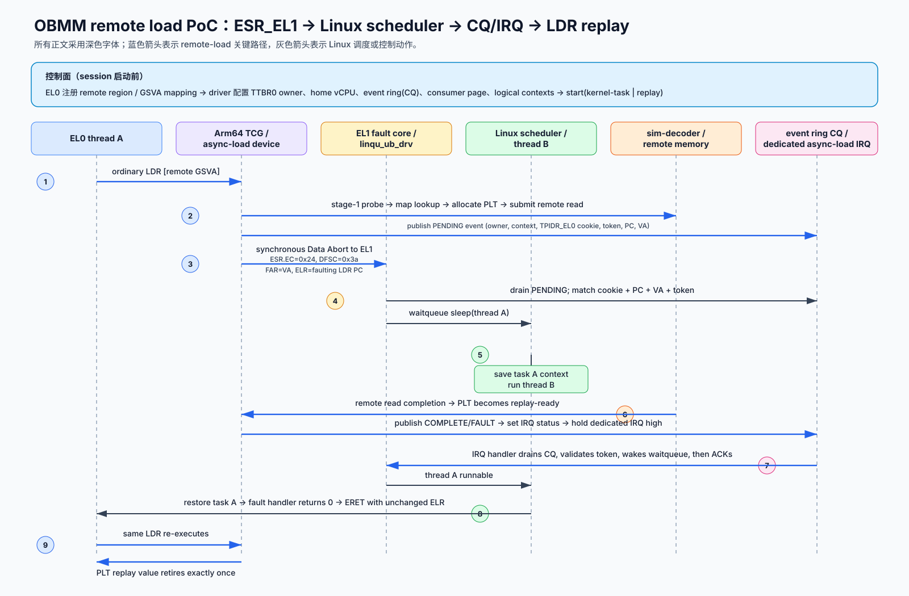

# OBMM async load：ESR_EL1 + Linux task + CQ/IRQ PoC

初始日期：2026-09-01

现行修订：2026-09-02

状态：Normal NC 与 Normal Cacheable 的 two-node Linux-task success path 均已通过

## 1. 结论

Linux-task mode 让 EL0 pthread 使用普通 `LDR` 访问 remote mapping。requester UBC
接受 remote request 后立即发布 PENDING，CPU 以 implementation-defined lower-EL
Data Abort 进入 EL1。driver 把当前 task 放入 waitqueue，Linux scheduler 运行其他
runnable task。remote completion 先进入普通 cache fill 或 NC PLT，再发布 CQE 和
raise IRQ；driver drain CQ、唤醒目标 task，fault handler 返回，标准 `ERET` 回到原
PC，原 `LDR` replay。

这条路径保留 remote-region 注册控制面，并让 Linux scheduler 负责 task context
save/switch/restore。EL0 coroutine trampoline、direct EL0 upcall 和 coroutine context
image不进入该 mode 的数据路径。



## 2. Memory-type 分流

| 项目 | Normal Cacheable | Normal NC |
|---|---|---|
| outstanding state | 普通 cache/MSHR/fill | requester UBC NC PLT |
| remote payload | 64-byte line | 1/2/4/8-byte scalar |
| completion 前置条件 | line fill 对 replay 可见 | NC PLT entry 为 `REPLAY_READY` |
| CQ identity | `wait_key` | NC replay token |
| resume 前 command | 无 | arm one-shot replay token |
| replay result | 普通 cache lookup | NC PLT exact-once consume |
| NC PLT allocation | 0 | 每条 outstanding dynamic load 一项 |

两条路径都保留 `ELR_EL1`，都不 patch saved `Rt`，也不将 saved PC 前移。

## 3. ESR_EL1 与 exception contract

| 字段 | PoC 取值 | 含义 |
|---|---:|---|
| `ESR_EL1.EC` | `0x24` | Data Abort from lower EL |
| `ESR_EL1.ISS.DFSC` | `0x3a` | UB remote load pending，implementation-defined |
| `FAR_EL1` | remote effective VA | fault/event 会合键的一部分 |
| `ELR_EL1` | faulting `LDR` PC | task 唤醒后 replay 同一条指令 |

`DFSC=0x3a` 由本项目的 QEMU 与 guest kernel 共同定义。未扩展的 Arm64 CPU 不会
自行产生该 reason。

PENDING 固定在 remote submit 前发布：

```text
state reserved
  -> PENDING visible
  -> remote request submitted
  -> Data Abort raised
```

fault handler 先 drain PENDING，再建立 waiter。remote submit 失败时发布 terminal
FAULT，并沿错误路径结束 waiter。

## 4. ABI 与 capability

当前 control ABI 为 4，event ring ABI 为 3。关键 capability/flag：

| 名称 | 用途 |
|---|---|
| `OBMM_ASYNC_LOAD_CAP_KERNEL_TASK_REPLAY` | Linux-task replay |
| `OBMM_ASYNC_LOAD_CAP_REPLAY_RETIRE` | success completion 从原 PC replay |
| `OBMM_ASYNC_LOAD_CAP_NC_REPLAY_TOKEN` | Normal NC one-shot token |
| `OBMM_ASYNC_LOAD_CAP_CACHEABLE_FILL_REPLAY` | Normal Cacheable fill/replay |
| `OBMM_ASYNC_LOAD_START_KERNEL_TASK` | session 选择 Linux-task delivery |
| `OBMM_ASYNC_LOAD_START_REPLAY_RETIRE` | 强制 replay retirement |
| `OBMM_ASYNC_LOAD_EVENT_CACHEABLE_FILL` | event 标记 Cacheable fill path |

kernel-task flag 必须与 replay flag 同时设置，`upcall_entry` 必须为 0。一个 session
只使用一种 delivery/scheduler mode。

观测 ioctl：

- `GET_KERNEL_TASK_STATS`：fault、PENDING、completion、sleep/wakeup 与 error；
- `GET_REPLAY_STATS`：NC replay consume/mismatch；
- `GET_PATH_STATS`：NC PLT allocation/current 与 Cacheable fill/hit/bytes。

## 5. CQ、IRQ 与 waiter 生命周期

PoC 复用 ABI v3 event ring 作为 completion queue：

- producer header 发布 `producer_sequence`；
- driver 维护 `consumer_sequence`；
- PENDING、COMPLETE、FAULT 使用 128-byte descriptor；
- dedicated async-load IRQ 通知 driver；
- driver drain CQ 后 ACK；仍有 event 时 IRQ 保持可观察。

`current task -> wait_key` 生命周期如下：

1. driver 接收 Data Abort，读取 current task 与 `TPIDR_EL0` thread cookie；
2. driver drain PENDING，校验 owner/session、fault PC、VA 与 cookie；
3. driver 分配 waiter，记录 task reference、waitqueue、deadline、path 与 `wait_key`；
4. task 进入 `wait_event_killable_timeout()`；
5. completion IRQ drain CQ；
6. driver 用 `wait_key` 找到 waiter，再校验 terminal event identity；
7. driver 记录 terminal status，执行 `wake_up()`；
8. task 重新 runnable；
9. fault handler 观察 terminal state；
10. Cacheable success 直接返回，Normal NC success 先 arm replay token；
11. waiter 从 driver table 删除，task reference 释放；
12. Normal NC 的 NC PLT entry 保留到原 `LDR` 消费 token。

`wait_key` 不保存 architectural value、cache line、task registers 或 scheduler policy。

## 6. Linux scheduler 数据路径

### 6.1 PENDING

1. pthread A 执行 eligible `LDR`；
2. QEMU/UBC 发布 PENDING 并提交 remote request；
3. CPU 产生 FSC `0x3a`；
4. driver fast path 完成 PENDING/fault 会合；
5. A 进入 waitqueue；
6. Linux scheduler 运行 pthread B。

### 6.2 Completion

1. remote payload 到达 requester UBC；
2. Cacheable line fill 可见，或 NC PLT entry 进入 `REPLAY_READY`；
3. CQE 发布；
4. IRQ 进入 driver；
5. driver drain/validate/ack CQ；
6. target waiter wakeup；
7. target task 被 Linux scheduler 选中；
8. Normal NC arm token，Cacheable 跳过该步骤；
9. fault handler 返回；
10. `ERET` 回到 `ELR_EL1`；
11. 原 `LDR` replay 并取得 result。

## 7. Concurrency 与身份

当前约束：

- 一个 async-load device 同时一个 active session；
- session 绑定一个 TTBR0 owner 和一个 home vCPU；
- consumer pthread 继承单 CPU affinity；
- logical context 上限 64；
- Normal NC PLT 上限 64；
- session 内 `TPIDR_EL0` 必须稳定且唯一；
- owner generation 隔离 stale event。

`TPIDR_EL0` 适合 PoC 中的 pthread identity。产品化接口需要受保护的 task/context
registration tag，以支持多 runtime、多语言和 task migration。

## 8. 错误语义

| condition | action |
|---|---|
| 无 active kernel-task session | fault handler 返回错误，EL0 收到 `SIGBUS/BUS_OBJERR` |
| owner/TGID 不匹配 | 拒绝 fault |
| ring sequence、cookie、PC、VA 或 generation 不匹配 | `protocol_errors++`，fail closed |
| remote terminal status 非 SUCCESS | 唤醒 task，fault handler 返回错误，EL0 收到 `SIGBUS` |
| deadline timeout | `timeouts++`，返回 `-ETIMEDOUT` |
| signal 中断 wait | `interrupted_waits++`，进入 cleanup/cancel path |
| NC replay key 不匹配 | `replay_mismatch++`，session fail-stop |
| Cacheable fill 缺失 | 禁止发布 success CQE；进入 terminal fault |

完整 cancel/orphan/late-response two-node matrix 尚未完成。

## 9. CLI 与 acceptance

关键参数：

```text
--mode async-load
--kernel-task-replay
--async-load-memory normal-nc|normal-cacheable
--threads 2
--iterations 2
--access-bytes 8
--verify
```

runner 建立 nodeA producer 与 nodeB consumer。每个 pthread 访问不同 offset，最终值
必须逐项等于 producer 写入值。

共同 gate：

- `faults == pending == completions == sleeps == wakeups == operations`；
- `protocol_errors == timeouts == interrupted_waits == 0`；
- `direct_el0_upcalls == 0`；
- producer/consumer value 全部匹配；
- PENDING 早于 remote submit；
- completion data placement 早于 CQE；
- artifact fingerprint 唯一；
- run 结束后 residual QEMU 为 0。

Cacheable 额外要求：

- `cacheable_fill_pending == cacheable_fill_completed == operations`；
- `cacheable_fill_bytes == operations * 64`；
- `cacheable_replay_hits >= operations`；
- `nc_plt_allocations == nc_plt_pending == 0`；
- `nc_replay_consumed == 0`。

Normal NC 额外要求：

- `nc_plt_allocations == operations`；
- `nc_replay_consumed == operations`；
- `replay_mismatch == nc_plt_pending == 0`；
- Cacheable fill counters 全为 0。

## 10. 2026-09-02 验证结果

### 10.1 Normal NC

主机与 workspace：
`n4-910c1:/home/ll/ub_sim_nc_replay_20260902`。

campaign：`normal-nc-replay-kernel-task-20260902-r2`。

| evidence | result |
|---|---:|
| producer writes / verified values | 2 / 2 |
| fault / PENDING / completion / sleep / wake | 2 / 2 / 2 / 2 / 2 |
| NC PLT allocation / replay consume | 2 / 2 |
| replay mismatch / final NC PLT pending | 0 / 0 |
| protocol error / timeout / interrupted wait | 0 / 0 / 0 |
| residual QEMU | 0 |
| status | pass |

### 10.2 Normal Cacheable

主机与 workspace：
`n4-910c1:/home/ll/ub_sim_normal_cacheable_20260902_r1`。

campaign：`cacheable-esr-cq-20260902-r4`。

| evidence | result |
|---|---:|
| producer writes / verified values | 2 / 2 |
| FSC `0x3a` / PENDING / block / completion / wake | 2 / 2 / 2 / 2 / 2 |
| 64-byte fill pending / completed / bytes | 2 / 2 / 128 |
| `resume=eret-replay` | 2 |
| NC PLT allocation / pending | 0 / 0 |
| NC replay consume / mismatch | 0 / 0 |
| protocol error / timeout / interrupted wait | 0 / 0 / 0 |
| residual QEMU | 0 |
| status | pass |

artifact 和失败尝试审计见
[Normal Cacheable validation](2026-09-02-normal-cacheable-void-response-esr-cq-validation-design.md)。

### 10.3 Shared-future regression

Cacheable implementation 将 transport future 抽成两种 kind。随后执行
`nc-future-reg-20260902-r2`：2 个值正确、2 个 NC PLT allocation、2 个 replay
consume、Cacheable fill counter 全为 0，status=pass。该结果证明 shared future
refactor 没有把 Normal NC result 错送到 Cacheable fill path。

## 11. 历史证据与性能边界

2026-09-01 的 `kernel-task-replay-poc-20260901-r8` 首次完成 Linux-task
FSC/CQ/IRQ/replay PoC，并修复 waitqueue wake mask。该 revision 早于 NC PLT 明确命名、
SVC/WFE 收敛和 Cacheable path，实现证据保留为历史里程碑。

同日 30-case trace-off matrix 显示当时 direct-EL0 与 Linux-task 的 QEMU crossover。
该数据也早于当前 revision，不能代表 SVC/WFE 或 Cacheable path。当前架构的正式性能
比较需要新 artifact 重跑。

## 12. 当前限制与后续方向

| limit | impact | next step |
|---|---|---|
| QEMU-specific FSC | 未扩展 CPU 无法运行 | 冻结 architecture syndrome/ISS2 contract |
| `TPIDR_EL0` cookie | 可由 EL0 修改 | 受保护 context registration tag |
| 单 home vCPU | 无 task migration | per-CPU CQ/IRQ 与 migration handshake |
| event ring 兼作 CQ | batching/moderation 简化 | phase/owner、coalescing、backpressure |
| 单 provider fault hook | 多设备分派受限 | FAR range/device owner registry |
| scalar load subset | vector/store/atomic 未覆盖 | 白名单与 fail-closed tests |
| Cacheable functional surrogate | 无真实 timing | cache/MSHR/coherence timing model 或 RTL |
| failure lifecycle | real guest matrix 不完整 | timeout/cancel/late/duplicate acceptance |
