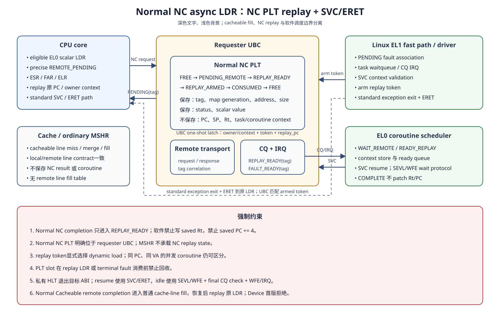

# Normal Non-cacheable async `LDR` replay 与 NC PLT 设计

日期：2026-09-02

状态：Normal NC replay-only 已完成 QEMU、Linux driver、EL0 runtime 与 two-node
arm64 guest 端到端验证；Normal Cacheable fill/replay 已在同日完成独立 two-node
功能验收

## 1. 结论

Normal Non-cacheable remote mapping 的透明异步 `LDR` 默认且仅采用 replay
retirement。completion 后保留原 PC，原 `LDR` 重新执行，并从 requester UBC
中的 Normal Non-cacheable Pending Load Table（NC PLT）取得第一次远端访问的
结果。replay 不再发起第二次远端 read。

设计边界如下：

| memory type | remote completion 返回后的处理 | 原 `LDR` 的完成方式 | result retention |
|---|---|---|---|
| Normal Cacheable | 完整 line 进入普通 fill/coherence pipeline | 从原 PC replay，通常命中已填充的 cache line | 普通 cache hierarchy |
| Normal Non-cacheable | scalar result 与 status 进入 NC PLT | 从原 PC replay，one-shot token 精确消费 NC PLT | requester UBC NC PLT |
| Device | 透明异步首版拒绝 | 同步访问或显式异步接口 | 由所选接口定义 |

Normal NC 不支持 patch retirement。EL0 runtime 和 Linux driver 均不得把 CQE
value 写入 saved `Rt`，也不得将 saved PC 前移四字节。

“Normal Cacheable 继续走普通 fill/replay”专门描述 remote completion 返回后的
result placement 与 retirement 行为。该映射仍可在 remote line miss 未完成期间产生
PENDING，并允许 software 调度另一条 task/coroutine。completion 返回完整 cache line，
普通 MSHR/cache fill 机制安装 line；原 execution context 恢复后从原 PC 重放 `LDR`。


本文的主要验收对象是 `O_SYNC` Normal NC mapping。Normal Cacheable 已通过
QEMU 功能 fill surrogate 验证：PENDING、FSC `0x3a`、Linux task sleep、64-byte
remote line fill、CQ/IRQ wakeup、`ERET` 和原 `LDR` replay 均已闭环，同时
`nc_plt_allocations=0`。QEMU 仍缺真实 cache、MSHR 与 coherence timing；因此
Cacheable 实跑只形成 success-path 功能结论。详细证据见
[Normal Cacheable void response、ESR 与 CQ/IRQ 验证](2026-09-02-normal-cacheable-void-response-esr-cq-validation-design.md)。

## 2. 硬件组件边界



### 2.1 CPU core

CPU core 负责：

- 识别受支持的 EL0 scalar `LDR`；
- 在 UBC 接收远端请求后产生精确 `REMOTE_PENDING`；
- 保存标准异常 PC、VA、PSTATE 和 syndrome；
- resume 后从原 PC 重新发出 eligible `LDR`；
- 把 owner/context 与 fault PC 作为 requester UBC replay lookup 的输入。

CPU core 不维护 per-outstanding-load table 或 replay-token latch。

### 2.2 Cache 与 MSHR

普通 cache 和 MSHR 只处理 cacheable line miss、merge、coherence 与 fill。
local/remote cacheable line 采用相同的 cache-line contract。

MSHR 禁止保存：

- Normal NC result；
- replay-ready 状态；
- task/coroutine ID；
- PC、SP、`Rt`；
- saved context；
- scheduler 状态。

### 2.3 Requester UBC 与 NC PLT

Requester UBC 持有明确命名的 NC PLT 和 one-shot replay-arm latch。每个 PLT entry
只服务一条尚未被 replay 消费的 Normal NC dynamic load。replay-arm latch 保存
`{owner/context, token, replay_pc}`，只覆盖 resume 到下一次 eligible `LDR` 的短窗口。
精确消费或 mismatch 后 latch 自动清除。

最小 entry 为：

```c
struct nc_plt_entry {
    uint32_t slot_generation;
    uint16_t owner_id;
    uint8_t state;
    uint8_t access_bytes;
    uint32_t session_generation;
    uint32_t mapping_handle;
    uint32_t mapping_generation;
    uint32_t status;
    uint64_t remote_offset;
    uint64_t value;
};
```

entry 不保存 coroutine context、task、SP、`Rt` 或 ready queue。显式 replay
token 负责选择 dynamic load；address、size、mapping generation 负责防止错误消费。

### 2.4 CQ 与 IRQ

Normal NC replay 的 CQE 只发布 readiness 与 terminal status：

```c
struct nc_replay_ready_cqe {
    uint64_t replay_token;
    uint32_t session_generation;
    uint32_t mapping_generation;
    uint32_t status;
    uint32_t flags;
};
```

architectural value 保留在 NC PLT。CQ consumer 不读取或 patch scalar value。

发布顺序固定为 `PLT.value/status visible`、`PLT.state = REPLAY_READY`、
`CQE visible`、`producer sequence visible`、`IRQ/event`。每一步都必须满足下一步
观察者所需的 release/acquire ordering。

### 2.5 Linux driver 与 EL0 coroutine scheduler

软件负责：

- `replay_token -> task/coroutine` 会合；
- 保存 task/coroutine context；
- WAIT_REMOTE、READY_REPLAY、FAULTED 状态；
- 选择下一条可运行 execution context；
- resume 前通过 SVC 请求安装 context 与 replay token。

## 3. NC PLT 状态机

成功路径的目标状态依次为 `FREE`、`RESERVED`、`PENDING_REMOTE`、
`REPLAY_READY`、`REPLAY_ARMED`、`CONSUMED`、`FREE`。组件图中的 NC PLT 区域
给出了这一主路径。

当前 PoC 在 request submit 中合并 `RESERVED` 与 `PENDING_REMOTE`，在精确 replay
消费后直接回到 `FREE`。terminal remote fault 发布 FAULT CQE 后回收 entry，EL0
runtime 将目标 coroutine 标记为 `FAULTED`；kernel-task fault handler 返回错误并由
Linux 生成 `SIGBUS/BUS_OBJERR`。fault-at-original-LDR replay 与完整
`CANCEL_REQUESTED/ORPHANED` 状态属于后续 silicon-accurate 收敛项。

PLT allocation 必须发生在 remote request submission 之前。capacity 不足采用
backpressure 或同步 capacity wait；不得先发送请求再寻找 result slot。

## 4. Replay token

token 使用现有 slot/generation 思路：`replay_token = owner/session identity + slot +
slot generation`。

系统必须保证：

- live token 唯一；
- terminal response 到达前禁止 slot reuse；
- replay `LDR` 消费前禁止 slot reuse；
- cancel 后等待 response quiesce 或 cancel ACK；
- session reset 增加 generation；
- replay lookup 验证 owner、mapping、address 与 size。

## 5. PENDING delivery

silicon contract 使用精确 lower-EL Data Abort。`ESR_EL1.DFSC` 记录
`REMOTE_PENDING`，`ESR_EL1.ISS` 记录 scalar load size、SRT 与 access attributes，
`FAR_EL1` 记录 effective VA，`ELR_EL1` 记录 faulting `LDR` PC。

replay token 可以通过 implementation-defined ISS2 或有序 PENDING CQE 交付。
QEMU PoC 当前使用 PENDING event ring 的 token，并用 `context cookie + PC + VA`
完成 fault/event 会合。ISS2 建模属于后续 silicon-accurate 收敛项，不影响 replay
retirement contract。

## 6. Resume ABI

### 6.1 已删除的私有 HLT ABI

以下 QEMU 私有 HLT 从目标 ABI 删除：

- `HLT #0x5343` context resume；
- `HLT #0x5344` idle wait；
- `HLT #0x5345` scheduler enter。

### 6.2 SVC context resume

EL0 scheduler 使用私有 SVC immediate 进入 arm64 fast path。`x0` 指向 validated
context image，`x1` 携带 replay token，普通 ready context 使用零 token；随后执行
`SVC #ASYNC_LOAD_RESUME`。

kernel fast path 调用注册的 driver callback。driver：

1. 验证 active owner/session；
2. 从 EL0 copy context；
3. 验证 context ID、SP、PC、reserved fields；
4. 使用 MMIO command 请求 UBC arm replay token；
5. 将目标 GPR、SP、PC、NZCV 安装到当前 `pt_regs`；
6. 返回标准 arm64 exception exit；
7. 标准 `ERET` 返回目标 coroutine。

EL0 assembly 在 SVC 前恢复 Q registers、FPCR、FPSR 与 TPIDR_EL0。SVC handler
负责 GPR、SP、PC、PSTATE 与 token 的原子生效边界。

### 6.3 Idle wait

EL0 scheduler 没有 READY coroutine 时执行标准 `WFE`。UBC completion 发布 CQE
后 raise IRQ；Linux IRQ handler ACK 后返回 EL0；scheduler 使用 acquire ordering drain
event ring。

等待协议必须关闭“最后一次 CQ-empty 检查”和真正进入 `WFE` 之间的 lost-wakeup
窗口。EL0 scheduler 先执行 `SEVL; WFE` 清理本地 event register，随后重新 drain
event ring。CQ 仍为空且仍有 WAIT_REMOTE coroutine 时，scheduler 才执行第二次
`WFE`。completion 与上述任一边界并发时，CQE 或 event register 至少保留一个可观察
依据。

### 6.4 Scheduler enter

coroutine 正常退出后，scheduler 使用私有 SVC fast path 通知 device：当前处于
scheduler context，随后 drain event ring 并选择下一条 coroutine。该 SVC 不安装
用户 context。

## 7. Coroutine 状态

`waiting_token` 拆分为 pending wait 与 replay ownership：

```c
struct coroutine_remote_state {
    uint64_t waiting_token;
    uint64_t replay_token;
};
```

状态依次从 `RUNNING` 进入 `WAIT_REMOTE(waiting_token)`，completion 后进入
`READY_REPLAY(replay_token)`，被选中后进入
`RUNNING_REPLAY_ARMED(replay_token)`，原 `LDR` 消费 token 后回到 `RUNNING`。

COMPLETE event 只执行：

- 校验 token；
- `waiting_token = 0`；
- `replay_token = event token`；
- state 变为 READY_REPLAY。

禁止写 saved `Rt`，禁止执行 `saved_pc += 4`。

## 8. Linux task replay

Linux task fault handler 继续在 EL1 中等待。driver 将 `REMOTE_PENDING` 与 PENDING
event 会合后进入 waitqueue；completion IRQ 唤醒原 task；driver arm replay token，
fault handler 返回，标准 exception exit 通过 `ERET` 回到原 `LDR`，NC PLT 提供
保存的 result。

signal、timeout 与 process exit 使用 ORPHANED/cancel 生命周期。driver 在 late
completion 被隔离前不得复用 wait slot 或 replay token。

## 9. Supported instruction subset

首版透明 async `LDR` 只支持：

- EL0 unsigned scalar load；
- 1、2、4、8 bytes；
- unsigned-offset 或 register-offset 形式；
- 无 writeback；
- `Rt` 为 XZR 时允许正常丢弃结果；
- Normal Non-cacheable remote mapping。

首版拒绝：

- signed load；
- pair load；
- SIMD/FP load；
- exclusive、atomic、acquire load；
- pre/post-index writeback；
- Device memory。

## 10. Fail-stop 与 capacity

以下情况进入 owner/session fail-stop：

- replay token 命中错误 owner；
- token generation 不匹配；
- replay PC、address、size 或 mapping generation 不匹配；
- duplicate replay consume；
- event/CQ sequence corruption；
- scheduler 请求安装尚未 REPLAY_READY 的 token。

PLT 满属于正常 backpressure，不进入 fail-stop。必须提供：

- per-owner quota；
- per-PE reservation；
- pending/replay-ready high-water；
- capacity stall counter；
- cancel/orphan counter。

## 11. QEMU 迁移步骤

1. 强制 session 使用 replay retirement，删除 patch CLI 与 patch context update。
2. 增加 token-directed replay consume，停止按 context 扫描 PLT。
3. 增加 replay-arm MMIO registers/command。
4. kernel-task fault handler 在 ERET 前 arm token。
5. 增加 arm64 private SVC fast-path hook。
6. EL0 context resume 改为 SVC，idle wait 改为 WFE。
7. scheduler-enter 改为 SVC。
8. 删除 QEMU HLT intercept 与 HLT capabilities。
9. completion event 在 replay 模式下不导出 scalar value。
10. 将 QEMU model 和文档明确命名为 NC PLT。

## 12. 验证结果

### 12.1 已通过

2026-09-02 在 `n4-910c1` 的隔离工作目录
`/home/ll/ub_sim_nc_replay_20260902` 完成以下验证。QEMU、kernel、initramfs、driver
和 model manifest 的指纹在 two-node 运行期间保持一致。

| 验证层 | 命令或 campaign | 结果 |
|---|---|---|
| QEMU NC PLT unit | `test-ub-async-load` | 10/10 pass |
| QEMU remote model unit | `test-ub-obmm-remote`、`test-ub-obmm-remote-model` | 6/6、7/7 pass |
| QEMU build | `build_qemu_binary.sh --with-obmm-tests` | pass |
| guest kernel/driver/initramfs | `build_guest_artifacts.sh` | pass |
| async-load contract | `python3 -m unittest guest-linux/aarch64/tests/test_obmm_async_load_coroutine_contract.py` | 15/15 pass |
| EL0 coroutine two-node | `normal-nc-replay-el0-20260902-r5` | 2 coroutines、2 operations、2 values verified、2 replay consumed、0 mismatch，status=pass |
| Linux task two-node | `normal-nc-replay-kernel-task-20260902-r2` | 2 threads、2 operations、2 values verified、2 replay consumed、0 mismatch，status=pass |
| Rust workspace | `cargo test --workspace --quiet` | pass；`sim-uapi` 重型组 159 passed、9 ignored |
| Python contract suite | `python3 -m unittest discover guest-linux/aarch64/tests` | 389/389 pass |
| Rust format | `cargo fmt --all -- --check` | pass |
| post-run cleanup | `pgrep -a -x qemu-system-aar` | 无残留 QEMU；Linux `comm` 名称为 15-byte 截断值 |

EL0 campaign 的关键结果：

- control ABI 4、event ring ABI 3；
- delivery 为 EL0 ring，idle wait 为 WFE + completion IRQ；
- 2 次 PENDING、2 次 COMPLETE、2 次 direct EL0 upcall；
- 2 次 context save、4 次 context restore、3 次 context switch；
- 2 次 replay consume，`replay_mismatch=0`，`replay_ready_high_water=2`；
- idle wait 使用 `SEVL; WFE`、final CQ drain、`WFE` 协议关闭 lost-wakeup 窗口；
- COMPLETE CQE 不携带 scalar result，最终校验值由 replay `LDR` 获取；
- p50 load latency 17,485,120 ns，max 18,503,952 ns，makespan 55,993,856 ns。

Linux-task campaign 的关键结果：

- delivery 为 CQ + IRQ，调度主体为 Linux task scheduler；
- 2 次 remote fault、2 次 PENDING、2 次 completion、2 次 sleep/wakeup；
- 2 次 replay consume，0 protocol error、0 timeout、0 mismatch；
- p50 load latency 14,897,088 ns，max 17,257,856 ns，makespan 26,034,400 ns。

上述 latency 来自开启逐事件日志的 2-operation 功能 campaign，只用于确认运行证据与
大致量级。它不构成 EL0 coroutine 与 Linux task 的正式性能比较。

证据目录：

- EL0：`guest-linux/aarch64/logs/normal-nc-replay-el0-20260902-r5_headless8/`；
- Linux task：`guest-linux/aarch64/logs/normal-nc-replay-kernel-task-20260902-r2_headless8/`；
- model manifest：`out/nc-replay-svc-eret/model/remote_memory_model_manifest_v1.json`。

artifact SHA-256：

| artifact | SHA-256 |
|---|---|
| QEMU | `d6f4b7fb0625561654d3f6ac51ac9b6f050e2a593ccfe49ee3527e6878a2ceab` |
| kernel `Image` | `08bea2cc11fa11a4ed2a85d91c20c72a182f706e148fca33cd61e9f2da35fea0` |
| initramfs | `86d6b6cf7dac645883cafe70a29084ca676e3577ea43e905e4ae2561ecf49c88` |
| `linqu_ub_drv.ko` | `cf9a90008060361ebbf532a9f7283ee2568a806217624640250291a07190d5f3` |
| remote model manifest | `22906130f5e65f4b9956697c1d6d21393477d6c5f1fe5931e2ad6eb5a7fcdcd1` |
| scenario | `dde4d793e72725d1f0c2effc1b777fa07968a48c8f02187118bf113092671009` |

同日的 shared-future 后续 revision 又执行了两条 path-separation acceptance：

| campaign | 关键结果 |
|---|---|
| `cacheable-esr-cq-20260902-r4` | 2 个 64-byte fill、2 个 FSC `0x3a`、2 个 ERET replay、`nc_plt_allocations=0`，pass |
| `nc-future-reg-20260902-r2` | 2 个 NC PLT allocation、2 个 replay consume、Cacheable fill counters 为 0，pass |

这两条运行使用后续 artifact，指纹和完整日志在 Cacheable 验证文档中单独记录；
证据聚合没有跨 revision 混用。

### 12.2 尚未形成实跑结论的范围

- Normal Cacheable 的 timing-accurate cache/MSHR/coherence hierarchy 与 RTL 行为；
- Normal Cacheable 的 EL0-coroutine delivery；
- Device memory 的透明 async `LDR`；
- fault-at-original-`LDR` replay 与完整 `CANCEL_REQUESTED/ORPHANED` 生命周期；
- timeout、cancel、late completion 的 two-node failure matrix；
- 关闭逐事件日志后的正式性能 campaign。

现有 QEMU unit tests 已覆盖 terminal fault、stale completion、capacity 和 replay
identity mismatch。这些测试无法替代上述 two-node failure matrix 与真实 Cacheable
hierarchy 验证。

## 13. Acceptance contract

目标验收集合：

- NC PLT unit test：allocation、completion、token replay、mismatch、stale、capacity；
- QEMU translation contract：三个私有 HLT 不再被 async-load 拦截；
- kernel contract：SVC fast path 只处理注册的 immediate；
- driver contract：Normal NC start 强制 replay；
- EL0 runtime contract：COMPLETE 不 patch `Rt/PC`；
- two-coroutine remote NC replay：两个 coroutine 获取 exporter 修改后的值；
- kernel-task remote NC replay；
- timeout、cancel、late completion 与 token reuse；
- 无残留 QEMU；
- trace-off replay data-path log 与指标一致。

第 12.1 节已经覆盖 Normal NC replay-only 成功路径、workspace regression 与 cleanup。
Normal Cacheable success path 的独立功能验收已经完成；第 12.2 节列出的 failure
matrix、trace-off performance、Cacheable EL0-coroutine mode 和 timing-accurate
hierarchy 仍需单独完成，禁止从当前功能日志推导其性能或 RTL 结论。

完整 QEMU、guest kernel、two-node 和性能验证在 arm64 remote host 执行。local
development machine 只运行静态检查与 lightweight unit/contract tests。
