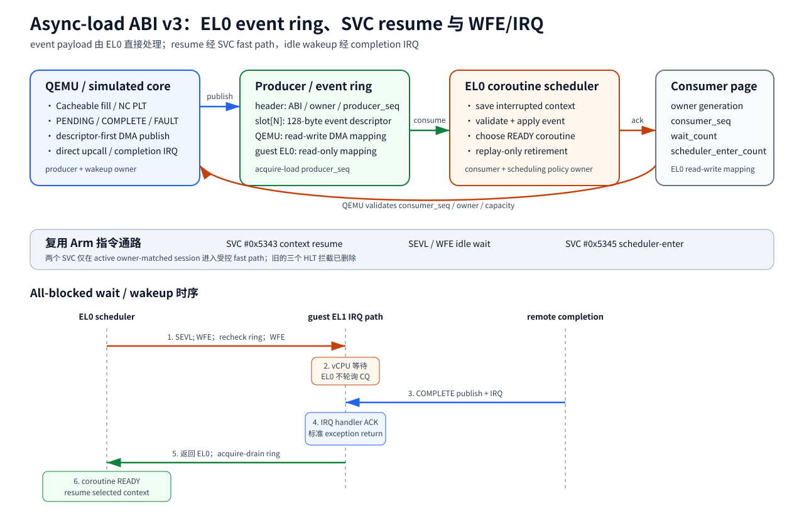

# Async-load ABI v3 EL0 event ring 与 SVC/WFE 设计

初始日期：2026-08-31

现行修订：2026-09-02

状态：event ABI v3 已实跑；control ABI 已升级为 v4；当前仅支持 replay retirement；
私有 HLT assist 已删除

## 1. 目标与边界

ABI v3 解决 event payload 直达 EL0 的问题：

- QEMU/计算单元发布 `PENDING`、`COMPLETE`、`FAULT` event；
- EL0 coroutine scheduler 直接读取 descriptor；
- EL0 直接确认 consumer progress；
- event hot path 不调用 `GET_EVENT`、`poll`、futex 或 signal；
- coroutine state、ready queue 和选择 policy 全部由 EL0 runtime 持有。

2026-09-02 的架构收敛删除了三个 simulator-private HLT。当前复用 Arm 指令通路：

- context resume：`SVC #0x5343`，guest kernel/driver fast path 安装目标 context；
- all-blocked wait：`SEVL; WFE` + completion IRQ；
- scheduler enter：`SVC #0x5345`。

因此，“kernel-free”精确覆盖 event descriptor 的读取、校验、ack 和 coroutine
状态转换。completion wakeup 会经过 EL1 IRQ，context resume 与 scheduler-enter
会经过 EL1 SVC。文档和验收禁止将整个 wait/wakeup/resume 链路描述为 kernel-free。

当前 control ABI version 为 4，event ring layout 保持 version 3。success completion
统一采用 replay：EL0 runtime 不 patch saved `Rt/PC`。

## 2. 映射布局



driver 为每个 async-load file allocation 分配两个 DMA-coherent mapping。

### 2.1 Producer/event ring

该 mapping 对 owner EL0 只读，由 device 写入：

```text
64-byte producer header
  + depth * 128-byte event slot
```

producer sequence 从 0 开始。sequence 为 `N` 的 event 使用
`slot = (N - 1) % depth`。device 固定按以下顺序发布：

1. 写入完整 event descriptor；
2. 执行 publish barrier；
3. 更新 `producer_sequence=N`；
4. 在需要时触发 direct upcall 或 IRQ。

### 2.2 Consumer page

该 mapping 对 owner EL0 可读写，device 只读。它包含 ABI version、owner
generation、consumer sequence、wait count 与 scheduler-enter count。

EL0 完成 descriptor validation 和 coroutine state transition 后，以 release store
更新 `consumer_sequence`。device 读取 consumer progress 时使用 acquire ordering。

以下情况进入 fail-stop：

- consumer sequence 回退；
- consumer sequence 超过 producer sequence；
- owner generation 不匹配；
- producer 与 consumer 距离超过 ring depth；
- descriptor sequence 与目标 sequence 不一致；
- ring DMA read/write 失败。

## 3. Event descriptor 与 replay 语义

event slot 固定为 128 bytes：

```c
struct obmm_async_load_event_v3 {
    __u64 sequence;
    __u64 owner_generation;
    __u64 context_id;
    __u64 plt_token;       /* ABI 字段名；Cacheable 路径承载 wait_key */
    __u64 interrupted_pc;
    __u64 fault_pc;
    __u64 effective_va;
    __u64 value;           /* replay-only success 不依赖该字段退休 */
    __u64 map_id;
    __u64 map_generation;
    __u64 model_phase_generation;
    __u32 kind;
    __u32 status;
    __u16 rt;
    __u16 access_bytes;
    __u32 flags;
    __u64 reserved[3];
};
```

字段 `plt_token` 的名称来自 ABI v3 初版。当前语义按 memory type 分流：

| memory type | 该字段语义 | completion result 所在位置 |
|---|---|---|
| Normal NC | NC replay token | requester UBC NC PLT |
| Normal Cacheable | software `wait_key` | 普通 cache fill hierarchy |

`interrupted_pc` 描述 direct upcall 打断的 EL0 instruction boundary。scheduler 已处于
all-blocked wait 时，该字段可以为 0。

## 4. 当前 CPU/OS assist

| instruction/event | 作用 | 所属层 |
|---|---|---|
| direct EL0 PC redirection | 在精确 EL0 boundary 进入注册 trampoline | QEMU/目标 core 扩展 |
| `SVC #0x5343` | 校验并安装 EL0 选择的 context，按需 arm NC replay token | guest kernel/driver fast path |
| `SEVL; WFE` | 清 event register 并等待 | 标准 AArch64 指令 |
| completion IRQ | 唤醒 WFE，允许 EL0 继续 drain ring | device + 标准 IRQ path |
| `SVC #0x5345` | 标记进入 scheduler context | guest kernel/driver fast path |

两个 SVC immediate 只在 active owner-matched async-load session 中触发私有 fast path。
其余 SVC 按现有 guest kernel 行为处理。

### 4.1 Context resume 原子边界

EL0 scheduler 先恢复目标 context 的 SIMD/FP/`TPIDR_EL0`，随后把 context image
地址放入 `x0`，把 replay token 放入 `x1`，执行 `SVC #0x5343`。kernel fast path：

1. 校验 owner、session、home CPU、context pointer 和 image；
2. 对 Normal NC token 执行 replay-arm MMIO command；
3. 把目标 GPR、SP、PC、NZCV 安装到当前 `pt_regs`；
4. 返回标准 arm64 exception exit；
5. 从目标 PC 继续。

原子性限定为 guest-visible context install：软件不会执行混合两套 context 的中间
指令。它不提供共享内存原子性。

### 4.2 WFE lost-wakeup closure

EL0 scheduler 找不到 READY coroutine 且仍有 `WAIT_REMOTE` 时：

1. drain event ring；
2. 执行 `SEVL; WFE` 清理本地 event register；
3. 再次 acquire-load producer sequence；
4. ring 非空时继续处理 event；
5. ring 为空时执行第二次 `WFE`；
6. completion 先 publish descriptor/sequence，再 raise IRQ；
7. IRQ 唤醒 vCPU；
8. EL0 返回后重新 drain ring。

最后一次 CQ-empty 检查与第二次 WFE 之间出现 completion 时，已发布 CQE 或 event
register 至少保留一个可观察依据。

## 5. Direct upcall 时序

remote `LDR` 产生 PENDING 时：

1. async-load model 为 Normal NC 分配 NC PLT，或为 Cacheable 建立普通 fill future；
2. device 把 PENDING descriptor 写入 ring；
3. device release-publish producer sequence；
4. device 提交 remote request；
5. QEMU 设置 `upcall_active` 与 `env->pc=upcall_entry`；
6. QEMU 调用 `cpu_loop_exit_noexc()`；
7. EL0 assembly 保存 application context；
8. dispatcher acquire-load producer sequence，处理 event；
9. dispatcher release-store consumer sequence；
10. scheduler 选择 READY coroutine，经 SVC resume。

completion 在另一 coroutine 运行期间到达时，event 保留到下一个精确 EL0 TB
boundary，随后以相同 direct upcall 方式交付。全部 coroutine 都处于 wait 状态时，
completion 通过 IRQ 唤醒 WFE；EL0 从 ring 读取 payload。

## 6. Kernel ABI 责任

`QUERY_CAPS` 当前返回：

- control ABI 4、event ABI 3；
- context/event/ring layout；
- `SVC_CONTEXT_RESUME`、`WFE_WAIT`、`EL0_SCHEDULER_ENTER`；
- `REPLAY_RETIRE`、`NC_REPLAY_TOKEN`、`CACHEABLE_FILL_REPLAY`；
- `KERNEL_FREE_EVENT_RING`；
- kernel-task replay capability。

driver 负责：

- 分配 coherent ring/page；
- 实施 producer read-only 与 consumer read/write mmap 权限；
- 验证 map/session/owner；
- 注册 SVC fast path；
- completion IRQ ack；
- stop/release 时的 lifecycle cleanup。

EL0 event hot path不使用 `GET_EVENT` 或 `SCHEDULER_ENTER` ioctl。SVC fast path 与 IRQ
路径属于当前 ABI 的显式组成部分。

## 7. 实现位置

| 层 | 文件 | 当前职责 |
|---|---|---|
| UAPI | `guest-linux/kernel_ub/include/uapi/ub/obmm_async_load.h` | control ABI 4、event ABI 3、caps、SVC immediate、path stats |
| guest driver | `guest-linux/aarch64/driver/linqu_ub_drv.c` | coherent mappings、SVC handler、IRQ、session lifecycle |
| QEMU model/device | `vendor/qemu_8.2.0_ub/hw/ub/ub_async_load*.c` | descriptor-first publish、sequence、NC PLT、Cacheable fill、wake |
| AArch64 TCG | `vendor/qemu_8.2.0_ub/target/arm/tcg/helper-a64.c` | direct upcall、Cacheable/NC load interception、Data Abort mode |
| EL0 runtime | `guest-linux/aarch64/libs/obmm_coroutine_scheduler/` | context save、ring consume、SVC resume、WFE wait、policy |
| E2E app/gate | `guest-linux/aarch64/apps/obmm_async_coroutine/`、`run_ub_obmm_eval.sh` | producer/consumer、value、causal、path、cleanup gate |

## 8. Test contract

静态和构建 contract 需要断言：

- EL0 event hot path 不包含 `GET_EVENT` 或 `SCHEDULER_ENTER` ioctl；
- runtime 映射 producer/event ring 与 consumer page；
- assembly 包含 `svc #0x5343`、`svc #0x5345`、`sevl` 和 `wfe`；
- QEMU 不拦截三个旧 HLT immediate；
- QEMU direct delivery 在 event publish 后改写 PC 并退出 TB；
- producer mapping 拒绝 writable VMA；
- success completion 不 patch saved `Rt/PC`；
- Normal Cacheable path的 NC PLT counter 恒为 0。

two-node E2E 需要记录：

- control/event ABI；
- event delivery、PENDING/COMPLETE sequence；
- context save/switch/resume；
- WFE/IRQ wakeup；
- replay exact-once；
- producer 写值与 consumer `LDR` 结果；
- producer/consumer final sequence；
- artifact fingerprint；
- residual QEMU count。

## 9. 验证状态

### 9.1 当前 replay-only revision

2026-09-02 在 `n4-910c1:/home/ll/ub_sim_nc_replay_20260902` 完成
`normal-nc-replay-el0-20260902-r5`：

| evidence | result |
|---|---:|
| control ABI / event ABI | 4 / 3 |
| nodeA writes / nodeB verified values | 2 / 2 |
| PENDING / COMPLETE / FAULT | 2 / 2 / 0 |
| direct EL0 upcalls | 2 |
| context saves / restores / switches | 2 / 4 / 3 |
| replay consumed / mismatch | 2 / 0 |
| final pending | 0 |
| residual QEMU | 0 |
| terminal status | pass |

该运行使用 SVC context resume、WFE + IRQ wakeup、replay-only NC PLT。完整证据和
artifact hash 见
[Normal NC replay 与 SVC/ERET 设计](2026-09-02-normal-nc-replay-plt-svc-eret-design.md)。

### 9.2 ABI v3 初版历史证据

2026-08-31 的 patch/replay 两次 2-node run 证明 event ring descriptor-first
publish、sequence、direct upcall 和 hot-path ioctl=0。该 revision 使用三个私有 HLT，
并允许 patch retirement。它保留为 ABI 演进证据，不定义当前 instruction assist 或
retirement contract。

## 10. 当前限制

- direct EL0 upcall 仍属于自定义 core 行为；
- WFE wakeup 依赖 completion IRQ，包含 EL1 IRQ 固定成本；
- SVC context resume 包含 EL1 fast-path 固定成本；
- 一个 active owner、一个 home vCPU；
- event ring depth 128、context 与 NC PLT capacity 各 64；
- Cacheable EL0-coroutine success path 尚缺单独 two-node acceptance；
- timeout/cancel/late/duplicate 的当前 revision real-guest matrix 尚未完成；
- 当前 trace-off 性能数据早于 SVC/WFE 收敛，需要重新测量。
