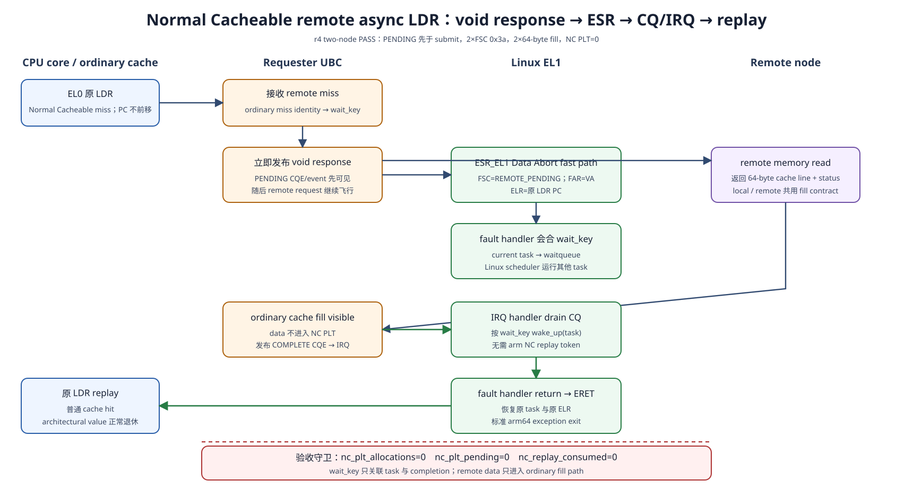
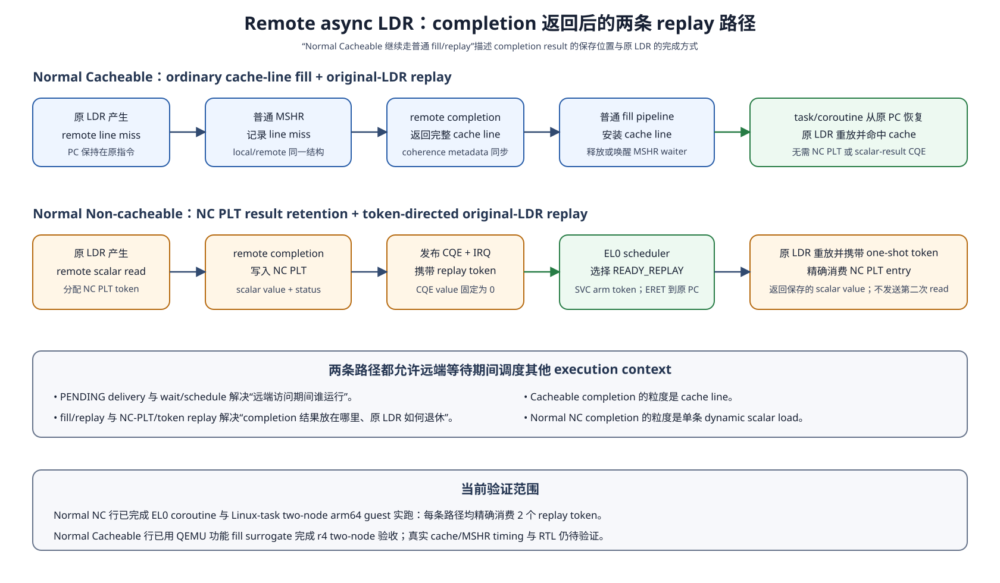

# Async load 当前实现总结与源码导读

日期：2026-09-02

状态：Normal Non-cacheable 与 Normal Cacheable 的 two-node arm64 guest
success path 均已通过；当前 retirement contract 统一为 replay-only

## 1. 结论

当前 `ub_sim` 已经形成两条透明 async `LDR` 路径，并共享 remote-region 注册、
split-phase backend、PENDING、completion ring 与 replay 语义：

| memory type | outstanding data state | completion data placement | replay source |
|---|---|---|---|
| Normal Cacheable | 普通 cache/MSHR/fill transaction | 64-byte line 进入普通 cache fill | 原 `LDR` 命中已填充 line |
| Normal Non-cacheable | requester UBC 的 NC PLT | scalar result 留在 NC PLT | 原 `LDR` one-shot 消费 replay token |

两条路径都保留 faulting PC。completion 交付后，software 恢复原 execution
context，异常返回或 context resume 最终回到原 PC，原 `LDR` 再执行一次。当前
接口不允许 completion patch saved `Rt`，也不允许把 saved PC 前移四字节。

Normal Cacheable 不分配 NC PLT。Cacheable remote line 和 local line 共用普通
cache-line contract；QEMU 的 page-cache line-valid bitmap 只承担功能仿真。
Normal NC 没有可供 replay 命中的 cache line，因此 requester UBC 使用专门命名的
NC Pending Load Table 保存 one-shot result。

当前提供两种 software scheduling mode：

| mode | pending delivery | scheduler | completion delivery | context resume |
|---|---|---|---|---|
| EL0 coroutine | direct EL0 upcall + ABI v3 ring | guest EL0 coroutine scheduler | ABI v3 ring；运行态 direct upcall，idle 态 `WFE + IRQ` | `SVC #0x5343` fast path + 标准 exception exit |
| Linux task | implementation-defined Data Abort，`ESR_EL1.DFSC=0x3a` | Linux scheduler | CQ/event ring + IRQ | fault handler 返回，标准 `ERET` replay |

现行 ABI 已删除 `HLT #0x5343/#0x5344/#0x5345` 私有拦截。`SVC` 与 `WFE`
复用 Arm 已有指令通路；guest kernel 对两个 SVC immediate 增加受控 fast path。

## 2. 当前端到端架构





### 2.1 共同控制面

1. 用户态通过 OBMM export/import 建立 remote mapping。
2. async-load driver 验证 VMA、mapping fd、owner、home CPU 与 session generation。
3. `REGISTER_MAP` 把 EL0 VA range、remote object identity、mapping generation 和
   memory attributes 交给 async-load device。
4. `START` 选择 EL0-coroutine 或 Linux-task delivery，并强制
   `START_REPLAY_RETIRE`。
5. `STOP` 停止新 load、drain 或隔离 outstanding transaction，随后提升 owner
   generation。

控制面仍经过 Linux。EL0 ring 的“kernel-free event handling”只覆盖 event descriptor
读取、sequence 确认和 coroutine 状态转换。

### 2.2 PENDING 共同顺序

一次 eligible remote `LDR` 的固定顺序为：

```text
MMU permission/type check
  -> reserve transport/fill or NC PLT state
  -> publish PENDING
  -> submit remote request
  -> transfer control to software scheduler
```

`PENDING` 在 remote submit 前可见。该顺序定义当前 PoC 的 immediate void-response
contract，并关闭远端快速完成抢在 waiter 建立之前的竞态。

### 2.3 Normal Cacheable completion

1. remote backend 返回 64-byte line；
2. requester UBC 把 line 交给普通 fill transaction；
3. fill 对 replay load 可见；
4. device 发布 COMPLETE CQE；
5. device raise IRQ；
6. driver 或 EL0 runtime 按 `wait_key` 标记 waiter ready；
7. 原 execution context 恢复并从原 PC replay；
8. `LDR` 通过普通 cache lookup 取得数据。

`wait_key` 只做 software wait/wakeup correlation。它不保存 load value、PC、SP、
register context、coroutine state 或 cache line。

### 2.4 Normal NC completion

1. remote backend 返回 scalar result；
2. requester UBC 将 value/status 写入 NC PLT entry；
3. entry 进入 `REPLAY_READY`；
4. device 发布只携带 readiness/status/token 的 COMPLETE CQE；
5. scheduler 唤醒目标 task/coroutine；
6. resume 前 arm one-shot replay token；
7. 原 `LDR` replay，并按 owner、mapping、address、size 和 generation 精确匹配；
8. value 被消费一次，NC PLT entry 回收。

NC PLT entry 不保存 task/coroutine ID、ready queue、SP、`Rt` 或完整 context。
software 维护 `replay_token -> waiter` 关系。

## 3. ABI v3 与 execution-context ownership

### 3.1 Event ring

ABI v3 使用两个 DMA-coherent mapping：

- producer/event ring：EL0 只读，device 写入；
- consumer page：owner EL0 可读写，device 只读。

每个 event slot 为 128 bytes。device 先写 descriptor，执行 publish ordering，随后
更新 `producer_sequence`。EL0 以 acquire load 观察 producer sequence，完成状态转换
后以 release store 更新 `consumer_sequence`。

ring 携带 `PENDING`、`COMPLETE`、`FAULT`。Normal NC success CQE 不携带可用于
retirement 的 scalar value；Normal Cacheable success CQE 也不携带 cache line。

### 3.2 EL0 coroutine mode

EL0 coroutine runtime 拥有：

- full GPR/SIMD/FP/TLS context image；
- coroutine stack；
- `READY`、`RUNNING`、`WAIT_REMOTE`、`READY_REPLAY`、`FAULTED` 状态；
- ready queue 与调度 policy；
- `waiting_token` 和 `replay_token`。

QEMU/core 不选择 coroutine，也不保存 ready queue。direct upcall 只在精确 EL0
instruction boundary 把 PC 转到已注册 trampoline 并退出当前 TB。trampoline 在使用
scratch register 前保存 application context，然后切到 scheduler stack。

当前 context resume 过程为：

1. EL0 assembly 恢复 SIMD/FP/`TPIDR_EL0`；
2. `x0` 指向目标 context image，`x1` 携带 NC replay token 或 0；
3. 执行 `SVC #0x5343`；
4. kernel fast path 校验 owner/session/context；
5. driver 对 NC 路径 arm replay token；
6. handler 把目标 GPR/SP/PC/PSTATE 安装到 `pt_regs`；
7. 标准 arm64 exception exit 返回目标 context。

coroutine 正常退出时使用 `SVC #0x5345` 进入 scheduler state。所有 coroutine 都等待
remote completion 时，runtime 使用 `SEVL; WFE`、再次 drain ring、再 `WFE` 的协议；
completion IRQ 唤醒 vCPU。该 wakeup 会进入 EL1 IRQ path，event payload 仍由 EL0
直接读取。

### 3.3 Linux-task mode

CPU 以 lower-EL Data Abort 交付 PENDING：

| register | value |
|---|---|
| `ESR_EL1.EC` | `0x24`，Data Abort from lower EL |
| `ESR_EL1.ISS.DFSC` | `0x3a`，implementation-defined `REMOTE_PENDING` |
| `FAR_EL1` | faulting effective VA |
| `ELR_EL1` | faulting `LDR` PC |

driver 将 fault 与 PENDING event 会合，并把当前 task 放入 waitqueue。completion IRQ
drain CQ、按 `wait_key` 唤醒 task。Normal NC 在异常返回前 arm replay token；Normal
Cacheable 无需该命令。两者都通过标准 `ERET` 返回原 PC。

## 4. 硬件契约与 QEMU 功能模型

| 目标硅片组件 | 目标职责 | 当前 QEMU 映射 |
|---|---|---|
| CPU/MMU/LSU | 识别 memory type、产生精确 pending exception/upcall、保留 fault PC | TCG load helper、PTE `pte_attrs`、TB exit |
| 普通 cache/MSHR/fill | Cacheable miss ownership、line fill、merge/coherence、replay hit | sim-decoder page cache + 64-bit line-valid bitmap |
| requester UBC | remote request、transport correlation、Cacheable fill handoff、NC PLT | `ub_async_load_device.c` + `ub_async_load.c` + UBC helper |
| CQ/IRQ | completion publish、ordering、interrupt | ABI v3 ring + async-load IRQ registers |
| Linux exception/driver | FSC fast path、waitqueue、CQ drain、ERET | `linqu_ub_drv.c` 与 kernel hook |
| EL0 runtime | event consume、coroutine state、policy、context image | `obmm_coroutine_scheduler` |

QEMU timer、latency/error model、逐事件 trace、host callback 和 page-cache line-valid
bitmap 都属于 `simulation-only`。它们用于制造延迟、注入故障和证明 ordering，不进入
silicon contract。

目标硬件不增加 Cacheable remote line fill table。普通 cache/MSHR/fill state 已经
覆盖 Cacheable line 的 outstanding 生命周期。Normal NC 需要 NC PLT，因为该 memory
type 不产生可供 replay 命中的 cache line。

## 5. 主要实现位置

| 层 | 文件 | 当前职责 |
|---|---|---|
| AArch64 load hook | `vendor/qemu_8.2.0_ub/target/arm/tcg/helper-a64.c` | memory type 判定、PENDING、Data Abort 或 direct EL0 delivery |
| async-load model | `vendor/qemu_8.2.0_ub/hw/ub/ub_async_load.c` | NC PLT、event、sequence、path counters |
| async-load device | `vendor/qemu_8.2.0_ub/hw/ub/ub_async_load_device.c` | session/map/future、PENDING-before-submit、CQ/IRQ、Cacheable fill |
| UBC fill surrogate | `vendor/qemu_8.2.0_ub/hw/ub/ub_ubc.c` | 64-byte remote line、page-cache line-valid bitmap |
| UAPI | `guest-linux/kernel_ub/include/uapi/ub/obmm_async_load.h` | ABI v3、caps、event/path stats、SVC immediate |
| driver | `guest-linux/aarch64/driver/linqu_ub_drv.c` | map/session、SVC fast path、FSC `0x3a`、CQ/IRQ、waitqueue |
| EL0 scheduler | `guest-linux/aarch64/libs/obmm_coroutine_scheduler/` | event consume、context save/resume、WFE wait、coroutine policy |
| workload CLI | `guest-linux/aarch64/apps/obmm_async_coroutine/obmm_async_coroutine.c` | producer/consumer、EL0/Linux-task mode、memory type、value gate |
| runner | `guest-linux/aarch64/scripts/run_ub_obmm_eval.sh` | artifact binding、causal/value/path/cleanup acceptance |

## 6. CLI 与复现入口

用户态 workload 的关键参数：

```text
--mode async-load
--async-load-memory normal-nc|normal-cacheable
--kernel-task-replay
--threads 2
--iterations 2
--verify
```

- 省略 `--kernel-task-replay` 时使用 EL0 coroutine mode；
- `normal-cacheable` 当前正式 acceptance 使用 Linux-task mode；
- `normal-nc` 已验证 EL0 coroutine 与 Linux-task 两种 mode；
- runner 负责生成 nodeA producer 与 nodeB consumer 角色，并绑定 scenario、QEMU、
  kernel、initramfs、driver 和 remote-model fingerprint。

## 7. 2026-09-02 验证状态

### 7.1 Normal NC replay-only

在 `n4-910c1:/home/ll/ub_sim_nc_replay_20260902` 完成：

| campaign | 结果 |
|---|---|
| `normal-nc-replay-el0-20260902-r5` | 2 coroutine、2 value、2 replay consume、0 mismatch，pass |
| `normal-nc-replay-kernel-task-20260902-r2` | 2 pthread、2 value、2 sleep/wakeup、2 replay consume、0 mismatch，pass |

该 revision 的 QEMU async-load unit 10/10、remote backend/model 6/6 与 7/7、Python
contract 389/389、Rust workspace 和 guest artifact build 均通过。

### 7.2 Normal Cacheable fill/replay

在 `n4-910c1:/home/ll/ub_sim_normal_cacheable_20260902_r1` 完成正式 campaign
`cacheable-esr-cq-20260902-r4`：

| evidence | result |
|---|---:|
| producer writes / verified loads | 2 / 2 |
| FSC `0x3a` / PENDING / block / completion / wake | 2 / 2 / 2 / 2 / 2 |
| 64-byte fill pending / completed / bytes | 2 / 2 / 128 |
| successful `resume=eret-replay` | 2 |
| NC PLT allocations / pending | 0 / 0 |
| NC replay consumed / mismatch | 0 / 0 |
| protocol error / timeout / interrupted wait | 0 / 0 / 0 |
| residual QEMU | 0 |
| status | pass |

同一代码状态下的 Normal NC shared-future regression
`nc-future-reg-20260902-r2` 通过：2 value、2 NC PLT allocation、2 replay consume、
Cacheable fill counter 全为 0。

详细证据见：

- [Normal NC replay 与 SVC/ERET 设计](2026-09-02-normal-nc-replay-plt-svc-eret-design.md)；
- [Normal Cacheable void response、ESR、CQ/IRQ 与 replay 验证](2026-09-02-normal-cacheable-void-response-esr-cq-validation-design.md)。

## 8. 性能证据边界

2026-09-01 的 30-case trace-off paired matrix 比较了当时的 direct-EL0 coroutine
与 Linux-task replay。该运行早于 2026-09-02 的 HLT 移除、SVC/WFE 收敛以及
Normal Cacheable 实现，因此数据保留为历史 QEMU PoC 证据，不能直接代表当前
SVC/WFE revision 或目标硅片。

P3 4,942-case campaign 当前按用户要求暂停。恢复性能评估时需要：

1. 使用当前 replay-only artifact 新建 campaign；
2. 分开 Normal NC 与 Normal Cacheable；
3. 同时比较 sync、submit/await、EL0 coroutine async load 和 Linux-task async load；
4. 关闭逐事件日志；
5. 绑定唯一 artifact fingerprint；
6. 扫描 latency、tail/jitter、compute、runnable contexts、IRQ batching 和 capacity。

## 9. 已知限制与下一步

| 范围 | 当前状态 | 下一步 |
|---|---|---|
| success path | NC 两种 scheduler、Cacheable Linux-task 已通过 | 增加 Cacheable EL0-coroutine acceptance |
| instruction class | EL0 unsigned scalar 1/2/4/8-byte 子集 | 增加拒绝/回退矩阵，随后评估 vector/store/atomic |
| failure lifecycle | unit/contract 覆盖部分 mismatch/stale/capacity | 跑 timeout/cancel/late/duplicate two-node matrix |
| multiprocessor | 单 owner、单 home vCPU | 增加 per-CPU CQ、task migration 与 owner handoff |
| Cacheable hardware fidelity | QEMU 功能 fill surrogate 已通过 | timing cache/MSHR/coherence model 或 RTL 验证 |
| NC PLT silicon design | 功能状态机已通过 | 容量、quota、cancel/orphan、RAS 与功耗评估 |
| Lingqu integration | OBMM/async-load 与 W5/mem_service 分段通过 | 形成 ObjectRef 到真实模型消费点的无旁路 E2E |

## 10. 文档适用范围

本文是当前实现入口。以下文档保留各阶段的详细证据：

- `2026-08-12-obmm-remote-load-coroutine-implementation-validation.md`：ABI v2
  历史验证；
- `2026-08-17-obmm-async-load-patch-replay-comparison-design.md`：patch/replay
  历史对比；patch 已退出现行 contract；
- `async-load-abi-v3-kernel-free-event-ring.md`：ABI v3 ring 与最新 SVC/WFE 修订；
- `async-load-coroutine-scheduler-detailed-design.md`：direct EL0 coroutine 机制演进；
- `2026-09-01-obmm-kernel-task-remote-load-poc.md`：Linux-task ESR/CQ/IRQ 路径；
- `2026-09-02-normal-nc-replay-plt-svc-eret-design.md`：Normal NC replay-only；
- `2026-09-02-normal-cacheable-void-response-esr-cq-validation-design.md`：Normal
  Cacheable fill/replay acceptance。
