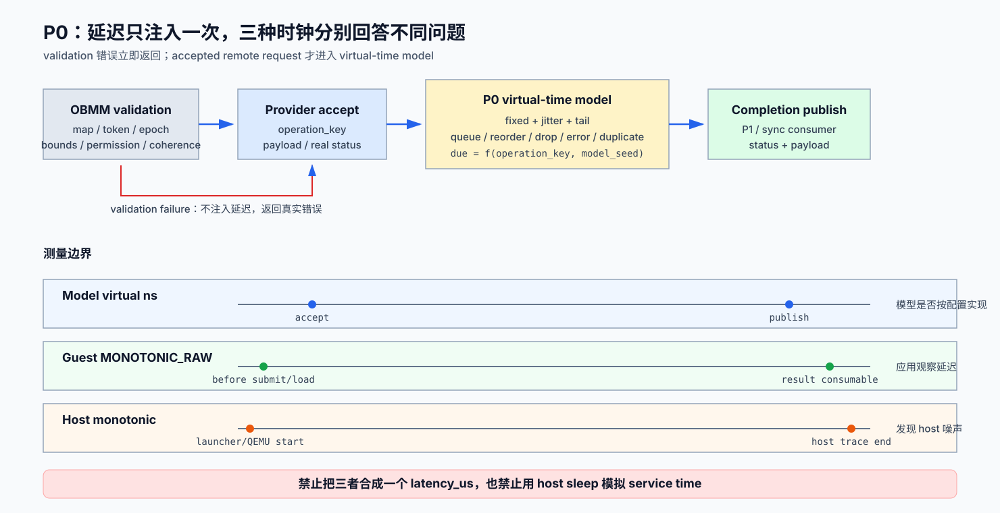

# P0：同步基线、时钟与远端延迟模型详细设计

> 状态：详细设计已冻结；实现尚未开始
>
> 日期：2026-08-11
>
> 上位设计：[OBMM 远端 Load 协程可行性与验证设计](2026-08-11-obmm-remote-load-coroutine-feasibility-design.md)
>
> 后继阶段：[P1：provider-neutral split-phase backend](p1-split-phase-backend-detailed-design.md)、
> [P4：标准 userfaultfd 透明页访问基线](p4-userfaultfd-baseline-detailed-design.md)

## 1. 目标和退出结论

P0 的任务不是证明协程有收益，而是建立可信的实验坐标系：同一个 payload、同一个
request identity、同一个 seed，在 local DRAM、OBMM local/cache hit、0-delay remote
和 modeled remote 四条同步路径上能够复现；模拟延迟、guest 观察时间和 host wall
time 必须分开记录。

P0 退出后才能回答后续结果是否来自真实等待重叠，而不是 `g_usleep()`、QEMU host
调度、缓存预热或不同故障序列。



## 2. 范围与非目标

### 2.1 必须交付

- `remote_memory_model` 的强类型 scenario schema、默认值和校验；
- scenario 到 QEMU device 的版本化 manifest/config 传递闭环；
- fixed latency、uniform jitter、long tail、queue depth、reorder、drop/error/duplicate；
- 不依赖 host sleep 的 QEMU virtual-time completion event；
- model/guest/host 三套时间戳和稳定 request identity；
- `sync-mmio` 基线 CLI、机器可解析 summary 和 trace schema；
- payload/checksum、0-delay compatibility、固定 seed reproducibility 测试。

### 2.2 不做

- 不在 P0 实现多 in-flight guest-visible async API；
- 不保存或切换 EL0 coroutine context；
- 不用延迟模型替代真实 provider 正确性检查；
- 不把 host wall time当成模拟 service latency；
- 不通过散落的环境变量配置实验参数。

## 3. 当前实现约束

| 证据 | 当前状态 | P0 要求 |
|---|---|---|
| `crates/sim-config/src/lib.rs` | `ScenarioConfig` 没有 `remote_memory_model` 字段 | 增加强类型字段、default 和 validation；未知/无效值 fail closed |
| `scenarios/mvp_*host_*.yaml` | 只有 scenario seed 和其他服务延迟 | 延迟模型成为 scenario 的显式一等配置 |
| `ubc_sim_dec_remote_read()` | 单槽 `sim_dec_sync_read`，poll + `g_usleep()` | P0 保留 sync consumer，但 provider response 延迟由 QEMU event model 决定 |
| SIM_DEC read wire payload | request/response 已带 `req_id` | 无需修改 wire identity；P1 再把单槽 response match 扩成 table |
| guest kernel/app | 可用 `clock_gettime()` | guest 观察使用 `CLOCK_MONOTONIC_RAW`，不直接拿 host timestamp |

## 4. Canonical scenario schema v1

```yaml
remote_memory_model:
  enabled: true
  time_source: qemu_virtual
  fixed_latency_ns: 100000
  jitter:
    mode: uniform
    max_abs_ns: 20000
  tail:
    probability_ppm: 0
    extra_latency_ns: 0
  queue_depth: 64
  reorder_window: 1
  drop_ppm: 0
  error_ppm: 0
  duplicate_ppm: 0
  duplicate_delay_ns: 1000
  seed: 1
```

v1 约束：

| 字段 | 约束 | 语义 |
|---|---|---|
| `enabled` | bool | false 时仍记录 model counters，但不增加延迟/故障 |
| `time_source` | 仅 `qemu_virtual` | 禁止把 host sleep 当模型时钟 |
| `fixed_latency_ns` | `0..10^10` | 从 provider accept 到 completion eligible 的基础延迟 |
| `jitter.mode` | `none|uniform` | v1 不引入依赖浮点库的分布 |
| `jitter.max_abs_ns` | `0..fixed+10^10` | signed uniform jitter；最终 service time clamp 到 0 |
| `tail.probability_ppm` | `0..1_000_000` | 独立 deterministic draw |
| `tail.extra_latency_ns` | `0..10^10` | tail 命中后额外延迟 |
| `queue_depth` | `1..65535` | provider 可接受的 pending event 数；满时返回 capacity error |
| `reorder_window` | `1..queue_depth` | 同一 eligible batch 内 deterministic permutation |
| `drop_ppm` | `0..1_000_000` | 不产生 provider completion，由 caller deadline 形成 timeout |
| `error_ppm` | `0..1_000_000-drop_ppm` | 在 modeled due time 返回 explicit remote I/O error |
| `duplicate_ppm` | `0..1_000_000` | success 后额外生成 duplicate response，仅用于验证 stale 防护 |
| `seed` | u64 | 与 scenario seed 分离，允许固定 workload 而扫描 provider 序列 |

`ScenarioConfig` 增加带 `#[serde(default)]` 的 `RemoteMemoryModelConfig`。旧 scenario
缺少该节时等价于 `enabled=false`；存在字段但拼写错误或超范围时必须校验失败，不能
静默回默认值。实现时为该配置结构启用 unknown-field rejection。

## 5. Deterministic request identity

随机结果不能依赖 host callback 的到达顺序。每次 accepted read 生成：

```text
operation_key = hash(
    model_seed,
    map_id,
    map_generation,
    remote_offset,
    length,
    per_range_ordinal
)
```

性能对比 workload 默认每个 logical operation 使用不同 offset，使 P2A lookahead 和
P2B demand issue 即使顺序不同，也得到相同 operation key。重复访问同一 range 时，
adapter 维护 per-range ordinal；trace 必须输出该 ordinal。

从 `operation_key` 派生互不共享状态的 draw：

```text
outcome_draw  -> drop 区间 / error 区间 / success
jitter_draw   -> [-max_abs_ns, +max_abs_ns]
tail_draw     -> 是否加 tail.extra_latency_ns
duplicate_draw-> success 是否产生 duplicate
reorder_key   -> eligible batch 内排序
```

这样 duplicate/drop 的启用不会改变其他 operation 的 jitter 序列。

## 6. Injection point 与事件语义

唯一注入点：**OBMM route/token/coherence validation 成功、provider 接受 request 之后，
上层 completion sink 发布之前。**

```text
validate request
  -> capacity check
  -> read/capture payload and status
  -> compute operation_key + modeled_due_ns
  -> enqueue QEMU virtual-time event
  -> due: apply error/drop/duplicate/reorder
  -> publish provider completion
```

规则：

- validation failure 立即返回真实错误，不受故障注入影响；
- `fixed_latency_ns=0` 仍经过同一 event/counter path，但可在当前 QEMU iteration 完成；
- drop 不发布 fake timeout；deadline owner 负责 timeout；
- error 必须带 status，不能修改 payload 后伪装 success；
- duplicate 在第一次 terminal completion 之后产生，必须被 P1/consumer 判为 duplicate；
- queue full 在 accept 前返回 capacity error，不消耗 operation ordinal；
- reorder 只改变已 eligible completion 的 publish 顺序，不改变其 due time/outcome。

## 7. 三种时钟与测量边界

| 时钟 | 采集位置 | 用途 | 禁止用途 |
|---|---|---|---|
| model virtual ns | QEMU provider accept/due/publish | 判断配置是否精确实现 | 推断 host 性能 |
| guest `CLOCK_MONOTONIC_RAW` | guest submit/load 前后 | 应用实际观察延迟、makespan | 直接当纯 provider service time |
| host monotonic | launcher/QEMU trace | 发现 host scheduling、I/O、thermal 噪声 | 写回 modeled latency |

必须输出：

```text
model_service_ns = model_publish_ns - model_accept_ns
guest_observed_ns = guest_after_ns - guest_before_ns
host_elapsed_ns = host_after_ns - host_before_ns
```

三者不应被合成一个 `latency_us`。P3 报告同时保留三列。

## 8. 同步基线矩阵

| Baseline | 地址/路径 | 目的 |
|---|---|---|
| `local-dram` | 普通匿名内存 load/copy | guest loop、clock、checksum 下限 |
| `obmm-local-hit` | OBMM local/shadow/cache hit | route、mapping、cache fast-path 成本 |
| `sync-remote-zero` | remote provider，模型 0 ns | wire/validation/sync wait 固定开销 |
| `sync-remote-modeled` | remote provider + latency/fault model | P2/P3 的同步参考 |

每个 case 先预热 mapping 和代码页，但 `sync-remote-modeled` 的目标 payload cache state
必须按 case manifest 固定。warmup 不进入 summary，也不能消耗 measurement 的
operation ordinal；measurement phase 使用独立 generation。

## 9. CLI 与输出契约

Host 入口：

```text
cargo run -p sim-cli -- obmm-remote-load-baseline \
  --scenario scenarios/mvp_2host_single_domain.yaml \
  --case local-dram|obmm-local-hit|sync-remote-zero|sync-remote-modeled \
  --access-bytes 8|64|256|4096|65536 \
  --warmup 1000 \
  --iterations 10000 \
  --seed 1 \
  --output-dir out/obmm-remote-load/<run-id> \
  --dry-run
```

`--dry-run` 只验证 scenario、生成 versioned QEMU manifest 和最终命令，不启动 QEMU。
实际运行使用仓库固定 QEMU wrapper，并在远端目标执行。

Guest summary：

```text
OBMM_BASELINE_SUMMARY schema=1 case=sync-remote-modeled status=pass \
iterations=10000 bytes=8 checksum=... failures=0 timeouts=0 \
guest_ns_p50=... guest_ns_p99=... model_ns_p50=... model_ns_p99=...
```

QEMU trace event：

```text
obmm_model_accept operation_key=... req_id=... model_ns=...
obmm_model_due operation_key=... outcome=success|error|drop model_ns=...
obmm_model_publish operation_key=... duplicate=0|1 model_ns=...
```

## 10. 配置传递闭环

scenario YAML 是唯一 source of truth：

1. `sim-config` 解析并校验；
2. `sim-cli` 生成 `remote_memory_model_manifest_v1.json` 到 run output directory；
3. 固定 guest/QEMU launcher 通过显式 `--remote-memory-model-manifest <path>` 参数接收；
4. wrapper 转成 UBC device property；QEMU 加载后打印 manifest hash；
5. guest summary、QEMU trace、host run metadata 都记录同一 manifest hash。

禁止用环境变量覆盖单个字段。若未来需要 override，必须生成一份新的完整 manifest
并记录 hash，不能让报告无法还原实际参数。

## 11. 实现落点

| 顺序 | 文件/目录 | 内容 |
|---:|---|---|
| 1 | `crates/sim-config/src/lib.rs` | `RemoteMemoryModelConfig`、defaults、validation、unknown-field tests |
| 2 | `crates/sim-cli/` | `obmm-remote-load-baseline`、manifest、dry-run、run metadata |
| 3 | `scenarios/` | 在相关 `mvp_<N>host_*.yaml` 增加显式 model section |
| 4 | `vendor/qemu_8.2.0_ub/hw/ub/ub_obmm_remote_model.c` | deterministic draw、virtual timers、eligible/reorder queue |
| 5 | `vendor/qemu_8.2.0_ub/include/hw/ub/ub_obmm_remote_model.h` | config/event/stats contract |
| 6 | `vendor/qemu_8.2.0_ub/hw/ub/ub_ubc.c` | 在 SIM_DEC response publish 前接入 model，不改变 validation |
| 7 | `guest-linux/aarch64/apps/obmm_async_coroutine/` | baseline cases、clock/checksum/summary |
| 8 | launcher/build/initramfs | 固定 manifest 参数和 guest app dispatch |
| 9 | Rust/Python/QEMU tests | schema、manifest、determinism、event、CLI contracts |

## 12. 测试与验收

### 12.1 本地轻量测试

- schema defaults、unknown field、所有上下界和非法组合；
- manifest canonical serialization/hash；
- operation key 和各 draw 的 golden vectors；
- 同 seed 同请求集与不同 arrival order得到相同 outcome/due time；
- queue full 不消耗 ordinal；drop/error/duplicate/reorder 状态；
- 0 ns 模型不改变 payload/checksum/status；
- CLI dry-run、summary/trace schema、build/run contract。

### 12.2 远端 QEMU 验证

- 四类 baseline 在 8 B 到 64 KiB 上 payload/checksum 一致；
- fixed 0/1/5/10/50/100/1000 us 的 model p50 与配置一致；
- jitter/tail/outcome counts 与 fixed seed golden manifest 一致；
- guest/model/host timestamps 单调且不混列；
- 连续两次相同 manifest 的 operation key/outcome/count 完全一致；
- run 后无残留 QEMU process。

### 12.3 P0 退出条件

1. scenario → manifest → QEMU → report hash 全链一致；
2. 0-delay payload 与未启用模型完全一致；
3. 固定 seed 的 event sequence 可复现；
4. model、guest、host 三种时间独立输出；
5. sync baseline 和故障注入已有 CLI、测试与远端验证记录。
