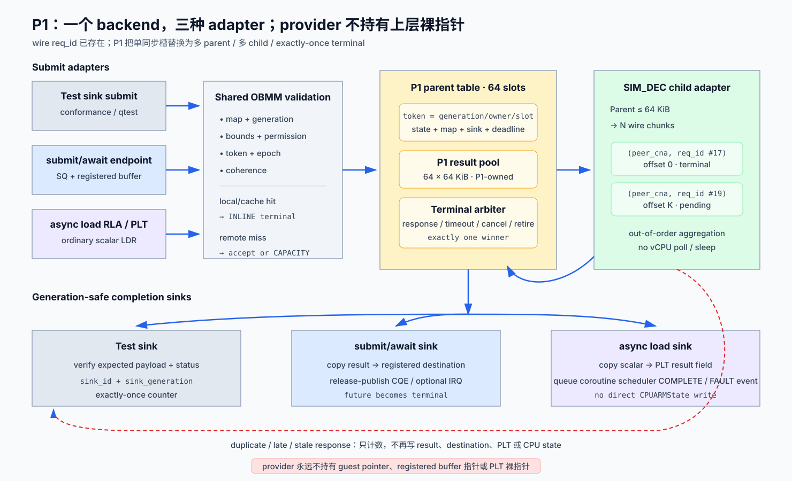

# P1：provider-neutral split-phase backend 详细设计

> 状态：详细设计已冻结；实现尚未开始
>
> 日期：2026-08-11
>
> 前置阶段：[P0：同步基线、时钟与远端延迟模型](p0-baseline-latency-model-detailed-design.md)
>
> 后继阶段：[P2A：submit/await](p2a-submit-await-detailed-design.md)、
> [P2B：scheduler core](p2b-scheduler-core-detailed-design.md)

## 1. 目标和退出结论

P1 把当前“发送一个 SIM_DEC READ 后在 vCPU 回调中 poll/`g_usleep()`”改造成真正的
split-phase backend：提交方得到内部 request token 后立即返回；0 到 64 个请求可以
同时 pending；响应通过 generation-safe completion sink 交给 P2A、P2B 或测试适配器。

P1 不定义 EL0 SQ/CQ、future、coroutine、PLT、Context Store 或目标寄存器。它只拥有
provider-neutral request lifecycle、payload、timeout/cancel 和 exactly-once terminal
delivery。这条边界保证两种上层方案比较的是调度机制，而不是两套不同的远端读实现。



## 2. 当前实现约束

| 证据 | 当前行为 | P1 决策 |
|---|---|---|
| `UBCSimDecReadReqPld` / `UBCSimDecReadRespPldHdr` | wire request/response 已有 `req_id` | wire v1 不增加新 identity 字段 |
| response handler | 只匹配单个 `sim_dec_sync_read` 的 `(peer_cna, req_id)` | 改成最多 64 项 child-response match table |
| `ubc_sim_dec_remote_read()` | 大请求按 `UBC_SIM_DEC_READ_CHUNK_MAX` 分块，但逐块同步等待 | 一个 parent request 可拥有多个并发 child request |
| URMA READ | 已有 64 项 pending table 和 CQE 范式 | 复用状态机思路，不复用 transport-specific layout |
| OBMM/GSVA route | 现有 map/token/epoch/coherence 检查 | 所有 sink 共享同一 validation，不允许 adapter 绕过 |

`req_id` 已足够关联一次 wire response；问题不在 wire format，而在本地只有单槽。
response lookup 必须使用 `(peer_cna, wire_req_id)`，不能只按可能回绕的 32-bit
`req_id` 匹配。

## 3. 范围与非目标

### 3.1 必须交付

- 固定容量 64 的 parent pending table 和 bounded payload pool；
- parent request 到一个或多个 wire child request 的拆分与聚合；
- test、P2A、P2B 三种 generation-safe completion sink；
- inline、pending、rejected 三种 submit outcome；
- timeout、cancel、map retire、duplicate、late response 的单一 terminal commit；
- P0 virtual-time latency/failure model 的唯一接入点；
- CLI conformance 入口、trace/counter schema 和 unit/qtest。

### 3.2 不做

- 不暴露 guest pointer、`CPUARMState *`、SQ/CQ 或 PLT 指针给 provider；
- 不在 provider callback 中切换 coroutine 或修改 CPU architectural state；
- 不把 SIM_DEC 名称写入 guest-visible ABI；
- 不在 v1 实现跨请求 zero-copy、remote store、atomic 或 writeback coherence；
- 不为追求吞吐把 scalar request 静默合并成 batch。

## 4. Canonical 内部接口

下列接口是 QEMU 内部契约，不是 UAPI：

```c
typedef struct ObmmRemoteToken {
    uint32_t generation;
    uint16_t owner_id;
    uint16_t slot;
} ObmmRemoteToken;

typedef struct ObmmRemoteRequest {
    uint32_t map_id;
    uint32_t map_generation;
    uint64_t remote_offset;
    uint32_t length;
    uint32_t flags;
    uint64_t deadline_model_ns;
    uint64_t operation_key;
    ObmmCompletionSink sink;
} ObmmRemoteRequest;

typedef struct ObmmRemoteResult {
    ObmmRemoteToken token;
    ObmmRemoteStatus status;
    uint32_t bytes_done;
    uint64_t checksum64;
    uint64_t model_accept_ns;
    uint64_t model_publish_ns;
    const void *payload;
} ObmmRemoteResult;

typedef enum ObmmSubmitDisposition {
    OBMM_SUBMIT_INLINE,
    OBMM_SUBMIT_PENDING,
    OBMM_SUBMIT_REJECTED,
} ObmmSubmitDisposition;

ObmmSubmitDisposition obmm_remote_submit(
    const ObmmRemoteRequest *request,
    ObmmRemoteToken *token,
    ObmmRemoteResult *inline_result);
ObmmCancelDisposition obmm_remote_cancel(ObmmRemoteToken token,
                                         ObmmRemoteStatus reason);
```

`ObmmCompletionSink` 固定包含：

```text
{sink_kind, sink_id, sink_generation, owner_id, complete_fn, adapter_state}
```

- `adapter_state` 必须是 QEMU-owned、在 unregister 前可 drain 的对象；
- `complete_fn` 只在 terminal winner 被确定后调用一次；
- sink callback 可以复制 payload/发布 CQE/更新 PLT，但不能递归 submit 或直接改
  `CPUARMState`；需要 CPU 边界动作时排 BH/event；
- callback 返回后 P1 才允许释放 result slot。

## 5. Ownership 与 bounded memory

P1 v1 每个 UBC/device 固定配置：

| 资源 | v1 容量 | owner |
|---|---:|---|
| parent request slots | 64 | P1 |
| payload slots | `64 × 64 KiB = 4 MiB` | P1 |
| child response entries | 至少 `64 × ceil(64 KiB / CHUNK_MAX)` | P1/SIM_DEC adapter |
| completion sink descriptor | 每个 parent 一项 | adapter 注册，P1 持 generation-safe 引用 |

provider response 先复制到 P1 payload slot；parent terminal 后：

- test sink 对比 expected payload/checksum；
- P2A sink 复制到 registered destination，完成后 release-publish CQE；
- P2B sink 只接受 1/2/4/8-byte scalar，把结果复制到 PLT result field，再排 SCC event。

这会产生一次有意保留的 sink copy，但 ownership 明确，不会让 provider 持有 guest VA、
已释放 buffer 或已复用 PLT 的裸指针。trace 必须输出 `sink_copy_bytes` 和
`sink_copy_ns`。只有 P1/P2 correctness gate 全过后，才能把 direct-to-destination
作为独立优化；优化不能改变 generation、terminal 或 CQ/PLT publish 语义。

## 6. 状态机与 terminal arbitration

Parent 状态机：

```text
FREE
  -> VALIDATING
       -> REJECTED -> FREE
       -> ACCEPTED
            -> INLINE_TERMINAL -> DELIVERING -> FREE
            -> IN_FLIGHT
                 -> SUCCESS | ERROR | TIMED_OUT | CANCELLED | RETIRED
                 -> DELIVERING -> FREE
```

每项 terminal transition 通过单一 `try_commit_terminal()` 完成。response、deadline、
cancel 和 retire 谁先成功谁成为 winner；loser 只能递增 `late_*` counter，不能再次
写 payload、调用 sink 或释放 slot。

Token validation 顺序固定为：

1. `owner_id` 存在；
2. `slot < capacity`；
3. slot 非 `FREE`；
4. request generation 相等；
5. map/sink generation 仍相等；
6. state 允许该事件。

slot 回收时 generation 加一；回绕到 0 时跳过 0。任何 stale token 都 fail closed。

## 7. Submit、分块与 completion 时序

### 7.1 Submit acceptance

1. 检查 `offset + length` overflow、长度 `1..65536` 和 supported flags；
2. 检查 map owner/generation、range、read permission、token、segment epoch、coherence；
3. 若 local/cache hit，构造 inline result；仍走同一 sink status/checksum 语义；
4. remote miss 时检查 parent/payload/child capacity；任何一项不足都在 accept 前返回
   `CAPACITY`，不生成半个 request；
5. 分配 parent token、payload slot 和 N 个 child entries；
6. 为每个 child 分配非零 wire `req_id`，记录 peer、parent token、chunk offset/length；
7. 通过 provider 发送；发送全部成功后返回 `PENDING`；若部分发送失败，parent 进入
   `ERROR`，已发送 child 保留为可识别的 late entries，不能复用其 identity。

### 7.2 Child aggregation

每个 child response 按 `(peer_cna, wire_req_id)` 查找固定表，校验长度和 parent
generation，把 payload 写入 parent slot 的 `chunk_offset`。child 可以乱序完成：

- 全部 child success 后才校验 parent checksum 并提交 `SUCCESS`；
- 第一个 error/length mismatch/checksum failure 尝试提交 parent `ERROR`；
- error 后其他 child 标为 cancelled-but-matchable，迟到 response 只清理 child/counter；
- duplicate response 因 child 已 terminal 被计数但不再写 payload；
- parent slot 只有在全部 child 已回收且 sink callback 返回后才能变 `FREE`。

固定扫描 64 个 parent/有限 child entry 对 v1 足够，优先可验证性；只有 profile 证明
lookup 成为瓶颈后才引入 hash table。

### 7.3 Completion delivery

provider callback 只记录 child result、尝试 parent terminal，并把 delivery 排到 QEMU
safe boundary。delivery 再执行：

```text
validate parent/map/sink generations
  -> invoke sink(result)
  -> record sink status/copy cost
  -> mark DELIVERED
  -> release child/payload/parent resources
```

P0 model 位于“真实 validation/provider result 已形成”和“parent terminal eligible”
之间。drop 不产生 completion；P1 deadline timer 成为 terminal winner。

## 8. Timeout、cancel、retire 与 teardown

| 事件 | 语义 |
|---|---|
| deadline | model virtual clock 到期后尝试 `TIMED_OUT`；不使用 host wall timer |
| explicit cancel | 返回 `CANCELLED_NOW`、`ALREADY_TERMINAL` 或 `STALE_TOKEN` |
| map retire/unmap | 阻止新 submit；已有请求 drain，或逐项以 `RETIRED` terminal cancel |
| sink unregister | 先阻止新引用，再 cancel/drain owner 的全部 token，最后递增 generation |
| device reset | fail 所有 accepted request，drain queued delivery，再释放资源 |

teardown 不能先释放 sink/map 再等待 callback。v1 默认返回 busy 并由 caller 明确选择
`drain` 或 `cancel-and-drain`；不得在后台静默遗留 request。

## 9. Status、ordering 与 trace

P1 status 固定为：

```text
SUCCESS, CAPACITY, BOUNDS, PERMISSION, STALE_MAP, STALE_SINK,
TOKEN_DENIED, COHERENCE, REMOTE_IO, CHECKSUM, TIMEOUT, CANCELLED,
RETIRED, UNSUPPORTED, INTERNAL
```

`provider_status` 只作为诊断字段，不进入上层控制流。success payload 对 sink callback
可见之前，P1 做 release；adapter 发布 CQE/SCC event 时再做其边界的 release。P1
不承诺普通 CPU load 的 acquire/atomic 语义；P2B 白名单负责限制可支持的 memop。

必需 trace：

```text
obmm_p1_submit token=... operation_key=... chunks=... bytes=...
obmm_p1_child_response token=... req_id=... chunk=... status=...
obmm_p1_terminal token=... winner=response|deadline|cancel|retire status=...
obmm_p1_deliver token=... sink=test|p2a|p2b copy_bytes=... copy_ns=...
obmm_p1_late token=... source=response|deadline|cancel|retire
```

## 10. CLI 与 conformance 输出

Host CLI：

```text
cargo run -p sim-cli -- obmm-remote-backend-conformance \
  --scenario scenarios/mvp_2host_single_domain.yaml \
  --sink test|p2a|p2b \
  --case inline|inflight64|reorder|duplicate|timeout|cancel-race|retire|capacity \
  --access-bytes 1|2|4|8|64|4096|65536 \
  --seed 1 \
  --output-dir out/obmm-remote-load/<run-id> \
  --dry-run
```

`--dry-run` 校验 P0 manifest、sink/size 组合和远端执行命令，不启动 QEMU。P2B sink
拒绝大于 8 B。summary：

```text
OBMM_P1_SUMMARY schema=1 sink=p2a case=inflight64 accepted=64 \
delivered=64 late=0 duplicate=0 checksum=... status=pass
```

## 11. 实现落点

| 顺序 | 文件/目录 | 内容 |
|---:|---|---|
| 1 | `vendor/qemu_8.2.0_ub/include/hw/ub/ub_obmm_remote.h` | request/result/token/sink/status contract |
| 2 | `vendor/qemu_8.2.0_ub/hw/ub/ub_obmm_remote.c` | parent table、payload pool、terminal arbitration、delivery |
| 3 | `vendor/qemu_8.2.0_ub/hw/ub/ub_ubc.c` | SIM_DEC child adapter、多 response lookup、移除 async path 的 poll/sleep |
| 4 | P0 model files | virtual-time eligible/error/drop/duplicate/reorder |
| 5 | P2A endpoint | registered-buffer sink adapter |
| 6 | P2B RLA/PLT | scalar-result sink adapter |
| 7 | `crates/sim-cli/` | conformance CLI、dry-run、summary aggregation |
| 8 | QEMU unit/qtest、Rust/Python tests | state/race/wire/CLI contracts |

## 12. 测试与验收

### 12.1 本地轻量测试

- token/slot/map/sink generation allocate、wrap、stale；
- parent 全状态转换和每对 terminal 事件的双向 race；
- 1/2/4/8/64 KiB 分块、乱序 child、首错、短响应、duplicate；
- 64 accepted + 第 65 项 capacity fail，资源计数不泄漏；
- fixed seed 下 P0 outcome 与 sink kind 无关；
- test/P2A/P2B sink 各 exactly once，stale sink 不被调用；
- CLI 参数组合、dry-run、summary/trace schema。

### 12.2 远端 QEMU 验证

- 64 个 remote read 同时 pending，application vCPU 没有 `g_usleep()`/busy-poll；
- response 任意乱序仍落入正确 parent offset/destination/PLT；
- timeout/cancel/retire 与 response 竞争 100% 只有一个 terminal status；
- P2A/P2B 与 test sink 使用同一 operation key 时 payload/status 相同；
- teardown 后 pending、child、payload、timer、BH 均为 0；
- run 后无残留 QEMU process。

### 12.3 P1 退出条件

1. test、P2A、P2B 三种 sink 通过同一 conformance suite；
2. 64 in-flight、分块、乱序、duplicate、late 和 capacity full 均 generation-safe；
3. async path 不在 vCPU 上 poll/sleep，completion 从 provider callback 解耦；
4. timeout/cancel/retire/response 恰好一个 terminal winner；
5. P0 model identity、时钟和 fault sequence 未因 sink 类型改变。
