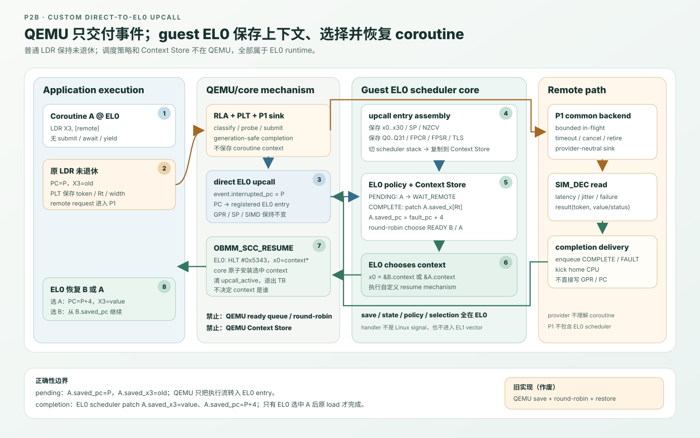
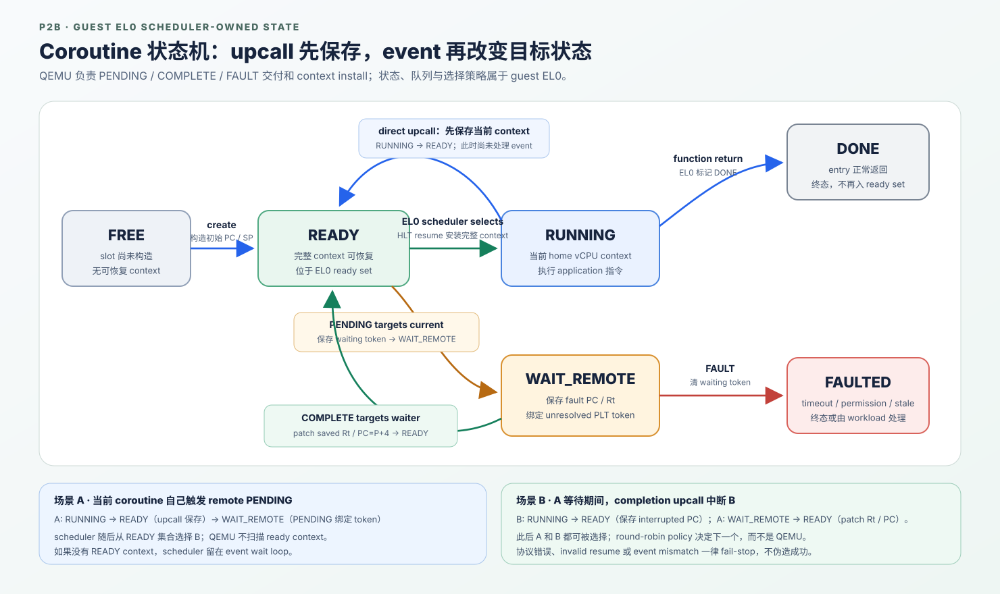
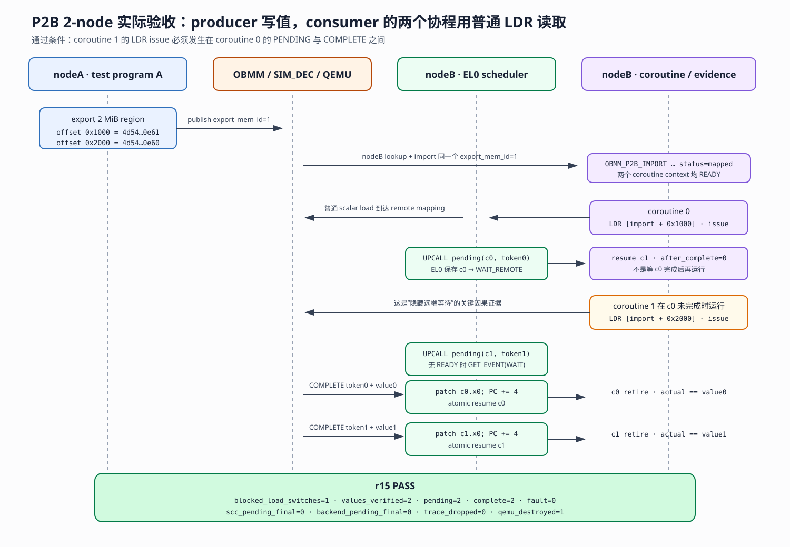

# P2B：普通 `LDR` + 自定义 EL0 upcall + EL0 协程调度核心

> 状态：ABI v2 的 2-node producer/consumer 功能目标已完成，并在 `n4-910c`
> 通过 ARM64 Linux 原生构建、远端 QEMU guest E2E 和机器可读 phase gate。P3 ABI v2
> 的 2-node acceptance 与 4/8-node 定向 scale-out 已完成，4,942-case full matrix
> 尚待完成；P3 不是本设计的功能退出条件。旧 QEMU-internal SCC
> 结果不计为本设计验收
>
> 日期：2026-08-12
>
> 上位设计：[OBMM 远端内存 Load 的 EL0 协程延迟隐藏](2026-08-11-obmm-remote-load-coroutine-feasibility-design.md)
>
> 共同底座：[P1：provider-neutral split-phase backend](p1-split-phase-backend-detailed-design.md)
>
> 软件基线：[P2A：submit/await + EL0 协程详细设计](p2a-submit-await-detailed-design.md)

## 1. 结论和纠偏

P2B 要验证的是一套偏离标准 Arm exception routing 的自定义 core 行为：普通
AArch64 EL0 `LDR` 访问 registered OBMM/GSVA range 时，如果远端读取不能立即完成，
QEMU 模拟的 core 直接产生 EL0 **upcall**。运行在 guest EL0 的协程调度核心直接处理 **upcall** 保存当前
coroutine context、维护 ready/wait 状态、选择并恢复另一个 coroutine。远端 completion
到达后，core 再产生 EL0 upcall；EL0 scheduler 把结果提交到挂起 coroutine 保存态中的
原 `Rt`，令其 `PC=fault_pc+4`，再择机恢复。

此前实现了把完整 context save/restore、ready queue 和 round-robin policy 放入 QEMU
`ub_scc.c`，并由 QEMU 直接安装另一个 `CPUARMState`。该实现验证的是 hardware-managed
threading，与本设计要求的 EL0 coroutine scheduler 不同，不作为 P2B 的目标和完成证据。

本次重构冻结如下 ownership：

| 能力 | QEMU/core mechanism | guest EL0 scheduler |
|---|---:|---:|
| 识别 registered remote `LDR` | 是 | 否 |
| 保持 load 未退休、维护 PLT | 是 | 否 |
| 产生 pending/completion EL0 upcall | 是 | 接收 |
| 保存完整 coroutine context | 否 | 是 |
| ready/wait/fault 状态机 | 否 | 是 |
| 选择下一个 coroutine | 否 | 是 |
| 修改 completion 对应的保存态 `Rt/PC` | 否 | 是 |
| 原子安装 EL0 选择的 context image | 是，作为 core mechanism | 发起 |



## 2. V2 范围

- 一个 Linux process、一个固定 home guest vCPU；
- 最多 64 个 EL0 coroutine；
- 最多 64 个 pending scalar loads；
- 每个 coroutine 最多一个 unresolved remote load；
- 128 项 core-to-EL0 event queue；
- AArch64 EL0 unsigned scalar `LDRB/LDRH/LDR Wt/LDR Xt`；
- immediate no-writeback 和 register-offset 两类 lowering；
- 1/2/4/8 bytes，支持 `Rt==XZR/WZR`；
- upcall-active 窗口不允许嵌套 delivery；应用不得在 worker 中依赖 signal-handler
  context switching；
- 不支持 store、signed load、atomic/exclusive、acquire、pair、SIMD load、SVE/SME、
  unaligned/cross-page、ptrace、single-step 和 live migration。

P2B V2 是 demand-pending：只有普通 `LDR` 真正需要远端访问时才切换，`lookahead=0`。
它不具有 P2A 在消费前显式 submit 的 schedule-ahead 窗口。

## 3. 公共基座与 P2B 边界

### 3.1 P1 不拥有 coroutine

P1 只负责 provider-neutral split-phase read：

```text
validated request
  -> bounded parent/child lifecycle
  -> provider submit
  -> timeout/cancel/retire/race
  -> generation-safe terminal sink
```

P1 不知道 EL0 stack、ready queue、fault PC、`Rt` 或调度策略。P2A sink 把结果交给
future/CQ；P2B sink 把结果交给 PLT/event adapter。

### 3.2 P2B core-visible state

QEMU/core 只保留尚未退休 load 所必需的状态：

| PLT 字段 | 作用 |
|---|---|
| token slot/generation | completion、stale、duplicate 防护 |
| context ID | 关联 EL0 runtime coroutine |
| fault PC / `Rt` / access bytes / endian | EL0 completion patch |
| effective VA / map ID / map generation / remote offset | OBMM ownership 与 retire 检查 |
| submit/deadline/complete time | timeout 与证据 |
| payload/status | completion event 内容 |

QEMU 不再拥有 coroutine Context Store，也不维护 coroutine READY/RUNNING/WAIT 状态。

### 3.3 guest EL0 scheduler-visible state

每个 EL0 coroutine 拥有一个 user-space context image：

```c
struct obmm_scc_context_v2 {
    uint64_t context_id;
    uint64_t flags;
    uint64_t x[31];
    uint64_t sp;
    uint64_t pc;
    uint64_t nzcv;
    uint64_t q[32][2];
    uint64_t fpcr;
    uint64_t fpsr;
    uint64_t tpidr_el0;
};
```

EL0 runtime 另外维护 coroutine state、stack、entry、argument、等待 token 和 metrics。

## 4. 自定义 EL0 upcall ABI

### 4.1 为什么需要自定义 entry/return

本实验明确模拟一种非标准 aarch64 行为：pending/completion event 不进入 EL1 vector，而是
在精确 EL0 instruction boundary 把执行流转向注册的 EL0 upcall entry。

进入 upcall 时，QEMU/core：

- 保持 `x0..x30`、SP、NZCV、Q registers、FPCR/FPSR、`TPIDR_EL0` 不变；
- 把被中断 PC 记录在 event 中；pending event 的 interrupted PC 等于 faulting load PC；
- 把 guest EL0 PC 设为 registered upcall entry；
- 设置 `upcall_active`，禁止 handler 内嵌套 delivery；
- 不切换到 QEMU-owned context，不运行 QEMU scheduling policy。

EL0 upcall entry 是 naked AArch64 assembly。它首先在当前 coroutine stack 上分配 transient
frame，并在调用任何 C 函数前保存全部 GPR、SP、NZCV、Q0..Q31、FPCR/FPSR 和
`TPIDR_EL0`。随后切到 runtime 独立分配的 scheduler stack，再调用 EL0 scheduler
dispatcher；dispatcher 从 event queue 取得
interrupted PC 和 pending/completion metadata，把 transient frame 复制到当前 coroutine
的 user-space context image。

#### 4.1.1 注册 upcall entry 并启用 TCG hook

`guest-linux/aarch64/libs/obmm_scc/obmm_scc.c::obmm_scc_run()` 把 assembly symbol
`obmm_scc_upcall_entry` 的 EL0 VA 放进 `OBMM_SCC_IOCTL_START`：

```c
request = (struct obmm_scc_start_v2) {
    .home_cpu = sched_getcpu(),
    .upcall_entry = (uintptr_t)obmm_scc_upcall_entry,
    .logical_contexts = runtime->logical_contexts,
};
ioctl(runtime->fd, OBMM_SCC_IOCTL_START, &request);
```

driver 的 `linqu_scc_start()` 验证调用进程、single-CPU affinity、entry 对齐和用户地址
可访问性，然后把 owner TTBR0、upcall entry、logical context count 写入 SCC MMIO，
最后写 `SESSION_COMMAND=START`。QEMU 的 `ub_scc_session_command()` 将执行该 MMIO
命令的 vCPU 记为唯一 `home_cpu`，置 `session_active=true`，并调用
`arm_obmm_scc_set_active()`。

`arm_obmm_scc_set_active()` 设置 `CPUARMState.obmm_scc_active`、flush 已翻译 TB，并
请求退出当前 TB。后续只为 active session 的 AArch64 EL0 TB 生成 remote-load hook 和
boundary hook；其他进程、vCPU 和 EL 不受影响。

#### 4.1.2 PENDING：在 faulting `LDR` 内同步重定向

`target/arm/tcg/translate-a64.c` 在白名单 unsigned scalar `LDR` 的正常 load lowering
之前插入 `gen_obmm_scc_remote_load()`：

```text
gen_helper_obmm_scc_remote_load(..., Rt, fault_pc)
do_gpr_ld_memidx(...)                         // 正常 load 在 helper 之后
```

对应的 `target/arm/tcg/helper-a64.c::HELPER(obmm_scc_remote_load)` 执行：

1. 校验 active session、AArch64 EL0、owner TTBR0、home vCPU 和 remote mapping；
2. 先做正常 MMU translation/permission probe，不能用 upcall 吞掉标准 page fault；
3. `ub_scc_cpu_remote_load()` 分配 PLT、enqueue PENDING，并向 P1 backend submit；
4. `ub_scc_cpu_take_upcall(fault_pc, &entry)` 把 PENDING 从 event queue 移到
   `delivered_event`，写入 `interrupted_pc=fault_pc`，置 `upcall_active=true`；
5. helper 只执行 `env->pc=entry`，随后 `cpu_loop_exit_noexc()`。

第 5 步立即退出当前 TB，因此排在 helper 后面的正常 `do_gpr_ld_memidx()` 没有执行：
目标 `Rt` 没被写，base writeback 也没提交，faulting `LDR` 仍未退休。这里没有构造 Arm
exception、没有切 EL，也没有进入 Linux signal handler；从 guest 视角，下一条执行的
指令就是注册的 EL0 assembly entry。

PENDING 在 `hw/ub/ub_scc.c::obmm_scc_event_push()` 中从 queue head 入队，而 COMPLETE/
FAULT 从 tail 入队。这保证当前刚触发 `LDR` 的 PENDING 不会被旧 terminal event 抢在
前面，否则 EL0 可能保存了当前 coroutine，却先收到另一个 coroutine 的 completion。

#### 4.1.3 COMPLETE/FAULT：异步产生，在下一个 EL0 TB boundary 交付

远端结果由 `hw/ub/ub_scc_device.c::ub_scc_load_complete()` 回调接收。
`obmm_scc_load_complete()` 校验 PLT generation 后 enqueue COMPLETE 或 FAULT；callback
本身不改 guest PC/GPR，只执行：

```c
state->home_cpu->halted = 0;
cpu_exit(state->home_cpu);
qemu_cpu_kick(state->home_cpu);
```

这三步只负责唤醒或打断 host 上的 QEMU vCPU loop。真正的 control transfer 发生在下一
个 active EL0 TB 开头：`aarch64_tr_tb_start()` 已插入
`HELPER(obmm_scc_boundary)`。boundary helper 用当前 `env->pc` 作为
`interrupted_pc`，调用同一个 `ub_scc_cpu_take_upcall()`，然后同样执行：

```c
env->pc = upcall_entry;
cpu_loop_exit_noexc(cs);
```

因此 completion 是“异步生成、精确边界交付”：event 可以在 B 运行期间到达，但 B
只会在 QEMU 形成的下一个 EL0 TB boundary 被截断。该 boundary 的正常 guest 指令尚未
执行，保存的 `interrupted_pc` 就是 B 之后应恢复的位置。

`upcall_active` 期间禁止嵌套 PC redirection。如果所有 coroutine 都在
`WAIT_REMOTE`，EL0 scheduler 已经位于当前 upcall 中，就通过
`GET_EVENT|OBMM_SCC_EVENT_GET_WAIT` 等待。driver 观察到 queue pending 后写
`EVENT_COMMAND=2`，把下一 event promote 为 `delivered_event`，直接交给现有 handler，
不再递归进入 assembly entry。

#### 4.1.4 EL0 entry 如何保存现场并取得 event

`guest-linux/aarch64/libs/obmm_scc/obmm_scc_aarch64.S::obmm_scc_upcall_entry` 是真正被
QEMU 写入 PC 的地址。QEMU 没有替换 SP 或传递 scratch 参数，所以 entry 可以看到完整
的被中断寄存器状态：

```text
sub sp, sp, #832           // 在当前 coroutine stack 建 transient frame
save x0..x30 / old SP / NZCV / Q0..Q31 / FPCR / FPSR / TPIDR_EL0
x19 = transient frame
sp = obmm_scc_scheduler_stack_top()
x0 = transient frame
bl obmm_scc_upcall_dispatch
```

assembly 必须先保存所有寄存器，再使用 `x9/x19/x0` 作为 scratch；这些寄存器的旧值此时
已经在 frame 中。切换 scheduler stack 是 guest EL0 指令完成的，不是 QEMU 改 SP。

`obmm_scc_upcall_dispatch()` 随后通过 `OBMM_SCC_IOCTL_GET_EVENT` 获取 payload。driver
从 SCC MMIO 读取 sequence、context ID、PLT token、`interrupted_pc`、fault PC、VA、
value、kind/status、Rt 和 width，再写 `EVENT_COMMAND=1` ack 当前
`delivered_event`。event 不通过 GPR 传递，避免在完整上下文保存前污染 application
register state。

`GET_EVENT` ioctl 本身当然会按标准 Linux syscall 路径短暂进入 EL1；但它发生在 direct
EL0 entry 已经保存完整 application context 之后。这里“direct-to-EL0”限定的是 **event
触发 control transfer 时不先进入 Arm exception vector**，不是声称整个 handler 永远不
调用内核。Linux driver 只搬运/ack event payload，不保存、选择或恢复 coroutine。

dispatcher 把 transient frame 复制到 guest-owned Context Store、用 event 中的
`interrupted_pc` 设置保存 PC，再处理 PENDING/COMPLETE/FAULT 并调用 EL0 scheduler。
最终不是用 `ERET` 返回，而是由 scheduler 选择 context 后执行 §4.3 的
`HLT #0x5343` atomic resume。

#### 4.1.5 与标准 Arm exception 的精确区别

| 项目 | 标准同步 exception | 当前模拟 upcall delivery |
|---|---|---|
| 初始 control transfer | EL0 → EL1/EL2/EL3 vector | QEMU 直接转到 EL0 entry；随后取 event 的 ioctl 可正常进入 EL1 |
| PC 保存 | hardware 写 ELR | QEMU 把 `interrupted_pc` 写入 SCC event |
| PSTATE 保存 | hardware 写 SPSR | EL0 assembly 读取并保存 NZCV；不生成 SPSR frame |
| stack | exception level 选择对应 SP | QEMU 保持 SP；entry 先用 coroutine stack，再由 EL0 切 scheduler stack |
| handler entry | `VBAR_ELx + vector offset` | session 注册的 `obmm_scc_upcall_entry` |
| syndrome | ESR/FAR 等 exception registers | SCC event 中的 kind/status/fault PC/VA/Rt/token |
| 返回 | `ERET` | EL0 scheduler 提交 context，`HLT #0x5343` 模拟原子安装 |

因此“direct-to-EL0”在当前代码中的准确含义是：**QEMU 在 TCG helper 中改
`CPUARMState.pc` 并无 exception 地退出 TB；EL0 assembly 自己完成传统 exception
entry 通常由硬件完成的上下文保存工作。**

### 4.2 EL0 event

```c
enum obmm_scc_event_kind_v2 {
    OBMM_SCC_EVENT_PENDING = 1,
    OBMM_SCC_EVENT_COMPLETE = 2,
    OBMM_SCC_EVENT_FAULT = 3,
    OBMM_SCC_EVENT_OWNER_STOP = 4,
};

struct obmm_scc_event_v2 {
    uint64_t sequence;
    uint64_t context_id;
    uint64_t plt_token;
    uint64_t interrupted_pc;
    uint64_t fault_pc;
    uint64_t effective_va;
    uint64_t value;
    uint32_t kind;
    uint32_t status;
    uint16_t rt;
    uint16_t access_bytes;
    uint32_t flags;
};
```

PENDING event 令当前 coroutine 进入 `WAIT_REMOTE`。COMPLETE event 携带 value；EL0
scheduler 根据 PLT token 找到挂起 coroutine，写其保存态 `x[rt]`（`rt==31` 不写），
然后设置 `pc=fault_pc+4`。FAULT event 不修改 `Rt/PC`，令 coroutine 进入 FAULTED。

event delivery 还必须保持一条因果优先级：一条普通 `LDR` 刚刚触发 remote pending
时，与该 load 对应的 PENDING 必须先于队列中已有的 COMPLETE/FAULT 交给 EL0。否则
handler 可能先消费另一 coroutine 的 terminal event，却没有把当前 coroutine 置为
`WAIT_REMOTE`。实现上，PENDING 从队首入队，terminal event 在队尾保持 FIFO；
`sequence` 在出队交付时分配，所以 EL0 观察到的序号仍严格递增。这是 control-flow
正确性约束，不是吞吐优化。

### 4.3 原子 resume mechanism

这里的 **resume** 是“恢复 EL0 scheduler 已经选中的 coroutine context”，不是直接让
远端 `LDR` 重新执行。这里的 **原子** 也不是 `LDXR/STXR`、CAS 或多核内存原子性，
而是下面这条 guest-visible architectural invariant：

> 从 coroutine A/scheduler 的寄存器状态切换到 coroutine B 的 832-byte 保存态时，
> guest 只能观察到切换前或切换后的完整状态，不能执行任何处于“PC 已切到 B、但部分
> GPR/SIMD/SP/TLS 仍属于 A”的中间指令。

#### 4.3.1 为什么普通 EL0 跳转不够

AArch64 普通 `BR Xn`/`RET Xn` 必须从某个 GPR 取得目标 PC。若 EL0 assembly 先把
`x0..x30` 全部恢复成 B 的值，就没有额外寄存器可以同时保存 B 的目标 PC；若保留一个
寄存器用于最后跳转，该寄存器又不能精确恢复成 B 原来的值。SP、NZCV、Q0..Q31、
FPCR/FPSR 和 `TPIDR_EL0` 也必须属于同一个 context，不能在普通指令之间暴露混合态。

借助 Linux signal return 可以让内核完成类似的全状态恢复，但那会进入 EL1，并改变
本实验要验证的 direct-to-EL0 模型。因此定义一个明确的 **QEMU 模拟 core 指令**：

```text
HLT #0x5343                 // OBMM_SCC_RESUME，"SC"
x0 = struct obmm_scc_context_v2 *
```

这不是标准 Arm 定义的 coroutine 指令。QEMU TCG 专门识别 immediate `0x5343`，把它
翻译为 `obmm_scc_resume` helper；在目标硬件 ISA 尚未定义相同机制之前，该二进制只能
在本实验的 QEMU 模型中运行。

#### 4.3.2 一次 resume 实际发生了什么

假设 A 因 remote load pending 进入 scheduler，EL0 协程 scheduler 从 ready queue 选择 B：

1. EL0 协程 scheduler 把 `&B.context` 放入参数寄存器 `x0`，执行 `HLT #0x5343`；
2. QEMU 先校验 SCC session、AArch64 EL0、owner TTBR0 和 context pointer 16-byte
   alignment；
3. QEMU 把 guest 中的 832-byte context image 完整复制到 host 临时对象；context
   跨 4-KiB guest page 时逐页做 translation/permission probe；
4. QEMU 校验 `context_id`、PC、SP、SP alignment、owner generation、home vCPU 和
   logical slot，并确认当前 delivered event 已由 EL0 消费；
5. 所有检查通过后，QEMU 更新 active context ID，清除 `upcall_active`；
6. QEMU 在一次 helper 内安装 B 的 `x0..x30`、SP、PC、NZCV、Q0..Q31、FPCR/FPSR 和
   `TPIDR_EL0`，清除 exclusive monitor，并重建 Arm execution flags；
7. helper 退出当前 TB。`HLT` 后面的 guest 指令不会执行；下一条可见指令是 B 保存 PC
   指向的指令。

第 1 步的 `x0` 只是把 context 地址传给 QEMU 的临时参数。第 6 步会用 `B.context.x[0]`
覆盖它，因此 B 最终看到的是自己保存的 `x0`，不是 context pointer。assembly 在 `HLT`
后放置的 fatal 分支只用于捕获 QEMU 错误返回；正常 resume 是 `noreturn`。

可以把这条指令理解为一个仅作用于当前 vCPU architectural state 的事务：

```text
validate(B.context)
    ├─ fail  -> session fail-stop；绝不带着半套 B context 继续运行
    └─ pass  -> CPU_EL0_STATE := B.context；exit TB；从 B.pc 继续
```

“原子”的范围仅限上述 core register/context install。它不表示 832-byte guest memory
读取是对其他 CPU/DMA 的内存事务，也不提供共享内存同步语义；EL0 runtime 必须保证
被提交的 context image 在 resume 期间不被并发修改。

#### 4.3.3 mechanism 与 policy 的边界

这个指令是 context-install mechanism，不包含 ready queue 或调度策略。context image
由 EL0 scheduler 保存和选择；QEMU 不决定传入哪个 context。QEMU 只拒绝伪造、过期、跨 owner
或不属于当前 home vCPU 的 image，不能因为 B 不是当前 active context 就拒绝它——
否则“选择下一个 coroutine”的 policy 又会被偷渡回 QEMU。

因此一次 A → B 切换的责任边界是：

| 动作 | owner |
|---|---|
| 判断 A 应进入 `WAIT_REMOTE` | guest EL0 scheduler |
| 从 ready queue 选择 B | guest EL0 scheduler |
| 提交 `&B.context` | guest EL0 scheduler |
| 校验 image/session/owner/home-vCPU | QEMU 模拟 core |
| 不暴露半恢复状态地安装完整 B context | QEMU 模拟 core |
| 从 B 的保存 PC 继续 | QEMU 模拟 core |

### 4.4 事件数据获取

V2 由 `/dev/linqu-scc0` 的 `GET_EVENT` ioctl 从 core event queue 复制 event。direct-to-EL0
描述的是 control transfer：QEMU 直接进入 EL0 upcall entry，而不是先进入 EL1 exception
vector。EL0 handler 保存 context 后读取 event payload。后续可以把 queue mmap 成只读
event page，减少 ioctl，但不改变 ownership。

## 5. 精确时序

### 5.1 Pending

1. coroutine A 在 EL0 执行普通 `LDR X3, [remote]`；
2. TCG helper 校验 active session、owner TTBR0、registered GSVA range；
3. `probe_access()` 先保持正常 translation/permission fault；
4. QEMU 分配 PLT，向 P1 backend 提交 request；
5. QEMU 把 `PENDING(A, token, fault_pc, Rt=X3)` 放到 event queue 队首；
6. 原 `LDR` 不执行正常 `qemu_ld`，`X3` 不变，PC 不前进；
7. QEMU 仅把 PC 转向 registered EL0 upcall entry；
8. EL0 assembly 保存 A 的完整 context；
9. EL0 dispatcher 令 A 进入 `WAIT_REMOTE`，round-robin 选择 READY 的 B；
10. EL0 以 `HLT #0x5343` 请求 core 安装 B 的 context；
11. B 从自己的保存 PC 继续。

若无 READY coroutine，EL0 scheduler 留在 event wait loop，等待 completion 后再选择；
不恢复 A 重发 load，也不在 QEMU helper 内 busy-poll。

### 5.2 Completion

1. provider completion 经 P1 sink 校验 PLT token/generation；
2. QEMU enqueue `COMPLETE(A, token, value)` 并 kick home CPU；
3. 若某 coroutine B 正在运行，下一精确 TB boundary 直接进入 EL0 upcall；
4. EL0 assembly 保存 B，event 的 interrupted PC 成为 B 的保存 PC，B 仍为 READY；
5. EL0 dispatcher 找到 A，按 width/endian 处理 value，patch `A.x[Rt]` 与
   `A.pc=fault_pc+4`，A 变 READY；
6. EL0 policy 选择 A 或其他 ready coroutine，并执行 resume mechanism；
7. A 被选中时从原 `LDR` 下一条指令继续，原 load 只提交一次。

### 5.3 Failure

- timeout、permission、stale map、remote I/O、cancel 产生 FAULT event；
- EL0 scheduler 令原 coroutine 保持 `pc=fault_pc`、`Rt=old` 并进入 FAULTED；
- workload policy 可 abort faulted coroutine；未来可实现 retry；
- event overflow、token/context mismatch、nested upcall 或 invalid resume frame 直接
  fail-stop，不能返回伪造数值。

## 6. Guest EL0 scheduler

### 6.1 状态机



direct upcall 到达时，EL0 assembly 总是先保存被中断的 `RUNNING` context，并把它变为
`READY`，然后 dispatcher 才处理 event。因此一次 remote PENDING 的完整转换实际是
`RUNNING → READY → WAIT_REMOTE`，而不是 QEMU 直接把 `RUNNING` 改成等待态。

completion 可能中断另一个正在推进的 coroutine B。此时 B 因保存现场从 `RUNNING`
变为 `READY`；event 所指向的 A 则从 `WAIT_REMOTE` 变为 `READY`，并在转换前完成保存态
`Rt/PC` patch。A、B 此后都只是 ready candidate，仍由 EL0 round-robin policy 决定谁先
resume。

round-robin policy 完全在 `guest-linux/aarch64/libs/obmm_scc/` 中。QEMU 不得出现
`schedule_next()` 或扫描 ready context 的逻辑。

### 6.2 初始 context 与退出

EL0 library 为每个 coroutine 分配带双 guard page 的 stack，构造初始完整 context：

- `x19 = coroutine-local descriptor *`，bootstrap 再把它传给 C entry；
- `sp = aligned stack top`；
- `pc = obmm_scc_context_start`；
- FP/SIMD、NZCV 初始化为 0；
- `TPIDR_EL0` 继承当前 Linux task。

bootstrap 调用 entry；entry return 后在 EL0 把 coroutine 标记 DONE，再由相同 scheduler
选择下一个 context。全部 worker 结束时恢复 `obmm_scc_run()` 的 scheduler-return
context、读取 metrics、STOP session 并返回。

### 6.3 Metrics ownership

下列指标必须来自 guest EL0 runtime，而不是 QEMU 伪造：

- `el0_upcalls_pending/complete/fault`；
- `el0_context_saves/restores/switches`；
- `el0_context_bytes`；
- `el0_no_ready`；
- `el0_scheduler_ns`；
- ready/wait high-water。

QEMU 只报告 PLT/backend/event queue、stale/duplicate/capacity 和 direct-upcall 次数。

## 7. Control-plane UAPI v2

V2 保留 map/session/observability，移除 QEMU-owned context create/destroy/fault-context：

| ioctl | 作用 |
|---|---|
| `QUERY_CAPS` | ABI v2、PLT/event depth、load class、resume instruction capability |
| `REGISTER/UNREGISTER_MAP` | 校验 OBMM VMA/fd/mem_id，注册 interception range |
| `START` | 注册 EL0 upcall entry、home CPU、owner TTBR0、timeout |
| `STOP` | cancel/drain、提升 owner generation、禁用 direct upcall |
| `GET_EVENT` | EL0 handler 读取并确认 event；无 READY 时可等待下一事件 |
| `GET_STATS/GET_OBSERVABILITY` | core/P1 证据与 drain 状态 |

driver 仍要求单 owner、单 CPU affinity，并用 mapping fd 交叉验证 VMA ownership。

## 8. QEMU 实现要求

### 8.1 TCG load hook

SCC active 时，unsigned scalar load lowering 在正常 `do_gpr_ld` 前调用 remote helper。
非 registered VA 返回继续原 load；pending helper 不返回当前 TB，保持 load 未退休。

### 8.2 Upcall delivery

QEMU helper/boundary 只能：

```text
capture interrupted_pc into event delivery record
env->pc = registered_el0_upcall_entry
upcall_active = true
exit current TB
```

禁止在这里复制完整 `CPUARMState`、选择 coroutine 或安装其他 context。

### 8.3 Resume helper

`HLT #0x5343` translator 只在 active EL0 SCC session 下生成 `obmm_scc_resume` helper。
helper 验证 context pointer 对齐、guest-readable、context ID 非零、PC/SP 合法且 owner
匹配；随后读取 context image、原子更新 `CPUARMState`、清 exclusive monitor、重建
hflags、记录 active context ID并退出 TB。

### 8.4 Completion concurrency

provider callback 只更新 PLT/event 并 kick CPU。vCPU helper 与 I/O completion 对
SCC/P1 state 的访问继续由 QEMU iothread lock 串行化；completion 不直接写 guest GPR。

## 9. 当前测试方法、结果与证据边界

当前测试不是一个测试程序包打天下，而是四层证据链。每层失败都会阻止 phase gate，
但各层证明的对象不同：

| 层次 | 当前测试 | 已通过 | 它实际证明什么 |
|---|---|---:|---|
| L1 · build/contract | AArch64 编译、UAPI static assert、源码 ownership contract | SCC 9/9；OBMM focused 合计 27/27 | ABI/layout 能编译；目标机制确实接入；旧 QEMU scheduler 没被重新引入 |
| L2 · QEMU model unit | SCC、remote model、P1 backend unit binary | 7 + 7 + 6 = 20/20，本地与 `n4-910c` 均通过 | PLT/event/backend 的纯状态机、数据和顺序规则 |
| L3 · real guest E2E | `n4-910c` 启动两个完整 AArch64 QEMU guest | producer/consumer r15 pass | nodeA 写值/export，nodeB import；两个 EL0 coroutine 在同一远端等待窗口内分别执行普通 `LDR`，并读取正确值 |
| L4 · machine phase gate | Rust parser 对原始日志 fail closed | producer/consumer r15 P2B gate pass | 跨节点 export/import/value 一致性、逐 coroutine 因果顺序、ownership counters、drain 和 artifact hash 同时满足 |

### 9.1 L1：build 与 contract tests

入口：

```text
python3 -m unittest \
  guest-linux/aarch64/tests/test_obmm_scc_contract.py
```

`test_obmm_scc_contract.py` 的 9 个 case 做的是：

1. 用 AArch64 compiler 编译 static asserts，检查 ABI v2、832-byte context 及关键
   offset；
2. 以 `-Wall -Wextra -Werror -static` 交叉编译 EL0 runtime、assembly 和共同 workload；
3. 检查 scheduler-core worker 源码只调用普通 volatile scalar load，不出现
   `submit/await`；
4. 检查 QEMU 有 `take_upcall/resume` mechanism，但没有 ready queue、Context Store 或
   `schedule_next()` policy；
5. 检查 EL0 C runtime 拥有 `READY/WAIT_REMOTE`、round-robin、`Rt/PC` patch；assembly
   包含 GPR/SIMD save 和 `.inst 0xd44a6860`；
6. 检查 UAPI/public runtime 不泄露具体 transport；
7. 检查 scenario 已删除 QEMU-owned save/schedule/restore/commit cycle model；
8. 检查 `GET_EVENT(WAIT)` 可以在没有 active upcall frame 时由 EL0 scheduler 拉取
   completion；
9. 检查 kernel artifact fingerprint 覆盖 SCC v2 headers，避免复用旧 Image。

这层是 **编译和静态 contract**，不是执行测试。比如它能证明 assembly 文件里存在
`stp q30, q31`，不能证明一个任意 Q31 bit pattern 已经在 real guest 中往返保持。

本轮共同回归还执行：

```text
python3 -m unittest \
  guest-linux/aarch64/tests/test_obmm_async_contract.py \
  guest-linux/aarch64/tests/test_obmm_scc_contract.py \
  guest-linux/aarch64/tests/test_obmm_uffd_contract.py
```

结果为 27/27，用于确认 P2B 修改没有破坏共同 workload、P2A 和 P4 contracts。

### 9.2 L2：QEMU model unit tests

`vendor/qemu_8.2.0_ub/tests/unit/test-ub-scc.c` 直接构造 `ObmmScc` model，不启动 Arm
CPU。7 个 case 分别验证：

| case | 断言 |
|---|---|
| `model-spec` | 只接受 ABI v2 和合法 contexts/pending/events/clock 参数 |
| `context-id-logical-ordinal` | owner generation、home core、slot 和 operation ordinal 编解码 |
| `pending-complete-events` | PENDING/COMPLETE metadata、PLT 回收、QEMU context counters 为 0 |
| `scalar-value-matrix` | 1/2/4/8-byte、little/big-endian payload 组装 |
| `pending-priority` | 新 PENDING 先于已排队 COMPLETE，且 dequeue sequence 单调 |
| `fault-stale` | timeout 产生 FAULT，晚到 completion 记为 stale |
| `capacity-fail-stop` | pending/event capacity、sync stall 和 fail-stop |

执行入口：

```text
vendor/qemu_8.2.0_ub/build/tests/unit/test-ub-scc
vendor/qemu_8.2.0_ub/build/tests/unit/test-ub-obmm-remote-model
vendor/qemu_8.2.0_ub/build/tests/unit/test-ub-obmm-remote
```

结果是 SCC 7/7、remote model 7/7、P1 backend 6/6，共 20/20；macOS build 和
`n4-910c` ARM64 Linux native build 都通过。

这里必须明确限制：`test-ub-scc` 没有实例化 `CPUARMState`，所以它不直接执行
`HELPER(obmm_scc_remote_load)`、TB boundary 或 `HLT #0x5343`。它证明 event/PLT model，
不能单独证明“upcall 只改 PC”或“完整 register image 已恢复”；后两项当前主要由 L1
源码 contract 和 L3 real guest 组合覆盖。

### 9.3 L3：2-node producer/consumer real guest E2E

旧 r8 是两端运行同一种 workload 的对称 smoke。它能证明 ABI v2 的普通 load/upcall
链路可运行，但没有证明“nodeA 的程序写入 export，nodeB 的两个 coroutine 从同一
export 读到这些值”，也没有逐事件证明第二个 coroutine 在第一个 load 完成前实际发出
自己的 `LDR`。因此 r8 降级为历史 smoke，不再作为 P2B 功能验收依据。

当前验收入口仍是 `guest-linux/aarch64/scripts/run_ub_obmm_eval.sh`，但使用专用
`--p2b-producer-consumer` 角色模式：

| 角色 | 行为 |
|---|---|
| nodeA / program A | export 2 MiB；在 `0x1000`、`0x2000` 写入两个 seed 派生的 64-bit 值；发布 `export_mem_id` 后保持 mapping 存活 |
| nodeB / program B | lookup nodeA 的 export，import/map；内置 guest EL0 scheduler core 和两个 stackful coroutine |
| coroutine 0 | 普通 `LDR [import+0x1000]`，验证值 0 |
| coroutine 1 | 普通 `LDR [import+0x2000]`，验证值 1 |



r15 使用的 correctness 参数：

| 参数 | 值 |
|---|---|
| topology | 2-node；每 guest `-smp 2 -m 2G` |
| scenario | `scenarios/mvp_2host_p2b_remote_10ms.yaml` |
| mode | `scheduler-core`；nodeB 2 个 EL0 coroutine；0 extra vCPU |
| data plane | 每 coroutine 一次 8-byte ordinary scalar `LDR`；`lookahead=0`；`--verify` |
| producer | nodeA；两个 offset、两个不同的确定值；seed 29 |
| remote model | fixed 10 ms、无 jitter/drop/error/duplicate；queue depth 64 |
| deadline | 每条 load 1 s |

10 ms 不是性能参数，而是因果验证工具。100 µs 模型下，completion 可能在 scheduler
恢复第二个 context、但尚未进入其 C worker body 时就到达，只能证明“选中过另一个
context”，不能稳定证明“另一个 coroutine 已执行自己的 load”。10 ms 确保该重叠窗口
可观察，phase gate 仍绑定模型 manifest，不能把此运行解释为性能结论。

r15 的关键日志顺序如下；第三行必须早于第五行：

```text
c0 LDR issue
c0 UPCALL pending
resume c1 (after_complete=0)
c1 LDR issue
c1 UPCALL pending
c0 UPCALL complete
resume c0 → c0 LDR retire, actual == nodeA value0
c1 UPCALL complete
resume c1 → c1 LDR retire, actual == nodeA value1
```

实际结果：

| 检查项 | r15 结果 |
|---|---:|
| nodeA writes / nodeB imported source export | 2 / `export_mem_id=1` |
| coroutine 0 expected / actual | `4d54ca036b700e61` / `4d54ca036b700e61` |
| coroutine 1 expected / actual | `4d54ca036b700e60` / `4d54ca036b700e60` |
| PENDING / COMPLETE / FAULT | 2 / 2 / 0 |
| EL0 saves / restores / switches | 2 / 4 / 3 |
| direct upcalls / no-ready synchronous completion | 2 / 2 |
| QEMU context saves/restores/switches/bytes | 0 / 0 / 0 / 0 |
| causally proven blocked-load switches | 1 |
| final SCC / backend pending | 0 / 0 |
| trace dropped / QEMU remaining | 0 / 0 |
| terminal status | pass |

event 总数是 4，但 direct upcall 只有 2。两个 PENDING 在 coroutine 运行时直接进入
EL0 trampoline；两个 COMPLETE 在所有 coroutine 均为 `WAIT_REMOTE` 时由 EL0 scheduler
通过 `GET_EVENT(WAIT)` 同步取得。后者没有被中断的 running context，因此不产生新的
context save。正确不变量是 `el0_context_saves == direct_el0_upcalls`，不是 save 数等于
PENDING+COMPLETE。

### 9.4 L4：machine-readable P2B phase gate 检查什么

`crates/sim-cli/src/obmm_remote.rs::validate_phase_evidence()` 不相信 runner 的一个
`status=pass`，而是重新解析完整 evidence。P2B producer/consumer gate 检查：

- 恰好一个 nodeA producer 和一个 nodeB consumer；nodeA `writes==coroutines>=2`；
- `OBMM_P2B_EXPORT.export_mem_id`、nodeB import 的 `source_export_mem_id` 和 terminal
  summary 三者一致；
- 对每个 coroutine，producer write、context ID、LDR issue、PENDING、COMPLETE、resume、
  LDR retire 和 coroutine summary 必须各出现一次；
- 每个 coroutine 的 offset/value/context/token/PC 必须前后一致，且 `actual==expected`；
- 至少存在一次 `pending(c0) < resume(c1) < LDR-issue(c1) < complete(c0)`，只看到
  `resume(c1)` 而 c1 未真正执行 load 不算通过；
- `pending==complete==coroutines`、fault=0、EL0 save/restore/switch 非零，且
  `save==direct_upcalls`；
- QEMU context save/restore/switch/bytes 全为 0；SCC/backend final pending 全为 0；
  `trace_dropped=0`、backend `drained=1`、`qemu_destroyed=1`；
- scenario、model manifest、QEMU、kernel 和 initramfs hash 必须与 run evidence 绑定。

通过后 CLI 才复制 raw evidence/model manifest 并生成：

```text
OBMM_PHASE_GATE_SUMMARY schema=1 phase=p2b runs=1 status=pass
```

当前 r15 gate 位于
`out/p2b_v2_remote_validation/gates/2node-producer-consumer-r15/p2b.json`，绑定 QEMU
SHA-256 `362e7745d3fa6e55bdbdb6f33438ef2a224c64d82061a0da14d7ce3325b2958c`、scenario
SHA-256 `636feccb702d884f8c30a15d689cd11582ec3d3b5e776532a0b14d3986532837` 和 model
contract `fnv1a64:e0b3f5ef7cc0da5c`。任何一个产物变化都不能直接继承该 gate。

### 9.5 当前 pass 没有证明什么

当前结论是“ABI v2 2-node producer/consumer success-path 功能验收通过”。以下内容
不在本次功能验收范围内，不影响该结论：

1. **逐寄存器 runtime oracle。** 当前 E2E 的正常 C workload、payload verify 和 checksum
   能发现大量 context corruption，但没有预置并逐项核对 x0..x30、Q0..Q31、NZCV、
   FPCR/FPSR、TLS 和 stack canary 的独立 bit pattern；§9.3 不能据此声称每个字段均已
   穷举验证；
2. **CPU-helper/qtest。** 尚无直接实例化 `CPUARMState` 的测试来断言 pending helper
   前后只有 PC 改变、normal `qemu_ld` 未执行，以及 invalid resume 的 fail-stop；
3. **failure real guest gate。** timeout、permission、stale map、duplicate/late、event
   overflow、owner mismatch 和 malformed context 目前只有 model/contract coverage，未跑
   ABI v2 guest fault-injection E2E；
4. **扩展覆盖。** 功能 gate 固定覆盖 8-byte、sequential、seed 29、2 coroutine、
   2-node；P3 acceptance/scale-out 已增加 seeds 1..7、4 coroutines 和 4/8-node，
   但更多 coroutines、latency/compute 组合仍依赖 full matrix。1/2/4-byte 与更多
   pattern 属于额外功能覆盖，不得用当前 gate 冒充已经验证；
5. **更一般的 overlap。** r15 已严格证明至少一个“c0 pending 期间 c1 发出 LDR”的
   窗口；它没有证明任意 coroutine 数、任意 latency 或连续工作负载下都能保持相同
   overlap，也不是 throughput/break-even 证据；
6. **性能结论。** P3 的新 7-seed acceptance 和 4/8-node 定向 scale-out 已完成；
   4,942-case campaign 尚未完成。因此可以发布当前基准点结果，但不能发布完整
   latency/compute/jitter/failure break-even 结论。

### 9.6 远端 E2E 产生的实现约束

2-node 真机远端运行发现并固定了五条 unit test 不足以覆盖的约束：

1. 832-byte context image 可能跨 4-KiB guest page；QEMU 必须逐页
   `probe_access()`，不能把整段交给单页 probe；
2. resume mechanism 只能校验 frame/session/owner，不得拒绝 EL0 scheduler 选择的另一
   context，否则调度 policy 又被偷渡回 QEMU；
3. completion 允许在当前 coroutine 的 `DONE` transition 到达；dispatcher 必须处理
   terminal event，但不得把已结束 context 重新放回 ready queue；
4. 每个用户态 coroutine 要维护自己的 monotonic timestamp watermark；OS-thread TLS
   被多个 coroutine 共享，会把合法交错误判为 clock regression。
5. 当所有 coroutine 都处于 `WAIT_REMOTE` 时，EL0 scheduler 必须能够在没有
   `upcall_active` frame 的情况下调用 `GET_EVENT(WAIT)`；driver/QEMU 若把“同步拉取
   completion”错误绑定到 direct-upcall 状态，会返回 `-EPERM` 并提前终止 scheduler。

## 10. 旧实现与证据处理

旧 QEMU-internal SCC 源码和测试只能作为对照/迁移输入。当前证据规则是：

- P2B 状态是 `ABI v2 2-node producer/consumer functional acceptance passed`；
- 旧 `out/obmm-remote-load/gates/p2b.json` 不再代表目标 P2B；
- 旧 `S3-p2b-demand` 性能数字标记为 `qemu-internal-scc legacy`；
- P3 formal acceptance 现已用 ABI v2 新证据达到 49/49；
- 新 2-node gate、P3 acceptance 与 4/8-node scale-out 均使用 ABI v2、EL0 counters
  和当前 QEMU binary hash，未拼接旧运行；
- 4,942-case full matrix 仍是独立未完成项。

## 11. 实现顺序

1. 冻结 UAPI v2 event/context/resume ABI；
2. 将 QEMU SCC model 缩减为 PLT + event，不再拥有 context/scheduler；
3. 实现 direct EL0 upcall entry registration/delivery；
4. 实现 `HLT #0x5343` context install helper；
5. 实现 EL0 full-context save entry assembly 和 C scheduler；
6. 改造 driver、workload、summary 和 phase gate；
7. 更新 unit/contract tests；
8. 在远端运行 2-node producer/consumer guest gate（已完成）。

P3 的 2-node correctness/acceptance 与 4/8-node 定向 scale-out 已完成，结果见
[2026-08-13 P3 性能评估](2026-08-13-obmm-p3-performance-evaluation.md)。下一步执行
完整 4,942-case matrix。P3 是整体方案的必做阶段，但不作为 P2B 2-node 功能验收的
退出条件。
