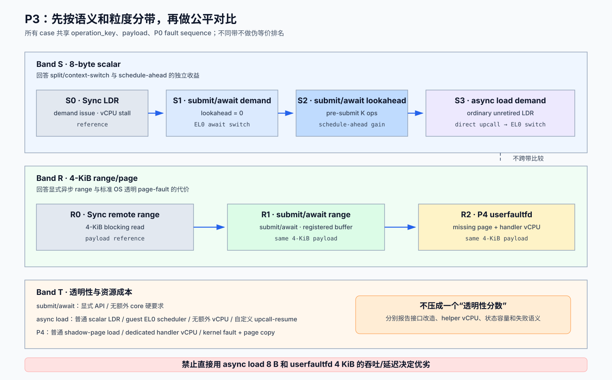

# P3：OBMM 远端 Load 路径对比评估详细设计

> 状态：评估器已实现；P2B ABI v2 的 2-node producer/consumer 功能验收、P3
> 2-node 49-case formal acceptance 与 4/8-node 定向 scale-out 均已通过。4,942-case
> full sensitivity matrix 已在远端启动但尚未执行完毕，因此完整 break-even 结论仍待生成
>
> 日期：2026-08-11
>
> 前置阶段：[P0](p0-baseline-latency-model-detailed-design.md)、
> [P1](p1-split-phase-backend-detailed-design.md)、
> [P2A](p2a-submit-await-detailed-design.md)、
> [P2B](p2b-scheduler-core-detailed-design.md)、
> [P4](p4-userfaultfd-baseline-detailed-design.md)
>
> 实施证据：[P0–P4 实施与验证报告](2026-08-12-obmm-remote-load-coroutine-implementation-validation.md)
>
> 性能结果：[2026-08-13 P3 ABI v2 性能评估](2026-08-13-obmm-p3-performance-evaluation.md)

## 1. 目标和退出结论

P3 的目标不是选一个总冠军，而是回答三个独立问题：

1. split-phase 和 context switch 能隐藏多少 remote wait；
2. P2A 的 pre-submit/lookahead 比 P2B demand-pending 多带来多少收益；
3. 用户态显式 API、页故障透明性和自定义 scheduler core 分别付出什么成本。

所有结论必须在相同 payload、logical operation、延迟/failure 序列和统计规则下产生。
scalar 和 page-range 是不同实验带，不能把 8-byte P2B 与 4-KiB `userfaultfd` 的结果
放在同一吞吐柱上直接排名。



## 2. 进入条件

P3 只在以下 gate 全部满足后运行正式矩阵：

- P0：scenario/manifest/QEMU/report hash 一致，三种时钟分列；
- P1：三种 sink 通过 64 in-flight、乱序、迟到和 terminal-race conformance；
- P2A：同一 vCPU 上 A await 时 B 推进，registered destination/CQ generation-safe；
- P2B：普通 `LDR` 只发出一次，pending 时原 load 不退休；QEMU direct upcall 到
  guest EL0，由 EL0 保存/选择/patch context，resume 时精确安装；
- P4：标准 userfaultfd feature probe、page fill、failure fail-closed 已通过；
- 所有路径与 sync oracle 的 payload/checksum 一致。

任一 gate 不满足时 CLI 仍可生成 `--dry-run` manifest，但正式结果标为 `invalid`，不能
生成性能结论。

截至 2026-08-13，ABI v2 已使用新 run ID 完成 2-node 49-case formal acceptance，
并完成 P2A demand 与 P2B demand 的 4/8-node、7-seed 定向 scale-out。旧 ABI v1
`S3-p2b-demand` raw rows 没有追认或拼接。当前剩余项是 4,942-case full matrix，
负责补齐 latency/compute/concurrency/jitter/failure sensitivity 与 break-even 区间；
单一 acceptance 基准点不得替代该矩阵。

## 3. 三个 canonical 比较带

### 3.1 Band S：scalar demand-load

| case | payload | issue point | suspension owner | 要回答的问题 |
|---|---:|---|---|---|
| `S0-sync` | 8 B | demand `LDR` | 无，vCPU stall | 同步参考 |
| `S1-p2a-demand` | 8 B | 消费点前立即 submit | EL0 runtime | 仅 split/context-switch 收益 |
| `S2-p2a-lookahead` | 8 B | 提前 K 个 logical ops submit | EL0 runtime | software schedule-ahead 增益 |
| `S3-p2b-demand` | 8 B | 普通 `LDR` remote miss | scheduler core | 透明 scalar load 的成本/收益 |

P2A demand case 必须令 `lookahead=0`；否则 P2A 同时获得提前发请求和切换的双重优势，
无法与 P2B demand-pending 隔离比较。

### 3.2 Band R：range/page transfer

| case | payload | issue/fault point | 粒度 | 要回答的问题 |
|---|---:|---|---:|---|
| `R0-sync-range` | 4 KiB | 显式同步 remote read | range | 页 payload 参考 |
| `R1-p2a-range` | 4 KiB | submit/await | range | 显式异步 range 的 overlap |
| `R2-userfaultfd` | 4 KiB | shadow mapping first touch | page | 标准 OS 透明路径代价 |

P2B v2 不进入 Band R，因为其白名单只有 1/2/4/8-byte scalar load。`userfaultfd` 不进入
Band S，因为 Linux userfaultfd 解决的是页缺失，不是单条 scalar load completion。

### 3.3 Band T：透明性与资源成本

Band T 不把不同粒度压成单一性能分数，而是报告：

| 维度 | P2A | P2B | P4 |
|---|---|---|---|
| hot-path 源码接口 | submit/test/await | 普通 scalar load | 普通 shadow-range load |
| machine-code suspension point | runtime `await` | 未退休 `LDR` | page fault / kernel block |
| 调度执行者 | 同一 application core 的 EL0 runtime | guest EL0 coroutine scheduler core（独立 scheduler stack） | dedicated userspace handler thread |
| 额外 core/vCPU | 无硬要求 | 无；不是 helper vCPU | 一个 handler vCPU |
| completion 粒度 | 1 B–64 KiB | 1/2/4/8 B | 4 KiB v1 |
| 软件/硬件改动面 | app/runtime/UAPI | 自定义 core/QEMU/控制面 | 标准 Linux UFFD + app handler |

## 4. 统一 workload 与 operation identity

所有 mode 使用同一 guest binary `obmm_async_coroutine`、同一 offset generator 和
checksum oracle。一个 logical operation 固定为：

```text
logical_op = {phase_generation, coroutine_id, ordinal, map_id, offset, length}
operation_key = P0 canonical hash(logical_op, model_seed)
```

不同 mode 可以改变 issue time，但不能改变 `operation_key`、offset、payload 或 injected
outcome。P4 的 4-KiB page 用该页 base offset 作为 identity；同页内多个 scalar access
不得冒充多个 remote operation。

`dependent` pattern 的下一个 offset 由前一个 value 导出，因此没有 lookahead；
`sequential/random` 可以按配置 lookahead。报告必须把 dependent 和 independent 分开。

## 5. 实验因素与默认矩阵

| 因素 | 默认取值 |
|---|---|
| topology | 2-node correctness；4/8-node scale-out |
| model latency | 0、1、5、10、50、100、1000 us |
| jitter/tail | 0；uniform 10%；1% +10× tail |
| outcome | success；error；drop→timeout；duplicate/late |
| coroutines | 1、2、4、8、32 |
| in-flight | 1、8、16、32、64 |
| P2A lookahead | 0、1、4、16、64 logical ops |
| useful compute | 0、1、5、10、50、100、1000 us/op |
| pattern | sequential、random、dependent、mixed local/remote |
| access size | Band S 8 B；Band R 4 KiB；扩展结果单列 |
| seed | correctness 1；正式统计 1..7 |

正式矩阵放在 versioned 文件：

```text
scenarios/experiments/obmm_remote_load_eval_v1.yaml
```

文件只引用现有 topology scenario，并列出 factors/cases；不复制或覆盖 P0 model。

## 6. 公平性规则

1. 同一 band 的 mode 使用相同 topology、QEMU build、guest image、CPU pinning、payload、
   operation list、model manifest 和 warmup policy；
2. P2A `demand` 与 P2B `demand` 均从真实消费点开始计时；P2A `lookahead` 单独列；
3. P1 v1 sink copy 包含在 end-to-end 时间中，并单列 copy bytes/ns；
4. P4 handler 使用的额外 vCPU、CPU time 和 staging copy 必须报告，不能当免费资源；
5. scalar case 禁止 transport batching；range case 的 chunking 由 P1 统一实现；
6. local/cache hit、shadow-page residency、mapping generation 和 warmup 必须由 manifest 固定；
7. timed run 默认关闭 per-request trace；另取 1% deterministic sampled trace 做诊断；
8. 每个 seed 内 case 顺序按 manifest 预生成的 deterministic permutation 执行，避免
   thermal/host-load 趋势固定偏向某个 mode；
9. 每 case 独立启动或执行完整 reset/drain gate，pending depth、page residency、ordinal
   都回到 manifest 指定初态；
10. host wall noise 只用于标记污染样本，不能修改 model virtual latency。

## 7. 测量边界与指标

### 7.1 时间分解

统一输出：

```text
T_issue       submit/RLA/fault setup
L_model       P0 accept -> publish
T_suspend     await switch / direct upcall+EL0 save+choose+resume / kernel fault block
W_useful      wait 窗口内退休的验证过的工作
T_complete    sink copy + CQ drain / PLT event+EL0 context patch / UFFDIO_COPY+wakeup
T_e2e         logical op 可消费结果的 guest elapsed time
T_makespan    全部 logical ops 完成时间
```

派生指标：

```text
overlap_hidden_ns = max(0, T_sync_makespan - T_mode_makespan)
overlap_efficiency = overlap_hidden_ns / min(total_model_wait_ns,
                                             available_useful_work_ns)
schedule_ahead_gain = T_p2a_demand - T_p2a_lookahead
mechanism_gain = T_sync - T_mode_demand
core_efficiency = useful_work_ns / sum(application_and_helper_cpu_ns)
```

分母为 0 时字段输出 `na`，不能输出 0 或 infinity。

### 7.2 必须报告

- guest latency/makespan p50/p95/p99/max 和 95% confidence interval；
- model latency与 host wall elapsed 分列；
- requests/s、bytes/s、checksum、success/error/timeout counts；
- ready/wait/idle 时间和 no-ready 次数；
- P2A submit/switch/CQ/lookahead；P2B PLT/upcall、EL0 save/choose/patch/restore；P4 fault/poll/read/
  `UFFDIO_COPY`/wake 和 handler CPU；
- P1 pending depth、capacity、sink-copy、late/duplicate；
- application vCPU、EL0 scheduler runtime、UFFD handler vCPU 的资源占用；P2B 的 QEMU
  context-save/restore/switch counters 必须为 0。

## 8. 统计设计与 invalidation

每 case/seed：先做不计数 warmup，再执行至少 10,000 scalar ops 或 1 GiB range payload，
两者取先达到“运行至少 2 秒”的条件。正式统计使用 7 个 seed；报告 median-of-seeds、
seed 间 min/max 和 bootstrap 95% CI，不把单次最好结果当结论。

以下任一条件使 case `invalid`：

- checksum、operation count 或 outcome sequence 与 oracle 不同；
- manifest/build/topology hash 不一致；
- pending/page/context 未 drain；
- trace dropped、counter overflow、clock regression；
- host elapsed 相对同组 median 偏离超过预先配置阈值且有 host-load 证据；
- P2A/P2B/P4 使用了不属于该 canonical case 的 lookahead、batch、helper vCPU 或 cache state；
- P2B 的 EL0 upcall/save/restore 未形成一一对应，或出现非零 QEMU scheduler/context counter。

invalid case 保留 raw evidence，但不参与聚合。重跑必须生成新 run ID，不能覆盖。

## 9. CLI、manifest 与产物

Host CLI：

```text
cargo run -p sim-cli -- obmm-remote-load-eval \
  --matrix scenarios/experiments/obmm_remote_load_eval_v1.yaml \
  --scenario scenarios/mvp_2host_single_domain.yaml \
  --bands scalar,range,transparency \
  --seeds 1..7 \
  --output-dir out/obmm-remote-load/<run-id> \
  --dry-run
```

`--dry-run` 展开完整 case list、检查各阶段 gate evidence、生成 randomized order 和
最终远端命令。产物固定为：

```text
run-manifest.json          hashes、build、topology、expanded cases、order
raw/<case>-<seed>.jsonl    per-phase/per-request sampled records
summary/<band>.csv         canonical metrics 与 CI
report.md                  只引用有效 case 的结论和限制
validation.json            gate、checksum、drain、invalid reasons
```

guest 单行输出：

```text
OBMM_EVAL_SUMMARY schema=1 band=scalar mode=p2b-demand seed=1 \
operations=10000 checksum=... failures=0 timeouts=0 guest_ns_p50=... \
makespan_ns=... model_wait_ns=... useful_work_ns=... status=pass
```

## 10. 实现落点

| 顺序 | 文件/目录 | 内容 |
|---:|---|---|
| 1 | `scenarios/experiments/obmm_remote_load_eval_v1.yaml` | versioned factors、case/band 定义 |
| 2 | `crates/sim-cli/` | matrix expand、gate check、dry-run、remote dispatch、aggregation |
| 3 | `guest-linux/aarch64/apps/obmm_async_coroutine/` | unified logical-op generator、mode runners、summary |
| 4 | P0/P1/P2/P4 trace points | canonical operation key、phase metrics、drain counters |
| 5 | `guest-linux/aarch64/tests/` | CLI/matrix/summary/manifest contract tests |
| 6 | Rust unit tests | permutation、CI、invalid filtering、report schema |

## 11. 测试与退出条件

本地轻量测试：matrix expansion golden、case-order determinism、operation list identity、
band compatibility、metric formulas、zero denominator、CI、invalid filtering、summary parser、
dry-run command snapshot。

远端 QEMU 测试：2-node correctness 全矩阵的最小子集，再扩 4/8-node；每个 mode 的
payload/outcome identity；trace-off timed run 与 sampled trace 的 counter 一致；reset/
drain；无残留 QEMU process。

P3 退出必须形成以下证据，而不是只产出曲线：

1. Band S 分离 demand mechanism gain 与 P2A schedule-ahead gain；
2. Band R 在同一 4-KiB payload 上比较 P2A 与标准 userfaultfd；
3. Band T 显式计算 helper vCPU、EL0 scheduler、软件改造和自定义 core mechanism 成本；
4. 每个结论能追溯到 hashes、raw rows、gate 和 valid seed；
5. 对“何种 L/W/并发下收益转正”给出 break-even 区间，未跨 gate 的结果不外推。

截至 2026-08-13，退出项 1–4 已在 acceptance 与定向 scale-out 基准点形成证据；
第 5 项仍受 full matrix 尚在运行、未最终聚合阻塞。当前结果和边界见
[P3 ABI v2 性能评估](2026-08-13-obmm-p3-performance-evaluation.md)。
