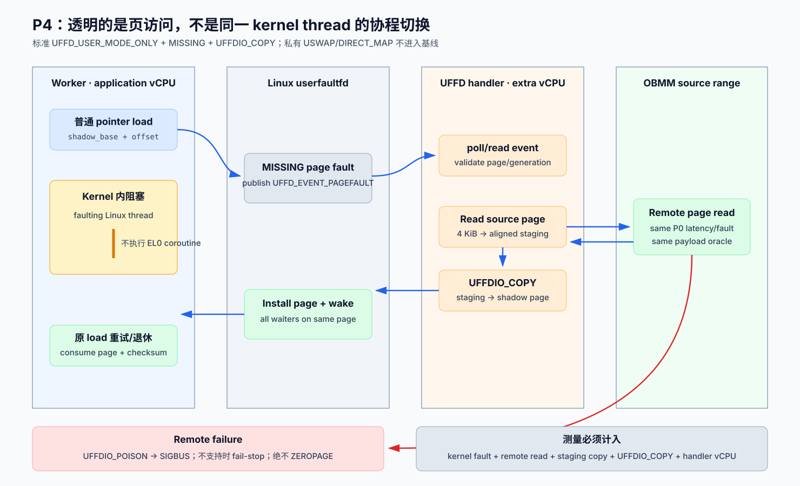

# P4：标准 userfaultfd 透明页访问基线详细设计

> 状态：已实现；P4 gate 通过
>
> 日期：2026-08-11
>
> 上位设计：[OBMM 远端 Load 协程可行性与验证设计](2026-08-11-obmm-remote-load-coroutine-feasibility-design.md)
>
> 对比阶段：[P3：对比评估](p3-comparative-evaluation-detailed-design.md)
>
> 实施证据：[P0–P4 实施与验证报告](2026-08-12-obmm-remote-load-coroutine-implementation-validation.md)

## 1. 目标和退出结论

P4 用 Linux 标准 `userfaultfd` MISSING 模式建立“普通指针 first-touch 自动触发远端页
读取”的透明 OS 基线。worker 访问匿名 shadow range；page missing 时 kernel 阻塞该
Linux thread，把事件交给独立 handler；handler 从 OBMM source range 读满一页，再以
`UFFDIO_COPY` 填入 shadow page 并唤醒 worker。

这条路径验证页粒度透明性的代价，**不能**验证“同一 kernel thread 在 faulting load
处主动切换到另一个 EL0 coroutine”：faulting thread 已进入内核等待；要推进工作必须
依靠另一 OS thread/vCPU。P4 因此是 P2A/P2B 的 OS 对照组，不是第三种同义实现。



## 2. 采用的标准内核契约

当前 guest kernel 6.6 配置包含 `CONFIG_USERFAULTFD=y`，本地 UAPI/文档提供：

```text
userfaultfd(UFFD_USER_MODE_ONLY)
  -> UFFDIO_API
  -> UFFDIO_REGISTER(mode=UFFDIO_REGISTER_MODE_MISSING)
  -> poll/read struct uffd_msg
  -> UFFD_EVENT_PAGEFAULT
  -> UFFDIO_COPY
```

v1 只依赖 upstream-compatible userfaultfd API。仓库 kernel 中即使存在私有
`UFFDIO_REGISTER_MODE_USWAP` 或 `UFFDIO_COPY_MODE_DIRECT_MAP`，P4 也不得使用；否则
结果不再代表标准 Linux 基线。

启动时必须 probe：

- `userfaultfd` syscall 成功；
- `UFFDIO_API` 协商成功且没有未知 required feature；
- range 支持 `UFFDIO_REGISTER_MODE_MISSING`；
- `UFFDIO_COPY` 在 ioctl bitmap 中可用；
- 若要验证 read failure 的页级 poison，额外 probe `UFFDIO_POISON`；缺失时使用
  fail-stop fallback，不把错误页填零。

任一 required capability 缺失，CLI 输出 `UNSUPPORTED` 并退出，不能回退成普通 memcpy。

## 3. 地址空间与 ownership

P4 使用两个互不重叠的 range：

| range | 映射 | 注册给 UFFD | owner | 用途 |
|---|---|---:|---|---|
| source range | OBMM/GSVA remote-readable mapping | 否 | OBMM | handler 的远端数据源 |
| shadow range | `mmap(MAP_PRIVATE|MAP_ANONYMOUS)` | MISSING | application | worker 的普通 pointer load 目标 |

shadow offset 与 source offset 一一对应：

```text
source_page = source_base + (fault_page - shadow_base)
```

registration 前检查两端 page alignment、`range_len`、加法 overflow 和 source map
generation。handler 每个 request 使用 page-aligned 4-KiB staging slot；v1 固定一个
handler、最多 64 个 tracked fault records，但 handler 可以同步服务每个 remote page。

staging 和 source 不注册到同一个 userfaultfd，避免 handler 自己再次 page fault 造成
递归死锁。handler stack、ring、日志 buffer 也必须在开始服务前 prefault/mlock 到可用
范围，不能依赖正在处理的 shadow mapping。

## 4. 组件与线程模型

| 组件 | 责任 |
|---|---|
| worker thread(s) | 对 shadow range 执行普通 load/copy，计算 checksum |
| kernel UFFD | 阻塞 page-faulting thread，向 fd 发布 pagefault event |
| handler thread | poll/read event，校验地址/generation，读取 source page，`UFFDIO_COPY` |
| P0/P1/sync source adapter | 为 handler 提供相同 remote payload 与 latency/failure model |
| launcher | 把 worker 与 handler pin 到不同 guest vCPU，并记录额外资源 |

handler 必须使用独立 pthread 和独立 guest vCPU。若只给一个 vCPU，handler 仍可能由
Linux 抢占 worker 后运行，但该结果混入 OS scheduler 行为，不能作为 canonical P4。
报告同时输出 worker/handler CPU time；额外 vCPU 不是免费资源。

P4 v1 source read 使用同步 remote-range helper，因为被阻塞的是 handler thread，不是
QEMU vCPU MMIO callback 的设计对象。P3 必须把 source read service time、kernel fault
和 `UFFDIO_COPY` 分解；未来可使用 P1/P2A 预取页，但要成为单独非 canonical case。

## 5. Page fault 状态机

每个 4-KiB fault page 的 userspace record：

```text
EMPTY
  -> FAULT_RECEIVED
       -> READING_REMOTE
            -> COPY_READY -> UFFD_COPYING -> RESOLVED
            -> READ_FAILED -> POISONED | FAIL_STOP
       -> STALE/OUT_OF_RANGE -> FAIL_STOP
```

多个 worker 同时 fault 同一页时，kernel 可能合并等待者或产生重复 event。handler
以 page index 建表：第一个 event 成为 owner，其他 event 只增加 waiter/duplicate
counter；只执行一次 remote read 和一次成功 resolution。`UFFDIO_COPY` 返回 `EEXIST`
时必须重新检查 page 已由同 generation 正确解决，不能盲目覆盖或记 success。

## 6. Success path

1. main thread 分配 source/shadow/staging，probe UFFD API；
2. 对 shadow range 执行 `UFFDIO_REGISTER_MODE_MISSING`，确认 ioctl bitmap；
3. 启动并 pin handler，等其进入 `READY` barrier 后再释放 worker；
4. worker 访问 `shadow + offset`，page missing 后在 kernel 内阻塞；
5. handler 从 UFFD fd 读到 pagefault event，把地址向下对齐到 page；
6. 校验 event 类型、address、range generation 和 source offset；
7. handler 记录 `remote_read_start`，把 source page 读入 staging，校验长度/checksum；
8. 对 fault page 调用 `UFFDIO_COPY(src=staging, dst=fault_page, len=4096)`；
9. ioctl 成功后 page 成为 present，kernel 唤醒所有等待该页的 worker；
10. worker 的原始 load 由 CPU/kernel 正常重试并退休，应用继续计算 checksum。

handler 不修改 worker PC/SP/GPR，也不在 signal trampoline 里执行 coroutine runtime。

## 7. Failure、timeout 与 shutdown

| 条件 | 动作 |
|---|---|
| remote read error/checksum/timeout | 若 probe 支持，`UFFDIO_POISON` 该页并记录预期 SIGBUS；否则置全局 fatal、终止进程 |
| fault address 越界/未对齐异常 | fail-stop；不对未知地址调用 `UFFDIO_COPY` |
| source map generation 已 retire | fail-stop 或 poison；不读新 generation 的同一 offset |
| UFFD fd HUP/ERR、short message | fail-stop，唤醒控制线程结束全部 worker |
| `UFFDIO_COPY` `EEXIST` | 验证同 generation 已解决；否则 fail-stop |
| worker cancel | 先停止产生新 fault，再 unregister/wake/terminate，最后 join handler |
| handler 自身 fault/递归 | watchdog fail-stop；测试必须证明 handler memory 已 prefault |

禁止在远端失败时 `UFFDIO_ZEROPAGE`。zero fill 会把错误伪装成成功数据，是本设计的
fail-closed 红线。

shutdown 顺序固定：stop workers → drain/resolve 或 fail outstanding faults →
`UFFDIO_UNREGISTER` → close uffd → join handler → unmap shadow/staging/source。不得先
unmap range 再让 handler 使用旧 fault address。

## 8. 可重复 fault 与 cache policy

一次 `UFFDIO_COPY` 后 shadow page 已 present，后续 load 不再产生 missing event。测量
remote fault 需要显式 phase boundary：

1. 所有 worker 到 barrier，确认没有人在访问目标页；
2. handler pending table 和 UFFD fd 已 drain；
3. 对 shadow phase range 执行 `madvise(MADV_DONTNEED)`，或销毁并新建 mapping；
4. 增加 `phase_generation`，重置 page record；
5. 释放下一 phase worker。

禁止 worker 正在读页时 eviction。warm-cache case 与 remote-fault case 分开：

- `uffd-present-hit`：先 fault/fill，measurement 只访问 present shadow page；
- `uffd-missing-remote`：measurement 的 first touch 才触发 remote read；
- warmup 用独立 phase generation，不消耗 measurement operation identity。

## 9. CLI 与输出

统一 guest CLI：

```text
obmm_async_coroutine \
  --mode userfaultfd \
  --uffd-case present-hit|missing-remote \
  --access-bytes 4096 \
  --worker-threads 1|2|4|8 \
  --handler-cpu <N> \
  --pages <N> \
  --pattern sequential|random \
  --iterations <N> \
  --deadline-us <N> \
  --seed <N> \
  --verify
```

v1 只接受 page-size access；`sysconf(_SC_PAGESIZE) != 4096` 时 `UNSUPPORTED`。dependent
scalar semantics 不属于该 mode。summary：

```text
OBMM_UFFD_SUMMARY schema=1 case=missing-remote pages=4096 faults=4096 \
remote_reads=4096 copy_ok=4096 duplicates=0 checksum=... \
fault_ns_p50=... remote_ns_p50=... copy_ns_p50=... handler_cpu_ns=... \
failures=0 status=pass
```

每页 sampled trace：

```text
obmm_uffd_fault operation_key=... page=... guest_ns=...
obmm_uffd_remote_done operation_key=... status=... guest_ns=...
obmm_uffd_resolve operation_key=... ioctl=copy|poison status=... guest_ns=...
```

## 10. 实现落点

| 顺序 | 文件/目录 | 内容 |
|---:|---|---|
| 1 | `guest-linux/aarch64/apps/obmm_async_coroutine/uffd_mode.c` | probe、ranges、handler、state、summary |
| 2 | `guest-linux/aarch64/apps/obmm_async_coroutine/` common | operation generator、checksum、barrier、CLI dispatch |
| 3 | `guest-linux/aarch64/common/` | 最小标准 UFFD wrapper；不包含私有 USWAP ioctl |
| 4 | guest build/initramfs/run-app | app 安装和 fixed dispatch |
| 5 | `guest-linux/aarch64/tests/` | source/layout/CLI/UAPI/summary contract tests |
| 6 | P3 matrix/launcher | worker/handler CPU pinning和资源记录 |

## 11. 测试与验收

### 11.1 本地轻量测试

- UFFD syscall/feature/ioctl bitmap probe 的 success/unsupported/error 分支；
- range/page alignment、offset overflow、generation 和 duplicate-event state machine；
- `EEXIST`、short event、HUP/ERR、remote error/timeout 的 fail-closed 行为；
- 源码/构建 contract 证明未使用 `USWAP`、`DIRECT_MAP` 或 error `ZEROPAGE`；
- CLI 拒绝非 4096-byte/P2B-only 参数；summary/trace parser；
- shutdown/phase ordering 的 mock tests。

### 11.2 远端 guest/QEMU 验证

- 一个 missing page 恰好一次 remote read，worker checksum 与 source oracle 相同；
- 多 worker 同页 fault 不重复搬运或覆盖；
- handler 在另一 vCPU 推进，faulting worker thread 在 kernel 内等待；
- present-hit 不产生新 UFFD event，missing-remote 每 phase 每页产生一次；
- remote error 形成 poison/SIGBUS 或 fail-stop，绝不 silent zero；
- phase reset、unregister、shutdown 后 fd/thread/mapping/pending 全部清零；
- run 后无残留 QEMU process。

### 11.3 P4 退出条件

1. 只使用标准 `UFFD_USER_MODE_ONLY + MISSING + UFFDIO_COPY` 主路径；
2. 4-KiB payload/checksum 与 sync/P2A range oracle 一致；
3. fault、remote read、copy/wakeup 和 handler CPU 成本可分解；
4. failure fail closed，缺少 optional poison 时明确 fail-stop；
5. 报告明确额外 handler vCPU 和“不能在同一 kernel thread 切 EL0 coroutine”的边界。
