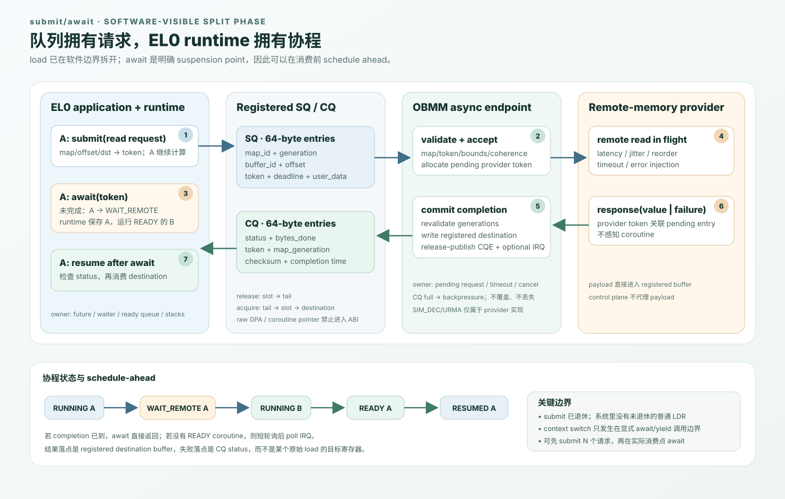

# OBMM submit/await + EL0 协程详细设计

> 状态：已实现；submit/await gate 通过
>
> 日期：2026-08-11
>
> 上位设计：[OBMM 远端内存 Load 的 EL0 协程延迟隐藏](2026-08-11-obmm-remote-load-coroutine-feasibility-design.md)
>
> 共同底座：[P1：provider-neutral split-phase backend](p1-split-phase-backend-detailed-design.md)
>
> 对照方案：[async load：普通 LDR + coroutine scheduler 详细设计](async-load-coroutine-scheduler-detailed-design.md)
>
> 实施证据：[P0–P4 实施与验证报告](2026-08-12-obmm-remote-load-coroutine-implementation-validation.md)

## 1. 结论

submit/await 把一次远端读显式拆成 `submit` 和 `await`：`submit` 产生稳定 token，远端结果
写入预注册 destination buffer，`await` 只在结果未完成时把当前 EL0 协程从
`RUNNING` 变为 `WAIT_REMOTE`。同一 guest vCPU 随后运行其他 `READY` 协程。

该方案是标准 AArch64/Linux 软件路径，不修改异常级别、普通 `LDR` 退休语义或
QEMU 的通用 MMIO read contract。它也是 async load 的正确性和性能基线。

对用户的直接影响是：访问点必须通过 API、编译器 lowering 或上层 tensor runtime
显式表达；作为交换，调用方可以在真正消费数据前提前 submit，完整处理 timeout/
retire/I/O failure，并且不依赖自定义 CPU。



## 2. 范围与非目标

### 2.1 submit/await 必须交付

- 一套 provider-neutral 的 64-byte SQ/CQ ABI；
- 独立 OBMM async endpoint，不复用现有 Lingqu 服务命令描述符；
- OBMM map、destination buffer 的注册和 generation 管理；
- 可在一个 AArch64 EL0 thread/vCPU 内切换的 stackful coroutine runtime；
- poll、IRQ/poll hybrid 两种 completion wakeup；
- 唯一 CLI `obmm_async_coroutine --mode async-poll|async-irq`；
- token、ring、状态机、CLI/build/run contract 测试；
- 与同步 OBMM/GSVA load 一致的 payload 校验和故障注入结果。

### 2.2 submit/await 不做

- 不让任意普通指针 `LDR` 自动变成异步访问；
- 不实现 remote store、atomic、exclusive、SVE/vector 语义；
- 不允许公开 UAPI 携带裸 coroutine 指针或可任意写入的 guest physical address；
- 不把 SIM_DEC、URMA 或某个具体 transport 名称暴露到 public ABI；
- 不把 QEMU host coroutine 当作 guest EL0 coroutine；
- 不在本阶段交付通用 C/C++ 编译器 pass。

## 3. 架构边界

### 3.1 组件

| 组件 | 所有状态 | 责任 |
|---|---|---|
| EL0 `libobmm_async` | future、waiter、ready queue、coroutine stack | submit/test/await、CQ drain、协程选择和切换 |
| guest driver | queue owner、pinned pages、buffer registration、process lifetime | 分配安全共享内存；验证 owner；mmap；IRQ/poll |
| OBMM async endpoint | SQ/CQ head/tail、queue ID、pending request | 校验并接收请求；发布 CQE；不感知 coroutine |
| OBMM adapter | map/generation/token/coherence metadata | 在 provider 之前 fail closed；避免绕过 OBMM lifecycle |
| remote-memory provider | request token、payload transfer、completion | 执行 split-phase read；不管理 EL0 上下文 |

现有 Linqu endpoint 的寄存器布局、64-byte ring slot 和 IRQ/poll 代码是实现参考，
不是可兼容的命令 ABI。submit/await 使用独立 capability/endpoint，避免服务命令和远端内存
命令共享 opcode、queue lifetime 或错误语义。

### 3.2 必须先完成的 P1 backend

submit/await 依赖一个真正的多请求 backend，而不是在 EL0 包装当前同步 read：

```text
accept request -> allocate provider token -> return to vCPU
               -> remote transfer in flight
response       -> P1 result slot -> validate generations
               -> submit/await sink copies destination -> publish CQE
```

当前单一 `sim_dec_sync_read` + poll/`g_usleep()` 只能用于 `sync-mmio` 基线。P1 应把
OBMM read pending state 独立出来；现有 URMA 64 项 pending table 可复用模式，但不能
跳过 OBMM map、token、epoch、coherence 检查。P1 v1 的 bounded result pool、分块聚合、
terminal arbitration 与 sink ownership 以
[P1 详细设计](p1-split-phase-backend-detailed-design.md)为准。

## 4. EL0 API

### 4.1 生命周期 API

```c
struct obmm_async_ctx;
struct obmm_async_buffer;
struct obmm_coro;

int obmm_async_open(struct obmm_async_ctx **out);
void obmm_async_close(struct obmm_async_ctx *ctx);

int obmm_async_map_register(struct obmm_async_ctx *ctx,
                            int obmm_fd,
                            uint64_t mem_id,
                            void *mapped_addr,
                            size_t length,
                            uint32_t flags,
                            uint64_t *map_id);
int obmm_async_map_unregister(struct obmm_async_ctx *ctx, uint64_t map_id);

int obmm_async_buffer_alloc(struct obmm_async_ctx *ctx,
                            size_t length,
                            struct obmm_async_buffer **out);
void *obmm_async_buffer_addr(struct obmm_async_buffer *buffer);
int obmm_async_buffer_free(struct obmm_async_buffer *buffer);
```

`map_id` 是 async endpoint 针对当前 process/queue 分配的 opaque handle，不等同于
OBMM `mem_id`。其内部记录 `mem_id + registration_generation + allowed range + access`
并在每次 submit 和 completion 时校验。

`obmm_async_buffer_alloc()` 从 driver 管理并可 pin 的 arena 分配 destination。公开
SQ 只携带 `buffer_id + offset`，不接受 `/proc/self/pagemap` 得到的裸 GPA。这样可以
保证 process ownership、completion 前 lifetime 和写入 bounds。

### 4.2 读 API

```c
struct obmm_async_read {
    uint64_t map_id;
    uint64_t remote_offset;
    struct obmm_async_buffer *dst;
    uint32_t dst_offset;
    uint32_t length;
    uint32_t flags;
    uint64_t deadline_ns;
    uint64_t user_data;
};

struct obmm_async_cqe {
    uint64_t token;
    int32_t status;
    uint32_t bytes_done;
    uint32_t provider_status;
    uint64_t checksum64;
    uint64_t completed_ns;
    uint64_t user_data;
};

int obmm_load_submit(struct obmm_async_ctx *ctx,
                     const struct obmm_async_read *req,
                     uint64_t *token);
int obmm_load_test(struct obmm_async_ctx *ctx,
                   uint64_t token,
                   struct obmm_async_cqe *cqe);
int obmm_load_await(struct obmm_async_ctx *ctx,
                    uint64_t token,
                    struct obmm_async_cqe *cqe);
int obmm_load_cancel(struct obmm_async_ctx *ctx, uint64_t token);
```

`obmm_load_submit()` 的成功只表示 endpoint 已拥有请求，不表示 payload 已到达。
queue full 时请求没有被接受，直接返回 `-EAGAIN`，不会产生 CQE。

### 4.3 协程 API

```c
typedef void (*obmm_coro_entry_fn)(void *arg);

int obmm_coro_spawn(struct obmm_async_ctx *ctx,
                    obmm_coro_entry_fn entry,
                    void *arg,
                    size_t stack_bytes,
                    uint64_t *coro_id);
int obmm_coro_run(struct obmm_async_ctx *ctx);
void obmm_coro_yield(struct obmm_async_ctx *ctx);
```

协程是 stackful、cooperative 的：只在 `yield`、未完成的 `await`、协程返回时切换，
不会由 IRQ handler 异步抢占。

## 5. 冻结的 SQ/CQ ABI v1

所有字段 little-endian；slot 固定 64 bytes、8-byte aligned。实现必须用
`static_assert(sizeof(...) == 64)` 和 offset assertions 锁定布局。

### 5.1 SQ entry

| Offset | Size | Field | 语义 |
|---:|---:|---|---|
| 0 | 2 | `abi_version` | v1 = 1 |
| 2 | 1 | `opcode` | v1 仅 `READ = 1` |
| 3 | 1 | `flags` | checksum、relaxed/acquire；未知位拒绝 |
| 4 | 4 | `length` | 1..64 KiB；不得跨 map/buffer bounds |
| 8 | 8 | `token` | queue/slot/generation；由 library 分配 |
| 16 | 8 | `map_id` | process-scoped opaque handle |
| 24 | 8 | `map_generation` | 注册时返回；防止 handle reuse |
| 32 | 8 | `remote_offset` | map 内偏移 |
| 40 | 4 | `dst_buffer_id` | driver 注册的 destination |
| 44 | 4 | `dst_offset` | buffer 内偏移 |
| 48 | 8 | `deadline_ns` | guest monotonic absolute deadline；0 表示无 deadline |
| 56 | 8 | `user_data` | 原样回 CQE；不得作为 host/guest 指针解引用 |

### 5.2 CQ entry

| Offset | Size | Field | 语义 |
|---:|---:|---|---|
| 0 | 2 | `abi_version` | v1 = 1 |
| 2 | 1 | `opcode` | `READ_COMPLETE = 0x81` |
| 3 | 1 | `flags` | duplicate/late 等只用于诊断的标志 |
| 4 | 4 | `status` | provider-neutral `enum obmm_async_status` |
| 8 | 8 | `token` | 必须完整匹配 queue/slot/generation |
| 16 | 8 | `user_data` | 从 SQ 复制 |
| 24 | 4 | `bytes_done` | success 必须等于 request length |
| 28 | 4 | `provider_status` | 诊断值；应用不得按 transport 解释 |
| 32 | 8 | `checksum64` | 未请求校验时为 0 |
| 40 | 8 | `completed_ns` | 模拟 device clock；只用于测量 |
| 48 | 8 | `map_generation` | completion 时再次观察到的 generation |
| 56 | 8 | `reserved` | 必须写 0、读时忽略 |

### 5.3 Token

```text
63                         32 31            16 15             0
+----------------------------+----------------+----------------+
| generation (32)            | queue_id (16)  | slot (16)      |
+----------------------------+----------------+----------------+
```

- `slot` 指向 library future table；v1 queue depth 不得超过 65535；
- `queue_id` 由 driver 分配，process exit 后旧 token 不得命中新 queue；
- slot 每次复用都增加 `generation`，0 保留为 invalid；
- duplicate、late、stale completion 只增加 counter，不写 destination、不唤醒 waiter。

### 5.4 Status

| 值 | 名称 | 说明 |
|---:|---|---|
| 0 | `OK` | payload 和可选 checksum 完整 |
| 1 | `INVALID` | version/opcode/flag/length 无效 |
| 2 | `NO_MAP` | map handle 不存在 |
| 3 | `BOUNDS` | map 或 destination 越界/整数溢出 |
| 4 | `PERMISSION` | token/read permission 拒绝 |
| 5 | `STALE` | map、queue 或 request generation 不匹配 |
| 6 | `RETIRED` | segment/map 已 retire |
| 7 | `TIMEOUT` | deadline 到期 |
| 8 | `REMOTE_IO` | provider 失败 |
| 9 | `CHECKSUM` | payload 校验失败 |
| 10 | `CANCELLED` | cancel 在 completion commit 前获胜 |
| 11 | `UNSUPPORTED` | provider/ordering/size 不支持 |

library 把 status 映射为稳定 errno，同时把原始 status 保留在 CQE。禁止用
`bytes_done == 0` 或 payload 全 0 推断失败。

## 6. Queue endpoint 与 ownership

### 6.1 MMIO register page

独立 endpoint 通过 device tree/sysfs capability 发现，不冻结物理基址：

| Offset | Register | Owner |
|---:|---|---|
| `0x000` | `VERSION_CAPS` | device |
| `0x008` | `STATUS` | device |
| `0x010` | `SQ_BASE` | guest setup，之后只读 |
| `0x018` | `SQ_SIZE` | device capability |
| `0x020` | `SQ_HEAD` | device |
| `0x028` | `SQ_TAIL` | guest |
| `0x030` | `CQ_BASE` | guest setup，之后只读 |
| `0x038` | `CQ_SIZE` | device capability |
| `0x040` | `CQ_HEAD` | guest |
| `0x048` | `CQ_TAIL` | device |
| `0x050` | `DOORBELL` | guest |
| `0x058` | `IRQ_STATUS` | device |
| `0x060` | `IRQ_ACK` | guest |
| `0x068` | `LAST_ERROR` | device |
| `0x070` | `QUEUE_ID` | device/driver |

v1 默认 SQ/CQ depth 均为 64，可配置为 8..4096 的 2 次幂。ring 使用 monotonically
increasing 64-bit head/tail；slot index 为 `counter & (depth - 1)`。不采用“留一个空
slot”的模糊约定，满条件固定为 `tail - head == depth`。

### 6.2 内存顺序

SQ：guest 填完整 slot，执行 release fence，再发布 `SQ_TAIL`/doorbell；device acquire
读取 tail 后才读取 slot。

CQ：device 先写 destination，随后写 CQ slot，执行 release publish，最后更新
`CQ_TAIL`；guest acquire 观察 tail，读取 CQE 后才能访问 destination。

同一 queue 为 single-producer/single-consumer。多个应用线程必须各自创建 queue，
或在 library 外串行化；v1 不把 MPMC 放进 ring ABI。

### 6.3 destination ownership

请求从 submit 成功到 `CONSUMED/CANCELLED` 之间，buffer range 归 device request
所有。应用不能写、free 或重注册该 range。cancel 只有在收到 `CANCELLED` CQE 后才
释放 ownership；“发出 cancel”本身不构成完成。

## 7. Future 与协程状态机

### 7.1 Request state

```text
FREE -> RESERVED -> SUBMITTED -> PENDING_REMOTE
                              -> READY | FAILED | TIMED_OUT | CANCELLED
                              -> CONSUMED -> FREE(next generation)
```

只有 endpoint 接受 SQ 后才能从 `RESERVED` 进入 `SUBMITTED`。queue full 时回滚到
`FREE`，token 不对外生效。

### 7.2 Coroutine state

```text
NEW -> READY -> RUNNING -> WAIT_REMOTE -> READY
                |   \-> READY (yield)
                \----> DONE
```

每个 token 最多一个 waiter。`await` 行为：

1. 先 drain CQ，避免 completion 已到仍然切换；
2. future 已 terminal：复制 CQE 并立即返回；
3. 未完成：把 `(token, current_coro)` 写入 waiter table；
4. 将当前协程设为 `WAIT_REMOTE`，选择下一个 `READY`；
5. 若没有 ready 协程，执行 `spin_us`，再 `poll(/dev/linqu-ub0)`；
6. CQE acquire 后把 waiter 设为 `READY`；恢复时 `await` 返回 status。

IRQ handler 只 ack 并唤醒 wait queue，绝不在内核/IRQ 上下文保存用户寄存器或运行
EL0 scheduler。

### 7.3 AArch64 context ABI

协程切换发生在普通函数调用边界。v1 保存：

- `x19..x30`、`sp`；
- `q8..q15`（比 AAPCS64 最低要求更保守）；
- `FPCR`、`FPSR`；
- stack base/limit、state、coroutine generation。

caller-saved registers 由正常 C ABI 负责。所有协程共享一个 Linux thread、address
space、signal mask 和 `TPIDR_EL0`；v1 不提供 per-coroutine TLS。stack 由 runtime
`mmap`，两侧 guard page，16-byte 对齐。协程返回必须进入 runtime exit trampoline，
不能从初始 entry 直接落入未定义 LR。

## 8. QEMU/OBMM backend 详细流程

### 8.1 Submit

```text
drain SQ
  -> validate version/opcode/reserved/overflow
  -> validate queue owner + token generation
  -> resolve map_id and map_generation
  -> validate [remote_offset, length) and read permission
  -> validate buffer_id + destination bounds/lifetime
  -> perform OBMM token/epoch/coherence acquire checks
  -> local/cache hit: copy payload and publish CQE
  -> remote miss: allocate pending entry and provider request
```

pending entry 必须复制稳定身份和 bounds，不持有可在 guest 中失效的 raw pointer：

```text
queue_id, token, map_id, map_generation,
remote_offset, length, buffer_id, dst_offset,
deadline, user_data, provider_token, state
```

### 8.2 Complete

```text
provider response
  -> P1 match provider token/chunks and commit terminal result
  -> revalidate request + map + buffer generations
  -> reject duplicate/late/stale
  -> submit/await sink copies P1-owned payload to registered destination
  -> optional checksum verify
  -> release-publish CQE
  -> raise coalesced IRQ if armed
```

P1 v1 有意保留一次 result-slot 到 registered destination 的 sink copy，以确保 provider
不持有 guest buffer 裸指针。该 copy 的 bytes/ns 必须进入指标。后续 direct-to-
destination 只能作为独立优化，并继续满足相同 generation、terminal 和 CQ publish
语义。

CQ 满时不得覆盖未消费 slot。endpoint 保留 terminal pending entry并置
`CQ_BACKPRESSURE`，guest 更新 `CQ_HEAD` 后继续 flush。若 CQ 长期不前进，记录 queue
fault，但仍不能静默丢 completion。

### 8.3 Timeout、cancel、retire 的竞争

所有 terminal transition 通过单一 compare-and-commit 点决定胜者：

- completion 先 commit：cancel 返回 already-completed；
- cancel 先 commit：后到 response 只记 late counter，不写 destination；
- deadline 先 commit：生成 `TIMEOUT` CQE；
- map retire 先 commit：尚未完成请求生成 `RETIRED`；
- process/queue teardown：先停止新 submit，再 cancel/drain，最后 unpin buffer。

## 9. Schedule-ahead 策略

submit/await 的主要优势不是 `await` 本身，而是可以在消费点之前发出请求：

```c
for (i = 0; i < lookahead; i++)
    token[i] = submit(item[i]);

for (i = 0; i < count; i++) {
    await(token[i]);
    consume(item[i]);
    token[i + lookahead] = submit(item[i + lookahead]);
}
```

初始 `lookahead = ceil(expected_remote_latency / compute_per_item)`，受 queue depth、
buffer bytes 和 `max_inflight` 限制。dependent chain 没有可提前的独立地址，必须单独
报告，不能与 sequential/random 结果混合。

## 10. 实现落点

| 顺序 | 文件/目录 | 实现内容 |
|---:|---|---|
| 1 | `guest-linux/kernel_ub/include/uapi/ub/obmm_async.h` | v1 ioctl、SQ/CQ、status、capability；layout asserts |
| 2 | `guest-linux/aarch64/driver/linqu_ub_drv.c` | queue/buffer owner、mmap/ioctl、poll/IRQ、teardown |
| 3 | `vendor/qemu_8.2.0_ub/include/hw/ub/ub_obmm_async.h` | submit/await endpoint/SQ/CQ adapter state |
| 4 | `vendor/qemu_8.2.0_ub/hw/ub/ub_obmm_async.c` | MMIO、SQ drain、CQ publish、timeout/cancel |
| 5 | P1 `ub_obmm_remote.*`、`ub_ubc.c` | 共同 validation、result pool、provider completion；submit/await sink 复制/发布 |
| 6 | `guest-linux/aarch64/libs/obmm_async/` | C API、future table、ring、AArch64 context switch |
| 7 | `guest-linux/aarch64/apps/obmm_async_coroutine/` | 统一 CLI、workload、checksum summary |
| 8 | `guest-linux/aarch64/scripts/build_initramfs.sh` | 构建并打包 app/library |
| 9 | `guest-linux/aarch64/initramfs/run_app` | kernel cmdline dispatch |
| 10 | `guest-linux/aarch64/tests/` | UAPI/layout/build/run/summary contract tests |
| 11 | `scenarios/` | provider-neutral latency/failure model |

QEMU build必须使用仓库 wrapper。QEMU、多节点、模型 workload 和完整矩阵不得在本地
开发机运行；本地只执行已知轻量的编译、layout/static/unit contract。

## 11. CLI 与输出契约

```text
obmm_async_coroutine \
  --mode async-poll|async-irq \
  --coroutines 1|2|4|8|32 \
  --inflight 1|8|16|32|64 \
  --lookahead <N> \
  --access-bytes 8|64|256|4096|65536 \
  --pattern sequential|random|dependent \
  --compute-us <N> \
  --iterations <N> \
  --deadline-us <N> \
  --seed <N> \
  --verify
```

唯一机器可解析结果行：

```text
OBMM_ASYNC_SUMMARY abi=1 mode=async-poll status=pass \
coroutines=8 inflight=32 lookahead=16 completed=... failures=0 \
timeouts=0 stale=0 checksum=... latency_us_p50=... latency_us_p99=... \
switch_ns_p50=... cq_drain_ns_p50=... overlap_milli=...
```

日志可有多行，但测试和自动化只以最后一个 summary 为准。

## 12. 测试与验收

### 12.1 本地轻量测试

- `sizeof/offsetof` 与 little-endian encode/decode golden vectors；
- token wrap、generation reuse、stale/duplicate/late completion；
- SQ/CQ full、monotonic counter wrap、release/acquire contract；
- request/coroutine 全状态转换；
- cancel/timeout/retire 三方竞争的确定性模型测试；
- buffer bounds、ownership、free-before-completion 拒绝；
- AArch64 callee-saved/GPR/SIMD/FPCR/FPSR/stack canary 切换测试；
- CLI 参数、summary、build/initramfs/run_app contract。

### 12.2 远端 QEMU 验证

- 在同一 guest vCPU 上证明 A `WAIT_REMOTE` 时 B 的 progress counter 增长；
- 0/1/5/10/50/100/1000 us、jitter、reorder、drop/error；
- 1..64 in-flight，CQ backpressure 和 IRQ coalescing；
- sync baseline 与 async payload/checksum 完全一致；
- failure 从不表现为 payload 0 的 success；
- guest 退出后无残留 `qemu-system-aarch64`。

### 12.3 submit/await 退出条件

1. 64 个乱序 in-flight 请求无错配、越界或 CQ 覆盖；
2. A 等待时 B 在同一 vCPU 推进，A 恢复后寄存器/栈/结果正确；
3. timeout、retire、cancel、duplicate、late response 全部 fail closed；
4. local/cache hit 相对 sync 回归不超过上位设计门槛；
5. CLI、测试、构建和远端验证命令及结果进入 validation report。

## 13. 尚未冻结的实验参数

以下不是 ABI，必须由 P0/P1/submit/await 数据决定：

- `spin_us`、IRQ coalescing threshold；
- 默认 `lookahead`、`max_inflight`、batch size；
- 8-byte 标量访问的 break-even point；
- checksum 算法和是否只在验证模式启用；
- local/cache hit 的 inline completion 阈值。

这些参数可以调优，但不能改变已经冻结的 ownership、generation、failure 和
release/acquire 语义。
