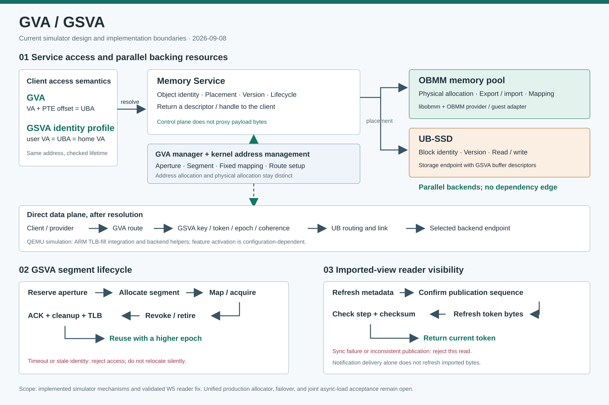
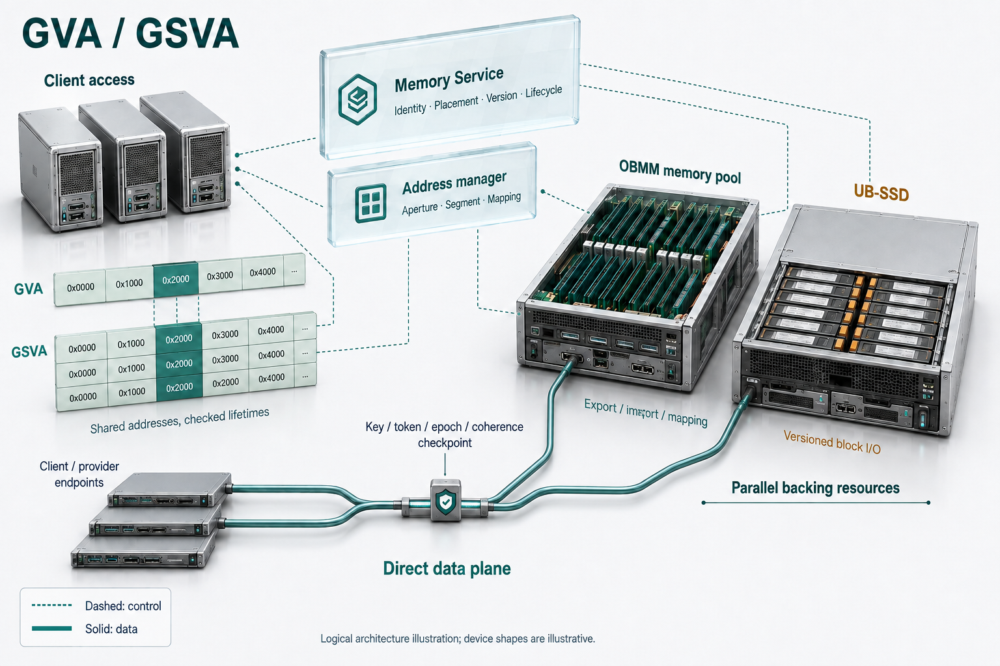

# GVA 设计：地址访问、服务管理与数据面

更新：2026-09-08。代码基线：ub_sim `39576eb`；QEMU `f201ebe`；
kernel_ub `85fb35d`；mem_service `e4a8a58`；libobmm `53011ee`。

本文替代原先以“下一阶段加入 GVA”为前提的设计叙述。
当前实现规格见 [实现与验证](sim_gva_gsva_implementation_spec.md)，
地址分配和回收见 [GSVA 管理设计](sim_gsva_shared_virtual_address_design.md)。
过去的逐阶段试验记录保留在原有运行报告中；本文不把历史 PASS 当成本次重测结果。

## 1. 结论与边界

GVA 提供地址翻译与跨节点路由语义；GSVA 是施加严格同址约束、
segment 身份与生命周期约束的访问配置。二者位于使用者访问服务数据的这一侧。
mem_service 负责对象身份、位置、版本和生命周期，客户端取得描述符后，
由具体 provider 或已建立的映射完成数据访问。

OBMM mem pool 和 UB-SSD 是并列的 backing 资源。
前者提供内存分配、导出、导入和映射，后者提供带版本的块对象读写。
某次传输可以使用 OBMM buffer 承载 UB-SSD I/O，但这不会建立两种资源的固定上下级关系。

当前具备可运行的 GVA/GSVA 仿真机制。服务级分配整合和动态描述符仍需补齐；
GVA/GSVA 分配、映射状态的故障恢复及联合 async-load 尚需完整验收。
mem_service 已有 journal 和恢复机制；上述缺口不表示整个服务缺少持久化能力。
启用了某项 W5 GSVA 描述符配置，也不能据此认定该次运行的所有 CPU 访存
都走了 GSVA ARM MMU 路径。

## 2. 架构图

图中上半部分是逻辑职责分解；数据面条带表达经过对象解析后的访问责任，
不表示所有 backend 都按同一条硬件时序执行。虚线表示地址管理配置。
两种 backing 之间没有依赖箭头。下半部分区分 segment 生命周期与读取可见性。

### SVG 逻辑原图

[打开可缩放 SVG](gva_gsva_current_architecture.svg)

### AI 生成空间架构插画

[打开原始 PNG](gva_gsva_current_architecture.generated.png)

SVG 是可维护的逻辑源，保留完整流程与约束。PNG 从 SVG 提取架构关系，
重新构图为空间插画，重点展示客户端、逻辑控制层、并列设备与直接数据访问；
生命周期及 reader 时序只在 SVG 中展开。PNG 原生尺寸为 1536 × 1024。
图中的机箱、线缆和 checkpoint 是职责的视觉符号；它们不规定真实硬件形态，
也不表示需要增加一个物理检查设备。地址格的对齐表示严格 GSVA 的同址语义。
实线表示直接数据访问，虚线表示控制关系；两种 backing 之间没有依赖边。
生成工具没有返回可核验的模型版本字段，故本仓库不把该图标为已核验的
GPT-image2 产物。[生成提示与核对记录](gva_gsva_current_architecture.imagegen.md)
保留生成依据。修改逻辑时先改 SVG，再更新插画并核对连接和标签。

## 3. 职责划分

| 层次 | 负责什么 | 不承担什么 |
| --- | --- | --- |
| 客户端、SDK、适配器 | 请求对象或地址访问能力，遵守版本和租约，消费描述符 | 在 infer 内创建全套基础设施 |
| mem_service 对象管理 | 对象记录、placement、backend 引用、版本、生命周期 | 按 LLM 模型选择底层传输；控制面转发 payload |
| GVA manager 与 guest kernel | aperture 协商/登记、segment 地址分配、固定映射、route 编程 | 仅凭统一 VA 承诺物理内存已分配 |
| OBMM/libobmm | 物理 backing、export/import、共享映射及其有效性 | 为整个服务实现完整对象目录和多租户调度 |
| UB-SSD backend | block identity、version、offset、bytes、checksum 与块 I/O | 把普通存储块直接当作所有进程可 LD/ST 的内存 |
| QEMU GVA/GSVA | 路由匹配、身份/权限/epoch、模拟 coherence、TLB 失效 | 周期准确模拟真实 CPU cache、NoC 和内存控制器 |

Memory Service 的通用 core 保持 transport-neutral；OBMM、UB/URMA 等实现位于
provider/适配层。OBMM remote mapping 与显式消息/传输各有职责，
不能把 OBMM 映射描述成依靠 URMA 搬运 payload 的统一路径。

## 4. 地址与路由

普通 GVA 的核心关系是 `UBA = VA + PTE.offset`。
实现还必须验证访问范围、访问类型以及所属地址上下文。
S3 路由用 VMID、ASID 和地址范围等元数据定位路由；
目的信息包括 CNA/EID、token、UPI 和 p_tag。NoC/UBC 路由元数据决定出口，
UB Link 与目标端检查完成实际 backing 访问。

严格 GSVA 配置要求 `user_va = uba = home_va`，并要求 `pte_offset = 0`。
这种数值同址与 segment 身份、权限、epoch 校验共同成立才构成有效访问。
地址翻译成功不等于对象仍然有效；队列通知送达也不等于导入视图已经刷新。

### 当前 QEMU 路径

- [ARM TLB fill](../vendor/qemu_8.2.0_ub/target/arm/tcg/tlb_helper.c)
  调用 `gsva_arm_mmu_translate_full()`；目标路径拒绝无效访问，
  成功时生成可供后续访存使用的映射。
- [UBC backend](../vendor/qemu_8.2.0_ub/hw/ub/ub_ubc.c)
  保留 GVA route、legacy SIM_DEC 控制和数据面辅助逻辑。
- [GSVA route](../vendor/qemu_8.2.0_ub/hw/ub/gsva_route.c)、
  [key](../vendor/qemu_8.2.0_ub/hw/ub/gsva_key.c)、
  [coherence](../vendor/qemu_8.2.0_ub/hw/ub/gsva_coherence.c)
  分别负责路由、身份检查和对象级一致性事务。

`gsva_arm_mmu_enabled()` 根据 experimental feature 配置和 `GSVA_MODE` 决定是否启用。
显式 `GSVA_MODE=arm_mmu` 可选择 ARM MMU 入口；
`sim_gva_tcg` 是保留的过渡入口，ARM MMU 模式启用时不会同时启用该过渡路径。
这些是仿真器选择条件，不能写成“所有 W5 默认都走 GSVA”。

SIM_DEC 在当前代码中仍用于控制、imported PA window 和部分 backend 工作。
文档将它标记为仿真实现机制，不把它添加成目标硬件 GVA 架构中的独立必需设备。

## 5. Allocation 与管理的真实状态

“memory manager 提供 GSVA feature”是服务边界上的目标方向。
当前实现分布在以下部分，尚无证据支持把它们描述为单一、完整的生产服务：

| 分配或管理对象 | 当前实现 |
| --- | --- |
| OBMM 物理内存 | kernel 的 `ubmempool_allocator.c`、`obmm_export_from_pool.c` |
| 全局地址 aperture 和 segment | guest `gva_manager` 与 OBMM kernel GSVA UAPI |
| W5 对象 payload 子分配 | mem_service 的 `mem_service_obmm_objects.c`，线性 payload arena |
| 服务对象与 backing 绑定 | mem_service record、placement、GSVA buffer descriptor、UB-SSD block ref |

地址 allocator、物理 allocator、对象 arena 必须清楚分工。
W5 arena 的线性游标不能证明已经具备通用 malloc/free、碎片整理或跨租户配额。
GVA manager 的 bootstrap/CLI 也不能自动证明已实现常驻多客户端管理、
持久化分配日志或节点失效接管。

## 6. 验证边界

历史报告记录过 GVA route、严格 GSVA 地址、aperture 保护、
ARM MMU 2/4/8-node 以及 token/coherence 生命周期试验：
[阶段状态与原始证据](sim_gva_gsva_obmm_mesi_stage_status_summary.md)。

2026-09-07 的 [W5 token 可见性调查](2026-09-07-w5-terminal-token-visibility-investigation.md)
证明了独立问题：对象 reader 需要显式刷新已导入视图。
`e4a8a58` 修复后的 Qwen3-0.6B 4-node/8-node、4-step
GSVA KV + shortpath 配置均完成预期 forwards 与 tokens。
该证据不覆盖全部 GSVA coherence 操作，也不证明真实 prefix cache 命中收益。

本次刷新只进行代码与文档核对、SVG/PNG 检查、链接和格式检查；
没有重跑 QEMU、模型推理或全套性能实验。

## 7. 后续推进

阶段、代码落点、远端验证和完成判据见
[服务能力补齐实施计划](plans/2026-09-08-gva-gsva-service-completion-plan.md)。

1. 收敛服务级地址分配接口：统一 segment、object、backing 三种身份，
   保持 provider 边界，允许分别分配 OBMM 内存和 UB-SSD 块。
2. 将 GSVA descriptor 的固定 profile 值替换为可验证的动态 generation、
   lease 与地址上下文；覆盖 revoke、retire、reuse 对客户端的可见性。
3. 补常驻多客户端 allocator 的回收、配额、重启恢复与失效接管验证。
4. 将 async-load 的 mapping handle/generation 与 GSVA key/token/epoch 联合验收。
5. 性能分别测量地址解析、数据传输、coherence、对象读取及端到端 infer；
   使用已展开的 legacy baseline，避免把线性查表慢直接归因为 GVA 的普遍收益。

相关历史性能证据见 [数据面收益报告](2026-06-24-w5-gva-gsva-dataplane-benefit-report.md)。
