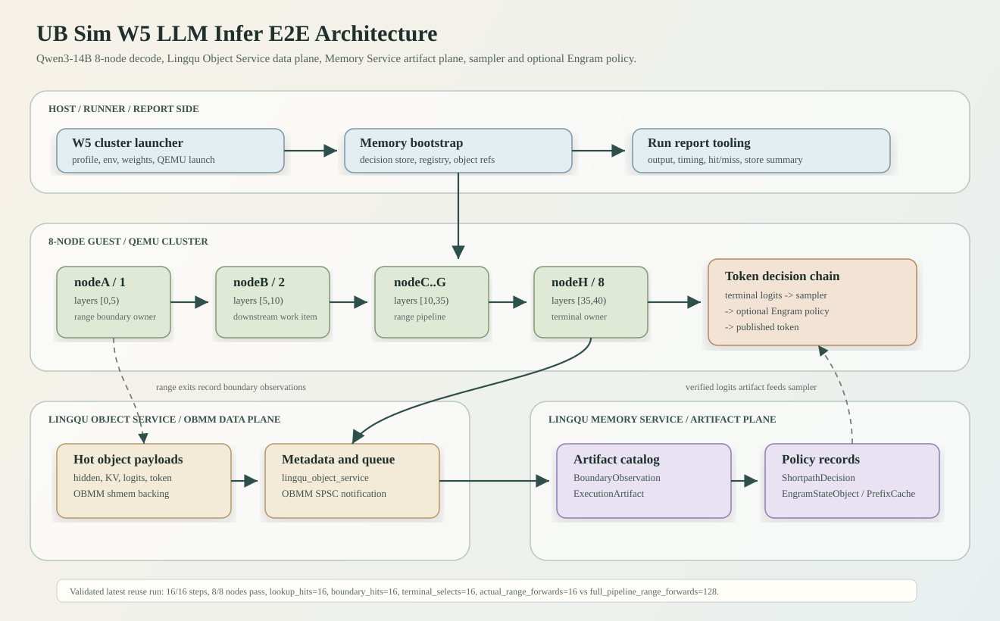
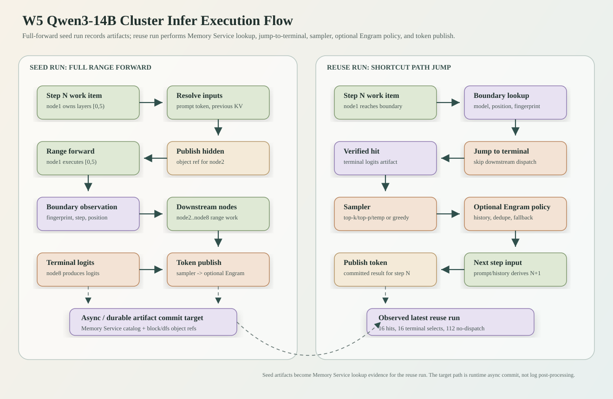

# UB Sim LLM Infer 端到端验证报告

日期：2026-05-26

## 结论

W5 当前已经在 W4 guest/QEMU 多节点底座上形成 Qwen3-14B LLM inference 的端到端闭环。最新稳定验证包含一轮 seed 和两轮 reuse 的 8-node、16-step cluster infer：

| 轮次 | run id | 目的 | 结果 |
| --- | --- | --- | --- |
| seed run | `2026-05-26_21-11-58_w5_qwen3_14b_decode_11113` | 完整 8-node range forward，在 decode 过程中 async commit artifacts into Memory Service | 16/16 steps 完成，8/8 nodes pass，`worker_timing_records=128`，`memory_boundary_observation_summary.records=112`，`post_run_promote_disabled` |
| reuse run | `2026-05-26_21-20-32_w5_qwen3_14b_decode_7659` | 直接加载 seed run 写入的 Memory Service durable store，验证 runtime artifact lookup 与 `jump-to-terminal` 执行 | 16/16 steps 完成，8/8 nodes pass，`lookup_hits=16`，`boundary_hits=16`，`terminal_selects=16`，`actual_range_forwards=16` |
| Engram reuse run | `2026-05-26_21-26-19_w5_qwen3_14b_engram_decode_11407` | 在同一 runtime durable store 上启用 Engram policy，验证 sampler -> Engram -> published token 串行路径 | 16/16 steps 完成，8/8 nodes pass，`engram_timing_records=128`，`engram_context_records=16`，`matches_terminal=true` |

当前主线状态：

- W4 报告仍然保留为 guest/QEMU resource-backed UAPI、OBMM object service、Qwen3-0.6B decode-loop 的底座验证文档，不应该删除。
- 本报告聚焦 W5 LLM inference：Qwen3-14B、8-node layer-range pipeline、Memory Service artifact access、Shortcut Path Jump、sampler/Engram policy 串行决策，以及 data store 的分层职责。
- 最新 non-Engram/Engram reuse run 证明 shortpath 不是“只写日志”或“后处理 replay”：运行时直接消费 seed run 异步写入的 Memory Service durable store，命中 verified terminal logits artifact，走 sampler selected token，再发布 terminal token。
- 最新 Engram reuse run 启用了已实现的 Engram policy：sampler selected token 之后进入 Engram writeback，`engram_timing_records=128`，`engram_context_records=16`，`matches_terminal=true`。这验证的是当前实现里的 Engram policy path，不是 paper Engram alignment，也不是 Prefix Cache。
- 当前 artifact lifecycle 已经完成 E2E 收敛：range forward runtime 在 decode 过程中异步提交 boundary observation、KV artifact 和 terminal logits artifact 到 Memory Service；summary/log post-run promote 已从默认路径降级为显式兼容/调试开关；第二轮已经直接消费 runtime commit 结果并在 node1 boundary 命中 shortpath。

## 系统架构

W5 不是替换 W4，而是在 W4 已验证的 guest/QEMU/resource-backed UAPI 底座上增加 LLM inference runtime、Memory Service artifact plane 和 policy plane。



W5 的职责边界：

| 层级 | 职责 | 当前验证状态 |
| --- | --- | --- |
| guest worker | 消费 step-local work item，执行本 node layer range，发布 hidden/KV/token artifacts | seed/reuse 两轮均通过 |
| QEMU / UAPI | resource-backed descriptors、CQ completion、guest/QEMU 进程与串口日志 | 继承 W4 底座，W5 profile 继续使用 |
| OBMM / Lingqu Object Service | hidden/KV/logits/token payload 的热路径对象发布、解析、SPSC 通知 | seed run 记录 `hidden_backend=obmm_shmem`，reuse run 消费 Memory Service artifact |
| Memory Service | 记录 boundary observation、构建 lookup request、验证 artifact、返回 shortpath decision | reuse run `lookup_hits=16` |
| sampler policy | 从 terminal logits 选择 selected token | reuse run `qwen3_w5_memory_terminal_logits_selected` |
| Engram policy | 在 sampler 之后继续做去重/历史/状态相关的 selected token 调整 | Engram reuse run 已通过，`matches_terminal=true` |
| report tooling | 汇总 output、timing、hit/miss、store 状态 | 最新 summary 已覆盖 timing 和 Memory Service stages |

## Qwen3-14B W5 模型与 layer range

当前 `qwen3_14b_decode` profile 从 Qwen3-14B config 推导模型形态：

| 字段 | 数值 |
| --- | ---: |
| `vocab_size` | 151936 |
| `hidden_size` | 5120 |
| `intermediate_size` | 17408 |
| `num_hidden_layers` | 40 |
| `num_attention_heads` | 40 |
| `num_key_value_heads` | 8 |
| `head_dim` | 128 |
| `max_position_embeddings` | 40960 |
| `rope_theta` | 1000000 |
| `hidden_range_bytes` | 1310720 |
| `decode_hidden_bytes` | 10240 |
| `kv_state_bytes` | 327680 |

8-node balanced placement：

| node | layer range | 下游 |
| --- | --- | --- |
| nodeA / node1 | `[0,5)` | nodeB |
| nodeB / node2 | `[5,10)` | nodeC |
| nodeC / node3 | `[10,15)` | nodeD |
| nodeD / node4 | `[15,20)` | nodeE |
| nodeE / node5 | `[20,25)` | nodeF |
| nodeF / node6 | `[25,30)` | nodeG |
| nodeG / node7 | `[30,35)` | nodeH |
| nodeH / node8 | `[35,40)` | terminal logits/token |

seed run 的 `112` 条 boundary observations 来自：

```text
16 decode steps x 7 range-exit boundaries(node1->2 ... node7->8) = 112
```

## Full Forward 运行流程

完整 range-forward 轮次用于产生可复用 artifacts。每个 worker 本身不需要维护全局 step 状态；step、node range、输入输出对象引用都属于 work item。



Full forward 的数据面发布点：

| artifact | 生产者 | 消费者 | backing / metadata |
| --- | --- | --- | --- |
| range runtime input | 上游 node | 下游 node | `obmm_shmem` + `lingqu_object_service` + `obmm_spsc` |
| range runtime output | 当前 node | 下游 node / Memory Service observation | `obmm_shmem` + object metadata |
| KV state | 每个 node | 下一 step 同 node work item | `obmm_shmem` + object metadata |
| terminal logits | nodeH | sampler / Memory Service execution artifact | object-backed artifact |
| terminal token result | terminal owner | 下一 step prompt/history | object service token record |
| boundary observation | node1..node7 range exit | Memory Service lookup/index builder | Memory Service catalog/audit |

seed run 关键结果：

```text
decode_steps_expected=16
decode_steps_observed=16
worker_timing_records=128
passed_nodes=8/8
idle_timing_records=0
memory_boundary_observation_summary.records=112
source=w5_guest_range_exit
hidden_backend=obmm_shmem
```

## Memory Service 与 Data Store

Memory Service 的目标不是把二进制 payload 文本化，也不是把所有 artifacts 拼进一个日志文件。正确分层是：hot path payload 走 Lingqu Object Service / OBMM shmem / SPSC queue；durable payload 走 Lingqu block / dfs payload refs；metadata 和 audit 进入 Memory Service catalog、manifest、audit log；兼容性 report artifact 只能保留 lightweight JSON summary 或 decision index。

当前涉及的数据类型：

| 类型 | 内容 | 应放位置 | JSON 是否合适 |
| --- | --- | --- | --- |
| hidden tensor | range handoff hidden bytes | OBMM shmem hot object；durable 时用 block/dfs ref | 不合适 |
| KV state | per-node/per-step KV cache | OBMM shmem hot object；durable 时用 block/dfs ref | 不合适 |
| logits artifact | terminal logits / candidate table | Object payload + Memory Service execution artifact metadata | payload 不合适，metadata 可以 |
| BoundaryObservation | step、node、layer range、hidden fingerprint、object ref | Memory Service catalog/audit | 可以 |
| BoundaryLookupRequest | model、position、range boundary、hidden fingerprint、allowed action | Memory Service request/audit | 可以 |
| ShortpathSupportRecord | verified artifact 支持什么 jump action | Memory Service durable audit | 可以 |
| ShortpathDecision | 某次 lookup 的决策、support id、proof checksum | Memory Service durable audit | 可以 |
| EngramStateObject | table/indices/gate/history 等 object refs 与 checksum | Memory Service catalog + Object refs | metadata 可以，payload 不合适 |
| PrefixCache plan | prefix range、KV refs、verification metadata | Memory Service catalog | metadata 可以 |

当前实现已经按这个分层落地：

- runtime commit 记录 `hot_object_ref`，不把 hidden/KV/logits payload 放进 execution artifact manifest。
- Object Service checkpoint 持久化时会把 `payload_bytes` 移入 Lingqu block payload，并在 checkpoint metadata 中留下 block ref。
- durable store JSON 超过 block payload 阈值时会把 block bytes 外置到 `.bin` sidecar，JSON 只保留 `lingqu_external_block_*` metadata。
- 当前 `w5_runtime_async_16step_codex8` artifact 里，seed 后 Memory store JSON 是 `2.2MiB`、bin sidecar 是 `106.6MiB`；Object Service JSON 是 `216.4KiB`、bin sidecar 是 `63.7MiB`。non-Engram reuse 后 Memory store JSON 是 `2.4MiB`、bin sidecar 是 `117.2MiB`；Object Service JSON 是 `217.2KiB`、bin sidecar 是 `63.7MiB`。Engram reuse 后 Memory store JSON 是 `2.7MiB`、bin sidecar 是 `130.0MiB`；Object Service JSON 是 `221.1KiB`、bin sidecar 是 `63.9MiB`；shortpath stream 是 `21.5KiB`，KV stream 是 `18.7KiB`。对应 Memory store JSON 使用 `lingqu_external_block_*` metadata 引用 sidecar payload。

最新 reuse run 使用的 store 口径：

- Memory Service: `lingqu_memory_service`
- lookup backend: `runtime_service`
- shortpath action: `jump-to-terminal`
- registry count: `128`
- decision store: `guest-linux/aarch64/out/w5_memory_object_store.w5_runtime_async_16step_codex8.json`

这里的关键边界已经收敛：21:20 reuse run 没有依赖 summary/log post-run promote 生成 staged decision store，而是直接消费 21:11 seed run 在 decode 过程中写入的 Memory Service durable store。registry 中 first artifact 是 `step0/node1`，reuse run 每个 step 都在 node1 命中，后续 node2..node8 不生成本 step range-forward work item。

## Shortcut Path Jump

Shortcut Path Jump 的目标是在某个 range outboundary 命中 verified artifact 后，直接跳到 terminal path，而不是继续生成下游 range-forward work items。

当前 `jump-to-terminal` 执行流程已经在上面的 execution flow 图中展开：node1 到达 boundary 后构造 `BoundaryLookupRequest`，Memory Service 命中 verified terminal logits artifact，runtime 加载 logits artifact，sampler 选 token，必要时继续走 Engram policy，最后发布 step-local terminal token result，并且不再生成 node2..node8 的本 step range-forward work items。

这个语义有几个关键点：

- shortpath hit 是 step-local 的。step N 命中不保证 step N+1 继续命中。
- worker 不需要在 idle wait 时知道全局 step；worker 消费的是带 step/range 的 work item。
- 如果命中 shortpath，后续 node 的本 step work item 不生成。因此 nodeB..nodeH 在 reuse run 中表现为 `idle_no_work_item`，不是继续计算旧 step，也不是等待 nodeA 的全局状态。
- shortpath 不能无条件 replay sampled token；必须加载 terminal logits artifact，走 sampler，得到 selected token。
- 如果启用 Engram policy，流程是 sampler selected token -> Engram policy -> published token，不是二选一。

reuse run 的 Memory Service summary：

```text
service=lingqu_memory_service
records=120
steps=16/16
lookup_hits=16
nodes=node1
hit_registry_indexes=0,8,16,24,32,40,48,56,64,72,80,88,96,104,112,120
hit_registry_steps=0,1,2,3,4,5,6,7,8,9,10,11,12,13,14,15
hit_positions=3,4,5,6,7,8,9,10,11,12,13,14,15,16,17,18
actions=jump-to-terminal
artifact_kinds=logits
```

guest worker shortpath summary：

```text
boundary_hits=16
terminal_selects=16
expected_hits=16
actual_range_forwards=16
actual_runtime_inputs=15
actual_runtime_outputs=0
shortpath_no_dispatch=112
shortpath_terminal_commits=112
shortpath_publish_hidden_zero=16
full_pipeline_range_forwards=128
full_pipeline_runtime_inputs=127
full_pipeline_runtime_outputs=128
```

`shortpath_no_dispatch=112` 对应 `16 steps x 7 downstream nodes`。含义是 downstream range-forward work item 不生成，而不是把一个全局 skip 状态广播给所有 worker。

## Sampler 与 Engram Policy

当前 token 决策链路必须按串行关系理解：

```text
terminal logits
-> sampler(top-k/top-p/temperature/greedy config)
-> selected token
-> optional Engram policy(no-repeat / repetition / history state)
-> published token
-> next-step prompt/history input
```

这意味着：

- sampler 负责从 logits 分布中选 candidate token。
- Engram policy 不是 non-greedy sampler 的开关，也不是 sampler 的替代品。
- Engram policy 启用时，它消费 sampler 的 selected token / candidate context / history state，再决定是否保留、替换或 fallback。
- Engram policy 不启用时，sampler selected token 直接成为 published token。

W5 当前已实现的 Engram 相关组件：

| 组件 | 作用 | 当前状态 |
| --- | --- | --- |
| token policy | no-repeat ngram、repetition penalty、stop token priority 等 decode-time policy | 单测和旧 run 覆盖 |
| Engram history object | 保存 token history，用于后续 step policy | object service path 已有 marker |
| Engram state object | Memory Service 中的 `EngramStateObject`，携带 table/indices/gate refs 与 checksum | Memory Service API 和 CLI path 已有 |
| Engram context op | `cpu-reference-object-ref` / `simpler-host-object-ref` context augmentation | 21:26 Engram reuse run 以 `cpu-reference` / object-ref mode 通过 |
| Engram owner | owner node 发布 owner-owned Engram state，避免 shortpath producer 必须等于 Engram owner | 设计已进入 W5 path |

latest 21:26 Engram reuse run 的 Engram 状态：

```text
engram_enabled=true
engram_mode=cpu
engram_pool=obmm
engram_timing_records=128
engram_context_records=16
engram_context_summary: records=16 steps=16/16 modes=object-ref
engram_total_ms=43
engram_avg_ms=2.7
matches_terminal=true
```

这说明当前已实现 Engram policy path 可以和 runtime-service shortpath 串行工作：terminal logits artifact 命中后先走 sampler，再进入 Engram selected writeback，最后 published terminal token 与 Engram selected token 一致。本轮没有验证 paper Engram alignment，也没有验证 Prefix Cache。

## Prefix Cache 与 Shortpath 的关系

Prefix Cache 潜在可以和 Shortcut Path Jump 共享一部分 Memory Service 基础设施，但并等同一个机制：

| 机制 | 触发位置 | 目标 | 当前验证 |
| --- | --- | --- | --- |
| Shortcut Path Jump | decode step N 的 range outboundary | 命中 verified terminal logits 后跳到 terminal token path | latest reuse run 已验证 |
| Prefix Cache | 通常在 step0/prefill 或 prefix 复用阶段 | 复用 prefix 对应 KV/cache，不重新计算前缀 | latest run 未验证 |
| Prefetch plan | range start / lookahead | 提前 materialize 可能要用的对象 | latest run 未验证 |

已有 shortpath 证明了 Memory Service 可以基于 boundary evidence 找到 verified execution artifacts，并在 runtime 中改变执行路径。Prefix Cache 可以复用这套 artifact/catalog/object-ref 基础设施，但它的语义是 KV/prefix reuse，不是 terminal logits jump。

## Decode 输出

两轮输出 token ids 一致：

```text
[264, 2813, 448, 3746, 431, 32365, 16928, 323, 264, 1550, 21117, 315, 431, 32365, 9162, 13]
```

decode text：

```text
 a company with strong R&D capabilities and a high proportion of R&D investment.
```

这个 fragment 语法连贯，token pieces 解码正常。两轮一致的原因是 reuse run 命中了 seed run 同一批 verified artifacts，并在当前实现下得到相同 terminal logits/sampler result；但不意味着所有 shortpath run 的结果都必然和 full forward byte-for-byte 输出一致。

reuse run 每个 step 的 selected token：

| step | token | piece | runner_up | margin_milli |
| --- | ---: | --- | ---: | ---: |
| 0 | 264 | ` a` | 279 | 1103 |
| 1 | 2813 | ` company` | 8453 | 0 |
| 2 | 448 | ` with` | 429 | 0 |
| 3 | 3746 | ` strong` | 264 | 0 |
| 4 | 431 | ` R` | 18770 | 2492 |
| 5 | 32365 | `&D` | 609 | 3933 |
| 6 | 16928 | ` capabilities` | 22302 | 3886 |
| 7 | 323 | ` and` | 13 | 84 |
| 8 | 264 | ` a` | 702 | 409 |
| 9 | 1550 | ` high` | 3644 | 0 |
| 10 | 21117 | ` proportion` | 2188 | 0 |
| 11 | 315 | ` of` | 304 | 11198 |
| 12 | 431 | ` R` | 3412 | 1712 |
| 13 | 32365 | `&D` | 609 | 14390 |
| 14 | 9162 | ` investment` | 16849 | 2443 |
| 15 | 13 | `.` | 11 | 1416 |

`runner_up` 是用于和 selected token 对照的候选 token id。selected token 是 raw logits top-1 时，`runner_up` 表示 top-2；sampler 选中非 top-1 时，当前记录会把 `runner_up` 记成被跳过的 raw top-1。`margin_milli` 是 logits 分差的 milli 表达；当 sampler 选中非 top-1 时，`margin_milli=0` 是 sentinel，不表示两个 logits 相等。

## Timing 分析

seed run 是完整 8-node range-forward pipeline：

| 指标 | 数值 |
| --- | ---: |
| decode steps | 16/16 |
| active workers | 8/8 per step |
| worker timing records | 128 |
| idle timing records | 0 |
| slowest step | step0, 67522 ms |
| step1 | 59571 ms |
| step2..15 | 23832 ms .. 27236 ms |
| node worker total | nodeA 420005 ms .. nodeH 443712 ms |
| boundary observations | 112 |

reuse run 是 shortpath hit 后的 jump-to-terminal path：

| 指标 | 数值 |
| --- | ---: |
| decode steps | 16/16 |
| active workers | 1/8 per step |
| worker timing records | 16 |
| idle timing records | 112 |
| slowest step | step0, 11427 ms |
| step1..15 | 2869 ms .. 3090 ms |
| nodeA worker total | 55725 ms |
| nodeB..nodeH | `idle_no_work_item` |
| boundary hits | 16 |
| terminal selects | 16 |

Engram reuse run 在相同 runtime-service shortpath path 上额外启用 Engram policy：

| 指标 | 数值 |
| --- | ---: |
| decode steps | 16/16 |
| active workers | 1/8 per step |
| worker timing records | 16 |
| idle timing records | 112 |
| engram timing records | 128 |
| engram context records | 16 |
| round sum | 55818 ms |
| avg round | 3488.6 ms |
| post-step0 avg round | 2960.1 ms |
| engram total | 43 ms |
| engram avg | 2.7 ms |
| matches terminal | true |

reuse run step timing：

| step | round_ms | compute_window_ms | publish_ms | workers |
| ---: | ---: | ---: | ---: | ---: |
| 0 | 11427 | 7667 | 169 | 1/8 |
| 1 | 2873 | 2677 | 143 | 1/8 |
| 2 | 2869 | 2674 | 141 | 1/8 |
| 3 | 2888 | 2672 | 161 | 1/8 |
| 4 | 2896 | 2674 | 167 | 1/8 |
| 5 | 2908 | 2681 | 175 | 1/8 |
| 6 | 2914 | 2674 | 185 | 1/8 |
| 7 | 2938 | 2679 | 203 | 1/8 |
| 8 | 2942 | 2677 | 211 | 1/8 |
| 9 | 2953 | 2676 | 222 | 1/8 |
| 10 | 2956 | 2675 | 232 | 1/8 |
| 11 | 2977 | 2679 | 250 | 1/8 |
| 12 | 2991 | 2678 | 257 | 1/8 |
| 13 | 3013 | 2693 | 270 | 1/8 |
| 14 | 3090 | 2720 | 305 | 1/8 |
| 15 | 3090 | 2736 | 290 | 1/8 |

性能含义：

- seed run 的每个 step 要驱动 8 个 node 做 range forward，关键路径在后续节点和 handoff 上累计。
- reuse run 的每个 step 在 node1 boundary 命中后，直接走 terminal logits artifact + sampler + token publish，后续 node 不生成 work item。
- 因此实际 range forward 从 `128` 降到 `16`，单 step 时间从 seed run 的 23.8s..67.5s 降到 reuse run 的 2.9s..11.4s。

## Correctness Guard

Correctness guard 的目标是防止 shortpath 命中错误 artifact 或跳过必要 token 决策。当前 guard 覆盖的关键约束：

- artifact 必须绑定 model / step / position / layer boundary / hidden fingerprint。
- `jump-to-terminal` 必须有 verified terminal logits artifact。
- terminal token 不能直接 replay 旧 sampled token，必须从 logits artifact 走 sampler。
- Engram policy 启用时，sampler selected token 之后还要进入 Engram policy。
- 不匹配或缺失 artifact 时 fail close，继续正常 range-forward，而不是发布不可靠 token。

latest reuse run 的 correctness 证据：

```text
qwen3_w5_memory_terminal_logits_loaded: status=ready
qwen3_w5_memory_terminal_logits_selected: policy=sampler status=ok
qwen3_w5_memory_shortpath_commit: status=ok
decode_steps_observed=16
passed_nodes=8/8
output_guard: status=pass
```

这说明 guard 可以保护 runtime async commit artifacts 被下一轮直接消费的命中 case：命中后仍然加载 logits artifact、走 sampler、发布 terminal token，并通过 output guard。miss/mismatch 的 fail-close 行为仍由 boundary lookup 的 `continue` path 和单测覆盖。

## 与 W4 报告的关系

`docs/w4_guest_qemu_e2e_validation_report.md` 是 W4 底座报告。它证明：

- guest/QEMU 多节点 resource-backed UAPI 闭环可用；
- `chipbackend`、`shmem`、`dfs`、`db`、`block` completion source 分类完整；
- OBMM object service 可以承载 hidden/KV/token publish；
- Qwen3 decode-loop 形态已经进入 guest/QEMU/simulator/ChipBackend/simpler-capi/simpler/guest-result 闭环；
- 8-node layer-range pipeline、KV state publish/resolve、terminal token publish 都有 W4 级验证。

本报告在 W4 之上的 W5 主线：

- 模型从 Qwen3-0.6B 扩展到 Qwen3-14B；
- pipeline 从普通 range-forward 扩展到 Memory Service artifact-aware execution；
- data plane 从 OBMM object service 扩展到 Lingqu Memory Service catalog/audit/object refs；
- policy plane 从 terminal sampler 扩展到 sampler + optional Engram policy；
- execution path 从 full forward 扩展到 verified Shortcut Path Jump。

## 最新运行记录

Engram reuse run：

- summary: `guest-linux/aarch64/out/eight_node_w5_inference_cluster_summary.2026-05-26_21-26-19_w5_qwen3_14b_engram_decode_11407.txt`
- run dir: `guest-linux/aarch64/logs/2026-05-26_21-26-19_w5_qwen3_14b_engram_decode_11407_headless8`
- profile: `qwen3_14b_engram_decode`
- Memory Service: `lingqu_memory_service`
- lookup backend: `runtime_service`
- action: `jump-to-terminal`
- registry count: `128`
- Engram: `enabled=true mode=cpu pool=obmm context_op=cpu-reference`
- result: `engram_timing_records=128`，`engram_context_records=16`，`matches_terminal=true`

reuse run：

- summary: `guest-linux/aarch64/out/eight_node_w5_inference_cluster_summary.2026-05-26_21-20-32_w5_qwen3_14b_decode_7659.txt`
- run dir: `guest-linux/aarch64/logs/2026-05-26_21-20-32_w5_qwen3_14b_decode_7659_headless8`
- profile: `qwen3_14b_decode`
- Memory Service: `lingqu_memory_service`
- lookup backend: `runtime_service`
- action: `jump-to-terminal`
- registry count: `128`
- decision store: `guest-linux/aarch64/out/w5_memory_object_store.w5_runtime_async_16step_codex8.json`
- artifact object store: `guest-linux/aarch64/out/w5_object_service_store.w5_runtime_async_16step_codex8.json`

seed run：

- summary: `guest-linux/aarch64/out/eight_node_w5_inference_cluster_summary.2026-05-26_21-11-58_w5_qwen3_14b_decode_11113.txt`
- run dir: `guest-linux/aarch64/logs/2026-05-26_21-11-58_w5_qwen3_14b_decode_11113_headless8`
- profile: `qwen3_14b_decode`
- 作用：完整执行 16 steps x 8 nodes，记录 16 steps x 7 outboundary observations，并在 decode runtime async commit artifacts into Memory Service。

## 已运行验证

本轮代码与文档更新后，已经通过的验证：

```text
cargo test -p sim-memory -p sim-uapi -p sim-cli
/opt/homebrew/bin/pytest guest-linux/aarch64/tests/test_qwen3_dense_env.py guest-linux/aarch64/tests/test_w5_artifact_prune.py guest-linux/aarch64/tests/test_w5_inference_run_report.py
zsh -n guest-linux/aarch64/scripts/run_ub_eight_node_w4_guest.sh guest-linux/aarch64/scripts/run_w5_cluster_config.sh guest-linux/aarch64/scripts/run_ub_eight_node_w5_inference_cluster.sh guest-linux/aarch64/scripts/launch_ub_eight_node_headless.sh
git diff --check
./guest-linux/aarch64/scripts/build_guest_artifacts.sh
./guest-linux/aarch64/scripts/run_w5_cluster_config.sh guest-linux/aarch64/out/w5_cluster_runtime_async_seed.env
./guest-linux/aarch64/scripts/run_w5_cluster_config.sh guest-linux/aarch64/out/w5_cluster_runtime_async_reuse.env
./guest-linux/aarch64/scripts/run_w5_cluster_config.sh --validate-only guest-linux/aarch64/out/w5_cluster_runtime_async_reuse_engram.env
./guest-linux/aarch64/scripts/run_w5_cluster_config.sh guest-linux/aarch64/out/w5_cluster_runtime_async_reuse_engram.env
```

其中 Rust tests 覆盖 `sim-memory`、`sim-uapi`、`sim-cli`，包括 runtime async commit 生成 earlier-boundary terminal artifacts、online boundary lookup 接受 runtime hot artifacts、Memory/Object Service durable store external block payloads；37 个 pytest 覆盖 W5 runner/env glue、artifact prune 和 inference run report；shell syntax check 覆盖 W4/W5 guest run scripts；两轮 non-Engram W5 16-step Qwen3-14B cluster infer 覆盖真实 guest/QEMU runtime-service shortpath path；Engram reuse run 覆盖 sampler -> Engram -> published token 串行 path。

## 下一步

下一步按顺序确认 artifact lifecycle 收敛。

| 顺序 | 状态 | 做的事情 | 当前证据 / 下一步 |
| ---: | --- | --- | --- |
| 1 | 已完成，E2E 通过 | 让 range forward 过程中产生的 boundary observations、terminal logits、KV refs 在 decode 运行中 async commit 到 Memory Service。 | 实现入口：`qwen3_enqueue_w5_memory_runtime_commit` / `qwen3_commit_w5_memory_runtime_artifacts`；flush 入口：`qwen3_flush_w5_memory_runtime_commits`。21:11 seed run 记录 `memory_boundary_observation_summary.records=112`，并输出 `memory_runtime_shortpath_artifacts_promoted ... promoted=0 status=skipped reason=post_run_promote_disabled`；21:20 reuse run 从该 durable store 加载 `artifact_count=128`。 |
| 2 | 已完成，E2E 通过 | 去掉依赖 summary/log post-run promote 的 staged decision store 路径，把它降级为兼容和调试路径。 | `sim-cli` 默认不再调用 `promote_w5_runtime_terminal_shortpath_artifacts_from_summary`；21:11 seed run 明确显示 `post_run_promote_disabled`，21:20 reuse run 的 decision store 是 `w5_memory_object_store.w5_runtime_async_16step_codex8.json`，不是 `w5_memory_runtime_boundary_lookup.*.json`。兼容/调试路径仍需显式传 `--memory-post-run-promote` / `SIM_W5_MEMORY_POST_RUN_PROMOTE=1`。 |
| 3 | 已完成，E2E 通过 | 将大 payload 全部放入 Lingqu object/shmem/block/dfs 数据面，JSON 只保存 metadata、manifest、audit index。 | 21:20 reuse run store size：Memory store JSON `2.4MiB`、bin `117.2MiB`；Object Service JSON `217.2KiB`、bin `63.7MiB`；shortpath stream `21.5KiB`，KV stream `18.7KiB`。Memory store JSON 中使用 `lingqu_external_block_*` metadata 引用 sidecar payload。 |
| 4 | 已完成，E2E 通过 | 跑全新两轮 W5 16-step cluster infer：第一轮 runtime async commit，第二轮直接从 Memory Service durable store lookup 并执行 shortpath。 | 21:11 seed run pass；21:20 reuse run pass，`lookup_hits=16`，`boundary_hits=16`，`terminal_selects=16`，`actual_range_forwards=16`，`shortpath_no_dispatch=112`，每个 step 在 `node1` 命中。 |
| 5 | 已完成，E2E 通过 | 在第二轮同时报告 output correctness、hit/miss、timing、store size、duplicate object growth、Engram enabled/disabled 两种 policy path。 | non-Engram path：21:20 reuse run output guard pass，`lookup_hits=16`，`actual_range_forwards=16`，`round_sum_ms=55725`。Engram-enabled path：21:26 reuse run output guard pass，`engram_timing_records=128`，`engram_context_records=16`，`engram_total_ms=43`，`matches_terminal=true`。Store growth：Memory bin `117.2MiB -> 130.0MiB`，Object bin `63.7MiB -> 63.9MiB`，registry dir `40.2KiB -> 64.2MiB`。 |
