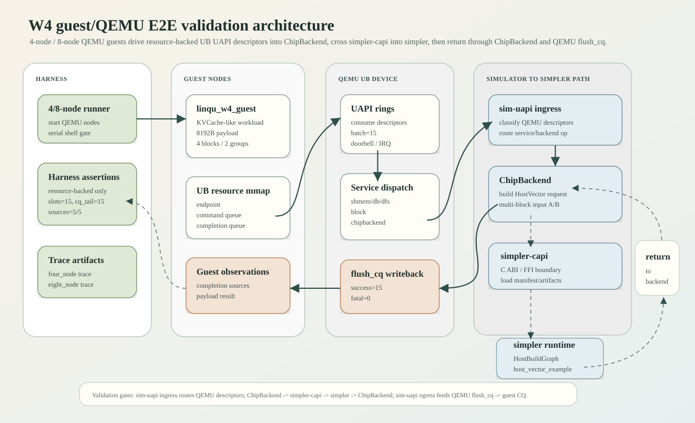
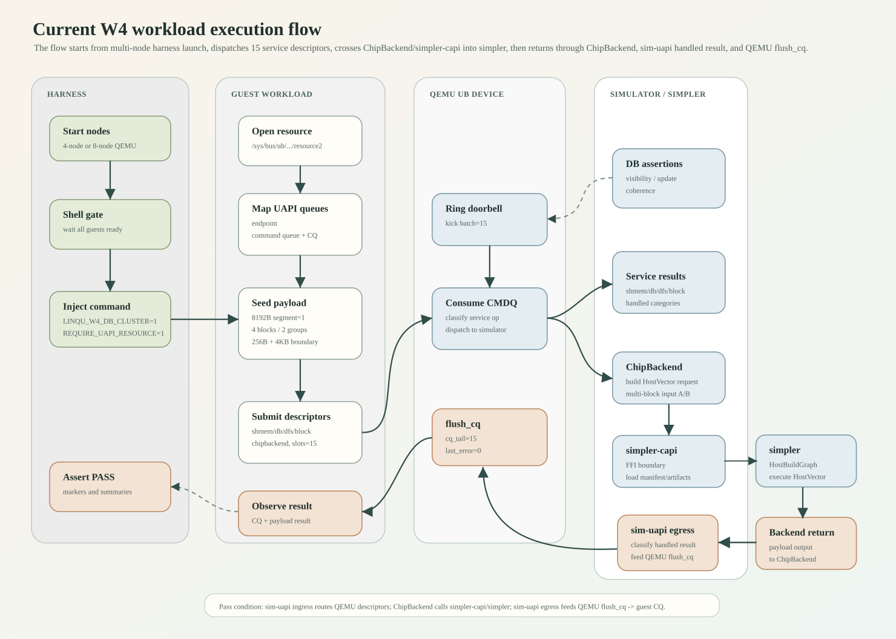

# W4 Guest/QEMU 端到端闭环验证报告

日期：2026-04-29

## 结论

W4 当前已经在 guest/QEMU 多节点系统中形成端到端功能闭环。主线目标已经从 generic HostMatmul smoke 转向支持 Qwen3 Dense 0.6B 形态的推理 workload。

当前阶段状态需要分层理解：

| 层级 | 当前状态 | 验证结果 |
| --- | --- | --- |
| guest/QEMU W4 默认 workload | Qwen3 Dense 0.6B shard-aware scaffold over HostMatmul / HostBuildGraph | 4-node / 8-node harness 通过 |
| simulator/simpler matrix workload | Qwen3 Dense 0.6B shard-aware HostMatmul / HostBuildGraph 已接通 | `qwen3_dense_0_6b_prefill_profile_uses_host_matmul_artifact` 通过 |
| guest/QEMU W4 HostVector 基线 | KVCache tile layout over HostVector arithmetic | 历史基线与可选 fallback profile，不再是本轮默认验证口径 |

因此，当前 W4 已经具备“LLM 推理负载形态”的 guest/QEMU 多节点闭环底座，并且已经把默认 workload profile 从 generic `host_matmul` 推进到 `qwen3_dense_0_6b`。当前还不是完整 Qwen3 模型推理，但主线入口已经不再是泛化 matrix smoke，而是 Qwen3 Dense 0.6B 的 shard-aware prefill/decode scaffold。

已验证范围：

- 4-node guest/QEMU W4 workload：通过。
- 8-node guest/QEMU W4 workload：通过。
- dispatch 路径：`ubc_entity_chipbackend`，不是 `guest_uapi_stub`，也不是 observer-only metadata 模式。
- 服务覆盖：`chipbackend`、`shmem`、`dfs`、`db`、`block`。
- KVCache 语义覆盖：multi-node KVCache metadata/state DB、prefix/prefix-group/block state、shmem hot/shared segment、block write/read、ChipBackend HostMatmul dispatch result。
- matrix workload 覆盖：默认通过 `SIM_UAPI_W4_CHIPBACKEND_PROFILE=qwen3_dense_0_6b` 进入 Qwen3 Dense 0.6B scaffold，底层当前复用 `HostMatmul / HostBuildGraph`。
- shard-aware backend 覆盖：ChipBackend 在 simulator 内部把 Qwen3 Dense 0.6B workload fan-out 为 8 个 shard dispatch，每个 shard 显式携带 `shard_id`、`owner_node`、`target_node`、attention head range 与 KV block range。
- payload 边界覆盖：多 segment、多 block、跨 `256B` 与 `4KB` 边界的 `8192B` payload 验证。
- completion 覆盖：15 个 resource-backed UAPI slots 全部成功完成，无 retryable/fatal failure。

最新验证结果：

- qwen3 shard-aware host test: `qwen3_dense_0_6b_prefill_profile_uses_host_matmul_artifact` 通过。
- 4-node run id: `2026-04-29_15-43-00_w4guest4_14721`
- 4-node result: `PASS: four-node w4 guest resource-backed uapi/chipbackend service coverage validated`
- 8-node run id: `2026-04-29_16-04-28_w4guest8_25783`
- 8-node result: `PASS: eight-node w4 guest resource-backed uapi/chipbackend service coverage validated`
- QEMU memory / PMD config: `QEMU_MEM=6G`, kernel append includes `pmd_mapping=30%`.
- QEMU submodule: includes `c09c77b852` (`Fix SIM decoder unmap lifetime`).

本轮修复并验证的关键数据面问题：

- 原问题：8-node W4 在 KVCache/Weights service 的 remote OBMM mapped load 路径上卡住。卡点最初表现为跨 `4KB` payload record copy 完成后，confirm header reload 长时间不返回。
- 数据面修复：guest 侧 remote payload header / confirm header 读取从 byte-wise MMIO load 改为已有的 64-bit chunk copy，减少远端 OBMM mapped load transaction 数量，并保持原始 payload 语义不变。
- QEMU 行为修复：去掉 sim-dec read 正常路径 probe 日志，并把 `multicast group=2 had no active remote links` 降为 trace-only，避免 8-node 下日志洪泛污染数据面调试和运行稳定性。
- QEMU SIM_DEC 生命周期修复：SIM decoder `UNMAP` 后不再立即 `object_unparent()` / `g_free()` dynamic `MemoryRegion` opaque，而是从 active map 删除并 `del_subregion`，将 entry 延迟到 decoder cleanup 释放。该修复消除了 4-node W4 在 `6G+pmd_mapping=30%` 下复现的 QOM `object_unref` assert、`double free` 与 `invalid pointer` 崩溃。
- Qwen3 result 校验修复：`qwen3_dense_0_6b` profile 不再按 legacy HostMatmul fixed word `0x3f8000003f800000` 校验，而是校验 shard-aware positive result。最新 4-node / 8-node guest/QEMU run 均观察到非固定 qwen result word。
- 协议修复：`OBSERVED` 阶段从 all-to-all wait barrier 改为 announce-only。真实验证前提是每个节点已经完成所有远端 payload snapshot 的读取和本地断言；后续“已观察”互等不是数据正确性必要条件，且会在 8-node 下形成不必要的等待点。
- 当前结论：remote OBMM mapped payload 已在 8-node 下完成跨节点 visibility / update / coherence 验证，包含多节点 metadata/state DB、KVCache/Weights object record、跨 `256B` 与 `4KB` 边界 payload 访问。

当前闭环链路是：

```text
guest W4 workload
-> UB resource-backed UAPI descriptors
-> QEMU UB device / UAPI dispatch
-> simulator UAPI ingress dispatch
-> simulator ChipBackend
-> simpler-capi FFI boundary
-> simpler HostBuildGraph runtime
-> simpler-capi result return
-> simulator ChipBackend handled result
-> simulator UAPI egress classification
-> QEMU UB device flush_cq
-> guest completion queue
-> guest completion/result observation
-> multi-node harness assertions
-> PASS
```

架构图：



workload 运行流程图：



需要明确边界：当前通过 `simpler-capi` 发给 simpler 的默认计算 workload 是 Qwen3 Dense 0.6B shard-aware scaffold，底层仍复用 `HostMatmul/HostBuildGraph` 的 matrix graph。它不是完整 Qwen3 attention kernel，也没有真实权重/tokenizer。W4 当前证明的是 KVCache 形态的 shmem/db/block/chipbackend/dfs descriptors、payload、completion、result 观察已经进入 guest/QEMU/simulator/ChipBackend/simpler-capi/simpler/guest-result 闭环，并且 ChipBackend 计算段已经从 HostVector 基线推进到 Qwen3-named shard-aware matrix scaffold。

最新验证进展：`qwen3_dense_0_6b` profile 已从单一 HostMatmul dispatch 推进为 8-shard backend。ChipBackend 在 simulator 内部生成 8 个 shard，每个 shard 绑定独立的 hidden/Q/KV/V tile input、独立 output segment、独立 request id / trace id / context，并携带 `owner_node`、`target_node`、attention head range 与 KV block range。16 个 attention heads 按 8 个 shard 切分，每 shard 2 heads；KV block 当前按每 shard 2 block 的 scaffold 口径分配。4-node 与 8-node guest/QEMU harness 均已通过该默认 profile。

HostVector tile payload 路径仍然保留为基线：ChipBackend 在发起 simpler-capi dispatch 前把 `8192B` KVCache-like payload 显式组织为 `block / prefix group / 16x16 matrix tile / 4x16 row-group`，并在 HostVector profile 下按完整 `8192B` result 做逐 element 校验。当前默认主线路径是 Qwen3 Dense 0.6B shard-aware HostMatmul scaffold。

下一步主线收敛点是把当前 shard-aware HostMatmul scaffold 继续推进为 Qwen3 layer-level graph：显式 Q/K/V projection、RoPE、attention score、softmax 与 MLP。

## 当前通过 simpler-capi 发给 simpler 的 workload

W4 guest workload 的 `chipbackend` descriptor 最终由 QEMU UB device 消费，经 simulator UAPI dispatcher 进入 ChipBackend，再通过 `simpler-capi` 调用 simpler。

这条链路里的职责边界是：

- `sim-uapi`: simulator 内部的 UAPI glue，不是 workload 执行端。ingress 侧负责把 QEMU 送来的 descriptors 分类并路由到 `shmem/db/dfs/block/chipbackend`；egress 侧负责把 backend/service 返回值归一成 handled result，交还给 QEMU `flush_cq` 写 guest CQ。
- `ChipBackend`: simulator 内部 backend adapter，接收 `chipbackend` descriptor，构造 HostVector request，并把 handled result 交还给 sim-uapi egress 分类。
- `simpler-capi`: simulator 与 simpler 之间的 C ABI / FFI 边界，负责加载 manifest/artifacts，调用 HostBuildGraph runtime，并把执行结果返回给 ChipBackend。
- `simpler`: 实际执行 `HostVector / HostBuildGraph / host_vector_example` 的 runtime/workload 侧。

交互方向是：

```text
ChipBackend
-> simpler-capi
-> simpler HostBuildGraph runtime
-> simpler-capi
-> ChipBackend handled result
-> simulator UAPI handled result
-> QEMU flush_cq
-> guest CQ
```

当前默认发送给 simpler 的 workload profile 定义如下：

- W4 profile: `qwen3_dense_0_6b`
- backend profile: `HostMatmul`
- `runtime_variant`: `HostBuildGraph`
- `callable_hint`: `host_matmul_example`
- orchestration function: `build_matmul_graph`
- manifest: `/tmp/simpler-host-matmul-artifacts/host_matmul_manifest.json`
- artifact producer: `guest-linux/aarch64/scripts/prepare_simpler_host_matmul_artifacts.sh`
- source example: `modules/simpler.old/examples/a2a3/host_build_graph/matmul/kernels`
- harness profile env: `SIM_UAPI_W4_CHIPBACKEND_PROFILE=qwen3_dense_0_6b`
- expected guest result: qwen shard-aware positive result word，不能退化为 fixed HostMatmul word `0x3f8000003f800000`

Qwen3 Dense 0.6B scaffold 当前落地的模型元数据：

- `vocab_size`: `151936`
- `hidden_size`: `1024`
- `intermediate_size`: `3072`
- `num_hidden_layers`: `28`
- `num_attention_heads`: `16`
- `num_key_value_heads`: `8`
- `head_dim`: `128`
- `max_position_embeddings`: `40960`
- `rope_theta`: `1000000`
- `prefill_tokens`: `128`
- `decode_tokens`: `1`
- `tp_nodes`: `8`

说明：目标模型口径已统一为 `Qwen/Qwen3-0.6B` / `qwen3_dense_0_6b`，当前尺寸按该公开小 dense config 落地。

HostVector 基线仍然保留为可选 profile，用于对照旧的 deterministic vector/tile payload 路径：

- `profile`: `HostVector`
- `runtime_variant`: `HostBuildGraph`
- `callable_hint`: `host_vector_example`
- orchestration function: `build_example_graph`
- manifest: `/private/tmp/simpler-host-vector-artifacts/host_vector_manifest.json`
- artifact producer: `simulator/scripts/prepare_simpler_host_vector_artifacts.py`
- source example: `modules/simpler.old/examples/a2a3/host_build_graph/vector_example/kernels`
- expected guest result word: `0x41a0000041a00000`

HostMatmul graph 公式：

```text
F = exp(sqrt(log(A)) @ W1 + sqrt(log(A)) @ W2)
```

当前 Qwen3 scaffold 使用 `128 x 128` half inputs 和 float output，验证 simulator 可以通过 simpler-capi 调起包含 AIV + AIC matmul task 的真实 simpler graph。guest 提交的 `8192B` KVCache payload 已作为 `qwen3_dense_0_6b_guest_kvcache_payload` resident binding 进入 request，并且已经用于确定性派生三个数值输入：

- `qwen3_dense_0_6b_layer0_prefill_hidden_half`
- `qwen3_dense_0_6b_layer0_q_proj_tile_half`
- `qwen3_dense_0_6b_layer0_kv_proj_tile_half`
- `qwen3_dense_0_6b_layer0_v_proj_tile_half`

其中 Q/KV/V projection tile 使用不同 stride/bias 从 guest payload 派生，避免 projection tile 退化成同一输入。当前 W4 guest 默认 payload 为 zero payload，但 `qwen3_dense_0_6b` result 不再按 fixed HostMatmul word 校验；guest 侧校验写回 word 解码出的两个 `f32` 均为 positive result，host-side qwen3 gate 还要求 8 个 shard 的 first output 不完全相同。当前 HostMatmul runtime 只消费 Q/KV 两路 projection input；V projection 已作为 resident binding 进入 request，供下一步 layer graph 扩展使用。后续需要进一步把该 projection scaffold 扩展为 Q/K/V projection、RoPE、attention score、softmax 与 MLP 的 layer-level graph。

当前 shard-aware backend 口径：

- guest 侧仍提交 1 个 `chipbackend` descriptor，因此 guest CQ 统计中 `completion_sources chipbackend=1`。
- simulator ChipBackend 内部将该 workload fan-out 为 8 个 shard dispatch。
- 每个 shard 的 request 显式携带 `shard_id`、`owner_node`、`target_node`、`head_start/head_end`、`kv_block_start/kv_block_end`。
- `num_attention_heads=16`，`tp_nodes=8`，因此每 shard 2 个 attention heads。
- 当前 scaffold 每 shard 分配 2 个 KV blocks。
- 每个 shard 拥有独立 input/output segment，输出按 shard 顺序拼接。

manifest 里的 runtime artifacts 包括：

- host runtime library: `runtime_host.bin`
- orchestration shared object: `orchestration.so`
- AICPU runtime binary: `runtime_aicpu.bin`
- AICore runtime binary: `runtime_aicore.bin`
- kernel binaries: `kernel_func_0.bin`、`kernel_func_1.bin`、`kernel_func_2.bin`

kernel 对应关系：

- `func_id=0`: `kernel_add.cpp`
- `func_id=1`: `kernel_add_scalar.cpp`
- `func_id=2`: `kernel_mul.cpp`

runtime launch 参数：

```text
aicpu_thread_num=3
block_dim=3
device_id=0
orch_thread_num=0
```

args template：

```text
input        a
input        b
output       f
scalar_size  size_a
scalar_size  size_b
scalar_size  size_f
scalar_elems SIZE
```

## 当前 W4 KVCache-like payload 与 HostMatmul 关系

最新 W4 workload 已从旧的单 `4096B` payload 扩展为更接近 KVCache 行为的 multi-block / prefix-group / matrix tile / row-group 形态。

当前 payload 口径：

- segment: `1`
- payload bytes: `8192`
- element shape: `32 x 64`
- element type: `f32`
- element count: `2048`
- KVCache blocks: `4`
- prefix groups: `2`
- matrix tiles per block: `2`
- tile shape: `16 x 16 f32`
- tile bytes: `1024`
- row groups per tile: `4`
- row group shape: `4 x 16 f32`
- row group bytes: `256`
- resident metadata bindings: `kvcache_prefix{N}_block{M}_state`
- resident tile bindings: `kvcache_block{M}_prefix{N}_tile{T}_state`
- resident row-group bindings: `kvcache_block{M}_prefix{N}_tile{T}_rowgroup{R}`
- input A: 按 block id / prefix group / tile / row-group 组织的 KVCache-like payload。
- input B: 按 prefix group、block id、tile id、row-group id 写入 layout bias，用于验证 result 不是 metadata-only completion。
- expected output: 按 element 校验 `input_a + input_b` 的 deterministic result。

HostVector 基线的 simpler 执行粒度：

- execution chunk count: `2`
- bytes per chunk: `4096`
- elems per chunk: `1024`
- final result bytes: `8192`
- 校验口径：两个 chunk 的 result 拼回后，按完整 `8192B` tile/row-group layout 逐 element 校验。

Qwen3 默认路径当前不再逐 element 校验 HostVector 的 `input_a + input_b` 结果，而是在 guest 侧校验 ChipBackend 写回的 qwen positive result word：

```text
[w4_guest] stage uapi_kvcache_payload_dispatch_result segment=1 word0=0x3f81c0003f81a000
```

关键 guest marker：

```text
[w4_guest] stage uapi_kvcache_payload_seeded segment=1 bytes=8192 checksum=0x0000000000000000
[w4_guest] stage uapi_kvcache_payload_boundaries segment=1 offsets=0,248,256,4088,4096,4104 status=ok
```

`uapi_kvcache_payload_boundaries` 是本轮新增的核心检查点，用于确认同一 W4 payload 覆盖：

- 256B 边界前后访问。
- 4KB 边界前后访问。
- 8192B segment 内跨页 payload 访问。
- shmem/block 组合路径对大 payload 的可见性。

## 当前 W4 service descriptor 覆盖

resource-backed UAPI descriptor batch 当前包含 15 个提交 slot：

| 服务 | descriptor | 语义 |
| --- | --- | --- |
| `chipbackend` | 1 | 将 KVCache-like payload dispatch 到 simulator ChipBackend / simpler-capi |
| `shmem` | 4 | `128B` 与 `8192B` hot/shared segment put/get |
| `dfs` | 2 | write/read coverage |
| `db` | 4 | primary block 与 aux block metadata/state put/get |
| `block` | 4 | primary block 与 aux block write/read |

代表性 descriptor marker：

```text
[w4_guest] stage uapi_kvcache_shmem_descriptor segment=1 bytes=128 puts=1 gets=1 role=hot_shared
[w4_guest] stage uapi_kvcache_shmem_descriptor segment=1 bytes=8192 puts=1 gets=1 role=hot_shared_large
[w4_guest] stage uapi_kvcache_db_descriptor key=block/w4-nodeA-block-0 bytes=824
[w4_guest] stage uapi_kvcache_db_descriptor key=block/w4-nodeA-block-aux bytes=824
[w4_guest] stage uapi_kvcache_block_descriptor block=w4-nodeA-block-0 segment=1 writes=1 reads=1
[w4_guest] stage uapi_kvcache_block_descriptor block=w4-nodeA-block-aux segment=1 writes=1 reads=1
[w4_guest] stage uapi_chipbackend_dispatch_descriptor block=w4-nodeA-block-0 segment=1 task_id=31
```

completion 统计口径：

```text
[w4_guest] step=doorbell ok slots=15
[w4_guest] step=wait_completions ok cq_tail=15
[w4_guest] completion_sources chipbackend=1 shmem=4 dfs=2 db=4 block=4 guest_uapi=0
[w4_guest] completion_status success=15 retryable=0 fatal=0
[w4_guest] summary chipbackend=1 shmem=4 dfs=2 db=4 block=4 guest_uapi=0 success=15 retryable=0 fatal=0
```

这个统计是当前 W4 “闭环”的最低判据之一：不是只看到进程退出，也不是只看到单一 completion，而是 15 个 resource-backed descriptors 全部走完，且 service source 分类完整。

## Multi-node KVCache metadata/state DB 断言

最新 W4 workload 在 guest 侧增加了 resource-backed DB cluster assertions。目标不是做泛化 DB service，而是验证能支撑 KVCache 的 metadata/state DB 能力。

当前断言覆盖：

- DB bootstrap。
- primary block metadata/state。
- aux block metadata/state。
- prefix 与 prefix group membership。
- publish / observe。
- compute result feed。
- update visibility。
- handoff visibility。
- remote fetch coherence。

代表性 marker：

```text
[w4_guest] stage db_service_cluster=resource_backed_assertions_ok nodes=4 peers=3 local_block=w4-nodeA-block-0 remote_block=w4-nodeA-block-aux version=... peer_version_floor=... handoff_owner=... prefix_group=... group_members=2
[w4_guest] stage db_service_cluster=resource_backed_assertions_ok nodes=8 peers=7 local_block=w4-nodeA-block-0 remote_block=w4-nodeA-block-aux version=... peer_version_floor=... handoff_owner=... prefix_group=... group_members=2
```

这里的 `peers=3` / `peers=7` 分别对应 4-node / 8-node harness。验证口径已经从 dual-node visibility 扩展为 multi-node visibility / update / coherence。

## 验证运行记录

### 本轮本地单测与构建 gate

KVCache tile layout 单测：

```bash
cargo test -p sim-uapi kvcache_ -- --test-threads=1
```

结果：

```text
running 2 tests
test tests::kvcache_input_b_encodes_prefix_block_tile_and_row_group_bias ... ok
test tests::kvcache_payload_layout_explicitly_maps_blocks_tiles_and_row_groups ... ok
test result: ok. 2 passed; 0 failed
```

ChipBackend/simpler-capi HostVector payload dispatch 单测：

```bash
cargo test -p sim-uapi host_vector_dispatch_accepts_w4_seed_payload -- --test-threads=1
```

结果：

```text
running 1 test
test tests::host_vector_dispatch_accepts_w4_seed_payload ... ok
test result: ok. 1 passed; 0 failed
```

Qwen3 Dense 0.6B shard-aware scaffold dispatch gate：

```bash
guest-linux/aarch64/scripts/prepare_simpler_host_matmul_artifacts.sh /tmp/simpler-host-matmul-artifacts
SIMPLER_HOST_MATMUL_MANIFEST=/tmp/simpler-host-matmul-artifacts/host_matmul_manifest.json \
  cargo test -p sim-uapi qwen3_dense_0_6b_prefill_profile_uses_host_matmul_artifact -- --test-threads=1
```

结果：

```text
running 1 test
test tests::qwen3_dense_0_6b_prefill_profile_uses_host_matmul_artifact ... ok
test result: ok. 1 passed; 0 failed
```

该 gate 覆盖 `qwen3_dense_0_6b` profile 的 8-shard dispatch：每个 shard 都经过 HostMatmul / HostBuildGraph artifact path，输出长度为 `8 * 128 * 128` 个 `f32`，并验证各 shard 输出不是同一 fixed HostMatmul word。

Qwen3 Dense 0.6B shard-aware scaffold 的完整准入 gate 是下面的 4-node / 8-node guest/QEMU W4 harness。harness 在 guest 内执行 `/bin/linqu_w4_guest`，该 binary 由 `guest-linux/aarch64/w4_guest_qemu_demo.c` 和 `guest-linux/aarch64/w4_kvcache_db_service.c` 构建：

```text
w4_guest_qemu_demo.c + w4_kvcache_db_service.c -> /bin/linqu_w4_guest
```

因此，本轮没有把 W4 验证降级为 HostMatmul smoke。host-side qwen3 dispatch gate 与 guest/QEMU 4-node、8-node run 一起构成本轮验证口径。

QEMU relink：

```bash
ninja -C vendor/qemu_8.2.0_ub/build qemu-system-aarch64
```

结果：

```text
Compiling C object libcommon.fa.p/hw_ub_ub_ubc.c.o
Linking target qemu-system-aarch64
```

guest artifacts：

```bash
UB_GUEST_ARTIFACT_SOURCE=none ./guest-linux/aarch64/scripts/build_guest_artifacts.sh
```

结果：

```text
built /sd_data/repo/ub_sim/guest-linux/aarch64/out/initramfs.cpio.gz
```

### 4-node Qwen3 scaffold run

命令：

```bash
UB_SYNC_ARTIFACTS=0 QEMU_MEM=6G \
APPEND_EXTRA='linqu_probe_skip=1 linqu_probe_load_helper=1 pmd_mapping=30%' \
./guest-linux/aarch64/scripts/run_ub_four_node_w4_guest.sh
```

run id：

```text
2026-04-29_15-43-00_w4guest4_14721
```

trace：

```text
guest-linux/aarch64/out/four_node_w4_guest.trace.latest.txt
```

关键结果：

```text
[w4guest4] shell gate ok for all four nodes
[w4guest4] PASS: four-node w4 guest resource-backed uapi/chipbackend service coverage validated
```

关键断言：

```text
resource_backed_assertions_ok nodes=4 peers=3
uapi_kvcache_payload_seeded segment=1 bytes=8192
uapi_kvcache_payload_boundaries segment=1 offsets=0,248,256,4088,4096,4104 status=ok
uapi_kvcache_payload_dispatch_result segment=1 word0=0x3f81c0003f81a000
step=doorbell ok slots=15
step=wait_completions ok cq_tail=15
completion_sources chipbackend=1 shmem=4 dfs=2 db=4 block=4 guest_uapi=0
completion_status success=15 retryable=0 fatal=0
```

### 8-node Qwen3 scaffold run

命令：

```bash
UB_SYNC_ARTIFACTS=0 QEMU_MEM=6G \
APPEND_EXTRA='linqu_probe_skip=1 linqu_probe_load_helper=1 pmd_mapping=30%' \
./guest-linux/aarch64/scripts/run_ub_eight_node_w4_guest.sh
```

run id：

```text
2026-04-29_16-04-28_w4guest8_25783
```

trace：

```text
guest-linux/aarch64/out/eight_node_w4_guest.trace.latest.txt
```

关键结果：

```text
[w4guest8] shell gate ok for all eight nodes
[w4guest8] PASS: eight-node w4 guest resource-backed uapi/chipbackend service coverage validated
```

关键断言：

```text
resource_backed_assertions_ok nodes=8 peers=7
uapi_kvcache_payload_seeded segment=1 bytes=8192
uapi_kvcache_payload_boundaries segment=1 offsets=0,248,256,4088,4096,4104 status=ok
uapi_kvcache_payload_dispatch_result segment=1 word0=0x3f8020003f822000
step=doorbell ok slots=15
step=wait_completions ok cq_tail=15
completion_sources chipbackend=1 shmem=4 dfs=2 db=4 block=4 guest_uapi=0
completion_status success=15 retryable=0 fatal=0
```

### 本轮修复点

#### QEMU SIM_DEC unmap lifetime

4-node W4 在明确使用 `QEMU_MEM=6G` 与 `pmd_mapping=30%` 后复现过 QEMU 侧崩溃：

```text
ERROR:../qom/object.c:1213:object_unref: assertion failed: (obj->ref > 0)
free(): invalid pointer
double free or corruption (out)
```

根因是 SIM decoder `UNMAP` 路径在 `memory_region_del_subregion()` 后立刻 `object_unparent()` 并释放 `SimDecMapEntry`，而 vCPU memory dispatch / in-flight SIM_DEC sync 仍可能短暂持有 stale `MemoryRegion` 或 opaque entry 引用。

修复后：

- `UNMAP` 将 entry 标记 inactive，并从 active map list 移除。
- mapped subregion 从 system memory 删除。
- `MemoryRegion` 和 opaque entry 放入 retired list，延迟到 decoder cleanup 统一释放。
- 4-node 与 8-node W4 在 `6G+pmd_mapping=30%` 下均未再出现 QOM assert、double-free 或 invalid pointer。

对应 QEMU submodule commit：

```text
c09c77b852 Fix SIM decoder unmap lifetime
```

#### Qwen3 result word

首次切换到 HostMatmul 后，4-node harness 暴露出一个 guest 侧校验口径 bug：

```text
[w4_guest] dispatch payload mismatch segment=1 expected=0x41a0000041a00000 got=0x3f8000003f800000
```

结论：

- ChipBackend / simpler-capi / simpler HostMatmul 实际已经把 result 写回 guest segment。
- 失败原因不是数据路径失败，而是 guest demo 内部仍硬编码 HostVector expected result word。
- 修复后 guest 根据 `SIM_UAPI_W4_CHIPBACKEND_PROFILE` 选择 expected result word。
- `host_matmul` 口径期望 `0x3f8000003f800000`。
- `host_vector` 口径保留 `0x41a0000041a00000`。

本轮进一步修正了 `qwen3_dense_0_6b` 的校验口径：qwen profile 不能继续沿用 fixed HostMatmul word，否则无法证明 shard-aware result。当前 qwen profile 校验 positive result word，并允许不同 shard/run 产生不同 word。最新结果示例：

```text
4-node nodeA: word0=0x3f81c0003f81a000
8-node nodeA: word0=0x3f8020003f822000
```

该修复后 `qwen3_dense_0_6b_prefill_profile_uses_host_matmul_artifact`、4-node W4 harness 与 8-node W4 harness 均通过。

环境标记：

```text
[headless8] qemu_mem=6G
[headless8] topology=/sd_data/repo/ub_sim/vendor/ub_topology_eight_node_full_mesh.ini
[headless8] append_extra=linqu_probe_skip=1 linqu_probe_load_helper=1 pmd_mapping=30% obmm.skip_cache_maintain=1
[headless8] ub_sim_port_num=7
```

## 闭环验证流程

### 1. harness 启动真实多节点 guest/QEMU 系统

4-node harness 启动 `nodeA` 到 `nodeD`。

8-node harness 启动 `nodeA` 到 `nodeH`。

每个节点都是独立 QEMU 进程，运行条件包括：

- QEMU `virt` machine。
- UB cluster mode。
- UMMU enabled。
- full-mesh topology。
- guest kernel/initramfs。
- shell gate 之后通过 serial 注入 W4 命令。

### 2. harness 进入 guest shell 并启动 W4 workload

harness 等待所有 guest shell 就绪后注入 W4 命令。

注入的关键环境变量包括：

```text
LINQU_UB_ROLE=<node id>
LINQU_UB_LOCAL_IP=<node ip>
LINQU_UB_ALL_IPS=<all node ips>
LINQU_UB_NODE_COUNT=4 or 8
LINQU_W4_DB_CLUSTER=1
LINQU_W4_REQUIRE_UAPI_RESOURCE=1
SIM_UAPI_W4_CHIPBACKEND_PROFILE=qwen3_dense_0_6b
```

每个 guest 执行：

```bash
/bin/linqu_w4_guest
```

关键点是 `LINQU_W4_REQUIRE_UAPI_RESOURCE=1`：workload 必须使用 guest UAPI resource path。harness 会拒绝 observer-only 或 stub-only 路径。

### 3. guest 进入 resource-backed UAPI 模式

代表性日志：

```text
[w4_guest] stage obmm_kvcache_path=ready
[w4_guest] stage db_cluster_mode=resource_backed_uapi
[w4_guest] step=open_resource ok path=/sys/bus/ub/devices/00001/resource2
[w4_guest] step=map_endpoint ok root=0x0000028000000000 endpoint=0x0000028000001000
[w4_guest] step=map_queues ok
```

这证明 guest workload 不是 host-only simulator test。它打开 UB device resource，映射 endpoint 和 queue，并通过 resource-backed UAPI descriptors 提交请求。

### 4. guest 准备 KVCache-like payload 与 metadata/state

guest 准备 `8192B` payload，覆盖 primary block、aux block、prefix group 和边界访问点。

代表性日志：

```text
[w4_guest] stage uapi_kvcache_payload_seeded segment=1 bytes=8192 checksum=0x0000000000000000
[w4_guest] stage uapi_kvcache_payload_boundaries segment=1 offsets=0,248,256,4088,4096,4104 status=ok
[w4_guest] stage db_service_cluster=resource_backed_assertions_ok nodes=<4 or 8> peers=<3 or 7> ... group_members=2
```

### 5. guest 提交 W4 service descriptors

guest 向 command queue 提交 `shmem/db/dfs/block/chipbackend` descriptors。当前 batch 总数为 15。

语义覆盖：

- `shmem`: KVCache hot/shared segment，覆盖小 payload 与 `8192B` 大 payload。
- `db`: KVCache metadata/state，覆盖 primary 与 aux block。
- `block`: 与 KVCache block id 绑定的 block write/read，覆盖 primary 与 aux block。
- `chipbackend`: resource-backed dispatch 到 simulator ChipBackend/simpler-capi。
- `dfs`: service source coverage，证明 DFS descriptor 也在同一 completion 体系内。

### 6. QEMU 消费 descriptors 并进入 simulator

代表性日志：

```text
linqu-uapi kick begin batch=15 cmdq_base=... cmdq_head=0 cmdq_tail=15 cmdq_depth=32 cq_base=... cq_head=0 cq_tail=0 cq_depth=64
linqu-uapi kick done cmdq_head=15 cq_tail=15 irq=0x1 last_error=0
```

验证点：

- command queue 中 15 个提交 slot 全部被 QEMU 侧 UB UAPI 路径消费。
- CQ tail 到达 `15`。
- `last_error=0`。
- IRQ 被触发。

### 7. simulator ChipBackend 通过 simpler-capi 执行 Qwen3 scaffold workload

ChipBackend 对 `chipbackend` descriptor 进行 handled result 处理，通过 simpler-capi 执行 `qwen3_dense_0_6b` workload profile。当前底层 kernel 仍是 HostMatmul workload。

当前验证重点不是证明 LLM kernel 已经完整接入，而是证明：

- guest payload 不是空 metadata。
- descriptor 能进入 simulator/simpler-capi 并选择 `qwen3_dense_0_6b` profile。
- simpler 能执行真实 `HostBuildGraph` matrix graph。
- result 能回写到 guest 可见区域。
- result 能被 guest 按 qwen positive result word 观察。

### 8. guest 观察 completion 和 result payload

代表性日志：

```text
[w4_guest] step=wait_completions ok cq_tail=15
[w4_guest] stage uapi_kvcache_payload_dispatch_result segment=1 word0=0x3f81c0003f81a000
[w4_guest] completion_sources chipbackend=1 shmem=4 dfs=2 db=4 block=4 guest_uapi=0
[w4_guest] completion_status success=15 retryable=0 fatal=0
[w4_guest] assessment service_coverage=5/5 dispatch_path=ubc_entity_chipbackend kvcache_shmem_segment=1 kvcache_block=w4-nodeA-block-0 kvcache_db_key=block/w4-nodeA-block-0 ... complete=true
[w4_guest] dispatch path=ubc_entity_chipbackend
[w4_guest] pass
```

这里形成四个关键闭环判断：

- completion 闭环：`cq_tail=15`，所有 descriptor 均完成。
- service 覆盖闭环：`chipbackend/shmem/dfs/db/block` 均有 completion source。
- payload 闭环：`uapi_kvcache_payload_dispatch_result` 证明 result payload 回到 guest 可见状态。
- multi-node DB 闭环：`resource_backed_assertions_ok` 证明 KVCache metadata/state 在 4-node/8-node 口径下完成 visibility / update / coherence 断言。

## W4 当前证明了什么

当前验证结果证明：

- W4 workload 运行在真实 guest/QEMU 多节点系统中，不是 host-only 单元测试。
- guest 能打开 UB resource 并映射 endpoint/queues。
- guest 能提交 shmem/db/block/chipbackend/dfs 相关 UAPI descriptors。
- QEMU 能消费 command queue 并把请求送入 simulator UAPI/ChipBackend。
- ChipBackend 能通过 `simpler-capi` 调用 simpler 的 `qwen3_dense_0_6b` scaffold workload。
- ChipBackend 能把一个 guest `chipbackend` workload 解释为 8 个 shard dispatch，并为每个 shard 保留 owner/target/head/KV-block 语义。
- guest/QEMU 4-node 与 8-node harness 已经覆盖 HostMatmul path，不再只是 host-only smoke test。
- KVCache-like payload 已经从单块 4KB 扩展到 8192B、多 block、多 prefix group、matrix tile、row-group。
- HostVector 基线能在同一 runtime 内将完整 `8192B` tile payload 拆成两个 `4096B` execution chunks，并拼回完整 result。
- HostVector 基线 result 校验已经从“观察 word0”推进到按完整 tile/row-group layout 逐 element 校验。
- Qwen3 scaffold 当前校验 result word，并已把 HostMatmul prefill hidden、Q projection tile、KV projection tile、V projection tile 输入绑定到 guest KVCache payload 派生路径；这些输入已经按 shard 派生，但还没有把 RoPE、attention score、softmax 或 MLP 输入绑定到真实 Qwen3 graph。
- shmem/block 组合路径已经覆盖 256B 与 4KB 边界访问。
- KVCache metadata/state DB 已经包含 multi-node visibility / update / coherence 断言。
- simpler 执行结果能被 simulator 归类为 handled result。
- QEMU 能把 handled result 写入 completion queue。
- guest 能观察 completion 和 payload result。
- 4-node 与 8-node harness 都能完成同一类闭环。

## W4 当前没有证明什么

当前验证结果不应被扩大解释为：

- 不是完整 LLM serving workload。
- 不是完整 transformer attention/KV attention kernel。
- 当前 Qwen3 scaffold 的 prefill hidden、Q projection tile、KV projection tile、V projection tile 数值输入已由 guest KVCache payload 和 shard metadata 派生，但仍不是从真实 Qwen3 token embedding、RoPE、attention 或 MLP graph 派生的输入。
- 不是真实生产级 KVCache eviction/prefetch/coherence 策略验证。
- 不是 DFS service 的完整语义验证。
- 不是所有 UB memory/cache/coherence corner case 的证明。

当前 W4-v0 的真实含义是：KVCache 形态的 control/metadata/block/shmem descriptors 已经进入 guest/QEMU/simulator/simpler-capi/guest-result 端到端链路，并在 4-node 与 8-node harness 中通过了 Qwen3 Dense 0.6B shard-aware scaffold dispatch、service completion、multi-node metadata/state DB 断言。主线目标已经切到 Qwen3 Dense 0.6B shard-aware scaffold，但这仍不是完整 Qwen3 模型推理。

## 后续建议

下一步如果继续推进 W4，优先级应是：

1. 将当前 Q/KV runtime input + V resident binding scaffold 扩展为显式 Q/K/V 三路 runtime projection descriptor 与 per-shard result 校验。
2. 将当前 Qwen3 scaffold result word 校验推进为多 tile / 多 block / 多 segment / 多 shard 的 matrix result 校验。
3. 增加 Qwen3 layer-level graph scaffold：RMSNorm、RoPE、attention score、softmax、MLP。
4. 将 DFS 从 completion-source coverage 推进到真实 service-level workload 覆盖。
5. 增加更多 UB memory/cache/coherence corner case，特别是跨节点 owner publish、observer read、handoff 后旧 owner/new owner 可见性。
